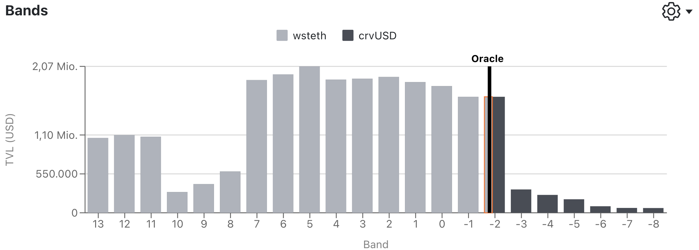

LLAMMA is the market-making contract that rebalances the collateral. As the name already suggests, this contract is responsible for lending and liquidating collateral. Every market has its own AMM (created from a blueprint contract), which contains the collateral asset and crvUSD.

When creating a new loan, the controller evenly distributes the collateral put up by the user across a specified number of bands in the AMM and mints stablecoins for the user. While the number of bands is, in principle, chosen by the user, there are certain boundaries to be aware of.

The **loan-to-value (LTV)** ratio depends on the number of bands.

$$LTV = 1 - \text{loan_discount} - 1 * \frac{N}{2*A}$$

Interestingly enough, the start of the liquidation range is also determined by the LTV:

$$ \text{starting_price} = \frac{debt} {collateral * LTV} $$

!!!tip
    The `starting_price` value is in percentage. To calculate the actual starting price, one must multiply the value by the `price_oracle` when creating the loan.


Each individual band has an upper ([`p_oracle_up`](#p_oracle_up)) and lower ([`p_oracle_down`](#p_oracle_down)) price bound. These prices are not real AMM prices, but rather tresholds for the bands! 
It's worth noting, that because it is a continious grid, the lower price-bound of lets say band 0 is the same as the upper price-bound of 1.

The concept of LLAMMA is to automatically convert collateral into crvUSD as the price of the collateral decreases, and vice versa, convert crvUSD back into the collateral asset when prices rise. When the price of the collateral is within a band that has deposited assets, the position enters a so-called **soft-liquidation** mode and the health of the loan starts decreasing.    
As soon as the `health` drops below 0%, the user is eligible for **hard-liquidation**. These 

!!!note
    A position is in soft-liquidation mode only when the price oracle is within a band in which the user deposited collateral in.

*There are **three possible compositions** of bands:*   

- `active_band` consists of both crvUSD and the collateral asset, depending on the the oracle price within the band  
- Bands < `active_band`: fully in crvusd as the bands above has already gone through soft-liquidation  
- Bands > `active_band`: fully in the collateral asset as the bands have not been in soft-liquidation mode

<figure markdown>
  
  <figcaption>bands > -2: fully in collateral asset, bands < -2: fully in crvusd and band -2: contains both (currently in soft-liquidtation)</figcaption>
</figure>


To ensure assets are liquidated or de-liquidated, the AMM adjusts its price to create arbitrage opportunities:

*The system relies on **two different prices**:*

- `price_oracle`: collateral price fetched from an external OracleContract  
- `get_p`: oracle price of the AMM itself

When $\text{price_oracle} = \text{get_p}$, the external oracle price and the AMM price are identical, making arbitrage impossible.  
Generally, when the price oracle begins to change, the AMM price is adjusted (the AMM price is kind of more sensitive than the regular `price_oracle`) to enable arbitrage opportunities.

When the price of the collateral starts to rise, then $\text{price_oracle} < \text{get_p}$, and therefore, arbitrage is possible by swapping the collateral asset into crvUSD until $\text{price_oracle} = \text{get_p}$.  
Conversely, when the price starts to decrease, $\text{price_oracle} > \text{get_p}$, and therefore, arbitrage is possible by swapping crvUSD into the collateral asset until both prices reach equilibrium. 


| Glossary      |  Description |
| ----------- | -------| 
| `ticks`, `bands` | price ranges where liquidity is deposited |
| `x` |  coin which is being borrowed, typically stablecoin |
| `y` |  collateral coin |
| `A` |  amplification, the measure of how concentrated the tick is  |
| `rate` |  interest rate |
| `rate_mul` |  rate multiplier, 1 + integral(rate * dt) |
| `active_band` |  current band. Other bands are either in one or other coin, but not both |
| `min_band` | bands below this are definitely empty |
| `max_band` | bands above this are definitely empty  |
| `bands_x[n]`, `bands_y[n]` | amounts of coin x or y deposited in band n |
| `user_shares[user,n] / total_shares[n]` | fraction of n'th band owned by a user  |
| `p_oracle` |  external oracle price (can be from another AMM) |
| `p (as in get_p)` | current price of AMM. It depends not only on the balances (x,y) in the band and active_band, but also on p_oracle |
| `p_current_up`, `p_current_down` | the value of p at constant p_oracle when y=0 or x=0 respectively for the band n  |
| `p_oracle_up`, `p_oracle_down` |  edges of the band when p=p_oracle (steady state), happen when x=0 or y=0 respectively, for band n  |


## **Depositing and Removing Collateral**
Depositing and removing collateral can only be done by the `admin` of the AMM, which is the Controller. 
Therefore the controller contract needs to be granted max approval in order to successfully call these functions. Max approval is given when `set_admin()` is called.

Collateral is put into bands by calling `deposit_range()` whenever someone creates a new loan or adds collateral to the existing position. Collateral is removed by calling `withdraw()`.


### `deposit_range`
!!! description "`AMM.deposit_range(user: address, amount: uint256, n1: int256, n2: int256):`"

    Function to deposit collateral `amount` for `user` in the range of bands between `n1` and `n2`. This function can only be called by the admin of the AMM, which is the controller.

    Emits event: `Deposit`

    !!!note
        This function is only callable by the admin of the contract. 

    | Input      | Type   | Description |
    | ----------- | -------| ----|
    | `user` |  `address` | User address |
    | `amount` |  `uint256` | Amount of collateral to deposit |
    | `n1` |  `int256` | Lower band in the deposit range |
    | `n2` |  `int256` | Upper band in the deposit range |

    ??? quote "Source code"

        ```python hl_lines="1 9 84"
        event Deposit:
            provider: indexed(address)
            amount: uint256
            n1: int256
            n2: int256

        @external
        @nonreentrant('lock')
        def deposit_range(user: address, amount: uint256, n1: int256, n2: int256):
            """
            @notice Deposit for a user in a range of bands. Only admin contract (Controller) can do it
            @param user User address
            @param amount Amount of collateral to deposit
            @param n1 Lower band in the deposit range
            @param n2 Upper band in the deposit range
            """
            assert msg.sender == self.admin

            user_shares: DynArray[uint256, MAX_TICKS_UINT] = []
            collateral_shares: DynArray[uint256, MAX_TICKS_UINT] = []

            n0: int256 = self.active_band

            # We assume that n1,n2 area already sorted (and they are in Controller)
            assert n2 < 2**127
            assert n1 > -2**127

            lm: LMGauge = self.liquidity_mining_callback

            # Autoskip bands if we can
            for i in range(MAX_SKIP_TICKS + 1):
                if n1 > n0:
                    if i != 0:
                        self.active_band = n0
                    break
                assert self.bands_x[n0] == 0 and i < MAX_SKIP_TICKS, "Deposit below current band"
                n0 -= 1

            n_bands: uint256 = unsafe_add(convert(unsafe_sub(n2, n1), uint256), 1)
            assert n_bands <= MAX_TICKS_UINT

            y_per_band: uint256 = unsafe_div(amount * COLLATERAL_PRECISION, n_bands)
            assert y_per_band > 100, "Amount too low"

            assert self.user_shares[user].ticks[0] == 0  # dev: User must have no liquidity
            self.user_shares[user].ns = unsafe_add(n1, unsafe_mul(n2, 2**128))

            for i in range(MAX_TICKS):
                band: int256 = unsafe_add(n1, i)
                if band > n2:
                    break

                assert self.bands_x[band] == 0, "Band not empty"
                y: uint256 = y_per_band
                if i == 0:
                    y = amount * COLLATERAL_PRECISION - y * unsafe_sub(n_bands, 1)

                total_y: uint256 = self.bands_y[band]

                # Total / user share
                s: uint256 = self.total_shares[band]
                ds: uint256 = unsafe_div((s + DEAD_SHARES) * y, total_y + 1)
                assert ds > 0, "Amount too low"
                user_shares.append(ds)
                s += ds
                assert s <= 2**128 - 1
                self.total_shares[band] = s

                total_y += y
                self.bands_y[band] = total_y

                if lm.address != empty(address):
                    # If initial s == 0 - s becomes equal to y which is > 100 => nonzero
                    collateral_shares.append(unsafe_div(total_y * 10**18, s))

            self.min_band = min(self.min_band, n1)
            self.max_band = max(self.max_band, n2)

            self.save_user_shares(user, user_shares)

            self.rate_mul = self._rate_mul()
            self.rate_time = block.timestamp

            log Deposit(user, amount, n1, n2)

            if lm.address != empty(address):
                lm.callback_collateral_shares(n1, collateral_shares)
                lm.callback_user_shares(user, n1, user_shares)
        ```

    === "Example"

        ```shell
        >>> AMM.deposit_range(todo)
        todo
        ```

### `withdraw`
!!! description "`AMM.withdraw(user: address, frac: uint256) -> uint256[2]:`"

    Function to withdraw liquidity for `user`. This function can only be called by the admin of the AMM, which is the controller. 

    Emit event: `Withdraw`

    !!!note
        This function is only callable by the admin of the contract. 

    | Input      | Type   | Description |
    | ----------- | -------| ----|
    | `user` |  `address` | User address |
    | `frac` |  `uint256` | Fraction to withdraw (1e18 = 100%) |

    ??? quote "Source code"

        ```python hl_lines="1 9 85"
        event Withdraw:
            provider: indexed(address)
            amount_borrowed: uint256
            amount_collateral: uint256

        @external
        @nonreentrant('lock')
        def withdraw(user: address, frac: uint256) -> uint256[2]:
            """
            @notice Withdraw all liquidity for the user. Only admin contract can do it
            @param user User who owns liquidity
            @param frac Fraction to withdraw (1e18 being 100%)
            @return Amount of [stablecoins, collateral] withdrawn
            """
            assert msg.sender == self.admin
            assert frac <= 10**18

            lm: LMGauge = self.liquidity_mining_callback

            ns: int256[2] = self._read_user_tick_numbers(user)
            n: int256 = ns[0]
            user_shares: DynArray[uint256, MAX_TICKS_UINT] = self._read_user_ticks(user, ns)
            assert user_shares[0] > 0, "No deposits"

            total_x: uint256 = 0
            total_y: uint256 = 0
            min_band: int256 = self.min_band
            old_min_band: int256 = min_band
            max_band: int256 = self.max_band
            old_max_band: int256 = max_band

            for i in range(MAX_TICKS):
                x: uint256 = self.bands_x[n]
                y: uint256 = self.bands_y[n]
                ds: uint256 = unsafe_div(frac * user_shares[i], 10**18)  # Can ONLY zero out when frac == 10**18
                user_shares[i] = unsafe_sub(user_shares[i], ds)
                s: uint256 = self.total_shares[n]
                new_shares: uint256 = s - ds
                self.total_shares[n] = new_shares
                s += DEAD_SHARES
                dx: uint256 = (x + 1) * ds / s
                dy: uint256 = unsafe_div((y + 1) * ds, s)

                x -= dx
                y -= dy

                # If withdrawal is the last one - tranfer dust to admin fees
                if new_shares == 0:
                    if x > 0:
                        self.admin_fees_x += x
                    if y > 0:
                        self.admin_fees_y += y / COLLATERAL_PRECISION
                    x = 0
                    y = 0

                if n == min_band:
                    if x == 0:
                        if y == 0:
                            min_band += 1
                if x > 0 or y > 0:
                    max_band = n
                self.bands_x[n] = x
                self.bands_y[n] = y
                total_x += dx
                total_y += dy

                if n == ns[1]:
                    break
                else:
                    n = unsafe_add(n, 1)

            # Empty the ticks
            if frac == 10**18:
                self.user_shares[user].ticks[0] = 0
            else:
                self.save_user_shares(user, user_shares)

            if old_min_band != min_band:
                self.min_band = min_band
            if old_max_band <= ns[1]:
                self.max_band = max_band

            total_x = unsafe_div(total_x, BORROWED_PRECISION)
            total_y = unsafe_div(total_y, COLLATERAL_PRECISION)
            log Withdraw(user, total_x, total_y)

            self.rate_mul = self._rate_mul()
            self.rate_time = block.timestamp

            if lm.address != empty(address):
                lm.callback_collateral_shares(0, [])  # collateral/shares ratio is unchanged
                lm.callback_user_shares(user, ns[0], user_shares)

            return [total_x, total_y]
        ```

    === "Example"

        ```shell
        >>> AMM.withdraw(todo)
        todo
        ```


## **Exchange Methods**
The corresponding AMMs for the markets can be used to exchange tokens, just like in any other AMM. This is necessary, as positions in soft-liquidation are arbitrated by trades within the AMM.

### `exchange`
!!! description "`AMM.exchange(i: uint256, j: uint256, in_amount: uint256, min_amount: uint256, _for: address = msg.sender) -> uint256[2]:`"

    Function to exchange two coins.

    Returns: amount of coins given in and out (`uint256`).

    Emits event: `TokenExchange`

    | Input      | Type   | Description |
    | ----------- | -------| ----|
    | `i` |  `uint256` | Input coin index |
    | `j` |  `uint256` | Output coin index |
    | `in_amount` |  `uint256` | Amount of input coin to swap |
    | `min_amount` |  `uint256` | Minimum amount of output coin to get |
    | `_for` |  `address` | Address to send coins to (defaulted to msg.sender) |

    Emits: <mark style="background-color: #FFD580; color: black">TokenExchange log</mark>

    ??? quote "Source code"

        ```python hl_lines="2 89"
        @internal
        def _exchange(i: uint256, j: uint256, amount: uint256, minmax_amount: uint256, _for: address, use_in_amount: bool) -> uint256[2]:
            """
            @notice Exchanges two coins, callable by anyone
            @param i Input coin index
            @param j Output coin index
            @param amount Amount of input/output coin to swap
            @param minmax_amount Minimal/maximum amount to get as output/input
            @param _for Address to send coins to
            @param use_in_amount Whether input or output amount is specified
            @return Amount of coins given in and out
            """
            assert (i == 0 and j == 1) or (i == 1 and j == 0), "Wrong index"
            p_o: uint256[2] = self._price_oracle_w()  # Let's update the oracle even if we exchange 0
            if amount == 0:
                return [0, 0]

            lm: LMGauge = self.liquidity_mining_callback
            collateral_shares: DynArray[uint256, MAX_TICKS_UINT] = []

            in_coin: ERC20 = BORROWED_TOKEN
            out_coin: ERC20 = COLLATERAL_TOKEN
            in_precision: uint256 = BORROWED_PRECISION
            out_precision: uint256 = COLLATERAL_PRECISION
            if i == 1:
                in_precision = out_precision
                in_coin = out_coin
                out_precision = BORROWED_PRECISION
                out_coin = BORROWED_TOKEN

            out: DetailedTrade = empty(DetailedTrade)
            if use_in_amount:
                out = self.calc_swap_out(i == 0, amount * in_precision, p_o, in_precision, out_precision)
            else:
                out = self.calc_swap_in(i == 0, amount * out_precision, p_o, in_precision, out_precision)
            in_amount_done: uint256 = unsafe_div(out.in_amount, in_precision)
            out_amount_done: uint256 = unsafe_div(out.out_amount, out_precision)
            if use_in_amount:
                assert out_amount_done >= minmax_amount, "Slippage"
            else:
                assert in_amount_done <= minmax_amount, "Slippage"
            if out_amount_done == 0 or in_amount_done == 0:
                return [0, 0]

            out.admin_fee = unsafe_div(out.admin_fee, in_precision)
            if i == 0:
                self.admin_fees_x += out.admin_fee
            else:
                self.admin_fees_y += out.admin_fee

            assert in_coin.transferFrom(msg.sender, self, in_amount_done, default_return_value=True)
            assert out_coin.transfer(_for, out_amount_done, default_return_value=True)

            n: int256 = min(out.n1, out.n2)
            n_start: int256 = n
            n_diff: int256 = abs(unsafe_sub(out.n2, out.n1))

            for k in range(MAX_TICKS):
                x: uint256 = 0
                y: uint256 = 0
                if i == 0:
                    x = out.ticks_in[k]
                    if n == out.n2:
                        y = out.last_tick_j
                else:
                    y = out.ticks_in[unsafe_sub(n_diff, k)]
                    if n == out.n2:
                        x = out.last_tick_j
                self.bands_x[n] = x
                self.bands_y[n] = y
                if lm.address != empty(address):
                    s: uint256 = 0
                    if y > 0:
                        s = unsafe_div(y * 10**18, self.total_shares[n])
                    collateral_shares.append(s)
                if k == n_diff:
                    break
                n = unsafe_add(n, 1)

            self.active_band = out.n2

            log TokenExchange(_for, i, in_amount_done, j, out_amount_done)

            if lm.address != empty(address):
                lm.callback_collateral_shares(n_start, collateral_shares)

            return [in_amount_done, out_amount_done]

        @external
        @nonreentrant('lock')
        def exchange(i: uint256, j: uint256, in_amount: uint256, min_amount: uint256, _for: address = msg.sender) -> uint256[2]:
            """
            @notice Exchanges two coins, callable by anyone
            @param i Input coin index
            @param j Output coin index
            @param in_amount Amount of input coin to swap
            @param min_amount Minimal amount to get as output
            @param _for Address to send coins to
            @return Amount of coins given in/out
            """
            return self._exchange(i, j, in_amount, min_amount, _for, True)
        ```

    === "Example"

        ```shell
        >>> AMM.exchange(todo)
        todo
        ```


### `exchange_dy`
!!! description "`AMM.exchange_dy(i: uint256, j: uint256, out_amount: uint256, max_amount: uint256, _for: address = msg.sender) -> uint256[2]:`"

    Function to exchange two tokens to obtain the desired amount of output token using the minimum amount of input token.

    Returns: amount of coins given in and out (`uint256`).

    | Input      | Type   | Description |
    | ----------- | -------| ----|
    | `i` |  `uint256` | Input coin index |
    | `j` |  `uint256` | Output coin index |
    | `in_amount` |  `uint256` | Amount of input coin to swap |
    | `min_amount` |  `uint256` | Minimum amount of output coin to get |
    | `_for` |  `address` | Address to send coins to (defaulted to msg.sender) |

    Emits: <mark style="background-color: #FFD580; color: black">TokenExchange log</mark>

    ??? quote "Source code"

        ```python hl_lines="2 89"
        @internal
        def _exchange(i: uint256, j: uint256, amount: uint256, minmax_amount: uint256, _for: address, use_in_amount: bool) -> uint256[2]:
            """
            @notice Exchanges two coins, callable by anyone
            @param i Input coin index
            @param j Output coin index
            @param amount Amount of input/output coin to swap
            @param minmax_amount Minimal/maximum amount to get as output/input
            @param _for Address to send coins to
            @param use_in_amount Whether input or output amount is specified
            @return Amount of coins given in and out
            """
            assert (i == 0 and j == 1) or (i == 1 and j == 0), "Wrong index"
            p_o: uint256[2] = self._price_oracle_w()  # Let's update the oracle even if we exchange 0
            if amount == 0:
                return [0, 0]

            lm: LMGauge = self.liquidity_mining_callback
            collateral_shares: DynArray[uint256, MAX_TICKS_UINT] = []

            in_coin: ERC20 = BORROWED_TOKEN
            out_coin: ERC20 = COLLATERAL_TOKEN
            in_precision: uint256 = BORROWED_PRECISION
            out_precision: uint256 = COLLATERAL_PRECISION
            if i == 1:
                in_precision = out_precision
                in_coin = out_coin
                out_precision = BORROWED_PRECISION
                out_coin = BORROWED_TOKEN

            out: DetailedTrade = empty(DetailedTrade)
            if use_in_amount:
                out = self.calc_swap_out(i == 0, amount * in_precision, p_o, in_precision, out_precision)
            else:
                out = self.calc_swap_in(i == 0, amount * out_precision, p_o, in_precision, out_precision)
            in_amount_done: uint256 = unsafe_div(out.in_amount, in_precision)
            out_amount_done: uint256 = unsafe_div(out.out_amount, out_precision)
            if use_in_amount:
                assert out_amount_done >= minmax_amount, "Slippage"
            else:
                assert in_amount_done <= minmax_amount, "Slippage"
            if out_amount_done == 0 or in_amount_done == 0:
                return [0, 0]

            out.admin_fee = unsafe_div(out.admin_fee, in_precision)
            if i == 0:
                self.admin_fees_x += out.admin_fee
            else:
                self.admin_fees_y += out.admin_fee

            assert in_coin.transferFrom(msg.sender, self, in_amount_done, default_return_value=True)
            assert out_coin.transfer(_for, out_amount_done, default_return_value=True)

            n: int256 = min(out.n1, out.n2)
            n_start: int256 = n
            n_diff: int256 = abs(unsafe_sub(out.n2, out.n1))

            for k in range(MAX_TICKS):
                x: uint256 = 0
                y: uint256 = 0
                if i == 0:
                    x = out.ticks_in[k]
                    if n == out.n2:
                        y = out.last_tick_j
                else:
                    y = out.ticks_in[unsafe_sub(n_diff, k)]
                    if n == out.n2:
                        x = out.last_tick_j
                self.bands_x[n] = x
                self.bands_y[n] = y
                if lm.address != empty(address):
                    s: uint256 = 0
                    if y > 0:
                        s = unsafe_div(y * 10**18, self.total_shares[n])
                    collateral_shares.append(s)
                if k == n_diff:
                    break
                n = unsafe_add(n, 1)

            self.active_band = out.n2

            log TokenExchange(_for, i, in_amount_done, j, out_amount_done)

            if lm.address != empty(address):
                lm.callback_collateral_shares(n_start, collateral_shares)

            return [in_amount_done, out_amount_done]

        @external
        @nonreentrant('lock')
        def exchange_dy(i: uint256, j: uint256, out_amount: uint256, max_amount: uint256, _for: address = msg.sender) -> uint256[2]:
            """
            @notice Exchanges two coins, callable by anyone
            @param i Input coin index
            @param j Output coin index
            @param out_amount Desired amount of output coin to receive
            @param max_amount Maximum amount to spend (revert if more)
            @param _for Address to send coins to
            @return Amount of coins given in/out
            """
            return self._exchange(i, j, out_amount, max_amount, _for, False)
        ```

    === "Example"

        ```shell
        >>> AMM.exchange_dy(todo)
        todo
        ```


### `get_dy`
!!! description "`AMM.get_dy(i: uint256, j: uint256, in_amount: uint256) -> uint256:`"

    Function to calculate the `out_amount` when swapping tokens through the AMM. 

    Returns: out amount (`uint256`).

    | Input      | Type   | Description |
    | ----------- | -------| ----|
    | `i` |  `uint256` | Input coin index |
    | `j` |  `uint256` | Output coin index |
    | `in_amount` |  `uint256` | Amount of input coin to swap |

    ??? quote "Source code"

        ```python hl_lines="1 3 12 44 52"
        struct DetailedTrade:
            in_amount: uint256
            out_amount: uint256
            n1: int256
            n2: int256
            ticks_in: DynArray[uint256, MAX_TICKS_UINT]
            last_tick_j: uint256
            admin_fee: uint256

        @internal
        @view
        def _get_dxdy(i: uint256, j: uint256, amount: uint256, is_in: bool) -> DetailedTrade:
            """
            @notice Method to use to calculate out amount and spent in amount
            @param i Input coin index
            @param j Output coin index
            @param amount Amount of input coin to swap
            @param is_in Whether IN our OUT amount is known
            @return DetailedTrade with all swap results
            """
            # i = 0: borrowable (USD) in, collateral (ETH) out; going up
            # i = 1: collateral (ETH) in, borrowable (USD) out; going down
            assert (i == 0 and j == 1) or (i == 1 and j == 0), "Wrong index"
            out: DetailedTrade = empty(DetailedTrade)
            if amount == 0:
                return out
            in_precision: uint256 = COLLATERAL_PRECISION
            out_precision: uint256 = BORROWED_PRECISION
            if i == 0:
                in_precision = BORROWED_PRECISION
                out_precision = COLLATERAL_PRECISION
            p_o: uint256[2] = self._price_oracle_ro()
            if is_in:
                out = self.calc_swap_out(i == 0, amount * in_precision, p_o, in_precision, out_precision)
            else:
                out = self.calc_swap_in(i == 0, amount * out_precision, p_o, in_precision, out_precision)
            out.in_amount = unsafe_div(out.in_amount, in_precision)
            out.out_amount = unsafe_div(out.out_amount, out_precision)
            return out

        @external
        @view
        @nonreentrant('lock')
        def get_dy(i: uint256, j: uint256, in_amount: uint256) -> uint256:
            """
            @notice Method to use to calculate out amount
            @param i Input coin index
            @param j Output coin index
            @param in_amount Amount of input coin to swap
            @return Amount of coin j to give out
            """
            return self._get_dxdy(i, j, in_amount, True).out_amount
        ```

    === "Example"

        ```shell
        >>> AMM.get_dy(0, 1, 2000000000000000000000)  -> swapping 2000 crvusd (`i`) to sfrxeth (`j`).
        1012955839734366020
        ```


### `get_dxdy`
!!! description "`AMM.get_dxdy(i: uint256, j: uint256, in_amount: uint256) -> (uint256, uint256):`"

    Function to calculate `out_amount` and `in_amount` of the DetailedTrade.

    Returns: in and out amounts (`uint256`).

    | Input      | Type   | Description |
    | ----------- | -------| ----|
    | `i` |  `uint256` | Input coin index |
    | `j` |  `uint256` | Output coin index |
    | `in_amount` |  `uint256` | Amount of input coin to swap |

    ??? quote "Source code"

        ```python hl_lines="1 3 12 44 53"
        struct DetailedTrade:
            in_amount: uint256
            out_amount: uint256
            n1: int256
            n2: int256
            ticks_in: DynArray[uint256, MAX_TICKS_UINT]
            last_tick_j: uint256
            admin_fee: uint256

        @internal
        @view
        def _get_dxdy(i: uint256, j: uint256, amount: uint256, is_in: bool) -> DetailedTrade:
            """
            @notice Method to use to calculate out amount and spent in amount
            @param i Input coin index
            @param j Output coin index
            @param amount Amount of input coin to swap
            @param is_in Whether IN our OUT amount is known
            @return DetailedTrade with all swap results
            """
            # i = 0: borrowable (USD) in, collateral (ETH) out; going up
            # i = 1: collateral (ETH) in, borrowable (USD) out; going down
            assert (i == 0 and j == 1) or (i == 1 and j == 0), "Wrong index"
            out: DetailedTrade = empty(DetailedTrade)
            if amount == 0:
                return out
            in_precision: uint256 = COLLATERAL_PRECISION
            out_precision: uint256 = BORROWED_PRECISION
            if i == 0:
                in_precision = BORROWED_PRECISION
                out_precision = COLLATERAL_PRECISION
            p_o: uint256[2] = self._price_oracle_ro()
            if is_in:
                out = self.calc_swap_out(i == 0, amount * in_precision, p_o, in_precision, out_precision)
            else:
                out = self.calc_swap_in(i == 0, amount * out_precision, p_o, in_precision, out_precision)
            out.in_amount = unsafe_div(out.in_amount, in_precision)
            out.out_amount = unsafe_div(out.out_amount, out_precision)
            return out

        @external
        @view
        @nonreentrant('lock')
        def get_dxdy(i: uint256, j: uint256, in_amount: uint256) -> (uint256, uint256):
            """
            @notice Method to use to calculate out amount and spent in amount
            @param i Input coin index
            @param j Output coin index
            @param in_amount Amount of input coin to swap
            @return A tuple with in_amount used and out_amount returned
            """
            out: DetailedTrade = self._get_dxdy(i, j, in_amount, True)
            return (out.in_amount, out.out_amount)
        ```

    === "Example"
        Selling 2000 crvUSD for sfrxETH:
        ```shell
        >>> AMM.get_dxdy(0, 1, 2000000000000000000000)
        2000000000000000000000, 1012955839734366020
        ```


### `get_dx`
!!! description "`AMM.get_dx(i: uint256, j: uint256, out_amount: uint256) -> uint256:`"

    Function to calculate the `in_amount` required to receive the desired `out_amount`.

    Returns: out amount (`uint256`).

    | Input      | Type   | Description |
    | ----------- | -------| ----|
    | `i` |  `uint256` | Input coin index |
    | `j` |  `uint256` | Output coin index |
    | `out_amount` |  `uint256` | Desired amount of output coin to receive |

    ??? quote "Source code"

        ```python hl_lines="1 3 12 44 54"
        struct DetailedTrade:
            in_amount: uint256
            out_amount: uint256
            n1: int256
            n2: int256
            ticks_in: DynArray[uint256, MAX_TICKS_UINT]
            last_tick_j: uint256
            admin_fee: uint256

        @internal
        @view
        def _get_dxdy(i: uint256, j: uint256, amount: uint256, is_in: bool) -> DetailedTrade:
            """
            @notice Method to use to calculate out amount and spent in amount
            @param i Input coin index
            @param j Output coin index
            @param amount Amount of input coin to swap
            @param is_in Whether IN our OUT amount is known
            @return DetailedTrade with all swap results
            """
            # i = 0: borrowable (USD) in, collateral (ETH) out; going up
            # i = 1: collateral (ETH) in, borrowable (USD) out; going down
            assert (i == 0 and j == 1) or (i == 1 and j == 0), "Wrong index"
            out: DetailedTrade = empty(DetailedTrade)
            if amount == 0:
                return out
            in_precision: uint256 = COLLATERAL_PRECISION
            out_precision: uint256 = BORROWED_PRECISION
            if i == 0:
                in_precision = BORROWED_PRECISION
                out_precision = COLLATERAL_PRECISION
            p_o: uint256[2] = self._price_oracle_ro()
            if is_in:
                out = self.calc_swap_out(i == 0, amount * in_precision, p_o, in_precision, out_precision)
            else:
                out = self.calc_swap_in(i == 0, amount * out_precision, p_o, in_precision, out_precision)
            out.in_amount = unsafe_div(out.in_amount, in_precision)
            out.out_amount = unsafe_div(out.out_amount, out_precision)
            return out

        @external
        @view
        @nonreentrant('lock')
        def get_dx(i: uint256, j: uint256, out_amount: uint256) -> uint256:
            """
            @notice Method to use to calculate in amount required to receive the desired out_amount
            @param i Input coin index
            @param j Output coin index
            @param out_amount Desired amount of output coin to receive
            @return Amount of coin i to spend
            """
            # i = 0: borrowable (USD) in, collateral (ETH) out; going up
            # i = 1: collateral (ETH) in, borrowable (USD) out; going down
            return self._get_dxdy(i, j, out_amount, False).in_amount
        ```

    === "Example"
        How much crvUSD does a user need to swap (sell) in order to receive 1 sfrxeth?
        ```shell
        >>> AMM.get_dx(0, 1, 1000000000000000000) 
        1973249425192953127559
        ```


### `get_dydx`
!!! description "`AMM.get_dydx(i: uint256, j: uint256, out_amount: uint256) -> (uint256, uint256):`"

    Function to calculate the `in_amount` required and `out_amount` received.

    Returns: out and in amount (`uint256`).

    | Input      | Type   | Description |
    | ----------- | -------| ----|
    | `i` |  `uint256` | Input coin index |
    | `j` |  `uint256` | Output coin index |
    | `out_amount` |  `uint256` | Desired amount of output coin to receive |

    ??? quote "Source code"

        ```python hl_lines="1 3 12 44 55"
        struct DetailedTrade:
            in_amount: uint256
            out_amount: uint256
            n1: int256
            n2: int256
            ticks_in: DynArray[uint256, MAX_TICKS_UINT]
            last_tick_j: uint256
            admin_fee: uint256

        @internal
        @view
        def _get_dxdy(i: uint256, j: uint256, amount: uint256, is_in: bool) -> DetailedTrade:
            """
            @notice Method to use to calculate out amount and spent in amount
            @param i Input coin index
            @param j Output coin index
            @param amount Amount of input coin to swap
            @param is_in Whether IN our OUT amount is known
            @return DetailedTrade with all swap results
            """
            # i = 0: borrowable (USD) in, collateral (ETH) out; going up
            # i = 1: collateral (ETH) in, borrowable (USD) out; going down
            assert (i == 0 and j == 1) or (i == 1 and j == 0), "Wrong index"
            out: DetailedTrade = empty(DetailedTrade)
            if amount == 0:
                return out
            in_precision: uint256 = COLLATERAL_PRECISION
            out_precision: uint256 = BORROWED_PRECISION
            if i == 0:
                in_precision = BORROWED_PRECISION
                out_precision = COLLATERAL_PRECISION
            p_o: uint256[2] = self._price_oracle_ro()
            if is_in:
                out = self.calc_swap_out(i == 0, amount * in_precision, p_o, in_precision, out_precision)
            else:
                out = self.calc_swap_in(i == 0, amount * out_precision, p_o, in_precision, out_precision)
            out.in_amount = unsafe_div(out.in_amount, in_precision)
            out.out_amount = unsafe_div(out.out_amount, out_precision)
            return out

        @external
        @view
        @nonreentrant('lock')
        def get_dydx(i: uint256, j: uint256, out_amount: uint256) -> (uint256, uint256):
            """
            @notice Method to use to calculate in amount required and out amount received
            @param i Input coin index
            @param j Output coin index
            @param out_amount Desired amount of output coin to receive
            @return A tuple with out_amount received and in_amount returned
            """
            # i = 0: borrowable (USD) in, collateral (ETH) out; going up
            # i = 1: collateral (ETH) in, borrowable (USD) out; going down
            out: DetailedTrade = self._get_dxdy(i, j, out_amount, False)
            return (out.out_amount, out.in_amount)
        ```

    === "Example"
        ```shell
        >>> AMM.get_dydx(0, 1, 1000000000000000000) 
        1000000000000000000, 1973249425192953127559
        ```


### `get_amount_for_price` (todo)
!!! description "`AMM.get_amount_for_price(p: uint256) -> (uint256, bool):`"

    Function to calculate the necessary amount to be exchanged to have the AMM at the funal price `p`.  
    bool = true --> need to exchange crvusd for collateral (to get the price of the collateral UP)  
    bool = false --> need to exchange collateral for crvusd (to get the price of the collateral DOWN)  
    output = the token thats needs to be sold!

    Returns: necessary amount to exchange(`uint256`) and true or flase (`bool`).

    | Input      | Type   | Description |
    | ----------- | -------| ----|
    | `p` |  `uint256` | Price of the AMM |

    ??? quote "Source code"

        ```python hl_lines="4"
        @external
        @view
        @nonreentrant('lock')
        def get_amount_for_price(p: uint256) -> (uint256, bool):
            """
            @notice Amount necessary to be exchanged to have the AMM at the final price `p`
            @return (amount, is_pump)
            """
            min_band: int256 = self.min_band
            max_band: int256 = self.max_band
            n: int256 = self.active_band
            p_o: uint256[2] = self._price_oracle_ro()
            p_o_up: uint256 = self._p_oracle_up(n)
            p_down: uint256 = unsafe_div(unsafe_div(p_o[0]**2, p_o_up) * p_o[0], p_o_up)  # p_current_down
            p_up: uint256 = unsafe_div(p_down * A2, Aminus12)  # p_crurrent_up
            amount: uint256 = 0
            y0: uint256 = 0
            f: uint256 = 0
            g: uint256 = 0
            Inv: uint256 = 0
            j: uint256 = MAX_TICKS_UINT
            pump: bool = True

            for i in range(MAX_TICKS + MAX_SKIP_TICKS):
                assert p_o_up > 0
                x: uint256 = self.bands_x[n]
                y: uint256 = self.bands_y[n]
                if i == 0:
                    if p < self._get_p(n, x, y):
                        pump = False
                not_empty: bool = x > 0 or y > 0
                if not_empty:
                    y0 = self._get_y0(x, y, p_o[0], p_o_up)
                    f = unsafe_div(unsafe_div(A * y0 * p_o[0], p_o_up) * p_o[0], 10**18)
                    g = unsafe_div(Aminus1 * y0 * p_o_up, p_o[0])
                    Inv = (f + x) * (g + y)
                    if j == MAX_TICKS_UINT:
                        j = 0

                if p <= p_up:
                    if p >= p_down:
                        if not_empty:
                            ynew: uint256 = unsafe_sub(max(self.sqrt_int(Inv * 10**18 / p), g), g)
                            xnew: uint256 = unsafe_sub(max(Inv / (g + ynew), f), f)
                            if pump:
                                amount += unsafe_sub(max(xnew, x), x)
                            else:
                                amount += unsafe_sub(max(ynew, y), y)
                        break

                # Need this to break if price is too far
                p_ratio: uint256 = unsafe_div(p_o_up * 10**18, p_o[0])

                if pump:
                    if not_empty:
                        amount += (Inv / g - f) - x
                    if n == max_band:
                        break
                    if j == MAX_TICKS_UINT - 1:
                        break
                    if p_ratio < 10**36 / MAX_ORACLE_DN_POW:
                        # Don't allow to be away by more than ~50 ticks
                        break
                    n += 1
                    p_down = p_up
                    p_up = unsafe_div(p_up * A2, Aminus12)
                    p_o_up = unsafe_div(p_o_up * Aminus1, A)

                else:
                    if not_empty:
                        amount += (Inv / f - g) - y
                    if n == min_band:
                        break
                    if j == MAX_TICKS_UINT - 1:
                        break
                    if p_ratio > MAX_ORACLE_DN_POW:
                        # Don't allow to be away by more than ~50 ticks
                        break
                    n -= 1
                    p_up = p_down
                    p_down = unsafe_div(p_down * Aminus12, A2)
                    p_o_up = unsafe_div(p_o_up * A, Aminus1)

                if j != MAX_TICKS_UINT:
                    j = unsafe_add(j, 1)

            amount = amount * 10**18 / unsafe_sub(10**18, max(self.fee, p_o[1]))
            if amount == 0:
                return 0, pump

            # Precision and round up
            if pump:
                amount = unsafe_add(unsafe_div(unsafe_sub(amount, 1), BORROWED_PRECISION), 1)
            else:
                amount = unsafe_add(unsafe_div(unsafe_sub(amount, 1), COLLATERAL_PRECISION), 1)

            return amount, pump
        ```

    === "Example"
        ```shell
        >>> AMM.get_amount_for_price(2048203821082923793482)
        547071746795405807643242, true
        ```


## **Contract Info Methods**
### `coins`
!!! description "`AMM.coins(i: uint256) -> address: pure`"

    Getter for the coins in the AMM.

    Returns: coins at index `i`.

    | Input      | Type   | Description |
    | ----------- | -------| ----|
    | `i` |  `uint256` | Index |

    ??? quote "Source code"

        ```python hl_lines="3"
        @external
        @pure
        def coins(i: uint256) -> address:
            return [BORROWED_TOKEN.address, COLLATERAL_TOKEN.address][i]
        ```

    === "Example"

        ```shell
        >>> AMM.coins(0)
        '0xf939E0A03FB07F59A73314E73794Be0E57ac1b4E'
        ```

    !!! tip
        `i = 0` -> BORROWED_TOKEN  
        `i = 1` -> COLLATERAL_TOKEN


### `price_oracle` 
!!! description "`AMM.price_oracle() -> uint256: view`"

    Getter for oracle price.

    Returns: oracle price (`uint256`).


    ??? quote "Source code"

        ```python hl_lines="3 51 56"
        @internal
        @view
        def limit_p_o(p: uint256) -> uint256[2]:
            """
            @notice Limits oracle price to avoid losses at abrupt changes, as well as calculates a dynamic fee.
                If we consider oracle_change such as:
                    ratio = p_new / p_old
                (let's take for simplicity p_new < p_old, otherwise we compute p_old / p_new)
                Then if the minimal AMM fee will be:
                    fee = (1 - ratio**3),
                AMM will not have a loss associated with the price change.
                However, over time fee should still go down (over PREV_P_O_DELAY), and also ratio should be limited
                because we don't want the fee to become too large (say, 50%) which is achieved by limiting the instantaneous
                change in oracle price.

            @return (limited_price_oracle, dynamic_fee)
            """
            p_new: uint256 = p
            dt: uint256 = unsafe_sub(PREV_P_O_DELAY, min(PREV_P_O_DELAY, block.timestamp - self.prev_p_o_time))
            ratio: uint256 = 0

            # ratio = 1 - (p_o_min / p_o_max)**3

            if dt > 0:
                old_p_o: uint256 = self.old_p_o
                old_ratio: uint256 = self.old_dfee
                # ratio = p_o_min / p_o_max
                if p > old_p_o:
                    ratio = unsafe_div(old_p_o * 10**18, p)
                    if ratio < 10**36 / MAX_P_O_CHG:
                        p_new = unsafe_div(old_p_o * MAX_P_O_CHG, 10**18)
                        ratio = 10**36 / MAX_P_O_CHG
                else:
                    ratio = unsafe_div(p * 10**18, old_p_o)
                    if ratio < 10**36 / MAX_P_O_CHG:
                        p_new = unsafe_div(old_p_o * 10**18, MAX_P_O_CHG)
                        ratio = 10**36 / MAX_P_O_CHG

                # ratio is guaranteed to be less than 1e18
                # Also guaranteed to be limited, therefore can have all ops unsafe
                ratio = unsafe_div(
                    unsafe_mul(
                        unsafe_sub(unsafe_add(10**18, old_ratio), unsafe_div(pow_mod256(ratio, 3), 10**36)),  # (f' + (1 - r**3))
                        dt),                                                                                  # * dt / T
                    PREV_P_O_DELAY)

            return [p_new, ratio]

        @internal
        @view
        def _price_oracle_ro() -> uint256[2]:
            return self.limit_p_o(self.price_oracle_contract.price())

        @external
        @view
        def price_oracle() -> uint256:
            """
            @notice Value returned by the external price oracle contract
            """
            return self._price_oracle_ro()[0]
        ```

    === "Example"

        ```shell
        >>> AMM.price_oracle()
        2042551766913649125528
        ```


### `has_liquidity`
!!! description "`AMM.has_liquidity(user_ address) -> bool:`"

    Function to check if `user` has any liquidity in the AMM. Checks if `user_shares[user]` is not equal to zero.

    Returns: true or flase (`bool`).

    | Input      | Type   | Description |
    | ----------- | -------| ----|
    | `user` |  `address` | User Address |

    ??? quote "Source code"

        ```python hl_lines="4 8"
        @external
        @view
        @nonreentrant('lock')
        def has_liquidity(user: address) -> bool:
            """
            @notice Check if `user` has any liquidity in the AMM
            """
            return self.user_shares[user].ticks[0] != 0
        ```

    === "Example"

        ```shell
        >>> AMM.has_liquidity("0x7a16ff8270133f063aab6c9977183d9e72835428")
        'true'
        ```


## **Admin Ownership**
### `admin`
!!! description "`AMM.admin() -> address: view`"

    Getter for the admin of the contract, which is the controller.

    Returns: admin (`address`).

    ??? quote "Source code"

        ```python hl_lines="1"
        admin: public(address)
        ```

    === "Example"

        ```shell
        >>> AMM.admin()
        '0x8472A9A7632b173c8Cf3a86D3afec50c35548e76'
        ```


### `set_admin`
!!! description "`AMM.set_admin(_admin: address):`"

    Function to set the admin of AMM. Approval needs to be given to the controller in order for it to effectively call functions such as `deposit_range` and `withdraw`. The implementation of `approve_max` as a separate function was chosen because it consumes fewer bytespace compared to calling it directly.  

    | Input      | Type   | Description |
    | ----------- | -------| ----|
    | `_admin` |  `address` | Admin address |

    ??? quote "Source code"

        ```python hl_lines="2 10 16 17 18"
        @internal
        def approve_max(token: ERC20, _admin: address):
            """
            Approve max in a separate function because it uses less bytespace than
            calling directly, and gas doesn't matter in set_admin
            """
            assert token.approve(_admin, max_value(uint256), default_return_value=True)

        @external
        def set_admin(_admin: address):
            """
            @notice Set admin of the AMM. Typically it's a controller (unless it's tests)
            @param _admin Admin address
            """
            assert self.admin == empty(address)
            self.admin = _admin
            self.approve_max(BORROWED_TOKEN, _admin)
            self.approve_max(COLLATERAL_TOKEN, _admin)
        ```

    === "Example"

        ```shell
        >>> AMM.set_admin("0x....")
        ''
        ```


## **Fees**


As with all the curve pools, there are two different kinds of fees: **regular swap fees** and **admin fees**. Regular fees are charged when tokens within the AMM are exchanged. The admin fee determines the percentage of the "total fees", which are ultimately distributed to veCRV holders.

Currently, the admin fees of the AMMs are set to 0 to incentivize borrows, as all the fees are given to liquidity providers who are the borrowers.

If there are admin fees accumulated, they can't be claimed separately. Instead, they can only be claimed by also claiming the interest rate fees. This is done by calling `collect_fee()` on the controller contract


### `fee`
!!! description "`AMM.fee() -> uint256: view`"

    Getter for the fee of the AMM.

    Returns: fee (`uint256`).

    ??? quote "Source code"

        ```python hl_lines="1 4 13 26 42"
        fee: public(uint256)

        @external
        def __init__(
                _borrowed_token: address,
                _borrowed_precision: uint256,
                _collateral_token: address,
                _collateral_precision: uint256,
                _A: uint256,
                _sqrt_band_ratio: uint256,
                _log_A_ratio: int256,
                _base_price: uint256,
                fee: uint256,
                admin_fee: uint256,
                _price_oracle_contract: address,
            ):
            """
            @notice LLAMMA constructor
            @param _borrowed_token Token which is being borrowed
            @param _collateral_token Token used as collateral
            @param _collateral_precision Precision of collateral: we pass it because we want the blueprint to fit into bytecode
            @param _A "Amplification coefficient" which also defines density of liquidity and band size. Relative band size is 1/_A
            @param _sqrt_band_ratio Precomputed int(sqrt(A / (A - 1)) * 1e18)
            @param _log_A_ratio Precomputed int(ln(A / (A - 1)) * 1e18)
            @param _base_price Typically the initial crypto price at which AMM is deployed. Will correspond to band 0
            @param fee Relative fee of the AMM: int(fee * 1e18)
            @param admin_fee Admin fee: how much of fee goes to admin. 50% === int(0.5 * 1e18)
            @param _price_oracle_contract External price oracle which has price() and price_w() methods
                which both return current price of collateral multiplied by 1e18
            """
            BORROWED_TOKEN = ERC20(_borrowed_token)
            BORROWED_PRECISION = _borrowed_precision
            COLLATERAL_TOKEN = ERC20(_collateral_token)
            COLLATERAL_PRECISION = _collateral_precision
            A = _A
            BASE_PRICE = _base_price

            Aminus1 = unsafe_sub(A, 1)
            A2 = pow_mod256(A, 2)
            Aminus12 = pow_mod256(unsafe_sub(A, 1), 2)

            self.fee = fee
            self.admin_fee = admin_fee
            self.price_oracle_contract = PriceOracle(_price_oracle_contract)
            self.prev_p_o_time = block.timestamp
            self.old_p_o = self.price_oracle_contract.price()

            self.rate_mul = 10**18

            # sqrt(A / (A - 1)) - needs to be pre-calculated externally
            SQRT_BAND_RATIO = _sqrt_band_ratio
            # log(A / (A - 1)) - needs to be pre-calculated externally
            LOG_A_RATIO = _log_A_ratio

            # (A / (A - 1)) ** 50
            MAX_ORACLE_DN_POW = unsafe_div(pow_mod256(unsafe_div(A**25 * 10**18, pow_mod256(Aminus1, 25)), 2), 10**18)
        ```

    === "Example"

        ```shell
        >>> AMM.fee()
        6000000000000000
        ```


### `set_fee`
!!! description "`AMM.set_fee(fee: uint256):`"

    Function to set the AMM fee. 

    Emits event: `SetFee`

    !!!note
        This function is only callable by the admin of the contract. 

    | Input      | Type   | Description |
    | ----------- | -------| ----|
    | `fee` |  `uint256` | Fee (1e18 == 100%) |

    ??? quote "Source code"

        ```python hl_lines="1 5 9 15 17"
        event SetFee:
            fee: uint256

        fee: public(uint256)

        @external
        @nonreentrant('lock')
        def set_fee(fee: uint256):
            """
            @notice Set AMM fee
            @param fee Fee where 1e18 == 100%
            """
            assert msg.sender == self.admin
            self.fee = fee
            log SetFee(fee)
        ```

    !!! tip
        This function can only be called by the `admin` of the AMM.

    === "Example"

        ```shell
        >>> AMM.set_fee(todo)
        ```


### `admin_fee`
!!! description "`AMM.admin_fee() -> uint256: view`"

    Getter for the admin fee of the AMM. 

    Returns: admin fee (`uint256`).

    ??? quote "Source code"

        ```python hl_lines="1 4 14 27 43"
        admin_fee: public(uint256)

        @external
        def __init__(
                _borrowed_token: address,
                _borrowed_precision: uint256,
                _collateral_token: address,
                _collateral_precision: uint256,
                _A: uint256,
                _sqrt_band_ratio: uint256,
                _log_A_ratio: int256,
                _base_price: uint256,
                fee: uint256,
                admin_fee: uint256,
                _price_oracle_contract: address,
            ):
            """
            @notice LLAMMA constructor
            @param _borrowed_token Token which is being borrowed
            @param _collateral_token Token used as collateral
            @param _collateral_precision Precision of collateral: we pass it because we want the blueprint to fit into bytecode
            @param _A "Amplification coefficient" which also defines density of liquidity and band size. Relative band size is 1/_A
            @param _sqrt_band_ratio Precomputed int(sqrt(A / (A - 1)) * 1e18)
            @param _log_A_ratio Precomputed int(ln(A / (A - 1)) * 1e18)
            @param _base_price Typically the initial crypto price at which AMM is deployed. Will correspond to band 0
            @param fee Relative fee of the AMM: int(fee * 1e18)
            @param admin_fee Admin fee: how much of fee goes to admin. 50% === int(0.5 * 1e18)
            @param _price_oracle_contract External price oracle which has price() and price_w() methods
                which both return current price of collateral multiplied by 1e18
            """
            BORROWED_TOKEN = ERC20(_borrowed_token)
            BORROWED_PRECISION = _borrowed_precision
            COLLATERAL_TOKEN = ERC20(_collateral_token)
            COLLATERAL_PRECISION = _collateral_precision
            A = _A
            BASE_PRICE = _base_price

            Aminus1 = unsafe_sub(A, 1)
            A2 = pow_mod256(A, 2)
            Aminus12 = pow_mod256(unsafe_sub(A, 1), 2)

            self.fee = fee
            self.admin_fee = admin_fee
            self.price_oracle_contract = PriceOracle(_price_oracle_contract)
            self.prev_p_o_time = block.timestamp
            self.old_p_o = self.price_oracle_contract.price()

            self.rate_mul = 10**18

            # sqrt(A / (A - 1)) - needs to be pre-calculated externally
            SQRT_BAND_RATIO = _sqrt_band_ratio
            # log(A / (A - 1)) - needs to be pre-calculated externally
            LOG_A_RATIO = _log_A_ratio

            # (A / (A - 1)) ** 50
            MAX_ORACLE_DN_POW = unsafe_div(pow_mod256(unsafe_div(A**25 * 10**18, pow_mod256(Aminus1, 25)), 2), 10**18)
        ```

    === "Example"

        ```shell
        >>> AMM.admin_fee()
        0
        ```


### `admin_fees_x`
!!! description "`AMM.admin_fees_x() -> uint256: view`"

    Getter for the accured admin fees of the borrowed token (crvUSD).

    Returns: admin fee of borrowed token (`uint256`).

    ??? quote "Source code"

        ```python hl_lines="1"
        admin_fees_x: public(uint256)
        ```

    === "Example"

        ```shell
        >>> AMM.admin_fees_x()
        0
        ```


### `admin_fees_y`
!!! description "`AMM.admin_fees_y() -> uint256: view`"

    Getter for the accured admin fees of the collateral token.

    Returns: admin fee of collateral token (`uint256`).

    ??? quote "Source code"

        ```python hl_lines="1"
        admin_fees_y: public(uint256)
        ```

    === "Example"

        ```shell
        >>> AMM.admin_fees_y()
        0
        ```


### `set_admin_fee`
!!! description "`AMM.set_admin_fee(fee: uint256):`"

    Function to set the admin fee of the AMM.

    Emits event: `SetAdminFee`

    !!!note
        This function is only callable by the admin of the contract. 

    | Input      | Type   | Description |
    | ----------- | -------| ----|
    | `fee` |  `uint256` | Admin Fee (1e18 == 100%) |

    ??? quote "Source code"

        ```python hl_lines="1 4 8 13 14 15"
        event SetAdminFee:
            fee: uint256

        admin_fee: public(uint256)

        @external
        @nonreentrant('lock')
        def set_admin_fee(fee: uint256):
            """
            @notice Set admin fee - fraction of the AMM fee to go to admin
            @param fee Admin fee where 1e18 == 100%
            """
            assert msg.sender == self.admin
            self.admin_fee = fee
            log SetAdminFee(fee)
        ```

    === "Example"

        ```shell
        >>> AMM.set_admin_fee(todo)
        'todo'
        ```


### `reset_admin_fee`
!!! description "`AMM.set_admin_fee(fee: uint256):`"

    Function to reset the accumulated admin fees (admin_fees_x and admin_fees_y) to zero. This function is automatically called when `collect_fees()` via the controller contract is called.

    !!!note
        This function is only callable by the admin of the contract. 

    | Input      | Type   | Description |
    | ----------- | -------| ----|
    | `fee` |  `uint256` | Admin Fee (1e18 == 100%) |

    ??? quote "Source code"

        ```python hl_lines="3 7 8 9"
        @external
        @nonreentrant('lock')
        def reset_admin_fees():
            """
            @notice Zero out AMM fees collected
            """
            assert msg.sender == self.admin
            self.admin_fees_x = 0
            self.admin_fees_y = 0
        ```

    === "Example"

        ```shell
        >>> AMM.set_admin_fee(todo)
        'todo'
        ```


## **Parameters**

### `A`
!!! description "`AMM.A() -> uint256: view`"

    Getter for A (amplicitation coefficient). The amplication defines the density of the liquidty and band size.  

    Returns: amplification coefficient (`uint256`).

    ??? quote "Source code"

        ```python hl_lines="1 4 9 22"
        A: public(immutable(uint256))

        @external
        def __init__(
                _borrowed_token: address,
                _borrowed_precision: uint256,
                _collateral_token: address,
                _collateral_precision: uint256,
                _A: uint256,
                _sqrt_band_ratio: uint256,
                _log_A_ratio: int256,
                _base_price: uint256,
                fee: uint256,
                admin_fee: uint256,
                _price_oracle_contract: address,
            ):
            """
            @notice LLAMMA constructor
            @param _borrowed_token Token which is being borrowed
            @param _collateral_token Token used as collateral
            @param _collateral_precision Precision of collateral: we pass it because we want the blueprint to fit into bytecode
            @param _A "Amplification coefficient" which also defines density of liquidity and band size. Relative band size is 1/_A
            @param _sqrt_band_ratio Precomputed int(sqrt(A / (A - 1)) * 1e18)
            @param _log_A_ratio Precomputed int(ln(A / (A - 1)) * 1e18)
            @param _base_price Typically the initial crypto price at which AMM is deployed. Will correspond to band 0
            @param fee Relative fee of the AMM: int(fee * 1e18)
            @param admin_fee Admin fee: how much of fee goes to admin. 50% === int(0.5 * 1e18)
            @param _price_oracle_contract External price oracle which has price() and price_w() methods
                which both return current price of collateral multiplied by 1e18
            """
            BORROWED_TOKEN = ERC20(_borrowed_token)
            BORROWED_PRECISION = _borrowed_precision
            COLLATERAL_TOKEN = ERC20(_collateral_token)
            COLLATERAL_PRECISION = _collateral_precision
            A = _A
            BASE_PRICE = _base_price

            Aminus1 = unsafe_sub(A, 1)
            A2 = pow_mod256(A, 2)
            Aminus12 = pow_mod256(unsafe_sub(A, 1), 2)

            self.fee = fee
            self.admin_fee = admin_fee
            self.price_oracle_contract = PriceOracle(_price_oracle_contract)
            self.prev_p_o_time = block.timestamp
            self.old_p_o = self.price_oracle_contract.price()

            self.rate_mul = 10**18

            # sqrt(A / (A - 1)) - needs to be pre-calculated externally
            SQRT_BAND_RATIO = _sqrt_band_ratio
            # log(A / (A - 1)) - needs to be pre-calculated externally
            LOG_A_RATIO = _log_A_ratio

            # (A / (A - 1)) ** 50
            MAX_ORACLE_DN_POW = unsafe_div(pow_mod256(unsafe_div(A**25 * 10**18, pow_mod256(Aminus1, 25)), 2), 10**18)
        ```

    === "Example"

        ```shell
        >>> AMM.A()
        100
        ```


### `rate`
!!! description "`AMM.rate() -> uint256: view`"

    Getter for the interest rate.

    Returns: interest rate (`uint256`).

    ??? quote "Source code"

        ```python hl_lines="1"
        rate: public(uint256)
        ```

    === "Example"

        ```shell
        >>> AMM.rate()
        701373443
        ```


### `get_rate_mul`
!!! description "`AMM.get_rate_mul() -> uint256: view`"

    Getter for the interest rate multiplier, which is $1.0 + \int rate \, dt$.    
    `get_rate_mul` is calculated by multiplying 1.0 with the difference between `block.timestamp` and `self.rate_time`. `rate_time` is always set to `block.timestamp` when calling `deposit_range`, `withdraw` or `set_rate`.

    Returns: interest rate multiplier (`uint256`).

    ??? quote "Source code"

        ```python hl_lines="3 7 16"
        rate: public(uint256)
        rate_time: uint256
        rate_mul: uint256

        @internal
        @view
        def _rate_mul() -> uint256:
            """
            @notice Rate multiplier which is 1.0 + integral(rate, dt)
            @return Rate multiplier in units where 1.0 == 1e18
            """
            return self.rate_mul + self.rate * (block.timestamp - self.rate_time)

        @external
        @view
        def get_rate_mul() -> uint256:
            """
            @notice Rate multiplier which is 1.0 + integral(rate, dt)
            @return Rate multiplier in units where 1.0 == 1e18
            """
            return self._rate_mul()
        ```

    === "Example"

        ```shell
        >>> AMM.get_rate_mul()
        1006642137417646444
        ```


### `set_rate`
!!! description "`AMM.set_rate(rate: uint256) -> uint256:`"

    Function to set the interest rate for the AMM.

    Returns: rate multiplier (`uint256`).

    | Input      | Type   | Description |
    | ----------- | -------| ----|
    | `rate` |  `uint256` | New rate in units of int(fraction * 1e18) per second |

    ??? quote "Source code"

        ```python hl_lines="3"
        @external
        @nonreentrant('lock')
        def set_rate(rate: uint256) -> uint256:
            """
            @notice Set interest rate. That affects the dependence of AMM base price over time
            @param rate New rate in units of int(fraction * 1e18) per second
            @return rate_mul multiplier (e.g. 1.0 + integral(rate, dt))
            """
            assert msg.sender == self.admin
            rate_mul: uint256 = self._rate_mul()
            self.rate_mul = rate_mul
            self.rate_time = block.timestamp
            self.rate = rate
            log SetRate(rate, rate_mul, block.timestamp)
            return rate_mul
        ```

    !!! tip
        This function can only be called by the `admin` of the AMM.

    === "Example"

        ```shell
        >>> AMM.set_rate(todo)
        'todo'
        ```


## **Bands**

### `active_band`
!!! description "`AMM.active_band() -> int256:`"

    Getter for the current active band. Other bands are either in one or the other coin, but not in both. Upper bands are in crvUSD, lower bands in the collateral token.

    Returns: active band (`int256`).

    ??? quote "Source code"

        ```python hl_lines="1"
        active_band: public(int256)
        ```

    === "Example"

        ```shell
        >>> AMM.active_band(todo)
        -7
        ```


### `min_band`
!!! description "`AMM.min_band() -> int256:`"

    Getter for the minimum band. All bands below this one are definitely empty. 

    Returns: minimum band (`int256`).

    ??? quote "Source code"

        ```python hl_lines="1"
        min_band: public(int256)
        ```

    === "Example"

        ```shell
        >>> AMM.min_band(todo)
        -8
        ```


### `max_band`
!!! description "`AMM.max_band() -> int256:`"

    Getter for the maximum band. All bands above this one are definitely empty. 

    Returns: maximum band (`int256`).

    ??? quote "Source code"

        ```python hl_lines="1"
        max_band: public(int256)
        ```

    === "Example"

        ```shell
        >>> AMM.max_band(todo)
        1026
        ```


### `bands_x` (check this)
!!! description "`AMM.bands_x(arg0: uint256) -> uint256:`"

    Getter for the amount of x (= coin, which is being borrowed) deposited in band n (`uint256`). X represents the token which is being borrowed, meaning that all bands below the active one will be full in token x as they have been soft-liquidated and the collateral was sold into the collateral token. The currently active band is the only band which includes coin x and coin y (thats the band which is in soft liquidation atm).

    Returns: amount (`uint256`) of coin x deposited in band n.

    | Input      | Type   | Description |
    | ----------- | -------| ----|
    | `arg0` |  `uint256` | Number of the band |

    ??? quote "Source code"

        ```python hl_lines="1"
        bands_x: public(HashMap[int256, uint256])
        ```

    === "Example"

        ```shell
        >>> AMM.bands_x(-8)
        5963974791137619564674
        ```


### `bands_y` (check this)
!!! description "`AMM.bands_y(arg0: uint256) -> uint256:`"

    Getter for the amount of y (= coin, which is put up as collateral) deposited in band n (`uint256`). Y represents the token which is put up as collateral, meaning that all bands above the active one will be fully in token y as they have not been soft-liquidated yet. The currently active band is the only band which includes coin x and coin y (thats the band which is in soft liquidation atm).

    Returns: amount (`uint256`) of coin y deposited in band n.

    | Input      | Type   | Description |
    | ----------- | -------| ----|
    | `arg0` |  `uint256` | Band |

    ??? quote "Source code"

        ```python hl_lines="1"
        bands_y: public(HashMap[int256, uint256])
        ```

    === "Example"

        ```shell
        >>> AMM.bands_y(-6)
        8119284311379011356
        ```

### `read_user_tick_numbers`
!!! description "`AMM.read_user_tick_numbers(user: address) -> int256[2]:`"

    Function to unpack and read the users tick numbers (= lowest and highest band the user deposited into). 

    Returns: lowest and highest band (`int256`).

    | Input      | Type   | Description |
    | ----------- | -------| ----|
    | `user` |  `address` | User address |

    ??? quote "Source code"

        ```python hl_lines="1 5 22 28"
        user_shares: HashMap[address, UserTicks]
    
        @internal
        @view
        def _read_user_tick_numbers(user: address) -> int256[2]:
            """
            @notice Unpacks and reads user tick numbers
            @param user User address
            @return Lowest and highest band the user deposited into
            """
            ns: int256 = self.user_shares[user].ns
            n2: int256 = unsafe_div(ns, 2**128)
            n1: int256 = ns % 2**128
            if n1 >= 2**127:
                n1 = unsafe_sub(n1, 2**128)
                n2 = unsafe_add(n2, 1)
            return [n1, n2]

        @external
        @view
        @nonreentrant('lock')
        def read_user_tick_numbers(user: address) -> int256[2]:
            """
            @notice Unpacks and reads user tick numbers
            @param user User address
            @return Lowest and highest band the user deposited into
            """
            return self._read_user_tick_numbers(user)
        ```

    === "Example"

        ```shell
        >>> AMM.read_user_tick_numbers("0x7a16ff8270133f063aab6c9977183d9e72835428")
        -5, 4
        ```


### `get_y_up` (check this)
!!! description "`AMM.get_y_up(user: address) -> uint256:`"

    Function to measure the amount of y (collateral) in band n for `user` if we adiabatically trade near p_oracle on the way up.

    Returns: amount of collateral (`uint256`).

    | Input      | Type   | Description |
    | ----------- | -------| ----|
    | `user` |  `address` | User address |

    ??? quote "Source code"

        ```python hl_lines="3 133"
        @internal
        @view
        def get_xy_up(user: address, use_y: bool) -> uint256:
            """
            @notice Measure the amount of y (collateral) in the band n if we adiabatically trade near p_oracle on the way up,
                    or the amount of x (stablecoin) if we trade adiabatically down
            @param user User the amount is calculated for
            @param use_y Calculate amount of collateral if True and of stablecoin if False
            @return Amount of coins
            """
            ns: int256[2] = self._read_user_tick_numbers(user)
            ticks: DynArray[uint256, MAX_TICKS_UINT] = self._read_user_ticks(user, ns)
            if ticks[0] == 0:  # Even dynamic array will have 0th element set here
                return 0
            p_o: uint256 = self._price_oracle_ro()[0]
            assert p_o != 0

            n: int256 = ns[0] - 1
            n_active: int256 = self.active_band
            p_o_down: uint256 = self._p_oracle_up(ns[0])
            XY: uint256 = 0

            for i in range(MAX_TICKS):
                n += 1
                if n > ns[1]:
                    break
                x: uint256 = 0
                y: uint256 = 0
                if n >= n_active:
                    y = self.bands_y[n]
                if n <= n_active:
                    x = self.bands_x[n]
                # p_o_up: uint256 = self._p_oracle_up(n)
                p_o_up: uint256 = p_o_down
                # p_o_down = self._p_oracle_up(n + 1)
                p_o_down = unsafe_div(p_o_down * Aminus1, A)
                if x == 0:
                    if y == 0:
                        continue

                total_share: uint256 = self.total_shares[n]
                user_share: uint256 = ticks[i]
                if total_share == 0:
                    continue
                if user_share == 0:
                    continue
                total_share += DEAD_SHARES
                # Also ideally we'd want to add +1 to all quantities when calculating with shares
                # but we choose to save bytespace and slightly under-estimate the result of this call
                # which is also more conservative

                # Also this will revert if p_o_down is 0, and p_o_down is 0 if p_o_up is 0
                p_current_mid: uint256 = unsafe_div(unsafe_div(p_o**2 / p_o_down * p_o, p_o_down) * Aminus1, A)

                # if p_o > p_o_up - we "trade" everything to y and then convert to the result
                # if p_o < p_o_down - "trade" to x, then convert to result
                # otherwise we are in-band, so we do the more complex logic to trade
                # to p_o rather than to the edge of the band
                # trade to the edge of the band == getting to the band edge while p_o=const

                # Cases when special conversion is not needed (to save on computations)
                if x == 0 or y == 0:
                    if p_o > p_o_up:  # p_o < p_current_down
                        # all to y at constant p_o, then to target currency adiabatically
                        y_equiv: uint256 = y
                        if y == 0:
                            y_equiv = x * 10**18 / p_current_mid
                        if use_y:
                            XY += unsafe_div(y_equiv * user_share, total_share)
                        else:
                            XY += unsafe_div(unsafe_div(y_equiv * p_o_up, SQRT_BAND_RATIO) * user_share, total_share)
                        continue

                    elif p_o < p_o_down:  # p_o > p_current_up
                        # all to x at constant p_o, then to target currency adiabatically
                        x_equiv: uint256 = x
                        if x == 0:
                            x_equiv = unsafe_div(y * p_current_mid, 10**18)
                        if use_y:
                            XY += unsafe_div(unsafe_div(x_equiv * SQRT_BAND_RATIO, p_o_up) * user_share, total_share)
                        else:
                            XY += unsafe_div(x_equiv * user_share, total_share)
                        continue

                # If we are here - we need to "trade" to somewhere mid-band
                # So we need more heavy math

                y0: uint256 = self._get_y0(x, y, p_o, p_o_up)
                f: uint256 = unsafe_div(unsafe_div(A * y0 * p_o, p_o_up) * p_o, 10**18)
                g: uint256 = unsafe_div(Aminus1 * y0 * p_o_up, p_o)
                # (f + x)(g + y) = const = p_top * A**2 * y0**2 = I
                Inv: uint256 = (f + x) * (g + y)
                # p = (f + x) / (g + y) => p * (g + y)**2 = I or (f + x)**2 / p = I

                # First, "trade" in this band to p_oracle
                x_o: uint256 = 0
                y_o: uint256 = 0

                if p_o > p_o_up:  # p_o < p_current_down, all to y
                    # x_o = 0
                    y_o = unsafe_sub(max(Inv / f, g), g)
                    if use_y:
                        XY += unsafe_div(y_o * user_share, total_share)
                    else:
                        XY += unsafe_div(unsafe_div(y_o * p_o_up, SQRT_BAND_RATIO) * user_share, total_share)

                elif p_o < p_o_down:  # p_o > p_current_up, all to x
                    # y_o = 0
                    x_o = unsafe_sub(max(Inv / g, f), f)
                    if use_y:
                        XY += unsafe_div(unsafe_div(x_o * SQRT_BAND_RATIO, p_o_up) * user_share, total_share)
                    else:
                        XY += unsafe_div(x_o * user_share, total_share)

                else:
                    y_o = unsafe_sub(max(self.sqrt_int(unsafe_div(Inv * 10**18, p_o)), g), g)
                    x_o = unsafe_sub(max(Inv / (g + y_o), f), f)
                    # Now adiabatic conversion from definitely in-band
                    if use_y:
                        XY += unsafe_div((y_o + x_o * 10**18 / self.sqrt_int(p_o_up * p_o)) * user_share, total_share)

                    else:
                        XY += unsafe_div((x_o + unsafe_div(y_o * self.sqrt_int(p_o_down * p_o), 10**18)) * user_share, total_share)

            if use_y:
                return unsafe_div(XY, COLLATERAL_PRECISION)
            else:
                return unsafe_div(XY, BORROWED_PRECISION)

        @external
        @view
        @nonreentrant('lock')
        def get_y_up(user: address) -> uint256:
            """
            @notice Measure the amount of y (collateral) in the band n if we adiabatically trade near p_oracle on the way up
            @param user User the amount is calculated for
            @return Amount of coins
            """
            return self.get_xy_up(user, True)
        ```

    === "Example"

        ```shell
        >>> AMM.get_y_up("0x7a16ff8270133f063aab6c9977183d9e72835428")
        829966866955064128024
        ```


### `get_x_down`
!!! description "`AMM.get_x_down(user: address) -> uint256:`"

    Function to measure the amount of x (stablecoin) in band n for `user` if we adiabatically trade near p_oracle on the way down.

    Returns: todo

    | Input      | Type   | Description |
    | ----------- | -------| ----|
    | `user` |  `address` | User address |

    ??? quote "Source code"

        ```python hl_lines="3 133"
        @internal
        @view
        def get_xy_up(user: address, use_y: bool) -> uint256:
            """
            @notice Measure the amount of y (collateral) in the band n if we adiabatically trade near p_oracle on the way up,
                    or the amount of x (stablecoin) if we trade adiabatically down
            @param user User the amount is calculated for
            @param use_y Calculate amount of collateral if True and of stablecoin if False
            @return Amount of coins
            """
            ns: int256[2] = self._read_user_tick_numbers(user)
            ticks: DynArray[uint256, MAX_TICKS_UINT] = self._read_user_ticks(user, ns)
            if ticks[0] == 0:  # Even dynamic array will have 0th element set here
                return 0
            p_o: uint256 = self._price_oracle_ro()[0]
            assert p_o != 0

            n: int256 = ns[0] - 1
            n_active: int256 = self.active_band
            p_o_down: uint256 = self._p_oracle_up(ns[0])
            XY: uint256 = 0

            for i in range(MAX_TICKS):
                n += 1
                if n > ns[1]:
                    break
                x: uint256 = 0
                y: uint256 = 0
                if n >= n_active:
                    y = self.bands_y[n]
                if n <= n_active:
                    x = self.bands_x[n]
                # p_o_up: uint256 = self._p_oracle_up(n)
                p_o_up: uint256 = p_o_down
                # p_o_down = self._p_oracle_up(n + 1)
                p_o_down = unsafe_div(p_o_down * Aminus1, A)
                if x == 0:
                    if y == 0:
                        continue

                total_share: uint256 = self.total_shares[n]
                user_share: uint256 = ticks[i]
                if total_share == 0:
                    continue
                if user_share == 0:
                    continue
                total_share += DEAD_SHARES
                # Also ideally we'd want to add +1 to all quantities when calculating with shares
                # but we choose to save bytespace and slightly under-estimate the result of this call
                # which is also more conservative

                # Also this will revert if p_o_down is 0, and p_o_down is 0 if p_o_up is 0
                p_current_mid: uint256 = unsafe_div(unsafe_div(p_o**2 / p_o_down * p_o, p_o_down) * Aminus1, A)

                # if p_o > p_o_up - we "trade" everything to y and then convert to the result
                # if p_o < p_o_down - "trade" to x, then convert to result
                # otherwise we are in-band, so we do the more complex logic to trade
                # to p_o rather than to the edge of the band
                # trade to the edge of the band == getting to the band edge while p_o=const

                # Cases when special conversion is not needed (to save on computations)
                if x == 0 or y == 0:
                    if p_o > p_o_up:  # p_o < p_current_down
                        # all to y at constant p_o, then to target currency adiabatically
                        y_equiv: uint256 = y
                        if y == 0:
                            y_equiv = x * 10**18 / p_current_mid
                        if use_y:
                            XY += unsafe_div(y_equiv * user_share, total_share)
                        else:
                            XY += unsafe_div(unsafe_div(y_equiv * p_o_up, SQRT_BAND_RATIO) * user_share, total_share)
                        continue

                    elif p_o < p_o_down:  # p_o > p_current_up
                        # all to x at constant p_o, then to target currency adiabatically
                        x_equiv: uint256 = x
                        if x == 0:
                            x_equiv = unsafe_div(y * p_current_mid, 10**18)
                        if use_y:
                            XY += unsafe_div(unsafe_div(x_equiv * SQRT_BAND_RATIO, p_o_up) * user_share, total_share)
                        else:
                            XY += unsafe_div(x_equiv * user_share, total_share)
                        continue

                # If we are here - we need to "trade" to somewhere mid-band
                # So we need more heavy math

                y0: uint256 = self._get_y0(x, y, p_o, p_o_up)
                f: uint256 = unsafe_div(unsafe_div(A * y0 * p_o, p_o_up) * p_o, 10**18)
                g: uint256 = unsafe_div(Aminus1 * y0 * p_o_up, p_o)
                # (f + x)(g + y) = const = p_top * A**2 * y0**2 = I
                Inv: uint256 = (f + x) * (g + y)
                # p = (f + x) / (g + y) => p * (g + y)**2 = I or (f + x)**2 / p = I

                # First, "trade" in this band to p_oracle
                x_o: uint256 = 0
                y_o: uint256 = 0

                if p_o > p_o_up:  # p_o < p_current_down, all to y
                    # x_o = 0
                    y_o = unsafe_sub(max(Inv / f, g), g)
                    if use_y:
                        XY += unsafe_div(y_o * user_share, total_share)
                    else:
                        XY += unsafe_div(unsafe_div(y_o * p_o_up, SQRT_BAND_RATIO) * user_share, total_share)

                elif p_o < p_o_down:  # p_o > p_current_up, all to x
                    # y_o = 0
                    x_o = unsafe_sub(max(Inv / g, f), f)
                    if use_y:
                        XY += unsafe_div(unsafe_div(x_o * SQRT_BAND_RATIO, p_o_up) * user_share, total_share)
                    else:
                        XY += unsafe_div(x_o * user_share, total_share)

                else:
                    y_o = unsafe_sub(max(self.sqrt_int(unsafe_div(Inv * 10**18, p_o)), g), g)
                    x_o = unsafe_sub(max(Inv / (g + y_o), f), f)
                    # Now adiabatic conversion from definitely in-band
                    if use_y:
                        XY += unsafe_div((y_o + x_o * 10**18 / self.sqrt_int(p_o_up * p_o)) * user_share, total_share)

                    else:
                        XY += unsafe_div((x_o + unsafe_div(y_o * self.sqrt_int(p_o_down * p_o), 10**18)) * user_share, total_share)

            if use_y:
                return unsafe_div(XY, COLLATERAL_PRECISION)
            else:
                return unsafe_div(XY, BORROWED_PRECISION)

        @external
        @view
        @nonreentrant('lock')
        def get_x_down(user: address) -> uint256:
            """
            @notice Measure the amount of x (stablecoin) if we trade adiabatically down
            @param user User the amount is calculated for
            @return Amount of coins
            """
            return self.get_xy_up(user, False)
        ```

    === "Example"

        ```shell
        >>> AMM.get_x_down("0x7a16ff8270133f063aab6c9977183d9e72835428")
        1563163804055324740128538
        ```

### `can_skip_bands`
!!! description "`AMM.can_skip_bands(n_end: int256) -> bool:`"

    Function to check if there is no liquidity between `active_band` and `n_end`.

    Returns: true or flase (`boolean`).

    | Input      | Type   | Description |
    | ----------- | -------| ----|
    | `n_end` |  `int256` | Band |

    ??? quote "Source code"

        ```python hl_lines="4"
        @external
        @view
        @nonreentrant('lock')
        def can_skip_bands(n_end: int256) -> bool:
            """
            @notice Check that we have no liquidity between active_band and `n_end`
            """
            n: int256 = self.active_band
            for i in range(MAX_SKIP_TICKS):
                if n_end > n:
                    if self.bands_y[n] != 0:
                        return False
                    n = unsafe_add(n, 1)
                else:
                    if self.bands_x[n] != 0:
                        return False
                    n = unsafe_sub(n, 1)
                if n == n_end:  # not including n_end
                    break
            return True
            # Actually skipping bands:
            # * change self.active_band to the new n
            # * change self.p_base_mul
            # to do n2-n1 times (if n2 > n1):
            # out.base_mul = unsafe_div(out.base_mul * Aminus1, A)
        ```

    === "Example"

        ```shell
        >>> AMM.can_skip_bands(-5)
        'False'
        ```


### `active_band_with_skip` (todo)
!!! description "`AMM.active_band_with_skip() -> int256:`"

    todo

    Returns: 

    | Input      | Type   | Description |
    | ----------- | -------| ----|
    | `n_end` |  `int256` | Band |

    ??? quote "Source code"

        ```python hl_lines="4"
        @external
        @view
        @nonreentrant('lock')
        def active_band_with_skip() -> int256:
            n0: int256 = self.active_band
            n: int256 = n0
            min_band: int256 = self.min_band
            for i in range(MAX_SKIP_TICKS):
                if n < min_band:
                    n = n0 - MAX_SKIP_TICKS
                    break
                if self.bands_x[n] != 0:
                    break
                n -= 1
            return n
        ```

    === "Example"

        ```shell
        >>> AMM.active_band_with_skip()
        -7
        ```


### `get_sum_xy`
!!! description "`AMM.get_sum_xy(user: address) -> uint256[2]:`"

    Function to measure the amount of stablecoin and collateral `user` currently owns inside the AMM.

    Returns: balances of stablecoin token and collateral token (`uint256`) inside the AMM.

    | Input      | Type   | Description |
    | ----------- | -------| ----|
    | `n_end` |  `int256` | Band |

    ??? quote "Source code"

        ```python hl_lines="4"
        @external
        @view
        @nonreentrant('lock')
        def get_sum_xy(user: address) -> uint256[2]:
            """
            @notice A low-gas function to measure amounts of stablecoins and collateral which user currently owns
            @param user User address
            @return Amounts of (stablecoin, collateral) in a tuple
            """
            xy: DynArray[uint256, MAX_TICKS_UINT][2] = self._get_xy(user, True)
            return [xy[0][0], xy[1][0]]
        ```

    === "Example"
        balances in AMM: crvusd, sfrxeth
        ```shell
        >>> AMM.get_sum_xy()
        49681626057739454730917, 804372801855872107611
        ```


## **Price Oracles**
### `get_base_price`
!!! description "`AMM.get_base_price() -> uint256:`"

    Function to get the base price of the AMM which corresponds to band 0. The base price grows with time to account for the interest rate:  `BASE_PRICE` (=the 'real' base price when the contract was deployed) is multiplied by `_rate_mul` to account for the interest rate.

    Returns: base price (`uint256`) .

    | Input      | Type   | Description |
    | ----------- | -------| ----|
    | `user` |  `address` | User address |

    ??? quote "Source code"

        ```python hl_lines="17 26"
        BASE_PRICE: immutable(uint256)
        rate: public(uint256)
        rate_time: uint256
        rate_mul: uint256

        @internal
        @view
        def _rate_mul() -> uint256:
            """
            @notice Rate multiplier which is 1.0 + integral(rate, dt)
            @return Rate multiplier in units where 1.0 == 1e18
            """
            return self.rate_mul + self.rate * (block.timestamp - self.rate_time)

        @internal
        @view
        def _base_price() -> uint256:
            """
            @notice Price which corresponds to band 0.
                    Base price grows with time to account for interest rate (which is 0 by default)
            """
            return unsafe_div(BASE_PRICE * self._rate_mul(), 10**18)

        @external
        @view
        def get_base_price() -> uint256:
            """
            @notice Price which corresponds to band 0.
                    Base price grows with time to account for interest rate (which is 0 by default)
            """
            return self._base_price()
        ```

    === "Example"

        ```shell
        >>> AMM.get_base_price()
        1884222370010455703704
        ```


### `p_current_up`
!!! description "`AMM.p_current_up(n: int256) -> uint256:`"

    Getter for the highest possible price of the band at the current oracle price.

    Returns: highest price (`uint256`) of band `n`.

    | Input      | Type   | Description |
    | ----------- | -------| ----|
    | `n` |  `int256` | Band Number |

    ??? quote "Source code"

        ```python hl_lines="1"
        @internal
        @view
        def _p_current_band(n: int256) -> uint256:
            """
            @notice Lowest possible price of the band at current oracle price
            @param n Band number (can be negative)
            @return Price at 1e18 base
            """
            # k = (self.A - 1) / self.A  # equal to (p_down / p_up)
            # p_base = self.p_base * k ** n = p_oracle_up(n)
            p_base: uint256 = self._p_oracle_up(n)

            # return self.p_oracle**3 / p_base**2
            p_oracle: uint256 = self._price_oracle_ro()[0]
            return unsafe_div(p_oracle**2 / p_base * p_oracle, p_base)

        @external
        @view
        def p_current_up(n: int256) -> uint256:
            """
            @notice Highest possible price of the band at current oracle price
            @param n Band number (can be negative)
            @return Price at 1e18 base
            """
            return self._p_current_band(n + 1)
        ```

        === "Example"

            ```shell
            >>> AMM.p_current_up()
            
            ```


### `p_current_down` 
!!! description "`AMM.p_current_down(n: int256) -> uint256:`"

    Getter for the lowest possible price of the band at the current oracle price.

    Returns: lowest price (`uint256`) of band `n`.

    | Input      | Type   | Description |
    | ----------- | -------| ----|
    | `n` |  `int256` | Band Number |

    ??? quote "Source code"

        ```python hl_lines="1"
        @internal
        @view
        def _p_current_band(n: int256) -> uint256:
            """
            @notice Lowest possible price of the band at current oracle price
            @param n Band number (can be negative)
            @return Price at 1e18 base
            """
            # k = (self.A - 1) / self.A  # equal to (p_down / p_up)
            # p_base = self.p_base * k ** n = p_oracle_up(n)
            p_base: uint256 = self._p_oracle_up(n)

            # return self.p_oracle**3 / p_base**2
            p_oracle: uint256 = self._price_oracle_ro()[0]
            return unsafe_div(p_oracle**2 / p_base * p_oracle, p_base)

        @external
        @view
        def p_current_down(n: int256) -> uint256:
            """
            @notice Lowest possible price of the band at current oracle price
            @param n Band number (can be negative)
            @return Price at 1e18 base
            """
            return self._p_current_band(n)
        ```

        === "Example"

            ```shell
            >>> AMM.p_current_down()
            1884222370010455703704
            ```


### `p_oracle_up`
!!! description "`AMM.p_oracle_up(n: int256) -> uint256:`"

    Getter for the highest oracle price of the collateral in band `n` when p = p_oracle.

    Returns: highest oracle price (`uint256`) in band `n`.

    | Input      | Type   | Description |
    | ----------- | -------| ----|
    | `n` |  `int256` | Band |

    ??? quote "Source code"

        ```python hl_lines="3 50 56"
        @internal
        @view
        def _p_oracle_up(n: int256) -> uint256:
            """
            @notice Upper oracle price for the band to have liquidity when p = p_oracle
            @param n Band number (can be negative)
            @return Price at 1e18 base
            """
            # p_oracle_up(n) = p_base * ((A - 1) / A) ** n
            # p_oracle_down(n) = p_base * ((A - 1) / A) ** (n + 1) = p_oracle_up(n+1)
            # return unsafe_div(self._base_price() * self.exp_int(-n * LOG_A_RATIO), 10**18)

            power: int256 = -n * LOG_A_RATIO

            # ((A - 1) / A) ** n = exp(-n * A / (A - 1)) = exp(-n * LOG_A_RATIO)
            ## Exp implementation based on solmate's
            assert power > -42139678854452767551
            assert power < 135305999368893231589

            x: int256 = unsafe_div(unsafe_mul(power, 2**96), 10**18)

            k: int256 = unsafe_div(
                unsafe_add(
                    unsafe_div(unsafe_mul(x, 2**96), 54916777467707473351141471128),
                    2**95),
                2**96)
            x = unsafe_sub(x, unsafe_mul(k, 54916777467707473351141471128))

            y: int256 = unsafe_add(x, 1346386616545796478920950773328)
            y = unsafe_add(unsafe_div(unsafe_mul(y, x), 2**96), 57155421227552351082224309758442)
            p: int256 = unsafe_sub(unsafe_add(y, x), 94201549194550492254356042504812)
            p = unsafe_add(unsafe_div(unsafe_mul(p, y), 2**96), 28719021644029726153956944680412240)
            p = unsafe_add(unsafe_mul(p, x), (4385272521454847904659076985693276 * 2**96))

            q: int256 = x - 2855989394907223263936484059900
            q = unsafe_add(unsafe_div(unsafe_mul(q, x), 2**96), 50020603652535783019961831881945)
            q = unsafe_sub(unsafe_div(unsafe_mul(q, x), 2**96), 533845033583426703283633433725380)
            q = unsafe_add(unsafe_div(unsafe_mul(q, x), 2**96), 3604857256930695427073651918091429)
            q = unsafe_sub(unsafe_div(unsafe_mul(q, x), 2**96), 14423608567350463180887372962807573)
            q = unsafe_add(unsafe_div(unsafe_mul(q, x), 2**96), 26449188498355588339934803723976023)

            exp_result: uint256 = shift(
                unsafe_mul(convert(unsafe_div(p, q), uint256), 3822833074963236453042738258902158003155416615667),
                unsafe_sub(k, 195))
            ## End exp
            return unsafe_div(self._base_price() * exp_result, 10**18)

        @external
        @view
        def p_oracle_up(n: int256) -> uint256:
            """
            @notice Highest oracle price for the band to have liquidity when p = p_oracle
            @param n Band number (can be negative)
            @return Price at 1e18 base
            """
            return self._p_oracle_up(n)
        ```

    === "Example"

        ```shell
        >>> AMM.p_oracle_up(1)
        1865386686603967429539
        ```


### `p_oracle_down`
!!! description "`AMM.p_oracle_down(n: int256) -> uint256:`"

    Getter for the lowest oracle price of the collateral in band `n` when p = p_oracle.

    Returns: lowest oracle price (`uint256`) in band `n`.

    | Input      | Type   | Description |
    | ----------- | -------| ----|
    | `n` |  `int256` | Band |

    ??? quote "Source code"

        ```python hl_lines="3 50 56"
        @internal
        @view
        def _p_oracle_up(n: int256) -> uint256:
            """
            @notice Upper oracle price for the band to have liquidity when p = p_oracle
            @param n Band number (can be negative)
            @return Price at 1e18 base
            """
            # p_oracle_up(n) = p_base * ((A - 1) / A) ** n
            # p_oracle_down(n) = p_base * ((A - 1) / A) ** (n + 1) = p_oracle_up(n+1)
            # return unsafe_div(self._base_price() * self.exp_int(-n * LOG_A_RATIO), 10**18)

            power: int256 = -n * LOG_A_RATIO

            # ((A - 1) / A) ** n = exp(-n * A / (A - 1)) = exp(-n * LOG_A_RATIO)
            ## Exp implementation based on solmate's
            assert power > -42139678854452767551
            assert power < 135305999368893231589

            x: int256 = unsafe_div(unsafe_mul(power, 2**96), 10**18)

            k: int256 = unsafe_div(
                unsafe_add(
                    unsafe_div(unsafe_mul(x, 2**96), 54916777467707473351141471128),
                    2**95),
                2**96)
            x = unsafe_sub(x, unsafe_mul(k, 54916777467707473351141471128))

            y: int256 = unsafe_add(x, 1346386616545796478920950773328)
            y = unsafe_add(unsafe_div(unsafe_mul(y, x), 2**96), 57155421227552351082224309758442)
            p: int256 = unsafe_sub(unsafe_add(y, x), 94201549194550492254356042504812)
            p = unsafe_add(unsafe_div(unsafe_mul(p, y), 2**96), 28719021644029726153956944680412240)
            p = unsafe_add(unsafe_mul(p, x), (4385272521454847904659076985693276 * 2**96))

            q: int256 = x - 2855989394907223263936484059900
            q = unsafe_add(unsafe_div(unsafe_mul(q, x), 2**96), 50020603652535783019961831881945)
            q = unsafe_sub(unsafe_div(unsafe_mul(q, x), 2**96), 533845033583426703283633433725380)
            q = unsafe_add(unsafe_div(unsafe_mul(q, x), 2**96), 3604857256930695427073651918091429)
            q = unsafe_sub(unsafe_div(unsafe_mul(q, x), 2**96), 14423608567350463180887372962807573)
            q = unsafe_add(unsafe_div(unsafe_mul(q, x), 2**96), 26449188498355588339934803723976023)

            exp_result: uint256 = shift(
                unsafe_mul(convert(unsafe_div(p, q), uint256), 3822833074963236453042738258902158003155416615667),
                unsafe_sub(k, 195))
            ## End exp
            return unsafe_div(self._base_price() * exp_result, 10**18)

        @external
        @view
        def p_oracle_down(n: int256) -> uint256:
            """
            @notice Lowest oracle price for the band to have liquidity when p = p_oracle
            @param n Band number (can be negative)
            @return Price at 1e18 base
            """
            return self._p_oracle_up(n + 1)
        ```

    === "Example"

        ```shell
        >>> AMM.p_oracle_down(1)
        1846732871125949043036
        ```


### `get_p` 
!!! description "`AMM.get_p() -> uint256:`"

    Function to get the current AMM price in `active_band`.

    Returns: current AMM price (`uint256`).

    ??? quote "Source code"

        ```python hl_lines="3 37 43"
        @internal
        @view
        def _get_p(n: int256, x: uint256, y: uint256) -> uint256:
            """
            @notice Get current AMM price in band
            @param n Band number
            @param x Amount of stablecoin in band
            @param y Amount of collateral in band
            @return Current price at 1e18 base
            """
            p_o_up: uint256 = self._p_oracle_up(n)
            p_o: uint256 = self._price_oracle_ro()[0]

            # Special cases
            if x == 0:
                if y == 0:  # x and y are 0
                    # Return mid-band
                    return unsafe_div((unsafe_div(p_o**2 / p_o_up * p_o, p_o_up) * A), Aminus1)
                # if x == 0: # Lowest point of this band -> p_current_down
                return unsafe_div(p_o**2 / p_o_up * p_o, p_o_up)
            if y == 0: # Highest point of this band -> p_current_up
                p_o_up = unsafe_div(p_o_up * Aminus1, A)  # now this is _actually_ p_o_down
                return unsafe_div(p_o**2 / p_o_up * p_o, p_o_up)

            y0: uint256 = self._get_y0(x, y, p_o, p_o_up)
            # ^ that call also checks that p_o != 0

            # (f(y0) + x) / (g(y0) + y)
            f: uint256 = A * y0 * p_o / p_o_up * p_o
            g: uint256 = unsafe_div(Aminus1 * y0 * p_o_up, p_o)
            return (f + x * 10**18) / (g + y)


        @external
        @view
        @nonreentrant('lock')
        def get_p() -> uint256:
            """
            @notice Get current AMM price in active_band
            @return Current price at 1e18 base
            """
            n: int256 = self.active_band
            return self._get_p(n, self.bands_x[n], self.bands_y[n])
        ```

    === "Example"

        ```shell
        >>> AMM.get_p()
        2063381340481787461220
        ```


### `price_oracle_contract`
!!! description "`AMM.price_oracle_contract() -> uint256: view`"

    Getter for the price oracle contract.

    Returns: oracle contract (`address`).

    | Input      | Type   | Description |
    | ----------- | -------| ----|
    | `i` |  `uint256` | Index |

    ??? quote "Source code"

        ```python hl_lines="1 15 28 44"
        price_oracle_contract: public(PriceOracle)

        @external
        def __init__(
                _borrowed_token: address,
                _borrowed_precision: uint256,
                _collateral_token: address,
                _collateral_precision: uint256,
                _A: uint256,
                _sqrt_band_ratio: uint256,
                _log_A_ratio: int256,
                _base_price: uint256,
                fee: uint256,
                admin_fee: uint256,
                _price_oracle_contract: address,
            ):
            """
            @notice LLAMMA constructor
            @param _borrowed_token Token which is being borrowed
            @param _collateral_token Token used as collateral
            @param _collateral_precision Precision of collateral: we pass it because we want the blueprint to fit into bytecode
            @param _A "Amplification coefficient" which also defines density of liquidity and band size. Relative band size is 1/_A
            @param _sqrt_band_ratio Precomputed int(sqrt(A / (A - 1)) * 1e18)
            @param _log_A_ratio Precomputed int(ln(A / (A - 1)) * 1e18)
            @param _base_price Typically the initial crypto price at which AMM is deployed. Will correspond to band 0
            @param fee Relative fee of the AMM: int(fee * 1e18)
            @param admin_fee Admin fee: how much of fee goes to admin. 50% === int(0.5 * 1e18)
            @param _price_oracle_contract External price oracle which has price() and price_w() methods
                which both return current price of collateral multiplied by 1e18
            """
            BORROWED_TOKEN = ERC20(_borrowed_token)
            BORROWED_PRECISION = _borrowed_precision
            COLLATERAL_TOKEN = ERC20(_collateral_token)
            COLLATERAL_PRECISION = _collateral_precision
            A = _A
            BASE_PRICE = _base_price

            Aminus1 = unsafe_sub(A, 1)
            A2 = pow_mod256(A, 2)
            Aminus12 = pow_mod256(unsafe_sub(A, 1), 2)

            self.fee = fee
            self.admin_fee = admin_fee
            self.price_oracle_contract = PriceOracle(_price_oracle_contract)
            self.prev_p_o_time = block.timestamp
            self.old_p_o = self.price_oracle_contract.price()

            self.rate_mul = 10**18

            # sqrt(A / (A - 1)) - needs to be pre-calculated externally
            SQRT_BAND_RATIO = _sqrt_band_ratio
            # log(A / (A - 1)) - needs to be pre-calculated externally
            LOG_A_RATIO = _log_A_ratio

            # (A / (A - 1)) ** 50
            MAX_ORACLE_DN_POW = unsafe_div(pow_mod256(unsafe_div(A**25 * 10**18, pow_mod256(Aminus1, 25)), 2), 10**18)
        ```

    === "Example"

        ```shell
        >>> AMM.price_oracle_contract()
        '0x19F5B81e5325F882C9853B5585f74f751DE3896d'
        ```


### `dynamic_fee` (todo)
!!! description "`AMM.dynamic_fee() -> uint256: view`"

    Getter for the dynamic fee of the AMM. Dynamic fee is set to the maixmum of either `fee` or `_price_oracle_ro()`.

    Returns: dynamic fee (`uint256`).

    ??? quote "Source code"

        ```python hl_lines="1"
        @internal
        @view
        def limit_p_o(p: uint256) -> uint256[2]:
            """
            @notice Limits oracle price to avoid losses at abrupt changes, as well as calculates a dynamic fee.
                If we consider oracle_change such as:
                    ratio = p_new / p_old
                (let's take for simplicity p_new < p_old, otherwise we compute p_old / p_new)
                Then if the minimal AMM fee will be:
                    fee = (1 - ratio**3),
                AMM will not have a loss associated with the price change.
                However, over time fee should still go down (over PREV_P_O_DELAY), and also ratio should be limited
                because we don't want the fee to become too large (say, 50%) which is achieved by limiting the instantaneous
                change in oracle price.

            @return (limited_price_oracle, dynamic_fee)
            """
            p_new: uint256 = p
            dt: uint256 = unsafe_sub(PREV_P_O_DELAY, min(PREV_P_O_DELAY, block.timestamp - self.prev_p_o_time))
            ratio: uint256 = 0

            # ratio = 1 - (p_o_min / p_o_max)**3

            if dt > 0:
                old_p_o: uint256 = self.old_p_o
                old_ratio: uint256 = self.old_dfee
                # ratio = p_o_min / p_o_max
                if p > old_p_o:
                    ratio = unsafe_div(old_p_o * 10**18, p)
                    if ratio < 10**36 / MAX_P_O_CHG:
                        p_new = unsafe_div(old_p_o * MAX_P_O_CHG, 10**18)
                        ratio = 10**36 / MAX_P_O_CHG
                else:
                    ratio = unsafe_div(p * 10**18, old_p_o)
                    if ratio < 10**36 / MAX_P_O_CHG:
                        p_new = unsafe_div(old_p_o * 10**18, MAX_P_O_CHG)
                        ratio = 10**36 / MAX_P_O_CHG

                # ratio is guaranteed to be less than 1e18
                # Also guaranteed to be limited, therefore can have all ops unsafe
                ratio = unsafe_div(
                    unsafe_mul(
                        unsafe_sub(unsafe_add(10**18, old_ratio), unsafe_div(pow_mod256(ratio, 3), 10**36)),  # (f' + (1 - r**3))
                        dt),                                                                                  # * dt / T
                    PREV_P_O_DELAY)

            return [p_new, ratio]

        @internal
        @view
        def _price_oracle_ro() -> uint256[2]:
            return self.limit_p_o(self.price_oracle_contract.price())

        @external
        @view
        def dynamic_fee() -> uint256:
            """
            @notice Dynamic fee which accounts for price_oracle shifts
            """
            return max(self.fee, self._price_oracle_ro()[1])
        ```

    === "Example"

        ```shell
        >>> AMM.dynamic_fee()
        6000000000000000
        ```


### `get_xy`
!!! description "`AMM.get_xy(user: address) -> DynArray[uint256, MAX_TICKS_UINT][2]:`"

    Function to measure balances of stablecoin and collateral across the different bands for `user`.

    Returns: balances of stablecoin and collateral token (`uint256`) in the different bands.

    | Input      | Type   | Description |
    | ----------- | -------| ----|
    | `user` |  `address` | User address |

    ??? quote "Source code"

        ```python hl_lines="3 41 47"
        @internal
        @view
        def _get_xy(user: address, is_sum: bool) -> DynArray[uint256, MAX_TICKS_UINT][2]:
            """
            @notice A low-gas function to measure amounts of stablecoins and collateral which user currently owns
            @param user User address
            @param is_sum Return sum or amounts by bands
            @return Amounts of (stablecoin, collateral) in a tuple
            """
            xs: DynArray[uint256, MAX_TICKS_UINT] = []
            ys: DynArray[uint256, MAX_TICKS_UINT] = []
            if is_sum:
                xs.append(0)
                ys.append(0)
            ns: int256[2] = self._read_user_tick_numbers(user)
            ticks: DynArray[uint256, MAX_TICKS_UINT] = self._read_user_ticks(user, ns)
            if ticks[0] != 0:
                for i in range(MAX_TICKS):
                    total_shares: uint256 = self.total_shares[ns[0]]
                    dx: uint256 = self.bands_x[ns[0]] * ticks[i] / total_shares
                    dy: uint256 = unsafe_div(self.bands_y[ns[0]] * ticks[i], total_shares)
                    if is_sum:
                        xs[0] += dx
                        ys[0] += dy
                    else:
                        xs.append(unsafe_div(dx, BORROWED_PRECISION))
                        ys.append(unsafe_div(dy, COLLATERAL_PRECISION))
                    if ns[0] == ns[1]:
                        break
                    ns[0] = unsafe_add(ns[0], 1)

            if is_sum:
                xs[0] = unsafe_div(xs[0], BORROWED_PRECISION)
                ys[0] = unsafe_div(ys[0], COLLATERAL_PRECISION)

            return [xs, ys]

        @external
        @view
        @nonreentrant('lock')
        def get_xy(user: address) -> DynArray[uint256, MAX_TICKS_UINT][2]:
            """
            @notice A low-gas function to measure amounts of stablecoins and collateral by bands which user currently owns
            @param user User address
            @return Amounts of (stablecoin, collateral) by bands in a tuple
            """
            return self._get_xy(user, False)
        ```

    === "Example"
        ```shell
        >>> AMM.get_xy("0x7a16ff8270133f063aab6c9977183d9e72835428") 
        63380038975112104970972,0,0,0,0,0,0,0,0,0,41547292092819592072,76745129494279646207,80932549271295120487,85505550289434551683,87415762350612525942,88161753995039151371,88913031968634028498,84145723494117511192,79510327248537508812,84498357558739975913
        ```


## **Callbacks**
### `liquidity_mining_callback`
!!! description "`AMM.liquidity_mining_callback() -> address: view`"

    Getter for the liquidity mining callback address.

    Returns: liquidity mining callback contract (`address`).

    ??? quote "Source code"

        ```python hl_lines="1"
        liquidity_mining_callback: public(LMGauge)
        ```

    === "Example"

        ```shell
        >>> AMM.liquidity_mining_callback()
        0x0000000000000000000000000000000000000000
        ```


### `set_callback`
!!! description "`AMM.set_callback(liquidity_mining_callback: LMGauge):`"

    Function to set the liquidity mining callback.

    !!!note
        This function is only callable by the admin of the contract. 

    | Input      | Type   | Description |
    | ----------- | -------| ----|
    | `liquidity_mining_callback` |  `LMGauge` | Liquidity Mining Gauge Address |


    ??? quote "Source code"

        ```python hl_lines="1 5 9 15"
        interface LMGauge:
            def callback_collateral_shares(n: int256, collateral_per_share: DynArray[uint256, MAX_TICKS_UINT]): nonpayable
            def callback_user_shares(user: address, n: int256, user_shares: DynArray[uint256, MAX_TICKS_UINT]): nonpayable

        liquidity_mining_callback: public(LMGauge)

        # nonreentrant decorator is in Controller which is admin
        @external
        def set_callback(liquidity_mining_callback: LMGauge):
            """
            @notice Set a gauge address with callbacks for liquidity mining for collateral
            @param liquidity_mining_callback Gauge address
            """
            assert msg.sender == self.admin
            self.liquidity_mining_callback = liquidity_mining_callback
        ```

    === "Example"

        ```shell
        >>> AMM.set_callback("todo")
        'todo'
        ```