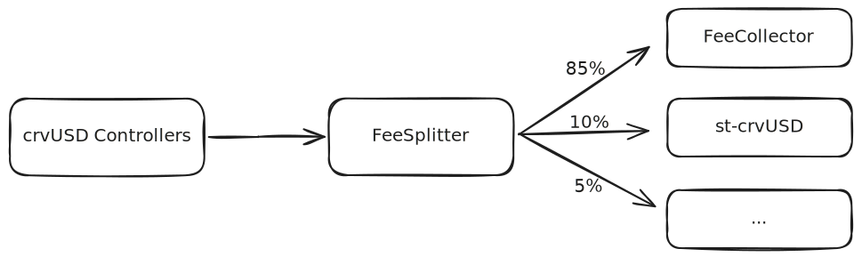

<h1>Fee Splitter</h1>

The `FeeSplitter.vy` contract is a straightforward contract that collects accumulated crvUSD fees from crvUSD Controllers[^1] and distributes them to other contracts according to predetermined weights in a single transaction.

[^1]: These are Controllers from which crvUSD is minted. See here: https://crvusd.curve.fi/

!!!github "GitHub"
    The source code for the `FeeSplitter.vy` contract can be found on [:material-github: GitHub](https://github.com/curvefi/curve-burners/pull/1). The contract is written using [Vyper](https://github.com/vyperlang/vyper) version `0.4.0` and utilizes a [snekmate module](https://github.com/pcaversaccio/snekmate/blob/main/src/snekmate/auth/ownable.vy) to handle contract ownership.


*The flow above, which involves claiming fees and distributing them among different components such as the `FeeCollector`, is facilitated with a single call to the `dispatch_fees()` function.*


!!! colab "Google Colab Notebook"
    A Google Colab notebook demonstrating the usage of the `FeeSplitter.vy` contract can be found here: [:simple-googlecolab: Google Colab Notebook](https://colab.research.google.com/drive/1JJyYJ1Z70WlRqFNt1093A3VMFplM775r?usp=sharing).


---


### **Dispatching Fees**

The `dispatch_fees` function is responsible for both collecting crvUSD fees from the `Controllers` and distributing them according to a predetermined set of weights. The contract utilizes a "helper contract" called `ControllerMulticlaim.vy`, which aims to track all `Controllers` and provides an interface for claiming fees from them. By default, the `dispatch_fees` function claims fees from all `Controllers` added to `ControllerMulticlaim.vy`, but it also allows for specifying particular controllers if one wants to claim fees from only those.

!!!info "Documentation for the `ControllerMulticlaim.vy` contract"

    The `ControllerMulticlaim.vy` contract uses a simple `update_controller` function, callable by anyone, to update the list of controllers from which the fees are claimed. This is necessary because newly deployed controllers are not directly picked up by the contract. This contract is not documented separately but is instead covered on this page in the relevant section. The full source code for the contract can be found below. An easy way to check if the `FeeSplitter` "recognizes" all controllers is to call the `n_receivers` function on both the `FeeCollector` and `ControllerMulticlaim` contracts. If both functions return the same value, it's up-to-date. If not, `update_controller` needs to be called to update.

    ??? quote "Source Code"

        The following source code includes all changes up to commit hash [581b897](https://github.com/curvefi/autobribe/tree/581b8978f91e426c648cf6243420fee5276166b7); any changes made after this commit are not included.

        === "`ControllerMulticlaim.vy`"

            ```python
            # pragma version ~=0.4.0

            """
            @title ControllerMulticlaim
            @notice Helper module to claim fees from multiple
            controllers at the same time.
            @license Copyright (c) Curve.Fi, 2020-2024 - all rights reserved
            @author curve.fi
            @custom:security security@curve.fi
            """

            import ControllerFactory
            import Controller

            factory: immutable(ControllerFactory)

            allowed_controllers: public(HashMap[Controller, bool])
            controllers: public(DynArray[Controller, MAX_CONTROLLERS])

            # maximum number of claims in a single transaction
            MAX_CONTROLLERS: constant(uint256) = 100


            @deploy
            def __init__(_factory: ControllerFactory):
                assert _factory.address != empty(address), "zeroaddr: factory"

                factory = _factory


            def claim_controller_fees(controllers: DynArray[Controller, MAX_CONTROLLERS]):
                """
                @notice Claims admin fees from a list of controllers.
                @param controllers The list of controllers to claim fees from.
                @dev For the claim to succeed, the controller must be in the list of
                    allowed controllers. If the list of controllers is empty, all
                    controllers in the factory are claimed from.
                """
                if len(controllers) == 0:
                    for c: Controller in self.controllers:
                        extcall c.collect_fees()
                else:
                    for c: Controller in controllers:
                        if not self.allowed_controllers[c]:
                            raise "controller: not in factory"
                        extcall c.collect_fees()


            @nonreentrant
            @external
            def update_controllers():
                """
                @notice Update the list of controllers so that it corresponds to the
                    list of controllers in the factory.
                @dev The list of controllers can only add new controllers from the
                    factory when updated.
                """
                old_len: uint256 = len(self.controllers)
                new_len: uint256 = staticcall factory.n_collaterals()
                for i: uint256 in range(new_len - old_len, bound=MAX_CONTROLLERS):
                    i_shifted: uint256 = i + old_len
                    c: Controller = Controller(staticcall factory.controllers(i_shifted))
                    self.allowed_controllers[c] = True
                    self.controllers.append(c)


            @view
            @external
            def n_controllers() -> uint256:
                return len(self.controllers)
            ```


All receiving addresses are stored in a `Receiver` struct, which includes the address and its corresponding weight:

```py
struct Receiver:
    addr: address
    weight: uint256
```

The weights assigned to different components receiving `crvUSD` are determined when a receiver address is added using the `set_receivers` function. Additionally, the contract supports dynamic weights based on various conditions. If a weight is dynamic, the `weight` value in the struct serves as a cap. If the dynamic weight is less than the defined weight in the struct, the unused portion is added to the weight of the last receiver. In effect, any unused weight is rolled over to the last receiver address in the `receivers` storage variable.


!!!tip "Weight Example"
    Let's consider a scenario where the initial weights stored in a `Receiver` struct are defined as follows: `receiver1` has a weight of 10%, `receiver2` also has a weight of 10%, and `receiver3` has a weight of 80%.

    However, due to the dynamic nature of `receiver1`'s weight, the actual weight for `receiver1` turns out to be 8%. This 2% difference is rolled over to the last receiver specified, `receiver3`.

    As a result, the final weights are adjusted as follows: `receiver1` ends up with a weight of 8%, `receiver2` remains at 10%, and `receiver3` receives an adjusted weight of 82%, which includes the 2% rolled over from `receiver1`.


---


### `dispatch_fees`
!!! description "`FeeSplitter.dispatch_fees(controllers: DynArray[multiclaim.Controller, multiclaim.MAX_CONTROLLERS]=[])`"

    Function to claim crvUSD fees from Controllers and distribute them to receivers according to their weights. This function is callable by anyone.

    | Input         | Type                                                          | Description |
    | ------------- | ------------------------------------------------------------- | ----------- |
    | `controllers` | `DynArray[multiclaim.Controller, multiclaim.MAX_CONTROLLERS]` | Array of Controllers to claim from; defaults to claiming fees from all Controllers |

    ??? quote "Source code"

        === "`FeeSplitter.vy`"

            The following source code includes all changes up to commit hash [581b897](https://github.com/curvefi/autobribe/tree/581b8978f91e426c648cf6243420fee5276166b7); any changes made after this commit are not included.

            ```python
            struct Receiver:
                addr: address
                weight: uint256

            # maximum number of splits
            MAX_RECEIVERS: constant(uint256) = 100
            # maximum basis points (100%)
            MAX_BPS: constant(uint256) = 10_000
            # TODO placeholder
            DYNAMIC_WEIGHT_EIP165_ID: constant(bytes4) = 0x12431234

            # receiver logic
            receivers: public(DynArray[Receiver, MAX_RECEIVERS])

            crvusd: immutable(IERC20)

            @nonreentrant
            @external
            def dispatch_fees(
                controllers: DynArray[
                    multiclaim.Controller, multiclaim.MAX_CONTROLLERS
                ] = []
            ):
                """
                @notice Claim fees from all controllers and distribute them
                @param controllers The list of controllers to claim fees from (default: all)
                @dev Splits and transfers the balance according to the receivers weights
                """

                multiclaim.claim_controller_fees(controllers)

                balance: uint256 = staticcall crvusd.balanceOf(self)

                excess: uint256 = 0

                # by iterating over the receivers, rather than the indices,
                # we avoid an oob check at every iteration.
                i: uint256 = 0
                for r: Receiver in self.receivers:
                    weight: uint256 = r.weight

                    if self._is_dynamic(r.addr):
                        dynamic_weight: uint256 = staticcall DynamicWeight(r.addr).weight()

                        # `weight` acts as a cap to the dynamic weight, preventing
                        # receivers to ask for more than what they are allowed to.
                        if dynamic_weight < weight:
                            excess += weight - dynamic_weight
                            weight = dynamic_weight

                    # if we're at the last iteration, it means `r` is the excess
                    # receiver, therefore we add the excess to its weight.
                    if i == len(self.receivers) - 1:
                        weight += excess

                    extcall crvusd.transfer(r.addr, balance * weight // MAX_BPS)

                    log FeeDispatched(r.addr, weight)
                    i += 1

            def _is_dynamic(addr: address) -> bool:
                """
                This function covers the following cases without reverting:
                1. The address is an EIP-165 compliant contract that supports
                    the dynamic weight interface (returns True).
                2. The address is a contract that does not comply to EIP-165
                    (returns False).
                3. The address is an EIP-165 compliant contract that does not
                    support the dynamic weight interface (returns False).
                4. The address is an EOA (returns False).
                """
                success: bool = False
                response: Bytes[32] = b""
                success, response = raw_call(
                    addr,
                    abi_encode(
                        DYNAMIC_WEIGHT_EIP165_ID,
                        method_id=method_id("supportsInterface(bytes4)"),
                    ),
                    max_outsize=32,
                    is_static_call=True,
                    revert_on_failure=False,
                )
                return success and convert(response, bool) or len(response) > 32
            ```

        === "`ControllerMulticlaim.vy`"

            The following source code includes all changes up to commit hash [581b897](https://github.com/curvefi/autobribe/tree/581b8978f91e426c648cf6243420fee5276166b7); any changes made after this commit are not included.

            ```python
            import ControllerFactory
            import Controller

            factory: immutable(ControllerFactory)

            allowed_controllers: public(HashMap[Controller, bool])
            controllers: public(DynArray[Controller, MAX_CONTROLLERS])

            # maximum number of claims in a single transaction
            MAX_CONTROLLERS: constant(uint256) = 100


            @deploy
            def __init__(_factory: ControllerFactory):
                assert _factory.address != empty(address), "zeroaddr: factory"

                factory = _factory


            def claim_controller_fees(controllers: DynArray[Controller, MAX_CONTROLLERS]):
                """
                @notice Claims admin fees from a list of controllers.
                @param controllers The list of controllers to claim fees from.
                @dev For the claim to succeed, the controller must be in the list of
                    allowed controllers. If the list of controllers is empty, all
                    controllers in the factory are claimed from.
                """
                if len(controllers) == 0:
                    for c: Controller in self.controllers:
                        extcall c.collect_fees()
                else:
                    for c: Controller in controllers:
                        if not self.allowed_controllers[c]:
                            raise "controller: not in factory"
                        extcall c.collect_fees()


            @nonreentrant
            @external
            def update_controllers():
                """
                @notice Update the list of controllers so that it corresponds to the
                    list of controllers in the factory.
                @dev The list of controllers can only add new controllers from the
                    factory when updated.
                """
                old_len: uint256 = len(self.controllers)
                new_len: uint256 = staticcall factory.n_collaterals()
                for i: uint256 in range(new_len - old_len, bound=MAX_CONTROLLERS):
                    i_shifted: uint256 = i + old_len
                    c: Controller = Controller(staticcall factory.controllers(i_shifted))
                    self.allowed_controllers[c] = True
                    self.controllers.append(c)
            ```

        === "`DynamicWeight.vyi`"

            The following source code includes all changes up to commit hash [581b897](https://github.com/curvefi/autobribe/tree/581b8978f91e426c648cf6243420fee5276166b7); any changes made after this commit are not included.

            ```python
            @view
            @external
            def supportsInterface(interface_id: bytes4) -> bool:
                ...


            @view
            @external
            def weight() -> uint256:
                ...
            ```

    === "Example"

        ```shell
        >>> soon
        ```


### `receivers`
!!! description "`FeeSplitter.receivers(arg0: uint256) -> Receiver: view`"

    Getter for the recevier information at index `arg0`. Receivers can be added or modified by the DAO using the `set_receivers` function.

    Returns: `Receiver` struct consisting of `address` and `weight`.

    | Input  | Type      | Description           |
    | ------ | --------- | --------------------- |
    | `arg0` | `uint256` | Index of the receiver |

    ??? quote "Source code"

        === "`FeeSplitter.vy`"

            The following source code includes all changes up to commit hash [581b897](https://github.com/curvefi/autobribe/tree/581b8978f91e426c648cf6243420fee5276166b7); any changes made after this commit are not included.

            ```python
            struct Receiver:
                addr: address
                weight: uint256

            receivers: public(DynArray[Receiver, MAX_RECEIVERS])
            ```

    === "Example"

        This example returns the receiver's address and their respective weight at index value 1.

        ```shell
        >>> FeeSplitter.receivers(1)
        '0xa2Bcd1a4Efbd04B63cd03f5aFf2561106ebCCE00', 100000
        ```


### `n_receivers`
!!! description "`FeeSplitter.n_receivers() -> uint256`"

    Getter for the total number of receivers. This is also the default number of receivers claimed from when calling `dispatch_fees`.

    Returns: number of receivers added (`uint256`)

    ??? quote "Source code"

        === "`FeeSplitter.vy`"

            The following source code includes all changes up to commit hash [581b897](https://github.com/curvefi/autobribe/tree/581b8978f91e426c648cf6243420fee5276166b7); any changes made after this commit are not included.

            ```python
            receivers: public(DynArray[Receiver, MAX_RECEIVERS])

            @view
            @external
            def n_receivers() -> uint256:
                """
                @notice Get the number of receivers
                @return The number of receivers
                """
                return len(self.receivers)
            ```

    === "Example"

        This example returns the total number of crvUSD Controllers "registered" in the [`receivers`](#receivers) array.

        ```shell
        >>> FeeSplitter.n_receivers()
        2
        ```


### `excess_receiver`
!!! description "`FeeSplitter.excess_receiver() -> address:`"

    Getter for the excess receiver. That is the last receiver address in [`receivers`](#receivers) and is the one that receiving additional weight ontop of his on weight, if prior receivers with a dynamic weight allocate less than their cap (see this example at the top). 

    Returns: excess receiver (`address`)

    ??? quote "Source code"

        === "`FeeSplitter.vy`"

            The following source code includes all changes up to commit hash [581b897](https://github.com/curvefi/autobribe/tree/581b8978f91e426c648cf6243420fee5276166b7); any changes made after this commit are not included.

            ```python
            receivers: public(DynArray[Receiver, MAX_RECEIVERS])

            @view
            @external
            def excess_receiver() -> address:
                """
                @notice Get the excess receiver, that is the receiver
                    that, on top of his weight, will receive an additional
                    weight if other receivers (with a dynamic weight) ask
                    for less than their cap.
                @return The address of the excess receiver.
                """
                receivers_length: uint256 = len(self.receivers)
                return self.receivers[receivers_length - 1].addr
            ```

    === "Example"

        ```shell
        >>> FeeSplitter.excess_receiver()
        '0xa2Bcd1a4Efbd04B63cd03f5aFf2561106ebCCE00'
        ```


### `set_receivers`
!!! description "`FeeSplitter.set_receivers(receivers: DynArray[Receiver, MAX_RECEIVERS])`"

    !!!guard "Guarded Method"
        This function can only be called by the `owner` of the contract. The contract uses the following Snekmate module for handling ownership: [:material-github: GitHub](https://github.com/pcaversaccio/snekmate/blob/main/src/snekmate/auth/ownable.vy).

    Function to set receivers and their respective weights of the collected crvUSD fees. When adding new receivers, one must include the current ones in the array of `Receiver` structs. The function will revert if the address is `ZERO_ADDRESS`, if the weight is 0 or greater than `MAX_BPS` (10000), or if the sum of the weights of all receivers does not equal `MAX_BPS` (100%). The weight is based on a scale of 1e5, meaning e.g. 100% corresponds to a weight value of 10000, and 50% would be a weight value of 5000. Additionally, when adding receivers with dynamic weights, they must support the `DYNAMIC_WEIGHT_EIP165_ID` as specified by EIP-165; otherwise, the function will revert.

    Emits: `SetReceivers`

    | Input       | Type                                | Description                                                  |
    | ----------- | ----------------------------------- | ------------------------------------------------------------ |
    | `receivers` | `DynArray[Receiver, MAX_RECEIVERS]` | Array of `Receiver` structs containing of address and weight |

    ??? quote "Source code"

        === "`FeeSplitter.vy`"

            The following source code includes all changes up to commit hash [581b897](https://github.com/curvefi/autobribe/tree/581b8978f91e426c648cf6243420fee5276166b7); any changes made after this commit are not included.

            ```python
            from snekmate.auth import ownable

            struct Receiver:
                addr: address
                weight: uint256

            # maximum number of splits
            MAX_RECEIVERS: constant(uint256) = 100
            # maximum basis points (100%)
            MAX_BPS: constant(uint256) = 10_000
            # TODO placeholder
            DYNAMIC_WEIGHT_EIP165_ID: constant(bytes4) = 0x12431234

            receivers: public(DynArray[Receiver, MAX_RECEIVERS])

            @external
            def set_receivers(receivers: DynArray[Receiver, MAX_RECEIVERS]):
                """
                @notice Set the receivers, the last one is the excess receiver.
                @param receivers The new receivers's list.
                @dev The excess receiver is always the last element in the
                    `self.receivers` array.
                """
                ownable._check_owner()

                self._set_receivers(receivers)

            def _set_receivers(receivers: DynArray[Receiver, MAX_RECEIVERS]):
                assert len(receivers) > 0, "receivers: empty"
                total_weight: uint256 = 0
                for r: Receiver in receivers:
                    assert r.addr != empty(address), "zeroaddr: receivers"
                    assert r.weight > 0 and r.weight <= MAX_BPS, "receivers: invalid weight"
                    total_weight += r.weight
                assert total_weight == MAX_BPS, "receivers: total weight != MAX_BPS"

                self.receivers = receivers

                log SetReceivers()
            ```

    === "Example"

        This example sets two receiver addresses and their respective weights: the first is the Vyper Gitcoin address with a 10% weight, and the second is the `FeeCollector` with the remaining 90%.

        ```shell
        >>> FeeSplitter.set_receivers([('0x70CCBE10F980d80b7eBaab7D2E3A73e87D67B775', 1000), ('0xa2Bcd1a4Efbd04B63cd03f5aFf2561106ebCCE00', 9000)])
        ```


### `version`
!!! description "`FeeSplitter.version() -> String[8]: view`"

    Getter for the version of the contract.

    Returns: contract version (`String[8]`). 

    ??? quote "Source code"

        === "`FeeSplitter.vy`"

            The following source code includes all changes up to commit hash [581b897](https://github.com/curvefi/autobribe/tree/581b8978f91e426c648cf6243420fee5276166b7); any changes made after this commit are not included.

            ```python
            version: public(constant(String[8])) = "0.1.0" # no guarantees on abi stability
            ```

    === "Example"

        ```shell
        >>> FeeSplitter.version()
        '0.1.0'
        ```