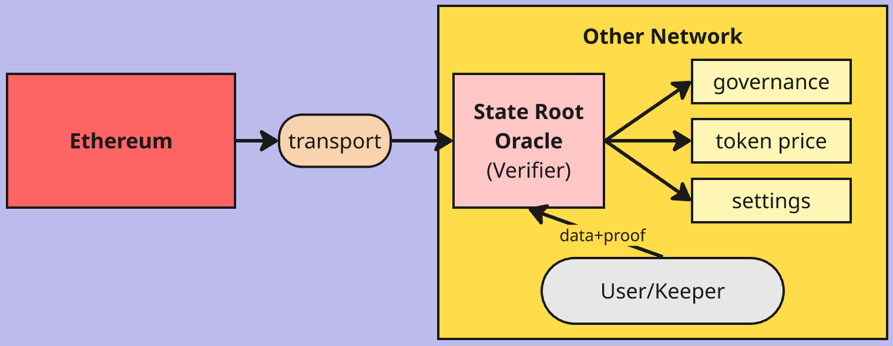
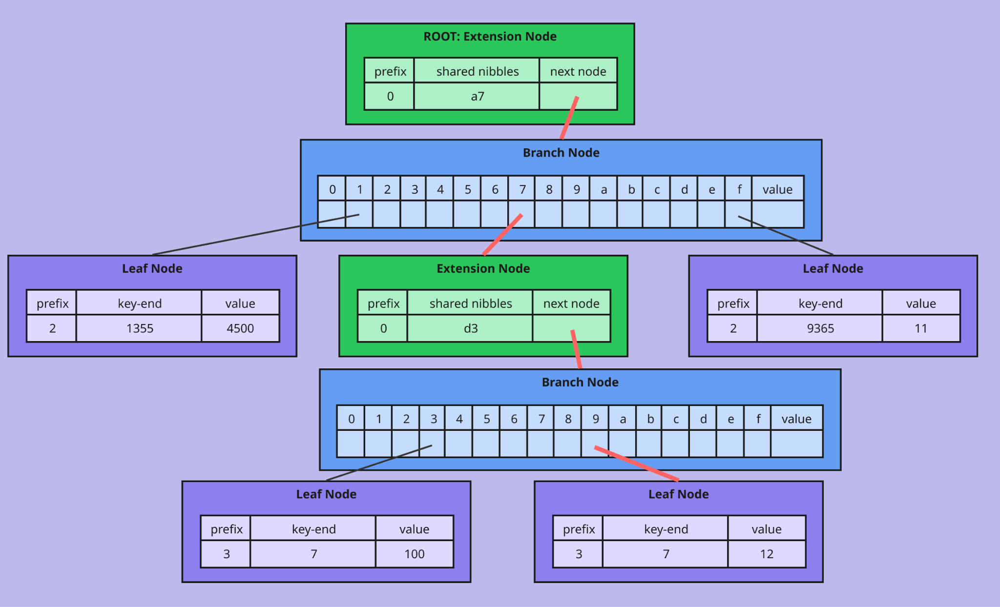
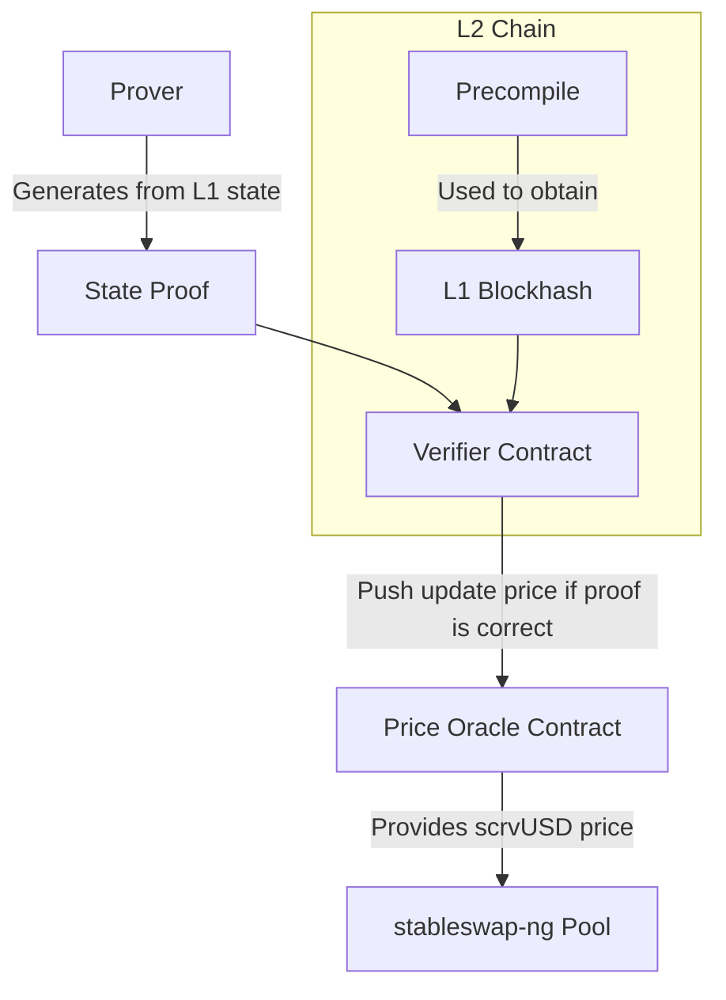

<h1>Curve Block Oracle Overview</h1>

!!!github "GitHub"
    Source code for the storage proof architecture is available here: [:material-github: `storage-proofs`](https://github.com/curvefi/storage-proofs)

    The [Curve Block Oracle Dashboard](https://curvefi.github.io/blockhash-oracle/) offers a live view of relayed blocks and headers across supported networks.

    A real-time [Storage Proof Monitoring Dashboard](https://curvefi.github.io/storage-proofs/) provides live insights into storage proofs and system status.

The **Curve Block Oracle** is a **decentralized**, **cross-chain** infrastructure designed to securely relay and verify Ethereum mainnet block hashes and state roots on other blockchains. This system enables **trust-minimized interoperability**, cross-chain oracles, and secure data streaming for applications such as price feeds, state proofs, and cross-chain governance. By providing a **canonical reference to Ethereum state**, the oracle allows DeFi protocols and dApps to safely use Ethereum-based data and logic across multiple networks.

## Why Block Oracles?

Curve DAO and core projects like crvUSD reside on Ethereum, with governance and canonical data stored on mainnet. To support new deployments and cross-chain integrations, it is essential to verify Ethereum state (such as block hashes and storage slots) on other networks.

The simplest and most robust way to support multiple transport layers is to send **block hashes** or **state roots** from Ethereum and use **storage proofs** on other chains. This approach abstracts away the messaging protocol—dApps simply verify data against the known Ethereum root.

## Storage Proofs

Each block has a **block header**, which includes the **state root**—a root hash of the entire Merkle Patricia Trie containing accounts and storage. Given a block hash, you can verify the state root.  
To prove a storage slot, you must verify the full path from the root down to the leaf node—or prove that it does not exist.

## System Architecture

The Curve Block Oracle system consists of several smart contracts and off-chain actors:

- [`BlockOracle`](./BlockOracle.md): A decentralized contract that stores block hashes using a **threshold-based, multi-committer consensus**. Only after a threshold of trusted committers submit matching block hashes is a block considered confirmed and immutable.
- [`LZBlockRelay`](./LZBlockRelay.md): A cross-chain relay contract built on LayerZero, responsible for securely transmitting block hashes and state roots to other chains. It supports both read-enabled and broadcast-only modes.
- [`MainnetBlockView`](./MainnetBlockView.md): A lightweight contract on Ethereum mainnet that provides access to recent block hashes, ensuring only finalized blocks are relayed.
- [`HeaderVerifier`](./HeaderVerifier.md): Decodes RLP-encoded Ethereum block headers and forwards the extracted data to the BlockOracle for verification and storage.
- **Offchain Prover**: An off-chain actor that fetches data from Ethereum, generates storage proofs, and submits them (with proofs) to the verifier contracts on target chains. The prover does not need to be trusted, as the safety of the whole system relies on the fact that it is not feasible to push an update with a forged proof. The prover must be online to provide the proof in a timely manner; if the prover is offline, the system might not be able to provide a correct (or accurate) price for scrvUSD.

## How It Works

1. **Block Hash Commitment**: Trusted committers submit block hashes to the BlockOracle. Once a threshold is reached, the block hash is confirmed.
2. **Cross-Chain Relay**: The LZBlockRelay contract uses LayerZero to relay confirmed block hashes to other chains, where they can be used for state proofs and oracles.
3. **State Proof Verification**: On the target chain, a verifier contract checks the provided storage proof against the known Ethereum state root, ensuring data integrity.
4. **Application Integration**: dApps (such as stableswap-ng pools or cross-chain price oracles) can now trustlessly verify Ethereum state and use it for pricing, governance, or other logic.

## System Specification

Depending on the type of chain, the proof and its verification process will differ:

- **OP Stack-based chains**: The verifier expects a block hash (to be matched with the one available in a precompile) and a state proof of the memory slots relevant to the growth rate computation.
- **Taiko Stack-based chains**: The verifier expects the block number and a state proof of the memory slots relevant to the growth rate computation.
- **Other chains**: The prover provides the same data as for the OP Stack, and relevant data to verify the proof will be bridged from Optimism using LayerZero.

### Example Flow (OP Stack-based chain)

## Prover's Trust Assumptions

A key feature of the Curve Block Oracle system is that the off-chain prover does **not need to be trusted for the system’s safety**. The design ensures that it is not feasible to push an update with a forged proof, so even if the prover is malicious, it cannot compromise the correctness of the data. However, the **liveness** of the system does depend on the prover: if the prover is offline or fails to provide timely proofs, the system may not be able to update or provide accurate prices (such as for scrvUSD) on the target chain. In this way, the system is robust against malicious actors but still requires at least one honest and available prover to function smoothly.

## Security Model

Security in the Curve Block Oracle is achieved through a combination of **threshold consensus** and **permissioned committers**. No single committer can control the oracle; instead, a configurable threshold of trusted parties must agree on each block hash before it is accepted. Only addresses added by the DAO (as owner) are allowed to submit block hashes, and the set of committers can be updated as needed to maintain decentralization and resilience. For cross-chain communication, only messages from trusted LayerZero peers are accepted, with all configuration managed by the contract owner. Finally, all data is verified using **Ethereum’s Merkle Patricia Trie proofs**, so correctness does not depend on trusting the prover or any single relayer.
