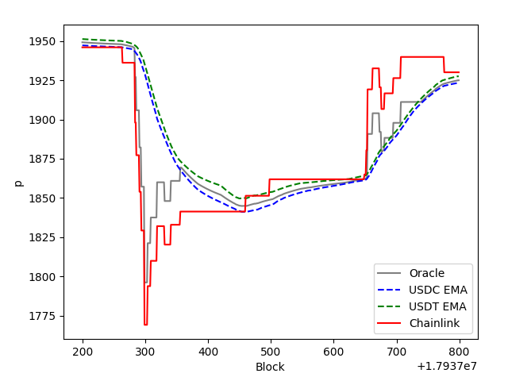

As crvUSD markets use internal oracles, they utilize in-house liquidity pools to aggregate the price of collateral. There is also a possibility to use Chainlink oracle prices as safety limits.

!!!warning
    Every market has its own price oracle contract, which can be fetched by calling `price_oracle_contract` within the controller of the market. The [wstETH oracle](https://etherscan.io/address/0xc1793A29609ffFF81f10139fa0A7A444c9e106Ad#code) will be used for the purpose of this documentation. Please be aware that oracle contracts can vary based on the collateral token.


!!!tip
    The formulas below use slightly different terminologies than the code to make them easier to read.  
    For abbreviations, see [here](#terminology-used-in-code).


## **EMA of TVL**
`_ema_tvl()` calculates the exponential moving average (EMA) of the total value locked (TVL) for tricrypto pools.It uses a smoothing factor $\alpha$ to smooth out the TVL based on the duration since it was last called.

This value is subsequently used in the internal function `_raw_price()` to compute the weighted price of ETH.


??? quote "`_ema_tvl() -> uint256[N_POOLS]:`"

    ```python
    last_timestamp: public(uint256)
    last_tvl: public(uint256[N_POOLS])
    TVL_MA_TIME: public(constant(uint256)) = 50000  # s

    @internal
    @view
    def _ema_tvl() -> uint256[N_POOLS]:
        last_timestamp: uint256 = self.last_timestamp
        last_tvl: uint256[N_POOLS] = self.last_tvl

        if last_timestamp < block.timestamp:
            alpha: uint256 = self.exp(- convert((block.timestamp - last_timestamp) * 10**18 / TVL_MA_TIME, int256))
            # alpha = 1.0 when dt = 0
            # alpha = 0.0 when dt = inf
            for i in range(N_POOLS):
                tvl: uint256 = TRICRYPTO[i].totalSupply() * TRICRYPTO[i].virtual_price() / 10**18
                last_tvl[i] = (tvl * (10**18 - alpha) + last_tvl[i] * alpha) / 10**18

        return last_tvl
    ```

$$tvl_{i} = \frac{TS_i * VP_i}{10^{18}}$$

$$\text{last_tvl}_i = \frac{tvl_i * (10^{18} - \alpha) + \text{last_tvl}_i * \alpha}{10^{18}}$$


$tvl_i = \text{TVL of i-th pool}$ in `TRICRYPTO[N_POOLS]`  
$TS_i = \text{total supply of i-th pool}$ in `TRICRYPTO[N_POOLS]`  
$VP_i = \text{virtual price of i-th pool}$ in `TRICRYPTO[N_POOLS]` 
$\text{last_tvl}_i = \text{smoothed TVL of i-th pool}$ in `TRICRYPTO[N_POOLS]` 

$tvl_i$ essentially represents the weight.


### `ema_tvl`
!!! description "`Oracle.ema_tvl() -> uint256[N_POOLS]:`"

    Function to calculate the Total-Value-Locked (TVL) Exponential-Moving-Average (EMA) of the `TRICRYPTO` pools. 

    Returns: `last_tvl` (`uint256[N_POOLS]`).

    ??? quote "Source code"

        ```python hl_lines="3 4 8 20"
        @external
        @view
        def ema_tvl() -> uint256[N_POOLS]:
            return self._ema_tvl()

        @internal
        @view
        def _ema_tvl() -> uint256[N_POOLS]:
            last_timestamp: uint256 = self.last_timestamp
            last_tvl: uint256[N_POOLS] = self.last_tvl

            if last_timestamp < block.timestamp:
                alpha: uint256 = self.exp(- convert((block.timestamp - last_timestamp) * 10**18 / TVL_MA_TIME, int256))
                # alpha = 1.0 when dt = 0
                # alpha = 0.0 when dt = inf
                for i in range(N_POOLS):
                    tvl: uint256 = TRICRYPTO[i].totalSupply() * TRICRYPTO[i].virtual_price() / 10**18
                    last_tvl[i] = (tvl * (10**18 - alpha) + last_tvl[i] * alpha) / 10**18

            return last_tvl
        ```

    === "Example"

        ```shell
        >>> Oracle.ema_tvl()
        38652775551183170655949, 40849321168337010409906
        ```


### `last_tvl`
!!! description "`Oracle.last_tvl(arg0: uint256) -> uint256:`"

    Getter for the `last_tvl` of the tricrypto pool at index `arg0`.

    Returns: `last_tvl` (`uint256[N_POOLS]`).

    | Input      | Type   | Description |
    | ----------- | -------| ----|
    | `arg0` |  `uint256` | Index |

    ??? quote "Source code"

        ```python hl_lines="3"
        last_tvl: public(uint256[N_POOLS])
        ```

    === "Example"

        ```shell
        >>> Oracle.last_tvl(0)
        38650114241563018578505
        ```


## **Calculate Raw Price**
`_raw_price()` calculates the raw price of the collateral. The function requires the inputs `tvls` (from `_ema_tvl()`) and `agg_price` (from `STABLESWAP_AGGREGATOR.price()`).

??? quote "`_raw_price(tvls: uint256[N_POOLS], agg_price: uint256) -> uint256:`"

    ```python
    @internal
    @view
    def _raw_price(tvls: uint256[N_POOLS], agg_price: uint256) -> uint256:
        weighted_price: uint256 = 0
        weights: uint256 = 0
        for i in range(N_POOLS):
            p_crypto_r: uint256 = TRICRYPTO[i].price_oracle(TRICRYPTO_IX[i])   # d_usdt/d_eth
            p_stable_r: uint256 = STABLESWAP[i].price_oracle()                 # d_usdt/d_st
            p_stable_agg: uint256 = agg_price                                  # d_usd/d_st
            if IS_INVERSE[i]:
                p_stable_r = 10**36 / p_stable_r
            weight: uint256 = tvls[i]
            # Prices are already EMA but weights - not so much
            weights += weight
            weighted_price += p_crypto_r * p_stable_agg / p_stable_r * weight     # d_usd/d_eth
        crv_p: uint256 = weighted_price / weights

        use_chainlink: bool = self.use_chainlink

        # Limit ETH price
        if use_chainlink:
            chainlink_lrd: ChainlinkAnswer = CHAINLINK_AGGREGATOR_ETH.latestRoundData()
            if block.timestamp - min(chainlink_lrd.updated_at, block.timestamp) <= CHAINLINK_STALE_THRESHOLD:
                chainlink_p: uint256 = convert(chainlink_lrd.answer, uint256) * 10**18 / CHAINLINK_PRICE_PRECISION_ETH
                lower: uint256 = chainlink_p * (10**18 - BOUND_SIZE) / 10**18
                upper: uint256 = chainlink_p * (10**18 + BOUND_SIZE) / 10**18
                crv_p = min(max(crv_p, lower), upper)

        p_staked: uint256 = STAKEDSWAP.price_oracle()  # d_eth / d_steth

        # Limit STETH price
        if use_chainlink:
            chainlink_lrd: ChainlinkAnswer = CHAINLINK_AGGREGATOR_STETH.latestRoundData()
            if block.timestamp - min(chainlink_lrd.updated_at, block.timestamp) <= CHAINLINK_STALE_THRESHOLD:
                chainlink_p: uint256 = convert(chainlink_lrd.answer, uint256) * 10**18 / CHAINLINK_PRICE_PRECISION_STETH
                lower: uint256 = chainlink_p * (10**18 - BOUND_SIZE) / 10**18
                upper: uint256 = chainlink_p * (10**18 + BOUND_SIZE) / 10**18
                p_staked = min(max(p_staked, lower), upper)

        p_staked = min(p_staked, 10**18) * WSTETH.stEthPerToken() / 10**18  # d_eth / d_wsteth

        return p_staked * crv_p / 10**18
    ```   


$$price_{weighted} = (\frac{price_{eth} * price_{crvusd}}{price_{usd}}) * weight$$

$$totalPrice_{weighted} = \frac{\sum{price_{weighted}}}{\sum{weight}}$$

$$price_{stETH} = min(price_{stETH}, 10^{18}) * \frac{rate_{wstETH}}{10^{18}}$$

$$price = price_{stETH} * totalPrice_{weighted}$$

$price_{weighted} =$ weighted price of ETH  
$totalPrice_{weighted} =$ total weighted price of ETH  
$price_{eth} =$ price oracle of eth in the tricrypto pools w.r.t usdc/usdt  
$price_{usd} =$ price oracle of stableswap pool  
$price_{crvusd} =$ price oracle of crvusd  
$price_{stETH} =$ price of stETH w.r.t ETH  
$rate_{wstETH} =$ amount of stETH for 1 wstETH


### `raw_price`
!!! description "`Oracle.raw_price() -> uint256: view`"

    Function to calculate the raw price.
    
    Returns: raw price (`uint256`).

    ??? quote "Source code"

        ```python hl_lines="1 16 18"
        @external
        @view
        def raw_price() -> uint256:
            return self._raw_price()

        @internal
        @view
        def _raw_price(tvls: uint256[N_POOLS], agg_price: uint256) -> uint256:
            weighted_price: uint256 = 0
            weights: uint256 = 0
            for i in range(N_POOLS):
                p_crypto_r: uint256 = TRICRYPTO[i].price_oracle(TRICRYPTO_IX[i])   # d_usdt/d_eth
                p_stable_r: uint256 = STABLESWAP[i].price_oracle()                 # d_usdt/d_st
                p_stable_agg: uint256 = agg_price                                  # d_usd/d_st
                if IS_INVERSE[i]:   
                    p_stable_r = 10**36 / p_stable_r
                weight: uint256 = tvls[i]
                # Prices are already EMA but weights - not so much
                weights += weight
                weighted_price += p_crypto_r * p_stable_agg / p_stable_r * weight     # d_usd/d_eth
            crv_p: uint256 = weighted_price / weights

            use_chainlink: bool = self.use_chainlink

            # Limit ETH price
            if use_chainlink:
                chainlink_lrd: ChainlinkAnswer = CHAINLINK_AGGREGATOR_ETH.latestRoundData()
                if block.timestamp - min(chainlink_lrd.updated_at, block.timestamp) <= CHAINLINK_STALE_THRESHOLD:
                    chainlink_p: uint256 = convert(chainlink_lrd.answer, uint256) * 10**18 / CHAINLINK_PRICE_PRECISION_ETH
                    lower: uint256 = chainlink_p * (10**18 - BOUND_SIZE) / 10**18
                    upper: uint256 = chainlink_p * (10**18 + BOUND_SIZE) / 10**18
                    crv_p = min(max(crv_p, lower), upper)

            p_staked: uint256 = STAKEDSWAP.price_oracle()  # d_eth / d_steth

            # Limit STETH price
            if use_chainlink:
                chainlink_lrd: ChainlinkAnswer = CHAINLINK_AGGREGATOR_STETH.latestRoundData()
                if block.timestamp - min(chainlink_lrd.updated_at, block.timestamp) <= CHAINLINK_STALE_THRESHOLD:
                    chainlink_p: uint256 = convert(chainlink_lrd.answer, uint256) * 10**18 / CHAINLINK_PRICE_PRECISION_STETH
                    lower: uint256 = chainlink_p * (10**18 - BOUND_SIZE) / 10**18
                    upper: uint256 = chainlink_p * (10**18 + BOUND_SIZE) / 10**18
                    p_staked = min(max(p_staked, lower), upper)

            p_staked = min(p_staked, 10**18) * WSTETH.stEthPerToken() / 10**18  # d_eth / d_wsteth

            return p_staked * crv_p / 10**18
        ```

    === "Example"

        ```shell
        >>> Oracle.raw_price()
        1970446024043370547236
        ```

## **Chainlink Limits**
The oracle contracts have the option to utilize Chainlink prices, which serve as safety limits. When enabled, these limits are triggered if the Chainlink price deviates by more than 1.5% (represented by `BOUND_SIZE`) from the internal price oracles.

Chainlink limits can be turned on and off by calling `set_use_chainlink(do_it: bool)`, which can only be done by the admin of the factory contract.

<figure markdown>
  { width="400" }
  <figcaption>Chainlink vs Internal Orcale</figcaption>
</figure>


### **ETH Limit**

??? quote "ETH Price Limit"

    ```python
    # Limit ETH price
    if use_chainlink:
        chainlink_lrd: ChainlinkAnswer = CHAINLINK_AGGREGATOR_ETH.latestRoundData()
        if block.timestamp - min(chainlink_lrd.updated_at, block.timestamp) <= CHAINLINK_STALE_THRESHOLD:
            chainlink_p: uint256 = convert(chainlink_lrd.answer, uint256) * 10**18 / CHAINLINK_PRICE_PRECISION_ETH
            lower: uint256 = chainlink_p * (10**18 - BOUND_SIZE) / 10**18
            upper: uint256 = chainlink_p * (10**18 + BOUND_SIZE) / 10**18
            crv_p = min(max(crv_p, lower), upper)
    ```


### **stETH Limit**

??? quote "stETH Price Limit"

    ```python
    # Limit STETH price
    if use_chainlink:
        chainlink_lrd: ChainlinkAnswer = CHAINLINK_AGGREGATOR_STETH.latestRoundData()
        if block.timestamp - min(chainlink_lrd.updated_at, block.timestamp) <= CHAINLINK_STALE_THRESHOLD:
            chainlink_p: uint256 = convert(chainlink_lrd.answer, uint256) * 10**18 / CHAINLINK_PRICE_PRECISION_STETH
            lower: uint256 = chainlink_p * (10**18 - BOUND_SIZE) / 10**18
            upper: uint256 = chainlink_p * (10**18 + BOUND_SIZE) / 10**18
            p_staked = min(max(p_staked, lower), upper)
    ```


### `use_chainlink`
!!! description "`Oracle.use_chainlink() -> bool:`"

    Getter method to check if chainlink oracles are turned on or off.

    Returns: True or False (`bool`).

    ??? quote "Source code"

        ```python hl_lines="1"
        use_chainlink: public(bool)
        ```

    === "Example"

        ```shell
        >>> Oracle.use_chainlink()
        'True'
        ```


### `set_use_chainlink`
!!! description "`Oracle.set_use_chainlink(do_it: bool):`"

    Function to toggle the usage of chainlink limits. 

    | Input      | Type   | Description |
    | ----------- | -------| ----|
    | `do_it` |  `bool` | Bool to toggle the usage of chainlink oracles |

    !!!note 
        This function can only be called by the `admin` of the factory contract. 

    ??? quote "Source code"

        ```python hl_lines="1 4 6"
        use_chainlink: public(bool)

        @external
        def set_use_chainlink(do_it: bool):
            assert msg.sender == FACTORY.admin()
            self.use_chainlink = do_it
        ```

    === "Example"

        ```shell
        >>> Oracle.set_use_chainlink('False')
        ```


## **Terminology used in Code**

| terminology used in code | |
|-----------|----------------|
| $\alpha$ | `alpha` |
| $\exp$  | `exp(power: int256) -> uint256:` |
| $TS_i$ | `TRICRYPTO[i].totalSupply()`
| $VP_i$ | `TRICRYPTO[i].virtual_price()` |
| $price_{eth}$ | `p_crypto_r` |
| $price_{usd}$ | `p_stable_agg` |
| $price_{crvusd}$ | `p_stable_r` |
| $price_{weighted}$ | `weighted_price` |
| $totalETH_{price}$ | `crv_p` |


## **Contract Info Methods**

### `N_POOLS`
!!! description "`Oracle.N_POOLS() -> uint256:`"

    Getter for the number of external pools used by the oracle.

    Returns: number of pools (`uint256`).

    ??? quote "Source code"

        ```python hl_lines="1"
        N_POOLS: public(constant(uint256)) = 2
        ```

    === "Example"

        ```shell
        >>> Oracle.N_POOLS()
        2
        ```


### `TRICRYPTO`
!!! description "`Oracle.TRICRYPTO(arg0: uint256) -> uint256:`"

    Getter for the tricrypto pool at index `arg0`.

    Returns: `last_tvl` (`uint256[N_POOLS]`).

    | Input      | Type   | Description |
    | ----------- | -------| ----|
    | `arg0` |  `uint256` | Index |

    ??? quote "Source code"

        ```python hl_lines="1"
        TRICRYPTO: public(immutable(Tricrypto[N_POOLS]))
        ```

    === "Example"

        ```shell
        >>> Oracle.TRICRYPTO(0)
        '0x7F86Bf177Dd4F3494b841a37e810A34dD56c829B'
        ```

### `TRICRYPTO_IX`
!!! description "`Oracle.TRICRYPTO_IX(arg0: uint256) -> uint256:`"

    Getter for the index of ETH in the tricrypto pool w.r.t the coin at index 0.

    Returns: Index of ETH price oracle in the tricrypto pool (`uint256`).

    !!!tip
        Returns 1, as ETH price oracle index in the tricrypto pool is 1. If the same index would be 0, it would return the price oracle of ETH. Their prices are all w.r.t the coin at index 0 (USDC or USDT).

    | Input      | Type   | Description |
    | ----------- | -------| ----|
    | `arg0` |  `uint256` | Index of `TRICRYPTO` |

    ??? quote "Source code"

        ```python hl_lines="1"
        TRICRYPTO_IX: public(immutable(uint256[N_POOLS]))
        ```

    === "Example"

        ```shell
        >>> Oracle.TRICRYPTO_IX(0)
        1
        ```


### `STABLESWAP_AGGREGATOR`
!!! description "`Oracle.STABLESWAP_AGGREGATOR() -> address:`"

    Getter for contract of the crvusd price aggregator.

    Returns: contract (`address`).

    ??? quote "Source code"

        ```python hl_lines="1"
        STABLESWAP_AGGREGATOR: public(immutable(StableAggregator))
        ```

    === "Example"

        ```shell
        >>> Oracle.STABLESWAP_AGGREGATOR()
        '0x18672b1b0c623a30089A280Ed9256379fb0E4E62'
        ```


### `STABLESWAP`
!!! description "`Oracle.STABLESWAP(arg0: uint256) -> address:`"

    Getter for the stableswap pool at index `arg0`., 

    Returns: stableswap pool (`address`).

    | Input      | Type   | Description |
    | ----------- | -------| ----|
    | `arg0` |  `uint256` | Index of `STABLESWAP` |

    ??? quote "Source code"

        ```python hl_lines="1"
        STABLESWAP: public(immutable(Stableswap[N_POOLS]))
        ```

    === "Example"

        ```shell
        >>> Oracle.STABLESWAP(0)
        '0x4DEcE678ceceb27446b35C672dC7d61F30bAD69E'
        ```


### `STABLECOIN`
!!! description "`Oracle.STABLECOIN() -> address:`"

    Getter for the contract address of crvUSD.

    Returns: crvUSD contract (`address`).

    ??? quote "Source code"

        ```python hl_lines="1"
        STABLECOIN: public(immutable(address))
        ```

    === "Example"

        ```shell
        >>> Oracle.STABLECOIN()
        '0xf939E0A03FB07F59A73314E73794Be0E57ac1b4E'
        ```


### `FACTORY`
!!! description "`Oracle.FACTORY() -> address:`"

    Getter for the contract address of the Factory.

    Returns: factory contract (`address`).

    ??? quote "Source code"

        ```python hl_lines="1"
        FACTORY: public(immutable(ControllerFactory))
        ```

    === "Example"

        ```shell
        >>> Oracle.FACTORY()
        '0xC9332fdCB1C491Dcc683bAe86Fe3cb70360738BC'
        ```


### `BOUND_SIZE`
!!! description "`Oracle.BOUND_SIZE() -> uint256:`"

    Getter for the bound size of the chainlink oracle limits. This essentially is the size of the safety limits.

    Returns: bound size (`uint256`).

    ??? quote "Source code"

        ```python hl_lines="1"
        BOUND_SIZE: public(immutable(uint256))
        ```

    === "Example"

        ```shell
        >>> Oracle.BOUND_SIZE()
        15000000000000000
        ```


### `STAKEDSWAP`
!!! description "`Oracle.STAKEDSWAP() -> address:`"

    Getter for the stETH/ETH stableswap pool.

    Returns: pool contract (`address`).

    ??? quote "Source code"

        ```python hl_lines="1"
        STAKEDSWAP: public(immutable(Stableswap))
        ```

    === "Example"

        ```shell
        >>> Oracle.STAKEDSWAP()
        '0x21E27a5E5513D6e65C4f830167390997aA84843a'
        ```


### `WSTETH`
!!! description "`Oracle.WSTETH() -> address:`"

    Getter for the wstETH contract address.

    Returns: wstETH contract (`address`).

    ??? quote "Source code"

        ```python hl_lines="1"
        WSTETH: public(immutable(wstETH))
        ```

    === "Example"

        ```shell
        >>> Oracle.WSTETH()
        '0x7f39C581F595B53c5cb19bD0b3f8dA6c935E2Ca0'
        ```


### `last_timestamp`
!!! description "`Oracle.last_timestamp() -> uint256:`"

    Getter for the last timestamp when `price_w()` was called.

    Returns: timestamp (`uint256`).

    ??? quote "Source code"

        ```python hl_lines="1"
        last_timestamp: public(uint256)
        ```

    === "Example"

        ```shell
        >>> Oracle.last_timestamp()
        1692613703
        ```


### `TVL_MA_TIME`
!!! description "`Oracle.TVL_MA_TIME() -> uint256:`"

    Getter for the Exponential-Moving-Average time.

    Returns: ema time (`uint256`).

    ??? quote "Source code"

        ```python hl_lines="1"
        TVL_MA_TIME: public(constant(uint256)) = 50000  # s
        ```

    === "Example"

        ```shell
        >>> Oracle.TVL_MA_TIME()
        50000
        ```


### `price`
!!! description "`Oracle.price() -> uint256: view`"

    Function to calculate the raw price of the collateral token.
    
    Returns: raw price (`uint256`).

    ??? quote "Source code"

        ```python hl_lines="3 4 8 47"
        @external
        @view
        def price() -> uint256:
            return self._raw_price(self._ema_tvl(), STABLESWAP_AGGREGATOR.price())

        @internal
        @view
        def _raw_price(tvls: uint256[N_POOLS], agg_price: uint256) -> uint256:
            weighted_price: uint256 = 0
            weights: uint256 = 0
            for i in range(N_POOLS):
                p_crypto_r: uint256 = TRICRYPTO[i].price_oracle(TRICRYPTO_IX[i])   # d_usdt/d_eth
                p_stable_r: uint256 = STABLESWAP[i].price_oracle()                 # d_usdt/d_st
                p_stable_agg: uint256 = agg_price                                  # d_usd/d_st
                if IS_INVERSE[i]:   
                    p_stable_r = 10**36 / p_stable_r
                weight: uint256 = tvls[i]
                # Prices are already EMA but weights - not so much
                weights += weight
                weighted_price += p_crypto_r * p_stable_agg / p_stable_r * weight     # d_usd/d_eth
            crv_p: uint256 = weighted_price / weights

            use_chainlink: bool = self.use_chainlink

            # Limit ETH price
            if use_chainlink:
                chainlink_lrd: ChainlinkAnswer = CHAINLINK_AGGREGATOR_ETH.latestRoundData()
                if block.timestamp - min(chainlink_lrd.updated_at, block.timestamp) <= CHAINLINK_STALE_THRESHOLD:
                    chainlink_p: uint256 = convert(chainlink_lrd.answer, uint256) * 10**18 / CHAINLINK_PRICE_PRECISION_ETH
                    lower: uint256 = chainlink_p * (10**18 - BOUND_SIZE) / 10**18
                    upper: uint256 = chainlink_p * (10**18 + BOUND_SIZE) / 10**18
                    crv_p = min(max(crv_p, lower), upper)

            p_staked: uint256 = STAKEDSWAP.price_oracle()  # d_eth / d_steth

            # Limit STETH price
            if use_chainlink:
                chainlink_lrd: ChainlinkAnswer = CHAINLINK_AGGREGATOR_STETH.latestRoundData()
                if block.timestamp - min(chainlink_lrd.updated_at, block.timestamp) <= CHAINLINK_STALE_THRESHOLD:
                    chainlink_p: uint256 = convert(chainlink_lrd.answer, uint256) * 10**18 / CHAINLINK_PRICE_PRECISION_STETH
                    lower: uint256 = chainlink_p * (10**18 - BOUND_SIZE) / 10**18
                    upper: uint256 = chainlink_p * (10**18 + BOUND_SIZE) / 10**18
                    p_staked = min(max(p_staked, lower), upper)

            p_staked = min(p_staked, 10**18) * WSTETH.stEthPerToken() / 10**18  # d_eth / d_wsteth

            return p_staked * crv_p / 10**18
        ```

    === "Example"

        ```shell
        >>> Oracle.price()
        1970446024043370547236
        ```


### `price_w` 
!!! description "`Oracle.price_w() -> uint256:`"

    Function to obtain the oracle price of the collateral token and update `last_tvl` and `last_timestamp`. This function is used in the AMM.

    | Input      | Type   | Description |
    | ----------- | -------| ----|
    | `arg0` |  `uint256` | `last_tvl` of tricrypto pool at index `arg0` |

    ??? quote "Source code"

        ```python hl_lines="2 7"
        @external
        def price_w() -> uint256:
            tvls: uint256[N_POOLS] = self._ema_tvl()
            if self.last_timestamp < block.timestamp:
                self.last_timestamp = block.timestamp
                self.last_tvl = tvls
            return self._raw_price(tvls, STABLESWAP_AGGREGATOR.price_w())
        ```

    === "Example"

        ```shell
        >>> Oracle.price_w()
        ```
