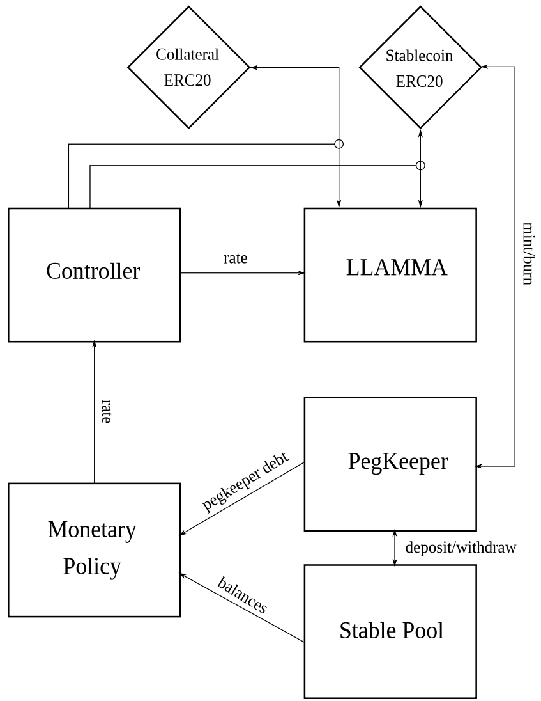

<h1>Curve Stablecoin: Overview</h1>

Curve Stablecoin ([crvUSD](../crvUSD/crvUSD.md)) infrastructure enables users to mint crvUSD using a selection of crypto collaterals (adding new ones is subject to DAO approval). 

crvUSD is designed to provide a more capital-efficient stablecoin mechanism and smoother liquidations, while maintaining a decentralized design which the Curve DAO governs.

!!!deploy "Contract Source & Deployment"
    crvUSD related deployments can be found [here](../references/deployed-contracts.md#curve-stablecoin).
    Source code available on [Github](https://github.com/curvefi/curve-stablecoin).

<figure markdown>
  { width="300" }
  <figcaption></figcaption>
</figure>

# **Components of the Curve Stablecoin Infrastructure**

## **[Controller](./controller.md)**
The Controller is the contract the user interacts with to create a loan and further manage the position. It holds all user debt information. External liquidations are also done through it.

## **[LLAMMA](./amm.md)**
LLAMMA is the market-making contract that rebalances the collateral. As the name suggests, this contract is responsible for lending and liquidating collateral. Every market has its own AMM (created from a blueprint contract) containing the collateral asset and crvUSD.

## **[Factory](./factory/overview.md)**
The factory contract is used to add new markets, raise or lower debt ceilings of already existing markets, set blueprint contracts for AMM and Controller, and set fee receivers.

## **[MonetaryPolicy](./monetarypolicy.md)**
Monetary policy contracts are integrated into the crvUSD system and are responsible for the interest rate of crvUSD markets.

## **[PegKeepers](./pegkeeper.md)**
PegKeepers are contracts that help stabilize the peg of crvUSD. They are allocated a specific amount of crvUSD to secure the peg. 

## **[PriceAggregator](./priceaggregator.md)**
The AggregatorStablePrice contract is designed to aggregate the prices of crvUSD based on multiple Curve Stableswap pools. This price is mainly used as an oracle for calculating the interest rate, providing an aggregated and exponential moving average price.

## **[Oracles](./oracle.md)**
Internal crvUSD market oracles.
