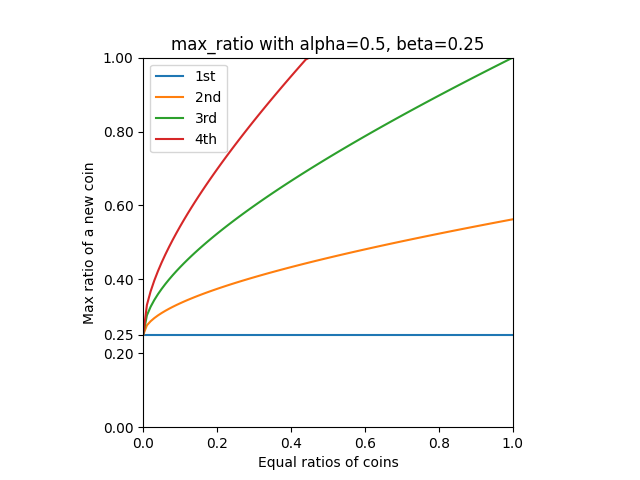

<h1>PegKeeperRegulator</h1>


The regulator contract supervises prices and other parameters telling whether the PegKeeper are allowed to provide or withdraw crvUSD.

!!!github "GitHub"
    Source code for the `PegKeeperRegulator.vy` contract is available on [:material-github: GitHub](https://github.com/curvefi/curve-stablecoin/blob/master/contracts/stabilizer/PegKeeperRegulator.vy).

Technically speaking, allowance is always granted but if certain checks do not pass, the Regulator will allow an amount of 0, which in return can be seen as not allowing anything to deposit or withdraw.


---

## **Providing**

*The Regulator will only grant allowance to the PegKeeper to provide crvUSD to the pool if the following requirements are met. If any of these conditions are not satisfied, the function will return 0, causing the transaction to ultimately revert:*

- **Providing is not paused**: This is checked using the `is_killed` method. If providing is paused, no crvUSD can be added to the pool.
- **Aggregated crvUSD price is higher than 1.0**: The crvUSD price, obtained from the `aggregator` contract, must be above 1.0 (`10**18`). If the price is equal to or below 1.0, providing crvUSD is not allowed.
- **Price consistency check**: The `get_p` (current AMM state price) and `price_oracle` (AMM EMA Price Oracle) must be within a specified deviation range (`price_deviation`). This is to prevent spam attacks by ensuring that the current price is not significantly deviating from the oracle price.
- **Depeg threshold check**: To ensure that the price of an asset has not depegged significantly, the current price is compared against a `worst_price_threshold`. This check ensures that prices across the pools with PegKeepers are within an acceptable range of deviation. If the price deviation is within the threshold, the PegKeeper is allowed to provide crvUSD.


Additionally, the system has implemented limit ratios to ensure a balanced and stable distribution of debt among the PegKeepers. The formula used to calculate the maximum allowed debt ratio, $\text{maxRatio}$, can be seen below. It dynamically adjusts the allowable debt ratio based on the aggregate debt of all PegKeepers in the system. These ratios can be plotted:

<figure markdown="span">
  { width="500" }
  <figcaption></figcaption>
</figure>

*The allowed amount to provide and the max debt ratio to provide is calculated as follows:*

$$\text{allowedToProvide} = \frac{\text{maxRatio} \times \text{total}}{10^{18}} - \text{debt}$$

$$\text{maxRatio} = \frac{(\alpha + \beta \times \frac{\text{rsum}}{10^{18}})^2}{10^{18}}$$

$$\text{rsum} = \sum_{i=n_{pk}}^{n} \sqrt{r_i \times 10^{18}}$$

Where:

- \(\text{total}\) is the sum of the debt and the balance of crvUSD held by the PegKeeper.
- \(\text{debt}\) is the current amount of crvUSD deposited into the pool by the PegKeeper.
- \( r_i \) represents the debt ratios of the other PegKeepers.


!!!example "Example: Amount allowed to provide with all empty PegKeepers"
    Let's take a look at the scenario when all PegKeepers are empty, therefore  $r = [0, 0, 0, 0]$.

    $\text{rsum} = \sqrt{0 \times 10^{18}} + \sqrt{0 \times 10^{18}} + \sqrt{0 \times 10^{18}} + \sqrt{0 \times 10^{18}} = 0$

    $\text{maxRatio} = \frac{(0.5 + 0.25 \times \frac{0}{10^{18}})^2}{10^{18}} = 0.25$

    *The `maxRatio` the PegKeeper can provide is 0.25. The actual crvUSD to provide is calculated as follows:*[^1]

    $\text{allowedToProvide} = \frac{0.25 \times 25000000}{1} - 0 = 6250000$

    [^1]: Assuming the PegKeeper has a total balance of 25m crvUSD.

    ---

    **To have full Desmos functionality and a cleaner overview, please view the graph directly on Desmos: [https://www.desmos.com/calculator/szhqv2edsd](https://www.desmos.com/calculator/szhqv2edsd).**

    <div style="text-align: center;">
        <iframe src="https://www.desmos.com/calculator/szhqv2edsd?embed" width="500" height="500" style="border: 1px solid #ccc" frameborder=0></iframe>
    </div>


### `provide_allowed`
!!! description "`PegKeeperRegulator.provide_allowed(_pk: address=msg.sender) -> uint256`"

    !!!warning
        This function may return a higher amount than the actual crvUSD that can be deposited, as it does not consider the current crvUSD balance of the PegKeeper. The returned value is capped by the maximum crvUSD balance of the PegKeeper in the `_provide` function of the PegKeeper itself.

    Function to check how much crvUSD a PegKeeper is allowed to provide into a liquidity pool. If the PegKeeper is not permitted to provide any, the function will return 0.

    Returns: amount of crvUSD allowed to provide (`uint256`).

    | Input | Type      | Description                                         |
    | ----- | --------- | --------------------------------------------------- |
    | `_pk` | `address` | PegKeeper address; Defaults to `msg.sender` as the function is usually called by the PegKeeper itself |

    ??? quote "Source code"

        === "PegKeeperRegulator.vy"

            ```py
            struct PegKeeperInfo:
                peg_keeper: PegKeeper
                pool: StableSwap
                is_inverse: bool
                include_index: bool

            peg_keepers: public(DynArray[PegKeeperInfo, MAX_LEN])

            @external
            @view
            def provide_allowed(_pk: address=msg.sender) -> uint256:
                """
                @notice Allow PegKeeper to provide stablecoin into the pool
                @dev Can return more amount than available
                @dev Checks
                    1) current price in range of oracle in case of spam-attack
                    2) current price location among other pools in case of contrary coin depeg
                    3) stablecoin price is above 1
                @return Amount of stablecoin allowed to provide
                """
                if self.is_killed in Killed.Provide:
                    return 0

                if self.aggregator.price() < ONE:
                    return 0

                price: uint256 = max_value(uint256)  # Will fail if PegKeeper is not in self.price_pairs
                largest_price: uint256 = 0
                debt_ratios: DynArray[uint256, MAX_LEN] = []
                for info in self.peg_keepers:
                    price_oracle: uint256 = self._get_price_oracle(info)
                    if info.peg_keeper.address == _pk:
                        price = price_oracle
                        if not self._price_in_range(price, self._get_price(info)):
                            return 0
                        continue
                    elif largest_price < price_oracle:
                        largest_price = price_oracle
                    debt_ratios.append(self._get_ratio(info.peg_keeper))

                if largest_price < unsafe_sub(price, self.worst_price_threshold):
                    return 0

                debt: uint256 = PegKeeper(_pk).debt()
                total: uint256 = debt + STABLECOIN.balanceOf(_pk)
                return self._get_max_ratio(debt_ratios) * total / ONE - debt

            @internal
            @pure
            def _get_price_oracle(_info: PegKeeperInfo) -> uint256:
                """
                @return Price of the coin in STABLECOIN
                """
                price: uint256 = 0
                if _info.include_index:
                    price = _info.pool.price_oracle(0)
                else:
                    price = _info.pool.price_oracle()
                if _info.is_inverse:
                    price = 10 ** 36 / price
                return price

            @internal
            @view
            def _price_in_range(_p0: uint256, _p1: uint256) -> bool:
                """
                @notice Check that the price is in accepted range using absolute error
                @dev Needed for spam-attack protection
                """
                # |p1 - p0| <= deviation
                # -deviation <= p1 - p0 <= deviation
                # 0 < deviation + p1 - p0 <= 2 * deviation
                # can use unsafe
                deviation: uint256 = self.price_deviation
                return unsafe_sub(unsafe_add(deviation, _p0), _p1) < deviation << 1

            @internal
            @pure
            def _get_price(_info: PegKeeperInfo) -> uint256:
                """
                @return Price of the coin in STABLECOIN
                """
                price: uint256 = 0
                if _info.include_index:
                    price = _info.pool.get_p(0)
                else:
                    price = _info.pool.get_p()
                if _info.is_inverse:
                    price = 10 ** 36 / price
                return price

            @internal
            @view
            def _get_ratio(_peg_keeper: PegKeeper) -> uint256:
                """
                @return debt ratio limited up to 1
                """
                debt: uint256 = _peg_keeper.debt()
                return debt * ONE / (1 + debt + STABLECOIN.balanceOf(_peg_keeper.address))

            @internal
            @view
            def _get_max_ratio(_debt_ratios: DynArray[uint256, MAX_LEN]) -> uint256:
                rsum: uint256 = 0
                for r in _debt_ratios:
                    rsum += isqrt(r * ONE)
                return (self.alpha + self.beta * rsum / ONE) ** 2 / ONE
            ```

    === "Example"
        ```shell
        >>> soon
        ```


---


## **Withdrawing**

*The Regulator will grant allowance to the PegKeeper to withdraw crvUSD from the pool if the following requirements are met. If any of these conditions are not met, the function will return 0, causing the transaction to ultimately revert:*

- **Withdrawing is not paused**: This is checked using the `is_killed` method. If withdrawing is paused, no crvUSD can be removed from the pool.
- **Aggregated crvUSD price is less than 1.0**: The crvUSD price, obtained from the `aggregator` contract, must be above 1.0 (`10**18`). If the price is equal to or below 1.0, withdrawing crvUSD is not allowed.
- **Price consistency check**: The `get_p` (current AMM state price) and `price_oracle` (AMM EMA Price Oracle) must be within a specified deviation range (`price_deviation`). This is to prevent spam attacks by ensuring that the current price is not significantly deviating from the oracle price.


### `withdraw_allowed`
!!! description "`PegKeeperRegulator.withdraw_allowed(_pk: address=msg.sender) -> uint256`"

    !!!warning
        If allowance to withdraw is granted, the function will always return `max_value(uint256)`. The actual value to withdraw is limited within the `_withdraw` function of the PegKeeper itself.

    Function to check how much crvUSD a PegKeeper is allowed to withdraw from the pool.

    Returns: amount of crvUSD allowed to withdraw (`uint256`).

    | Input | Type      | Description                                          |
    | ----- | --------- | ---------------------------------------------------- |
    | `_pk` | `address` | PegKeeper address; defaults to `msg.sender` as it's usually called by the PegKeeper itself |


    ??? quote "Source code"

        === "PegKeeperRegulator.vy"

            ```vyper
            struct PegKeeperInfo:
                peg_keeper: PegKeeper
                pool: StableSwap
                is_inverse: bool
                include_index: bool

            peg_keeper_i: HashMap[PegKeeper,  uint256]  # 1 + index of peg keeper in a list

            @external
            @view
            def withdraw_allowed(_pk: address=msg.sender) -> uint256:
                """
                @notice Allow Peg Keeper to withdraw stablecoin from the pool
                @dev Can return more amount than available
                @dev Checks
                    1) current price in range of oracle in case of spam-attack
                    2) stablecoin price is below 1
                @return Amount of stablecoin allowed to withdraw
                """
                if self.is_killed in Killed.Withdraw:
                    return 0

                if self.aggregator.price() > ONE:
                    return 0

                i: uint256 = self.peg_keeper_i[PegKeeper(_pk)]
                if i > 0:
                    info: PegKeeperInfo = self.peg_keepers[i - 1]
                    if self._price_in_range(self._get_price(info), self._get_price_oracle(info)):
                        return max_value(uint256)
                return 0

            @internal
            @pure
            def _get_price_oracle(_info: PegKeeperInfo) -> uint256:
                """
                @return Price of the coin in STABLECOIN
                """
                price: uint256 = 0
                if _info.include_index:
                    price = _info.pool.price_oracle(0)
                else:
                    price = _info.pool.price_oracle()
                if _info.is_inverse:
                    price = 10 ** 36 / price
                return price

            @internal
            @view
            def _price_in_range(_p0: uint256, _p1: uint256) -> bool:
                """
                @notice Check that the price is in accepted range using absolute error
                @dev Needed for spam-attack protection
                """
                # |p1 - p0| <= deviation
                # -deviation <= p1 - p0 <= deviation
                # 0 < deviation + p1 - p0 <= 2 * deviation
                # can use unsafe
                deviation: uint256 = self.price_deviation
                return unsafe_sub(unsafe_add(deviation, _p0), _p1) < deviation << 1

            @internal
            @pure
            def _get_price(_info: PegKeeperInfo) -> uint256:
                """
                @return Price of the coin in STABLECOIN
                """
                price: uint256 = 0
                if _info.include_index:
                    price = _info.pool.get_p(0)
                else:
                    price = _info.pool.get_p()
                if _info.is_inverse:
                    price = 10 ** 36 / price
                return price
            ```

    === "Example"
        ```shell
        >>> soon
        ```


---


## **Parameters**

*The Regulator uses several parameters:*

- `worst_price_threshold` is a threshold value for the price of the pegged coin. If the threshold is exceeded, providing crvUSD will not be allowed as the pegged coin is potentially depegged (too far away from other pegged coins' prices).
- `price_deviation` represents an absolute error value and is used to check if prices (`get_p` and `price_oracle`) are within a certain range of each other in order to prevent spam attacks.
- `alpha` and `beta` are used for the calculations of the maximum debt ratio within `_get_max_ratio`.

For more details on the calculations and research behind these parameters, see [here](https://github.com/curvefi/curve-stablecoin-researches/blob/main/peg_keeper/README.md).


### `worst_price_threshold`
!!! description "`PegKeeperRegulator.worst_price_threshold() -> uint256: view`"

    Getter for the current worst price threshold. The value can only be changed by the `admin` calling the [`set_worst_price_threshold`](#set_worst_price_threshold) function.

    Returns: worst price threshold (`uint256`).

    Emits: `WorstPriceThreshold` at contract initialization

    ??? quote "Source code"

        === "PegKeeperRegulator.vy"

            ```vyper
            event WorstPriceThreshold:
                threshold: uint256

            worst_price_threshold: public(uint256)

            @external
            def __init__(_stablecoin: ERC20, _agg: Aggregator, _fee_receiver: address, _admin: address, _emergency_admin: address):
                ...
                self.worst_price_threshold = 3 * 10 ** (18 - 4)  # 0.0003
                ...
                log WorstPriceThreshold(self.worst_price_threshold)
                ...
            ```

    === "Example"
        ```shell
        >>> PegKeeperRegulator.worst_price_threshold()
        300000000000000
        ```

    === "Example"
        ```shell
        >>> soon
        ```


### `price_deviation`
!!! description "`PegKeeperRegulator.price_deviation() -> uint256: view`"

    Getter for the current price deviation value. The value can only be changed by the `admin` calling the [`set_price_deviation`](#set_price_deviation) function.

    Returns: price deviation (`uint256`).

    Emits: `PriceDeviation` at contract initialization

    ??? quote "Source code"

        === "PegKeeperRegulator.vy"

            ```vyper
            event PriceDeviation:
                price_deviation: uint256

            price_deviation: public(uint256)

            @external
            def __init__(_stablecoin: ERC20, _agg: Aggregator, _fee_receiver: address, _admin: address, _emergency_admin: address):
                ...
                self.price_deviation = 5 * 10 ** (18 - 4) # 0.0005 = 0.05%
                ...
                log PriceDeviation(self.price_deviation)
                ...
            ```

    === "Example"
        ```shell
        >>> PegKeeperRegulator.price_deviation()
        500000000000000
        ```


### `alpha`
!!! description "`PegKeeperRegulator.alpha() -> uint256: view`"

    Getter for the alpha value, which represents the initial boundary. This value can be changed by the `admin` by calling the [`set_debt_parameters`](#set_debt_parameters) function.

    Returns: alpha (`uint256`).

    Emits: `DebtParameters` at contract initialization

    ??? quote "Source code"

        === "PegKeeperRegulator.vy"

            ```vyper
            event DebtParameters:
                alpha: uint256
                beta: uint256

            alpha: public(uint256)  # Initial boundary

            @external
            def __init__(_stablecoin: ERC20, _agg: Aggregator, _fee_receiver: address, _admin: address, _emergency_admin: address):
                ...
                self.alpha = ONE / 2 # 1/2
                ...
                log DebtParameters(self.alpha, self.beta)
            ```

    === "Example"
        ```shell
        >>> PegKeeperRegulator.alpha()
        500000000000000000
        ```


### `beta`
!!! description "`PegKeeperRegulator.beta() -> uint256: view`"

    Getter for the beta value, which represents each PegKeeper's impact. This value can be changed by the `admin` by calling the [`set_debt_parameters`](#set_debt_parameters) function.

    Returns: beta (`uint256`).

    Emits: `DebtParameters` at contract initialization

    ??? quote "Source code"

        === "PegKeeperRegulator.vy"

            ```vyper
            event DebtParameters:
                alpha: uint256
                beta: uint256

            beta: public(uint256)  # Each PegKeeper's impact

            @external
            def __init__(_stablecoin: ERC20, _agg: Aggregator, _fee_receiver: address, _admin: address, _emergency_admin: address):
                ...
                self.beta = ONE / 4  # 1/4
                ...
                log DebtParameters(self.alpha, self.beta)
            ```

    === "Example"
        ```shell
        >>> PegKeeperRegulator.beta()
        250000000000000000
        ```


### `set_worst_price_threshold`
!!! description "`PegKeeperRegulator.set_worst_price_threshold(_threshold: uint256)`"

    !!!guard "Guarded Methods"
        This function can only be called by the `admin` of the contract.

    Function to set `_threshold` as the new `worst_price_threshold` value.

    Emits: `WorstPriceThreshold`

    | Input        | Type      | Description  |
    | ------------ | --------- | ------------ |
    | `_threshold` | `uint256` | New value for `worst_price_threshold` |

    ??? quote "Source code"

        === "PegKeeperRegulator.vy"

            ```vyper
            event WorstPriceThreshold:
                threshold: uint256

            worst_price_threshold: public(uint256)

            @external
            def set_worst_price_threshold(_threshold: uint256):
                """
                @notice Set threshold for the worst price that is still accepted
                @param _threshold Price threshold with base 10 ** 18 (1.0 = 10 ** 18)
                """
                assert msg.sender == self.admin
                assert _threshold <= 10 ** (18 - 2)  # 0.01
                self.worst_price_threshold = _threshold
                log WorstPriceThreshold(_threshold)
            ```

    === "Example"
        ```shell
        >>> soon
        ```


### `set_price_deviation`
!!! description "`PegKeeperRegulator.set_price_deviation(_deviation: uint256)`"

    !!!guard "Guarded Methods"
        This function can only be called by the `admin` of the contract.

    Function to set `_deviation` as the new `price_deviation` value.

    Emits: `PriceDeviation`

    | Input        | Type      | Description  |
    | ------------ | --------- | ------------ |
    | `_deviation` | `uint256` | New value for `price_deviation` |

    ??? quote "Source code"

        === "PegKeeperRegulator.vy"

            ```vyper
            event PriceDeviation:
                price_deviation: uint256

            price_deviation: public(uint256)

            @external
            def set_price_deviation(_deviation: uint256):
                """
                @notice Set acceptable deviation of current price from oracle's
                @param _deviation Deviation of price with base 10 ** 18 (1.0 = 10 ** 18)
                """
                assert msg.sender == self.admin
                assert _deviation <= 10 ** 20
                self.price_deviation = _deviation
                log PriceDeviation(_deviation)
            ```

    === "Example"
        ```shell
        >>> soon
        ```


### `set_debt_parameters`
!!! description "`PegKeeperRegulator.set_debt_parameters(_alpha: uint256, _beta: uint256)`"

    !!!guard "Guarded Methods"
        This function can only be called by the `admin` of the contract.

    Function to set new parameters for `alpha` and `beta`.

    Emits: `DebtParameters`

    | Input    | Type      | Description           |
    | -------- | --------- | --------------------- |
    | `_alpha` | `uint256` | New value for `alpha` |
    | `_beta`  | `uint256` | New value for `beta`  |

    ??? quote "Source code"

        === "PegKeeperRegulator.vy"

            ```vyper
            event DebtParameters:
                alpha: uint256
                beta: uint256

            ONE: constant(uint256) = 10 ** 18

            alpha: public(uint256)  # Initial boundary
            beta: public(uint256)  # Each PegKeeper's impact

            @external
            def set_debt_parameters(_alpha: uint256, _beta: uint256):
                """
                @notice Set parameters for calculation of debt limits
                @dev 10 ** 18 precision
                """
                assert msg.sender == self.admin
                assert _alpha <= ONE
                assert _beta <= ONE

                self.alpha = _alpha
                self.beta = _beta
                log DebtParameters(_alpha, _beta)
            ```

    === "Example"
        ```shell
        >>> soon
        ```


---


## **Adding and Removing PegKeepers**

PegKeepers rely on the Regulator, as it provides the contract with information on whether they are allowed to provide or withdraw crvUSD from the pool. These PegKeepers need to be added by `admin` using the [`add_peg_keepers`](#add_peg_keepers) function and are then stored within the [`peg_keepers`](#peg_keepers) variable.

PegKeepers can be removed from the Regulator contract by the `admin` using the [`remove_peg_keepers`](#remove_peg_keepers) function.


### `peg_keepers`
!!! description "`PegKeeperRegulator.peg_keepers(arg0: uint256) -> PegKeeperInfo: view`"

    Getter for the PegKeeper contract at index `arg0`.

    Returns: `PegKeeperInfo` (`struct`) consisting of the PegKeeper (`address`), its associated pool (`address`), if it is inverse (`bool`) and wether the pool has more than two coins (`bool`).

    | Input  | Type      | Description |
    | ------ | --------- | ----------- |
    | `arg0` | `address` | Index of the PegKeeper; starts at 0 |

    ??? quote "Source code"

        === "PegKeeperRegulator.vy"

            ```vyper
            struct PegKeeperInfo:
                peg_keeper: PegKeeper
                pool: StableSwap
                is_inverse: bool
                include_index: bool

            peg_keepers: public(DynArray[PegKeeperInfo, MAX_LEN])
            ```

    === "Example"
        ```shell
        >>> PegKeeperRegulator.peg_keepers(0)
        '0x9201da0D97CaAAff53f01B2fB56767C7072dE340, 0x4DEcE678ceceb27446b35C672dC7d61F30bAD69E, false, false'

        >>> PegKeeperRegulator.peg_keepers(1)
        '0xFb726F57d251aB5C731E5C64eD4F5F94351eF9F3, 0x390f3595bCa2Df7d23783dFd126427CCeb997BF4, false, false'
        ```


### `add_peg_keepers`
!!! description "`PegKeeperRegulator.add_peg_keepers(_peg_keepers: DynArray[PegKeeper, MAX_LEN])`"

    !!!guard "Guarded Methods"
        This function can only be called by the `admin` of the contract.

    Function to add one or more `PegKeepers` to the `Regulator`. Simultaneously, the PegKeeper is added to the `peg_keepers` list and indexed in `peg_keeper_i`.

    Emits: `AddPegKeeper`

    | Input          | Type      | Description  |
    | -------------- | --------- | ------------ |
    | `_peg_keepers` | `DynArray[PegKeeper, MAX_LEN]` | PegKeeper contracts to add |

    ??? quote "Source code"

        === "PegKeeperRegulator.vy"

            ```vyper
            event AddPegKeeper:
                peg_keeper: PegKeeper
                pool: StableSwap
                is_inverse: bool

            struct PegKeeperInfo:
                peg_keeper: PegKeeper
                pool: StableSwap
                is_inverse: bool
                include_index: bool

            @external
            def add_peg_keepers(_peg_keepers: DynArray[PegKeeper, MAX_LEN]):
                assert msg.sender == self.admin

                i: uint256 = len(self.peg_keepers)
                for pk in _peg_keepers:
                    assert self.peg_keeper_i[pk] == empty(uint256)  # dev: duplicate
                    pool: StableSwap = pk.pool()
                    success: bool = raw_call(
                        pool.address, _abi_encode(convert(0, uint256), method_id=method_id("price_oracle(uint256)")),
                        revert_on_failure=False
                    )
                    info: PegKeeperInfo = PegKeeperInfo({
                        peg_keeper: pk,
                        pool: pool,
                        is_inverse: pk.IS_INVERSE(),
                        include_index: success,
                    })
                    self.peg_keepers.append(info)  # dev: too many pairs
                    i += 1
                    self.peg_keeper_i[pk] = i

                    log AddPegKeeper(info.peg_keeper, info.pool, info.is_inverse)
            ```

    === "Example"
        ```shell
        >>> soon
        ```


### `remove_peg_keepers`
!!! description "`PegKeeperRegulator.remove_peg_keepers(_peg_keepers: DynArray[PegKeeper, MAX_LEN])`"

    !!!guard "Guarded Methods"
        This function can only be called by the `admin` of the contract.

    Function to remove one or more `PegKeepers` from the `Regulator` contract.

    Emits: `RemovePegKeeper`

    | Input          | Type      | Description  |
    | -------------- | --------- | ------------ |
    | `_peg_keepers` | `DynArray[PegKeeper, MAX_LEN]` | PegKeeper contracts to remove |

    ??? quote "Source code"

        === "PegKeeperRegulator.vy"

            ```vyper
            event RemovePegKeeper:
                peg_keeper: PegKeeper

            struct PegKeeperInfo:
                peg_keeper: PegKeeper
                pool: StableSwap
                is_inverse: bool
                include_index: bool

            peg_keepers: public(DynArray[PegKeeperInfo, MAX_LEN])
            peg_keeper_i: HashMap[PegKeeper,  uint256]  # 1 + index of peg keeper in a list

            @external
            def remove_peg_keepers(_peg_keepers: DynArray[PegKeeper, MAX_LEN]):
                """
                @dev Most gas efficient will be sort pools reversely
                """
                assert msg.sender == self.admin

                peg_keepers: DynArray[PegKeeperInfo, MAX_LEN] = self.peg_keepers
                for pk in _peg_keepers:
                    i: uint256 = self.peg_keeper_i[pk] - 1  # dev: pool not found
                    max_n: uint256 = len(peg_keepers) - 1
                    if i < max_n:
                        peg_keepers[i] = peg_keepers[max_n]
                        self.peg_keeper_i[peg_keepers[i].peg_keeper] = 1 + i

                    peg_keepers.pop()
                    self.peg_keeper_i[pk] = empty(uint256)
                    log RemovePegKeeper(pk)

                self.peg_keepers = peg_keepers
            ```

    === "Example"
        ```shell
        >>> soon
        ```


---


## **Pausing and Unpausing PegKeepers**

In this context, **"killing"** refers to either **pausing or unpausing PegKeepers**. When the Regulator is "killed," it means the contract **restricts the PegKeeper from performing one or both of the following actions: providing or withdrawing crvUSD.** Both actions, providing and withdrawing, can be killed separately. For example, the Regulator can kill the permission to provide any additional crvUSD to pools but keep the withdrawing action "unkilled" so that it is still possible to unload debt.

Only the `admin` and `emergency_admin` are able to kill. The former is the Curve DAO, and the latter is the EmergencyDAO.


### `is_killed`
!!! description "`PegKeeperRegulator.is_killed() -> uint256: view`"

    Getter to check if the Regulator allows providing or withdrawing.

    Returns: index value of the `Killed` enum (`bool`).

    ??? quote "Source code"

        === "PegKeeperRegulator.vy"

            ```vyper
            enum Killed:
                Provide  # 1
                Withdraw  # 2

            is_killed: public(Killed)
            ```

    === "Example"
        ```shell
        >>> PegKeeperRegulator.is_killed()
        0           # nothing killed

        >>> PegKeeperRegulator.is_killed()
        1           # providing killed

        >>> PegKeeperRegulator.is_killed()
        2           # withdrawing killed

        >>> PegKeeperRegulator.is_killed()
        3           # providing and withdrawing killed
        ```


### `set_killed`
!!! description "`PegKeeperRegulator.set_killed(_is_killed: Killed)`"

    !!!guard "Guarded Methods"
        This function can only be called by the `admin` or `emergency` of the contract.

    Function to pause or unpause PegKeepers.

    There are four options for pausing/unpausing, depending on the value set for the `Killed` enum:

      - `0` -> provide and withdraw allowed
      - `1` -> provide paused, withdraw allowed
      - `2` -> provide allowed, withdraw paused
      - `3` -> provide and withdraw paused

    Emits: `SetKilled`

    | Input        | Type      | Description |
    | ------------ | --------- | ----------- |
    | `_is_killed` | `uint256` | Value depending on the action wanted |

    ??? quote "Source code"

        === "PegKeeperRegulator.vy"

            ```vyper
            event SetKilled:
                is_killed: Killed
                by: address

            @external
            def set_killed(_is_killed: Killed):
                """
                @notice Pause/unpause Peg Keepers
                @dev 0 unpause, 1 provide, 2 withdraw, 3 everything
                """
                assert msg.sender in [self.admin, self.emergency_admin]
                self.is_killed = _is_killed
                log SetKilled(_is_killed, msg.sender)
            ```

    === "Example"
        ```shell
        >>> soon
        ```


---


## **Contract Ownership**

The Regulator contract has two types of ownerships, the `admin` and the `emergency_admin`.

While the `admin` is able to call any guarded function from the contract, like setting new parameters and pausing/unpausing PegKeepers, etc., the `emergency_admin` is only allowed to pause and unpause pools. More on pausing pools [here](#pausing-and-unpausing-pegkeepers).

Both their ownerships can be transferred using the corresponding [`set_admin`](#set_admin) or [`set_emergency_admin`](#set_emergency_admin) functions.


### `admin`
!!! description "`PegKeeperRegulator.admin() -> address: view`"

    Getter for the current admin of the Regulator contract. This address can only be changed by the `admin` by calling the [`set_admin`](#set_admin) function.

    Returns: current admin (`address`).

    Emits: `SetAdmin` at contract initialization

    ??? quote "Source code"

        === "PegKeeperRegulator.vy"

            ```vyper
            event SetAdmin:
                admin: address

            admin: public(address)

            @external
            def __init__(_stablecoin: ERC20, _agg: Aggregator, _fee_receiver: address, _admin: address, _emergency_admin: address):
                ...
                self.admin = _admin
                log SetAdmin(_admin)
                ...
            ```

    === "Example"
        ```shell
        >>> PegKeeperRegulator.admin()
        '0x40907540d8a6C65c637785e8f8B742ae6b0b9968'
        ```


### `set_admin`
!!! description "`PegKeeperRegulator.set_admin(_admin: address)`"

    !!!guard "Guarded Methods"
        This function can only be called by the `admin` of the contract.

    Function to set a new admin for the contract.

    Emits: `SetAdmin`

    | Input    | Type      | Description  |
    | -------- | --------- | ------------ |
    | `_admin` | `address` | New admin address |

    ??? quote "Source code"

        === "PegKeeperRegulator.vy"

            ```vyper
            event SetAdmin:
                admin: address

            admin: public(address)

            @external
            def set_admin(_admin: address):
                # We are not doing commit / apply because the owner will be a voting DAO anyway
                # which has vote delays
                assert msg.sender == self.admin
                self.admin = _admin
                log SetAdmin(_admin)
            ```

    === "Example"
        ```shell
        >>> soon
        ```


### `emergency_admin`
!!! description "`PegKeeperRegulator.emergency_admin() -> address: view`"

    Getter for the current emergency admin of the Regulator contract. This address can only be changed by the `admin` by calling the [`set_emergency_admin`](#set_emergency_admin) function.

    Returns: emergency admin (`address`).

    Emits: `SetEmergencyAdmin` at contract initialization

    ??? quote "Source code"

        === "PegKeeperRegulator.vy"

            ```vyper
            event SetEmergencyAdmin:
                admin: address

            emergency_admin: public(address)

            @external
            def __init__(_stablecoin: ERC20, _agg: Aggregator, _fee_receiver: address, _admin: address, _emergency_admin: address):
                ...
                self.emergency_admin = _emergency_admin
                log SetEmergencyAdmin(_emergency_admin)
                ...
            ```

    === "Example"
        ```shell
        >>> PegKeeperRegulator.emergency_admin()
        '0x467947EE34aF926cF1DCac093870f613C96B1E0c'
        ```


### `set_emergency_admin`
!!! description "`PegKeeperRegulator.set_emergency_admin(_admin: address)`"

    Function to set a new emergency admin for the contract.

    Emits: `SetEmergencyAdmin`

    | Input    | Type      | Description  |
    | -------- | --------- | ------------ |
    | `_admin` | `address` | New emergency admin address |

    ??? quote "Source code"

        === "PegKeeperRegulator.vy"

            ```vyper
            event SetEmergencyAdmin:
                admin: address

            emergency_admin: public(address)

            @external
            def set_emergency_admin(_admin: address):
                assert msg.sender == self.admin
                self.emergency_admin = _admin
                log SetEmergencyAdmin(_admin)
            ```

    === "Example"
        ```shell
        >>> soon
        ```


---


## **Fee Receiver and Aggregator Contract**

### `fee_receiver`
!!! description "`PegKeeperRegulator.fee_receiver() -> address: view`"

    Getter for the fee receiver. The fee receiver can be changed via the [`set_fee_receiver`](#set_fee_receiver) function.

    Returns: fee receiver (`address`).

    ??? quote "Source code"

        === "PegKeeperRegulator.vy"

            ```vyper
            fee_receiver: public(address)

            @external
            def __init__(_stablecoin: ERC20, _agg: Aggregator, _fee_receiver: address, _admin: address, _emergency_admin: address):
                ...
                self.fee_receiver = _fee_receiver
                ...
            ```

    === "Example"
        ```shell
        >>> PegKeeperRegulator.fee_receiver()
        '0xeCb456EA5365865EbAb8a2661B0c503410e9B347'
        ```


### `aggregator`
!!! description "`PegKeeperRegulator.aggregator() -> address: view`"

    Getter for the crvusd price aggregator contract. This address is set when intializing the contract and can be changed using [`set_aggregator`](#set_aggregator).

    Returns: price aggregator contract (`address`).

    ??? quote "Source code"

        === "PegKeeperRegulator.vy"

            ```vyper
            interface Aggregator:
                def price() -> uint256: view
                def price_w() -> uint256: nonpayable

            aggregator: public(Aggregator)

            @external
            def __init__(_stablecoin: ERC20, _agg: Aggregator, _admin: address, _emergency_admin: address):
                ...
                self.aggregator = _agg
                ...
            ```

    === "Example"
        ```shell
        >>> PegKeeperRegulator.aggregator()
        '0x18672b1b0c623a30089A280Ed9256379fb0E4E62'
        ```


### `set_fee_receiver`
!!! description "`PegKeeperRegulator.set_fee_receiver(_fee_receiver: address)`"

    !!!guard "Guarded Methods"
        This function can only be called by the `admin` of the contract.

    Function to set a new fee receiver.

    Emits: `SetFeeReceiver`

    | Input           | Type      | Description              |
    | --------------- | --------- | ------------------------ |
    | `_fee_receiver` | `address` | New fee receiver address |

    ??? quote "Source code"

        === "PegKeeperRegulator.vy"

            ```vyper
            fee_receiver: public(address)

            event SetFeeReceiver:
                fee_receiver: address

            @external
            def set_fee_receiver(_fee_receiver: address):
                """
                @notice Set new PegKeeper's profit receiver
                """
                assert msg.sender == self.admin
                self.fee_receiver = _fee_receiver
                log SetFeeReceiver(_fee_receiver)
            ```

    === "Example"
        ```shell
        >>> soon
        ```


### `set_aggregator`
!!! description "`PegKeeperRegulator.set_aggregator(_agg: Aggregator)`"

    !!!guard "Guarded Methods"
        This function can only be called by the `admin` of the contract.

    Function to set a new aggregator contract.

    Emits: `SetAggregator`

    | Input           | Type      | Description             |
    | --------------- | --------- | ----------------------- |
    | `_fee_receiver` | `address` | New aggregator contract |

    ??? quote "Source code"

        === "PegKeeperRegulator.vy"

            ```vyper
            event SetAggregator:
                aggregator: address

            aggregator: public(Aggregator)

            @external
            def set_aggregator(_agg: Aggregator):
                """
                @notice Set new crvUSD price aggregator
                """
                assert msg.sender == self.admin
                self.aggregator = _agg
                log SetAggregator(_agg.address)
            ```

    === "Example"
        ```shell
        >>> soon
        ```


---


## **Other Methods**

### `stablecoin`
!!! description "`PegKeeperRegulator.stablecoin() -> address: view`"

    Getter for the stablecoin the PegKeeper stabilizes, which is crvUSD. This address is set when intializing the contract and can not be changed.

    Returns: stablecoin (`address`).

    ??? quote "Source code"

        === "PegKeeperRegulator.vy"

            ```vyper
            interface ERC20:
                def balanceOf(_owner: address) -> uint256: view

            STABLECOIN: immutable(ERC20)

            @external
            @view
            def stablecoin() -> ERC20:
                return STABLECOIN

            @external
            def __init__(_stablecoin: ERC20, _agg: Aggregator, _admin: address, _emergency_admin: address):
                STABLECOIN = _stablecoin
                ...
            ```

    === "Example"
        ```shell
        >>> PegKeeperRegulator.stablecoin()
        '0xf939E0A03FB07F59A73314E73794Be0E57ac1b4E'
        ```
