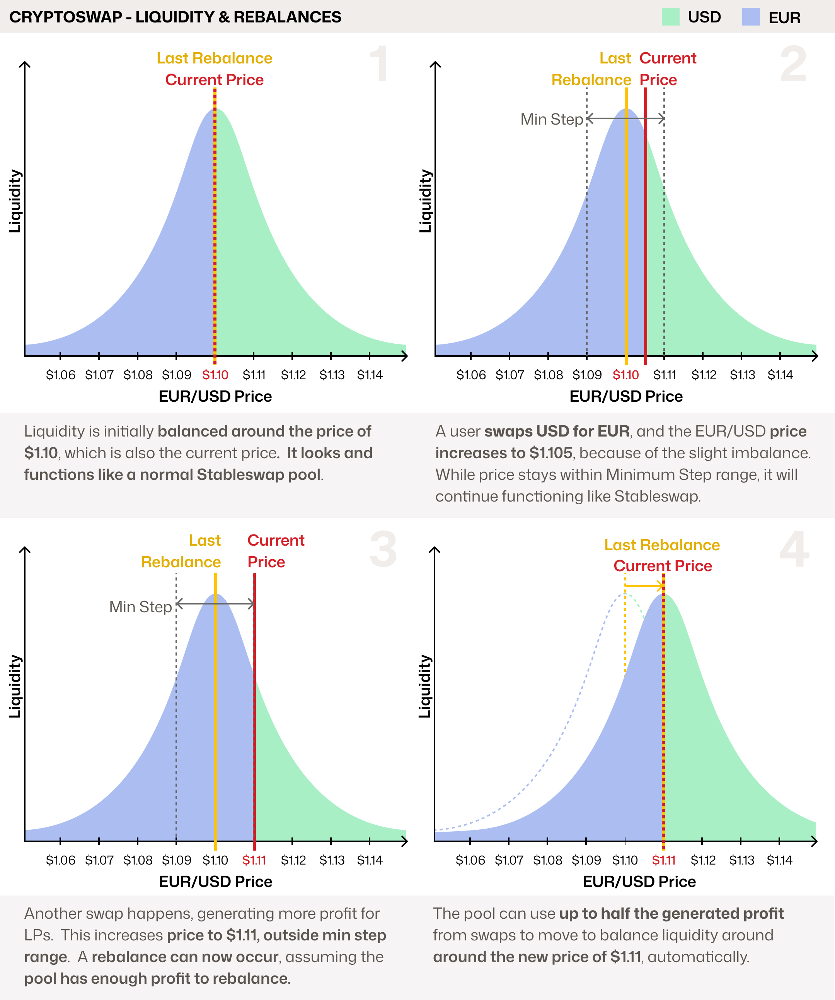
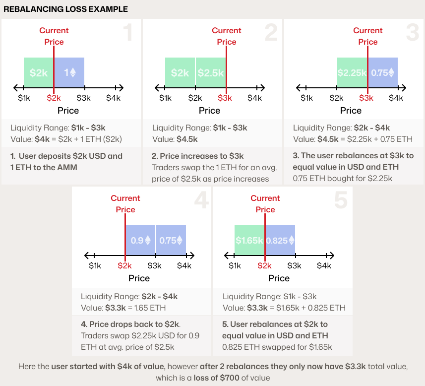
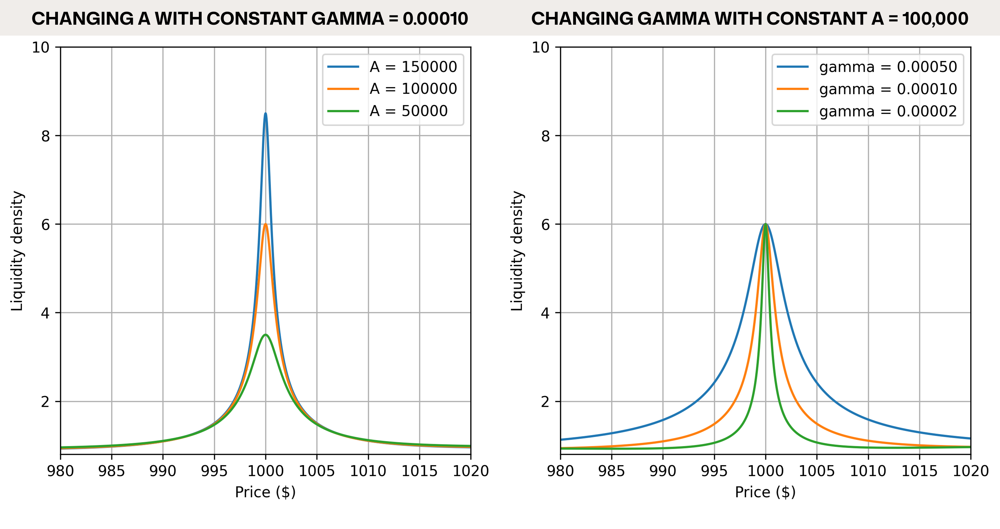

# Cryptoswap: How it Works

Cryptoswap is a type of pool developed by Curve for swapping between uncorrelated assets, for example `ETH` and `USDT`.

To understand how Cryptoswap works, we first need to cover the basics of Stableswap, which was designed to concentrate liquidity around a fixed price for pegged assets (e.g., `USDC/USDT`).  While these are different products with very different use cases, they leverage similar technology to benefit two different use cases.

!!! info "Crytposwap Names"
      Originally Cryptoswap was called **Cryptopools** in the whitepaper, and it's possible to still see this name in some out of date resources.
      
      Cryptoswap is also sometimes erroneously referred to as **Curve v2**, however, this was an unofficial naming convention simply because it was the second product released by Curve. 

      Sometimes you will also see **Cryptoswap-NG**, which means **New Generation**, it is an optimized version of the original implementation.

## Understanding Stableswap

Stableswap was designed for pools of similarly priced assets, like stablecoins, to **concentrate liquidity** around their pegged price (e.g., 1 USDC = 1 USDT). This allows for large swaps with very low slippage, even when the pool is imbalanced.

Let's look at an example with a crvUSD/USDC pool, where each block represents $1M in tokens:

Stableswap pools are designed to function effectively even when heavily unbalanced. A pool can offer efficient pricing even if it holds 90% of one asset and 10% of the other. Such imbalances create arbitrage opportunities, which incentivize trades that rebalance the pool and generate fees for liquidity providers (LPs).

While the blocks are a helpful visual, Stableswap's liquidity is more accurately represented by a bonding curve:

The shape of this curve is controlled by a parameter called `A`, the **Amplification Coefficient**. A higher `A` value concentrates liquidity more tightly around the peg, providing deeper liquidity for swaps. The trade-off is that if an asset moves far from the peg, liquidity and price can drop off sharply.

<figure markdown="span">
  { width="400" }
  <figcaption></figcaption>
</figure>

## **Cryptoswap**

Cryptoswap pools build upon the simple Stableswap algorithm. Its key innovation is *where* it concentrates liquidity. Instead of targeting a fixed peg, Cryptoswap automatically concentrates and rebalances liquidity close to the pool's **current market price**. This allows it to efficiently support volatile asset pairs (e.g., `crvUSD/ETH`), and allows everything to **fully passive for liquidity providers**.

As the market price moves, the algorithm must "rebalance" its liquidity to follow it. This action is handled carefully, because **rebalancing locks in impermanent loss**. To protect LPs, Cryptoswap only rebalances when two conditions are met:

1. The internal price must move beyond a minimum threshold, called the **adjustment step**.
2. The cost of rebalancing must be less than 50% of the trading fees earned by LPs. **This core safeguard ensures that impermanent loss is only realized when it is offset by sufficient profit.**  Ensuring LP deposits don't erode over time.

!!! info "Internal EMA Price Oracle"
      For added safety, rebalances are triggered not by the last price of the pool, but an Exponential Moving Average of all recent prices (internal price oracle), to stop manipulation of rebalances.
      
      In the following examples the EMA Price and Current price are assumed to be the same, however in reality the EMA will lag the current price slightly.

Let's look at an example with a forex pool trading Euros (EUR) against US Dollars (USD):

In this scenario, the pool performs a rebalance once the price hits the adjustment step, using its collected fees to cover the cost.  

### **Why Does Rebalancing Cost?**

Rebalancing costs because when you are offering your assets to be swapped in return for trading fees.  As price increases, you are selling your assets.  When you rebalance, you are rebuying your assets, but at a higher price, causing a loss.  Let's look at a very simple example of a concentrated liquidity range AMM:

Interestly in the above example, if the user had not rebalanced, they would have kept their initial value.  However, if the price continued to increase, their loss would have been larger because they would need to buy back higher.  Rebalances need to happen, but rebalancing frequently can cause large losses, just as rebalancing rarely can, this is the balance Cryptoswap tries to automate.

### **Parameters**

This article from Nagaking goes into detail about each of Cryptoswap's parameters: [Deep Dive: Curve v2 Parameters](https://nagaking.substack.com/p/deep-dive-curve-v2-parameters).

There are two main parameters which change change the shape of the Liquidity Curve, these are `A` and `gamma`.

- **`A`**: controls liquidity concentration in the center of the bonding curve
- **`gamma`**: controls overall breadth of the curve; can fine-tune the extremes

Here is how they affect the curve in practice (note that orange curve are equal in both charts):

As the image shows, a higher `A` means more liquidity is concentrated around the price at which it's balanced, called the `price_scale`.  Where as a higher `gamma` means liquidity is spread wider.

### Why is Cryptoswap a great algorithm?

**1. It's Passive and Decentralized**

Cryptoswap was built on the original cypherpunk ethos of DeFi: that anyone should be able to provide liquidity easily, passively, and profitably. Compared to protocols that require LPs to become active managers, Cryptoswap's design allows for broader participation, increasing the resilience of the ecosystem.

**2. It Intelligently Manages Impermanent Loss**

The algorithm is designed to protect LPs from Rebalancing losses (as much as possible). By only rebalancing when the fees earned are **more than double the cost**, it ensures that the act of locking in impermanent loss is itself profitable. This prevents the pool from "chasing" the price at a loss to LPs.

**3. It's Capital Efficient**

This efficiency stands in contrast to classic AMMs like Uniswap v2, which use the $x \cdot y = k$ formula. In those models, liquidity is spread thinly across all possible prices (from zero to infinity). By concentrating liquidity around the current market price, Cryptoswap offers significantly lower slippage for traders and generates more fees for LPs from the same amount of capital.

### Stale Pools - How can Cryptoswap pools sometimes become stuck?

A Cryptoswap pool's main safety feature is refusing to rebalance at a loss to LPs.  However, this can sometimes cause a pool to become stuck, which means it has a stale liquidity concentration because the last rebalance price (`price scale`) is very different to the current price.  This can trigger a negative feedback loop during periods of high volatility:

As the market price moves away from the pool's last rebalance price, the available liquidity for traders decreases. This leads to fewer swaps and, consequently, lower fee generation. Without enough profit from fees, the pool cannot afford to rebalance and follow the price, leaving its liquidity stranded.

### How to Stale Liquidity within Pools

The best prevention is **proper parameterization**.

Choosing a higher `gamma` and a lower `A` spreads liquidity across a wider price range. This makes a pool more resilient to volatility in two ways:

1.  It ensures the pool can continue facilitating trades and earning fees even during large price swings.
2.  It makes the eventual rebalance cheaper because the liquidity is less concentrated.

[Llamarisk](https://www.llamarisk.com/) is also able to help with simulations to find reasonable parameters for your pool.

### Help my pool's liquidity is stale!

If your pool becomes stale, you essentially have 3 options:

1. **Change Pool Parameters**. Through a DAO vote, parameters can be gradually changed (a process called "ramping"). Reducing `A` and adjusting `gamma` will spread out liquidity, adding depth at the current price. If parameterization wasn't the cause of stale liquidity, parameters can be ramped back to their original values once the pool recovers.
2. **Seed a New Pool**. This is typically only viable for a protocol that owns most of the pool's liquidity (POL). It involves deploying a new pool with better parameters and killing the old gauge (if any).
3. **Wash Trade the Pool**. Manually generating high trading volume (likely via flashloans) can create the necessary fee income to allow the pool to rebalance. This approach is extremely capital-intensive and should only be used as a last resort.  

### Why not use Stableswap with an external oracle?

Since Stableswap is very efficient around a single price, and allows an external oracle to price an asset pair, many devs have wondered if it is a good idea to use an external oracle to price volatile assets against each other.

While some protocols have tried this, and this can work (e.g., [Spectra](https://spectra.finance/)'s pools), there are a few considerations required:

Every time the oracle pushes a new price, the pool is forced to rebalance, these rebalances can add up to large losses if assets are quite volatile against each other.  LPs can still profit if trading fees are high, or if LPs are subsidized in another form, e.g., token emissions.  However, if volatility is very low, this technique can work well.

This design also requires a high quality oracle, as a malfunctioning, manipulated, or delayed oracle could report an incorrect price, creating losses for LPs.

In contrast, Cryptoswap's internal pricing and profit-aware rebalancing are designed specifically to avoid these issues for highly volatile asset pairs.