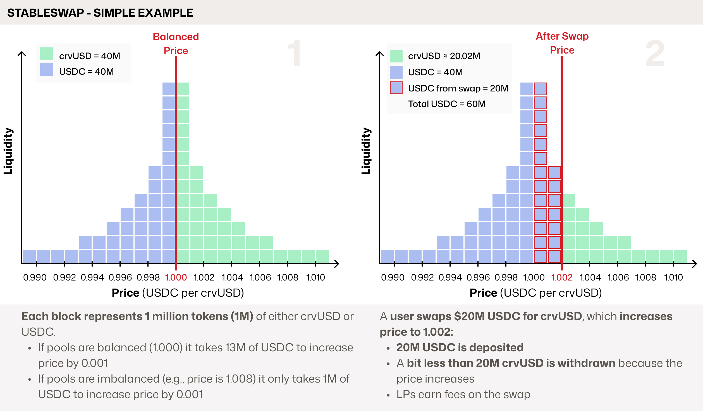
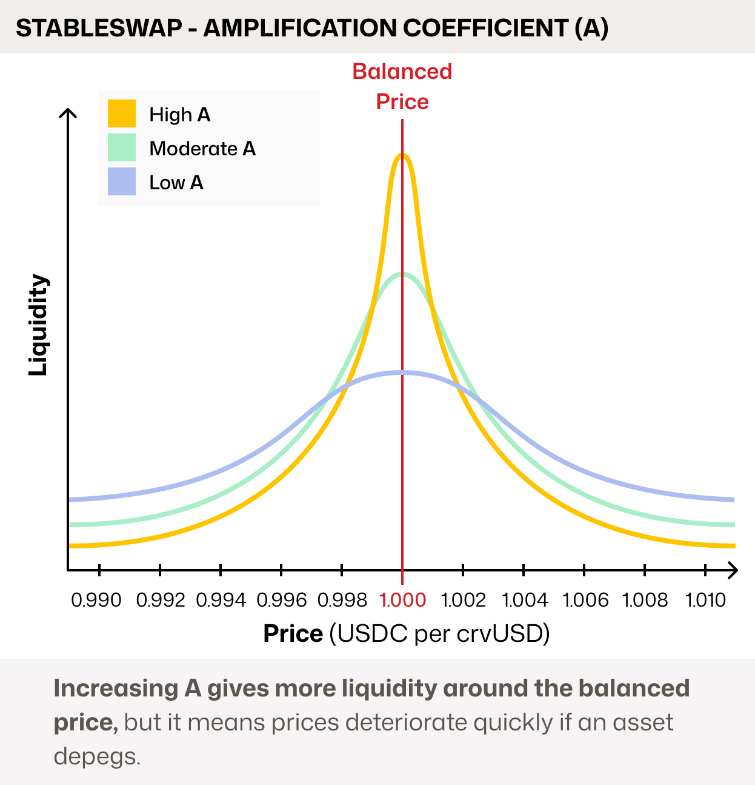

# Cryptoswap: How it Works

Cryptoswap is an evolution of the Stableswap algorithm. To understand how Cryptoswap works, we first need to cover the basics of Stableswap, which was designed to concentrate liquidity around a fixed price for pegged assets (e.g., USDC/USDT).

## Understanding Stableswap

Stableswap was designed for pools of similarly priced assets, like stablecoins, to **concentrate liquidity** around their pegged price (e.g., 1 USDC = 1 USDT). This allows for large swaps with very low slippage, even when the pool is imbalanced.

Let's look at an example with a crvUSD/USDC pool, where each block represents $1M in tokens:

Stableswap pools are designed to function effectively even when heavily unbalanced. A pool can offer efficient pricing even if it holds 90% of one asset and 10% of the other. Such imbalances create arbitrage opportunities, which incentivize trades that rebalance the pool and generate fees for liquidity providers (LPs).

While the blocks are a helpful visual, Stableswap's liquidity is more accurately represented by a bonding curve:

The shape of this curve is controlled by a parameter called `A`, the **Amplification Coefficient**. A higher `A` value concentrates liquidity more tightly around the peg, providing deeper liquidity for swaps. The trade-off is that if an asset moves far from the peg, liquidity and price can drop off sharply.

<figure markdown="span">
  { width="400" }
  <figcaption></figcaption>
</figure>

## **Cryptoswap**

Cryptoswap (also known as Curve v2) is an evolution of Stableswap. Its key innovation is *where* it concentrates liquidity. Instead of targeting a fixed peg, Cryptoswap automatically concentrates and rebalances liquidity close to the pool's **current market price**. This allows it to efficiently support volatile asset pairs (e.g., crvUSD/ETH), and the entire process is **fully passive for liquidity providers**.

As the market price moves, the algorithm must "rebalance" its liquidity to follow it. This action is handled carefully, because **rebalancing locks in impermanent loss**. To protect LPs, Cryptoswap only rebalances when two conditions are met:

1. The internal price must move beyond a minimum threshold, called the **adjustment step**.
2. The cost of rebalancing must be less than 50% of the trading fees earned by LPs. **This core safeguard ensures that impermanent loss is only realized when it is offset by sufficient profit.**  Ensuring LP deposits don't erode over time.

Let's look at an example with a forex pool trading Euros (EUR) against US Dollars (USD):

In this scenario, the pool performs a full rebalance once the price hits the adjustment step, using its collected fees to cover the cost.  

However, the algorithm is flexible. The pool can also perform a **partial rebalance**, using whatever fees it has accumulated to move the liquidity *towards* the new market price, even if it can't shift it all the way.

### **Parameters**

This article from Nagaking goes into detail about each of Cryptoswap's parameters: [Deep Dive: Curve v2 Parameters](https://nagaking.substack.com/p/deep-dive-curve-v2-parameters).

There are two main parameters which change change the shape of the Liquidity Curve, these are `A` and `gamma`.

- **`A`**: controls liquidity concentration in the center of the bonding curve
- **`gamma`**: controls overall breadth of the curve; can fine-tune the extremes

Here is how they affect the curve in practice:

As the image shows, a higher `A` means more liquidity is concentrated around the price at which it's balanced, called the `price_scale`.  Where as a higher `gamma` means liquidity is spread wider.

### Dynamic Fees

Cryptoswap introduced **Dynamic Fees**, a mechanism that adjusts swap costs based on their effect on the pool's balance:

- Swaps that push the pool *further from* its ideal balance are charged a **higher fee**.
- Swaps that help *rebalance* the pool are charged a **lower fee**.

This structure incentivizes arbitrage trades that help maintain the pool's health. This popular feature was also integrated into Stableswap with the Stableswap-NG (New Generation) upgrade.

### Why is Cryptoswap a great algorithm?

**1. It's Passive and Decentralized**

Cryptoswap was built on the original cypherpunk ethos of DeFi: that anyone should be able to provide liquidity easily, passively, and profitably. Compared to protocols that require LPs to become active managers, Cryptoswap's design allows for broader participation, increasing the resilience of the ecosystem.

**2. It Intelligently Manages Impermanent Loss**

The algorithm is designed to protect LPs from capital erosion. By only rebalancing when the fees earned are **more than double the cost**, it ensures that the act of locking in impermanent loss is itself profitable. This prevents the pool from "chasing" the price at a loss to LPs.

**3. It's Highly Capital Efficient**

This efficiency stands in contrast to classic AMMs like Uniswap v2, which use the $x \cdot y = k$ formula. In those models, liquidity is spread thinly across all possible prices (from zero to infinity). By concentrating liquidity around the current market price, Cryptoswap offers significantly lower slippage for traders and generates more fees for LPs from the same amount of capital.

### How can Cryptoswap pools sometimes become stuck?

A Cryptoswap pool's main safety feature is refusing to rebalance at a loss to LPs.  However, this can sometimes cause it to become "stuck." This can trigger a negative feedback loop during periods of high volatility:

As the market price moves away from the pool's concentrated liquidity, the available depth for traders decreases. This leads to fewer swaps and, consequently, lower fee generation. Without enough profit from fees, the pool cannot afford to rebalance and follow the price, leaving its liquidity stranded.

### How to stop pools getting stuck

The best prevention is **proper parameterization**.

Choosing a higher `gamma` and a lower `A` spreads liquidity across a wider price range. This makes a pool more resilient to volatility in two ways:

1.  It ensures the pool can continue facilitating trades and earning fees even during large price swings.
2.  It makes the eventual rebalance cheaper because the liquidity is less concentrated.

[Llamarisk](https://www.llamarisk.com/) is also able to help with simulations to find reasonable parameters for your pool.

### Help my pool is stuck!

If your pool becomes stuck, you essentially have 3 options:

1. **Change Pool Parameters**. Through a DAO vote, parameters can be gradually changed (a process called "ramping"). Reducing `A` and adjusting `gamma` will spread out liquidity, adding depth at the current "stuck" price. Parameters can be ramped back to their original values once the pool recovers.
2. **Seed a New Pool**. This is typically only viable for a protocol that owns most of the pool's liquidity (POL). It involves deploying a new pool with better parameters and killing the emissions gauge for the old one to migrate liquidity.
3. **Wash Trade the Pool**. Manually generating high trading volume can create the necessary fee income to allow the pool to rebalance. This approach is extremely capital-intensive and should only be used as a last resort.

### Why not use Stableswap with an external oracle?

Since Stableswap is so efficient around a peg, a common question arises: why not just peg it to an external oracle price for volatile assets? While some protocols have tried this, the approach introduces two critical flaws:

**1. It forces LPs to lose money.**

Every time the oracle pushes a new price, the pool is forced to rebalance. This action realizes a small amount of impermanent loss for liquidity providers. With a constantly moving price, LPs suffer a "death by a thousand cuts," as these small, forced losses accumulate over time. The only way to compensate LPs is with continuous token incentives that must be greater than their rebalancing losses.

**2. It introduces catastrophic oracle risk.**

This design makes the pool's entire liquidity dependent on a single external source. A malfunctioning, manipulated, or delayed oracle could report a drastically incorrect price, allowing arbitrageurs to drain the pool at a massive loss to LPs.

In contrast, Cryptoswap's internal pricing and profit-aware rebalancing are designed specifically to avoid these issues.