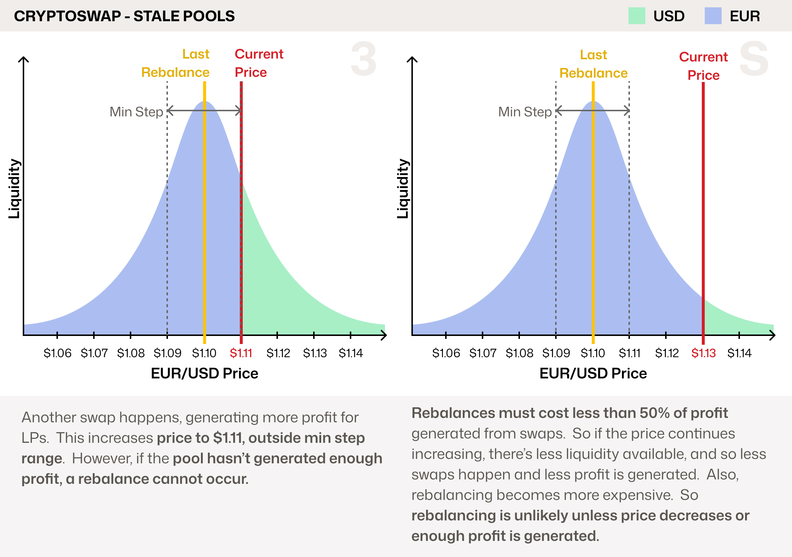
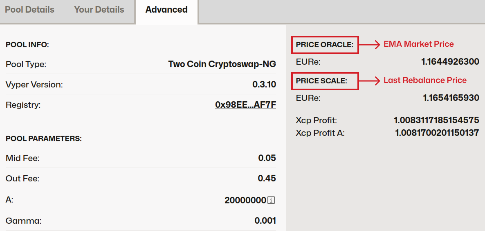

<h1>Cryptoswap: In Depth</h1>

Cryptoswap is an automated market maker (AMM) pool developed by Curve for swapping between **uncorrelated assets**, such as `ETH` and `USDT`, where the exchange rate between these assets changes.

To understand Cryptoswap, it's helpful to first understand Stableswap, Curve's original AMM. Stableswap was designed to swap **pegged assets** (e.g., `USDC/USDT`) by concentrating liquidity around a fixed price (1 `USDT` = 1 `USDC`). While these products have different use cases, they are built on similar underlying technology.

!!! info "Cryptoswap Names"
    - **Cryptopools:** This was the original name used in the whitepaper. You might still find it in outdated resources.
    - **Cryptoswap-NG:** NG stands for **New Generation**, referring to an optimized version of the original implementation.
    - **Curve v2:** An unofficial name used simply because it was the second product released by Curve.  This term is misleading, and we recommend always using the Cryptoswap name instead.

# **Understanding Stableswap**

Stableswap was designed for pools of similarly priced assets, like stablecoins, to **concentrate liquidity** around their pegged price (e.g., 1 `USDC` = 1 `USDT`). This allows for large swaps with very low slippage, even when the pool is imbalanced.

Let's look at an example with a `crvUSD/USDC` pool, where each block represents $1M in tokens:

Stableswap pools are designed to function effectively even when heavily imbalanced. Depending on the **Amplification coefficient** (`A`), pools can maintain close to 1:1 pricing even when significantly imbalanced. If the imbalance becomes large enough to cause a price deviation from the 1:1 peg, it creates an arbitrage opportunity. This incentivizes traders to rebalance the pool, with each swap generating fees for liquidity providers (LPs).

While the blocks offer a helpful visual, Stableswap's liquidity is more accurately represented by a bonding curve:

The shape of this liquidity bonding curve and how imbalanced a pool can become before price deviates from 1:1 is controlled by a parameter called `A`, the **Amplification Coefficient**:

<figure markdown="span">
  { width="500" }
  <figcaption></figcaption>
</figure>

- A **higher `A`** (e.g., 1,000–20,000) concentrates liquidity more tightly around the peg. This provides deeper liquidity for swaps and allows pools to become very imbalanced before the price deviates significantly from 1:1. The trade-off is that if an asset moves far from the peg, liquidity and pricing can drop off sharply.

- A **lower `A`** (e.g., 50–200) distributes liquidity more evenly. The price will deviate more gradually from the peg as the pool becomes imbalanced, avoiding sharp jumps.

# **Understanding Cryptoswap**

Cryptoswap pools build upon the core Stableswap algorithm, but with a key innovation: *where* liquidity is concentrated. Instead of targeting a fixed peg, Cryptoswap automatically concentrates and rebalances liquidity around the pool's **recent average price**.  This allows it to efficiently support **volatile asset pairs** (e.g., `crvUSD/ETH`) while making the entire process **fully passive for liquidity providers**.

As the market price moves, the algorithm must "rebalance" its liquidity to follow it. This process is handled carefully, because **rebalancing realizes impermanent loss**. To protect LPs, Cryptoswap only rebalances when two conditions are met:

1.  The internal price must move beyond a minimum threshold, known as the **adjustment step**.
2.  The cost of rebalancing must be less than 50% of the trading fees earned by LPs. **This core safeguard ensures that impermanent loss is only realized when it is sufficiently offset by trading profits**, helping to prevent the erosion of LP deposits from rebalancing fees over time.

!!! info "Internal EMA Price Oracle"
    For added safety, rebalances are triggered not by the last price of the pool, but by an **Exponential Moving Average** (EMA) of all recent prices. This internal price oracle helps prevent manipulation of rebalances.

    In the following examples, the EMA Price and current price are assumed to be the same. In reality, the EMA will lag the current price slightly.

Let's look at an example using a forex pool trading Euros (EUR) against US Dollars (USD):

In this scenario, the pool performs a rebalance once the price hits the adjustment step, using up to 50% of its collected fees to cover the cost.  

## **Why Does Rebalancing Cost?**

Rebalancing costs because you are offering your assets to be swapped in return for trading fees.  As price increases, you are selling your assets.  When you rebalance, you are rebuying your assets, but at a higher price, causing a loss.  Let's look at a very simple example of a concentrated liquidity range AMM:

This example highlights two important takeaways about rebalancing:

* If the user had not rebalanced, they would have kept their initial asset value.
* If the price continued to increase without a rebalance, the user's impermanent loss would have been larger, as they would need to buy back assets at an even higher price to re-enter the liquidity range.
 
Rebalancing is necessary, but both frequent and infrequent rebalancing can lead to significant losses. Cryptoswap automates this process to strike a balance, ensuring LPs remain profitable while maintaining high liquidity depth for swappers.

## **Parameters**

This article from Nagaking goes into detail about each of Cryptoswap's parameters: [Deep Dive: Curve v2 Parameters](https://nagaking.substack.com/p/deep-dive-curve-v2-parameters).

There are two main parameters which change change the shape of the Liquidity Bonding Curve, these are `A` and `gamma`.

- **`A`**: controls liquidity concentration in the center of the bonding curve
- **`gamma`**: controls overall breadth of the curve; can fine-tune the extremes

Here is how they affect the curve in practice (note that orange curve are equal in both charts):

As the image shows, a higher `A` means more liquidity is concentrated around the price at which it's balanced, called the `price_scale`.  Where as a higher `gamma` means liquidity is spread wider.

## **Dynamic Fees**

Cryptoswap and all new Stableswap pools feature **dynamic fees** that adjust to increase returns for LPs when their liquidity is in high demand.

For Cryptoswap pools, this works as follows:

<figure markdown="span">
  { width="500" }
  <figcaption></figcaption>
</figure>

## **Why is Cryptoswap a great algorithm?**

**1. It's Passive and Decentralized**

Cryptoswap was built on the original cypherpunk ethos of DeFi: that anyone should be able to provide liquidity easily, passively, and profitably. Compared to protocols that require LPs to become active managers, Cryptoswap's design allows for broader participation, increasing the resilience of the ecosystem.

**2. It Automatically Manages Impermanent Loss**

The algorithm is designed to protect LPs from Rebalancing losses (as much as possible). By only rebalancing when the fees earned are **more than double the cost**, it ensures that the act of locking in impermanent loss is itself profitable. This prevents the pool from "chasing" the price at a loss to LPs.

**3. It's Capital Efficient**

This efficiency stands in contrast to classic AMMs like Uniswap v2, which use the $x \cdot y = k$ formula. In those models, liquidity is spread thinly across all possible prices (from zero to infinity). By concentrating liquidity around the current market price, Cryptoswap offers significantly lower slippage for traders and generates more fees for LPs from the same amount of capital.

## **Stale Pools - How Cryptoswap Pools Can Become Stuck**

A Cryptoswap pool's main safety feature is its refusal to rebalance at a loss to LPs. However, this can sometimes cause a pool to become **stuck**, meaning it has a **stale liquidity concentration** because the last rebalance price (`price scale`) is very different from the current price. This can trigger a negative feedback loop during periods of high volatility:

As the market price moves away from the pool's last rebalance price, the available liquidity for traders decreases. This leads to fewer swaps and, consequently, lower fee generation. Without enough profit from fees, the pool cannot afford to rebalance and follow the price, leaving its liquidity stranded.

## **Monitoring Liquidity Balance within Pools**

To see how balanced liquidity is within a pool, navigate to the pool's page, for example the [EURe/USDC pool on Arbitrum](https://www.curve.finance/dex/arbitrum/pools/factory-twocrypto-89/deposit). At the bottom of the pool details, click the `Advanced` tab. You will then see the following details:

In the image above, you can see two key parameters:

- **Price Scale**: This is the price at which liquidity was last rebalanced.
- **Price Oracle**: This is an Exponential Moving Average (EMA) of recent market prices. Rebalances are triggered by this price, not the current market price, which helps prevent manipulation of the rebalancing mechanism.

## **How to Prevent Stale Liquidity within Pools**

The best prevention for stale liquidity is **proper parameterization**.

Choosing a higher `gamma` and a lower `A` spreads liquidity across a wider price range. This makes a pool more resilient to volatility in two ways:

1.  It ensures the pool can continue to facilitate trades and earn fees even during large price swings.
2.  It makes the eventual rebalance cheaper because the liquidity is less concentrated.

For assistance with simulations to find reasonable parameters for your pool, refer to [Llamarisk](https://www.llamarisk.com/).

## **Help! My Pool's Liquidity is Stale!**

If your pool's liquidity becomes stale, you have three primary options:

1.  **Change Pool Parameters:** Through a DAO vote, parameters can be gradually changed (a process called "ramping"). Reducing `A` and adjusting `gamma` will spread out liquidity, adding depth at the current price. If parameterization was not the root cause, these parameters can be ramped back to their original values once the pool recovers.

2.  **Seed a New Pool:** This option is typically only viable for protocols that own most of the pool's liquidity (POL). It involves deploying a new pool with better parameters and "killing" the old gauge, if applicable.

3.  **Wash Trade the Pool:** Manually generating high trading volume (likely via flash loans) can create the necessary fee income to allow the pool to rebalance. This approach is extremely capital-intensive and should only be used as a last resort.

## **Why Not Use Stableswap with an External Oracle?**

Since Stableswap is highly efficient around a single price and can be guided by an external oracle, many developers have considered using this design to price volatile asset pairs against each other.

While some protocols have attempted this, and it can work (e.g., [Spectra](https://spectra.finance/)'s pools), there are a few important considerations:

* **Rebalancing Costs:** Every time the oracle pushes a new price, the pool is forced to rebalance. For volatile assets, these frequent rebalances can accumulate into significant losses for LPs. Profitability depends on trading fees being high enough, or LPs being subsidized in other ways, such as with token emissions. However, for low-volatility assets (even USD/EUR volatility is too high), this technique can work well.

* **Oracle Dependency:** This design requires a high-quality oracle. A malfunctioning, manipulated, or delayed oracle could report an incorrect price, leading to substantial losses for LPs.

In contrast, Cryptoswap's **profit-aware rebalancing mechanisms** are designed specifically to mitigate these risks for highly volatile asset pairs.