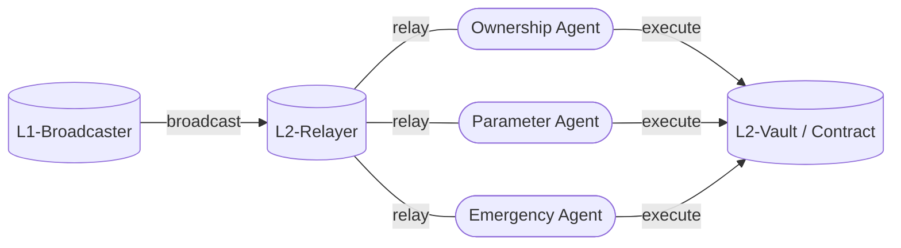

<h1>Curve Cross-Chain Governance</h1>

!!!deploy "Source Code"
    All source code can be found in the [`curve x-gov`]((../../references/deployed-contracts.md#curve-x-gov)) repository on GitHub.  
    A comprehensive list of all deployed contracts is available [here :material-arrow-up-right:](../../references/deployed-contracts.md#curve-x-gov).

The Curve X-DAO infrastructure facilitates **cross-chain governance across multiple blockchain networks**. This architecture allows the DAO to conduct and implement governance activities not only on Ethereum but also on other networks such as `Arbitrum`, `Optimism`, `Base`, `Mantle`, `Avalanche`, `Fantom`, `BinanceSmartChain`, `Kava`, and `Polygon`. 

**Governance voting is consistently conducted on the Ethereum mainnet**. Following a successful vote, the **results are transmitted** to the L2 network through a `L1-Broadcaster`. Subsequently, the intended actions are executed by `Agents` on the respective L2 networks by a `L2-Relayer`.

---

-   __Broadcaster.vy__ [:material-github:](https://github.com/curvefi/curve-xgov/tree/master/contracts)

    ---

    The `Broadcaster.vy` contract is responsible for broadcasting the results of governance votes from the Ethereum mainnet to various sidechains. 

    [:octicons-arrow-right-24: Getting started](./broadcaster.md)

-   __L2-Relayer.vy__ [:material-github:](https://github.com/curvefi/curve-xgov/tree/master/contracts)

    ---

    The `L2-Relayer.vy` contract facilitates the relay of voting outcomes to Layer 2 networks, ensuring the execution of governance decisions.

    [:octicons-arrow-right-24: Getting started](./relayer.md)

-   __Agent.vy__ [:material-github:](https://github.com/curvefi/curve-xgov/blob/master/contracts/Agent.vy)

    ---

    On each sidechain and Layer 2 network, the `Agent.vy` contract assumes three distinct roles: ownership, parameter, and emergency, mirroring the structure found on the Ethereum mainnet for controlled actions.

    [:octicons-arrow-right-24: Getting started](./agents.md)

-   __Vault.vy__ [:material-github:](https://github.com/curvefi/curve-xgov/blob/master/contracts/Vault.vy)

    ---

    The `Vault.vy` contract serves as a repository for various assets, with its control vested in the ownership agent.

    [:octicons-arrow-right-24: Getting started](./vault.md)

