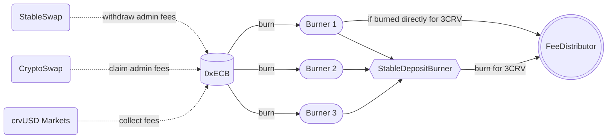

## **Overview**

Burning is handled on a per-coin basis. The process is initiated by calling the `PoolProxy.burn` or `PoolProxy.burn_many` functions. Calling to burn a coin transfers that coin into the burner and then calls the `burn` function on the burner.

Each `burn` action typically performs one conversion into another asset; either 3CRV itself, or something that is a step closer to reaching 3CRV. As an example, here is the sequence of conversions required to burn wstETH:  

`wstETH -> stETH -> ETH -> USDT`

1. wstETH to stETH via *unwrapping (wstETH Burner)*  
2. stETH to ETH via *swap through stETH/ETH curve pool (SwapStableBurner)*  
3. ETH to USDT via *swap through tricrypto pool (CryptoSwapBurner)*  
4. USDT to 3CRV via *depositing into 3pool (StableDepositBurner)*  


**Simplified  burn pattern:**  



!!!success
    Efficiency within the intermediate conversions is the reason it is important to run the burn process in a specific order. For example, if you burn stETH prior to burning wstETH, you will have to burn stETH a second time!

**There are multiple burner contracts, each of which handles a different category of fee coin. The following list also outlines the rough sequence in which burners should be executed:** 

## **Deployed Burner Contracts**

| Burner Type   | Description | Address  |
| -------- | -------|-------|
|`ABurner`|`Aave lending tokens`|[0x12220a63a2013133D54558C9d03c35288eAC9B34](https://etherscan.io/address/0x12220a63a2013133d54558c9d03c35288eac9b34#code)|
|`CBurner`|`Compound lending tokens`|[0xdd0e10857d952c73b2fa39ce86308299df8774b8](https://etherscan.io/address/0xdd0e10857d952c73b2fa39ce86308299df8774b8#code)|
|`YBurner`|`Yearn lending tokens`|[0xd16ea3e5681234da84419512eb597362135cd8c9](https://etherscan.io/address/0xd16ea3e5681234da84419512eb597362135cd8c9#code)|
|`CryptoSwapBurner`|`Swaps crypto LP tokens`|[0xdc237b4B882Fa1d1fd1dD5B59A08F8dB3416DbE3](https://etherscan.io/address/0xdc237b4B882Fa1d1fd1dD5B59A08F8dB3416DbE3#code)|
|`SwapStableBurner`|` Swaps into another asset using a stable pool`|[0x90B4508e8F91523e5c8854eA73AFD8c22d8c27b7](https://etherscan.io/address/0x90B4508e8F91523e5c8854eA73AFD8c22d8c27b7#code)|
|`LPBurner`|`Burner for LP Tokens`|[0xaa42C0CD9645A58dfeB699cCAeFBD30f19B1ff81](https://etherscan.io/address/0xaa42C0CD9645A58dfeB699cCAeFBD30f19B1ff81#code)|
|`MetaBurner`|`USD denominated assets that are directly swappable for 3CRV`|[0xE4b65889469ad896e866331f0AB5652C1EcfB3E6](https://etherscan.io/address/0xE4b65889469ad896e866331f0AB5652C1EcfB3E6#code)|
|`SynthBurner`|`non-USD denominated assets that are synths or can be swapped into synths`|[0x67a0213310202dbc2cbe788f4349b72fba90f9fa](https://etherscan.io/address/0x67a0213310202dbc2cbe788f4349b72fba90f9fa#code)|
|`UniswapBurner`|`Assets that must be swapped on Uniswap/Sushiswap`|[0xf3b64840b39121b40d8685f1576b64c157ce2e24](https://etherscan.io/address/0xf3b64840b39121b40d8685f1576b64c157ce2e24#code)|
|`UnderlyingBurner`|`Assets that can be directly deposited into 3pool, or swapped for an asset that is deposited into 3pool`|[0x786b374b5eef874279f4b7b4de16940e57301a58](https://etherscan.io/address/0x786b374b5eef874279f4b7b4de16940e57301a58#code)|
|`Wrapped stETH Burner`|`Unwraps wstETH into stETH` |[0x072C93f12dC274300c79E92Eb61a0feCFa8E8918](https://etherscan.io/address/0x072C93f12dC274300c79E92Eb61a0feCFa8E8918#code)|
|`Stable Deposit Burner`| `Deposits stables into Threepool`|[0x1D56495c76d99435d10ecd5b0C3bd6a8EE7cC3bb](https://etherscan.io/address/0x1D56495c76d99435d10ecd5b0C3bd6a8EE7cC3bb#code)|
|`Tricrypto Factory LP Burner`| `Withdraws LP Tokens`|[0xA6a0103f8F185786143f3EFe3Ddf268d8E070813](https://etherscan.io/address/0xA6a0103f8F185786143f3EFe3Ddf268d8E070813#code)|
|`crvUSD Burner`| `Withdraws LP tokens from crvUSD pools and exchanges crvUSD`|[0xA6a0103f8F185786143f3EFe3Ddf268d8E070813](https://etherscan.io/address/0xA6a0103f8F185786143f3EFe3Ddf268d8E070813#code)|


!!!deploy "Contract Source & Deployment"
    Source code for burners is available on [Github](https://github.com/curvefi/curve-dao-contracts/tree/master/contracts/burners).


## **Burners**

### **ABurner / CBurner / YBurner**
`ABurner`, `CBurner` and `YBurner` are collectively known as “lending burners”. They unwrap lending tokens into the underlying asset and transfer those assets onward into the underlying burner.

*There is no configuration required for this burner.*

### **CryptoSwap Burner**
The CryptoSwapBurner is used to burn fees from Crypto Pools.

### **StableSwap Burner**
Swaps an asset into another asset using a Stable pool and forwards to another burner.

### **LP Burner**
The LP Burner handles non-3CRV LP tokens. This burner is primarily used for [fraxbp LP tokens](https://etherscan.io/address/0x3175df0976dfa876431c2e9ee6bc45b65d3473cc#code) which are converted to USDC and then sent to 0xECB for a further burn process.

LP burner calls to `StableSwap.remove_liquidity_one_coin` to unwrap the LP token. The new asset is then transferred on to another burner.

#### `swap_data`
!!! description "`LPBurner.swap_data(arg0: adress) -> pool: address, coin: address, burner: address, i: int128`"

    Getter method for informations about the LP Token burn process.

    Retuns: pool (`address`) of the LP token, coin (`address`) in which the LP token in withdrawn, burner (`address`) where the output token is forwarded to and i (`index`) of `coin` in the pool.

    | Input      | Type   | Description |
    | ----------- | -------| ----|
    | `arg0` |  `address` | LP Token Address |

    ??? quote "Source code"

        ```vyper hl_lines="1"
        struct SwapData:
            pool: address
            coin: address
            burner: address
            i: int128
        ```

    === "Example"
        ```shell
        >>> LPBurner.swap_data("0x3175df0976dfa876431c2e9ee6bc45b65d3473cc")
        pool: '0xDcEF968d416a41Cdac0ED8702fAC8128A64241A2'
        coin: '0xA0b86991c6218b36c1d19D4a2e9Eb0cE3606eB48'
        burner: '0x786B374B5eef874279f4B7b4de16940e57301A58'
        i: 1
        ```


#### `set_swap_data`
!!! description "`LPBurner.set_swap_data(_lp_token: address, _coin: address, _burner: address) -> bool:`"

    !!!guard "Guarded Method"
        This function is only callable by the `owner` or `emergency_owner` of the contract.

    Function to set the swap data of a LP token.

    Returns: true (`bool`).

    | Input      | Type   | Description |
    | ----------- | -------| ----|
    | `_lp_token` |  `address` | LP token address |
    | `_coin` |  `address` | coin address to swap the LP token to |
    | `_burner` |  `address` | burner address to forward to  |

    ??? quote "Source code"

        ```vyper hl_lines="2"
        @external
        def set_swap_data(_lp_token: address, _coin: address, _burner: address) -> bool:
            """
            @notice Set conversion and transfer data for `_lp_token`
            @param _lp_token LP token address
            @param _coin Underlying coin to remove liquidity in
            @param _burner Burner to transfer `_coin` to
            @return bool success
            """
            assert msg.sender in [self.owner, self.emergency_owner]  # dev: only owner

            # if another burner was previous set, revoke approvals
            pool: address = self.swap_data[_lp_token].pool
            if pool != ZERO_ADDRESS:
                # we trust that LP tokens always return True, so no need for `raw_call`
                ERC20(_lp_token).approve(pool, 0)
            coin: address = self.swap_data[_lp_token].coin
            if coin != ZERO_ADDRESS:
                response: Bytes[32] = raw_call(
                    _coin,
                    concat(
                        method_id("approve(address,uint256)"),
                        convert(self.swap_data[_lp_token].burner, bytes32),
                        convert(0, bytes32),
                    ),
                    max_outsize=32,
                )
                if len(response) != 0:
                    assert convert(response, bool)

            # find `i` for `_coin` within the pool, approve transfers and save to storage
            registry: address = AddressProvider(ADDRESS_PROVIDER).get_registry()
            pool = Registry(registry).get_pool_from_lp_token(_lp_token)
            coins: address[8] = Registry(registry).get_coins(pool)
            for i in range(8):
                if coins[i] == ZERO_ADDRESS:
                    raise
                if coins[i] == _coin:
                    self.swap_data[_lp_token] = SwapData({
                        pool: pool,
                        coin: _coin,
                        burner: _burner,
                        i: i
                    })
                    ERC20(_lp_token).approve(pool, MAX_UINT256)
                    response: Bytes[32] = raw_call(
                        _coin,
                        concat(
                            method_id("approve(address,uint256)"),
                            convert(_burner, bytes32),
                            convert(MAX_UINT256, bytes32),
                        ),
                        max_outsize=32,
                    )
                    if len(response) != 0:
                        assert convert(response, bool)
                    return True
            raise
        ```

    === "Example"
        ```shell
        >>> LPBurner.set_swap_data("0x3175df0976dfa876431c2e9ee6bc45b65d3473cc", "0xA0b86991c6218b36c1d19D4a2e9Eb0cE3606eB48", "0x786B374B5eef874279f4B7b4de16940e57301A58")
        'true'
        ```


### **MetaBurner**
The MetaBurner converts Metapool-paried coins to 3CRV and transfers to the FeeDistributor. It uses the registry’s `exchange_with_best_rate` and transfers 3CRV directly to the fee distributor.

*There is no configuration required for this burner.*


### **SynthBurner** 
Swaps non-USD denominated assets for synths, converts synths to sUSD and transfers to `UnderlyingBurner`.
The synth burner is used to convert non-USD denominated assets into sUSD. This is accomplished via synth conversion, the same mechanism used in cross-asset swaps.

When the synth burner is called to burn a non-synthetic asset, it uses `RegistrySwap.exchange_with_best_rate` to swap into a related synth. If no direct path to a synth is avaialble, a swap is made into an intermediate asset.

For synths, the burner first transfers to the [underlying burner](#underlyingburner). Then it calls `UnderlyingBurner.convert_synth`, performing the cross-asset swap within the underlying burner. This is done to avoid requiring another transfer call after the settlement period has passed.

The optimal sequence when burning assets using the synth burner is thus:  
1. Coins that cannot directly swap to synths  
2. Coins that can directly swap to synths  
3. Synthetic assets  

The burner is configurable via the following functions:

#### `set_swap_for`
!!! description "`SynthBurner.set_swap_for(_coins: address[10], _targets: address[10]) -> bool:`"

    Function to set target coins that the burner will swap into.

    For assets that can be directly swapped for a synth, the target should be set as that synth. For assets that cannot be directly swapped, the target must be an asset that has already had it’s own target registered (e.g. can be swapped for a synth).

    | Input      | Type   | Description |
    | ----------- | -------| ----|
    | `_coin` |  `address[10]` | list of coins to be burned |
    | `_targets` |  `address[10]` | list of coins to be swapped for |

    !!!tip
        If you wish to set less than 10 `_coins`, fill the remaining array slots with `ZERO_ADDRESS`.    
        The address as index `n` within this list corresponds to the address at index `n` within `coins`.

    ??? quote "Source code"

        ```vyper hl_lines="2"
        @external
        def set_swap_for(_coins: address[10], _targets: address[10]) -> bool:
            """
            @notice Set target coins that will be swapped into
            @dev If any target coin is not a synth, it must have already
                had it's own target coin registered
            @param _coins List of coins to be burned
            @param _targets List of coins to be swapped for
            @return bool success
            """
            registry: address = AddressProvider(ADDRESS_PROVIDER).get_registry()
            for i in range(10):
                coin: address = _coins[i]
                if coin == ZERO_ADDRESS:
                    break
                target: address = _targets[i]
                assert Registry(registry).find_pool_for_coins(coin, target) != ZERO_ADDRESS

                if self.currency_keys[target] == EMPTY_BYTES32:
                    # if target is not a synth, ensure target already has a target set
                    assert self.swap_for[target] != ZERO_ADDRESS
                self.swap_for[coin] = target

            return True
        ```

    === "Example"
        ```shell
        >>> SynthBurner.set_swap_for(todo)
        'true'
        ```


#### `add_synths`
!!! description "`SynthBurner.add_synths(_synths: address[10]) -> bool:`"

    Register synthetic assets within the burner. This function is unguarded. For each synth to be added, a call is made to Synth.currencyKey to validate the addresss and obtain the synth currency key.

    | Input      | Type   | Description |
    | ----------- | -------| ----|
    | `_synths` |  `address[10]` | list of synth tokens to register |

    !!!note
        If you wish to set less than 10 `_coins`, fill the remaining array slots with `ZERO_ADDRESS`.    
        The address as index `n` within this list corresponds to the address at index `n` within `coins`.

    ??? quote "Source code"

        ```vyper hl_lines="3"
        @external
        @nonreentrant("lock")
        def add_synths(_synths: address[10]) -> bool:
            """
            @notice Registry synth token addresses
            @param _synths List of synth tokens to register
            @return bool success
            """
            for synth in _synths:
                if synth == ZERO_ADDRESS:
                    break
                # this will revert if `_synth` is not actually a synth
                self.currency_keys[synth] = Synth(synth).currencyKey()

            return True
        ```

    === "Example"
        ```shell
        >>> SynthBurner.add_synths(todo)
        'true'
        ```

### **Wrapped stETH Burner** 
This burner unwraps wstETH to stETH and sends it back to 0xECB.


### **UnderlyingBurner**
The underlying burner handles assets that can be directly swapped to USDC and deposits DAI/USDC/USDT into [3pool](https://curve.fi/#/ethereum/pools/3pool/deposit/) to obtain 3CRV. This is the **final step of the burn process** for many assets that require multiple intermediate swaps.

!!!note
    Prior to burning any assets with the UnderlyingBurner, you should have completed the entire burn process with `SynthBurner`, `UniswapBurner` and `all of the lending burners`.

The burn process consists of: 

- For sUSD: First call settles to complete any pending synth conversions. Then swaps into USDC. 
- For all other assets that are not DAI/USDC/USDT: Swap into USDC.  
- For DAI/USDC/USDT: Only transfer the assets into the burner.  

Once the entire burn process has been completed you must call `execute` as the final action:

!!! description "`UnderlyingBurner.execute() -> bool:`"

    Function to deposit all the tokens into 3pool and transfer the recieved 3CRV to the FeeDistributor contract.

    ??? quote "Source code"

        ```vyper hl_lines="1"
        def execute() -> bool:
            """
            @notice Add liquidity to 3pool and transfer 3CRV to the fee distributor
            @return bool success
            """
            assert not self.is_killed  # dev: is killed

            amounts: uint256[3] = [
                ERC20(TRIPOOL_COINS[0]).balanceOf(self),
                ERC20(TRIPOOL_COINS[1]).balanceOf(self),
                ERC20(TRIPOOL_COINS[2]).balanceOf(self),
            ]
            if amounts[0] != 0 and amounts[1] != 0 and amounts[2] != 0:
                StableSwap(TRIPOOL).add_liquidity(amounts, 0)

            amount: uint256 = ERC20(TRIPOOL_LP).balanceOf(self)
            if amount != 0:
                ERC20(TRIPOOL_LP).transfer(self.receiver, amount)

            return True
        ```

    !!!note
        This is the final function to be called in the burn process, after all other steps are completed. Calling this function does not do anything if the burner has a balance of zero for DAI, USDC and USDT.


### **Stable Deposit Burner**
This burner converts DAI, USDC and USDT into 3CRV by adding liquidity to the 3pool and then transfers them to the FeeDistributor.

!!! description "`StableDepositBurner.burn(_coin: ERC20) -> bool:`"

    Function to add the entire burner's balance of `_coin` to the 3pool.

    ??? quote "Source code"

        ```vyper 
        @external
        def burn(_coin: ERC20) -> bool:
            """
            @notice Convert `_coin` by depositing
            @param _coin Address of the coin being converted
            @return bool success
            """
            assert not self.is_killed  # dev: is killed
            assert _coin in COINS

            amount: uint256 = _coin.balanceOf(msg.sender)
            assert _coin.transferFrom(msg.sender, self, amount, default_return_value=True)  # safe transfer

            if _coin == COINS[N_COINS - 1]:  # Do it once
                amounts: uint256[N_COINS] = empty(uint256[N_COINS])
                for i in range(N_COINS):
                    amounts[i] = COINS[i].balanceOf(self)
                self._burn(amounts)

            return True

        @internal
        def _burn(_amounts: uint256[N_COINS]):
            amount: uint256 = 0
            for i in range(N_COINS):
                amount += _amounts[i] * DEC[i]

            min_amount: uint256 = amount * ONE / POOL.get_virtual_price()
            min_amount -= min_amount * self.slippage / BPS

            POOL.add_liquidity(_amounts, min_amount)

            amount = LP.balanceOf(self)
            LP.transfer(FEE_DISTRIBUTER, amount)
        ```


### **Metapool Burner**
This is not a burner contract in itself. Some metapools transfer 'coin 0' of the admin fees to the Factory, where it is swapped for 'coin 1' (e.g., 3CRV), which is then sent directly to the FeeDistributor.


??? quote "Source code"

    ```vyper
    @external
    def withdraw_admin_fees():
        # transfer coin 0 to Factory and call `convert_fees` to swap it for coin 1
        factory: address = self.factory
        coin: address = self.coins[0]
        amount: uint256 = ERC20(coin).balanceOf(self) - self.balances[0]
        if amount > 0:
            response: Bytes[32] = raw_call(
                coin,
                concat(
                    method_id("transfer(address,uint256)"),
                    convert(factory, bytes32),
                    convert(amount, bytes32),
                ),
                max_outsize=32,
            )
            if len(response) > 0:
                assert convert(response, bool)
            Factory(factory).convert_metapool_fees()

        # transfer coin 1 to the receiver
        coin = self.coins[1]
        amount = ERC20(coin).balanceOf(self) - self.balances[1]
        if amount > 0:
            receiver: address = Factory(factory).get_fee_receiver(self)
            response: Bytes[32] = raw_call(
                coin,
                concat(
                    method_id("transfer(address,uint256)"),
                    convert(receiver, bytes32),
                    convert(amount, bytes32),
                ),
                max_outsize=32,
            )
            if len(response) > 0:
                assert convert(response, bool)
    ```


## **Configuring Fee Bruners**

Burners are configured within the 0xECB (PoolOwner) contract. 

### `burners`
!!! description "`PoolProxy.burners(coin: address) -> address: view`"

    Getter for the burner contract address for `coin`.

    Returns: burner of a coin (`address`).

    | Input      | Type   | Description |
    | ----------- | -------| ----|
    | `coin` |  `address` | Token Address |

    ??? quote "Source code"

        ```vyper hl_lines="1"
        burners: public(HashMap[address, address])
        ```

    === "Example"
        ```shell
        >>> GaugeController.burners("0x056fd409e1d7a124bd7017459dfea2f387b6d5cd")
        '0xE4b65889469ad896e866331f0AB5652C1EcfB3E6'
        ```


### `set_burner`
!!! description "`PoolProxy.set_burner(_coin: address, _burner: address):`"

    !!!guard "Guarded Method"
        This function is only callable by the `ownership_admin` of the contract.

    Function to set burner of `_coin` to `_burner` address.

    Emits: `AddBurner`

    | Input      | Type   | Description |
    | ----------- | -------| ----|
    | `_coin` |  `address` | Token Address |
    | `_burner` |  `address` | Burner Address |

    ??? quote "Source code"

        ```vyper hl_lines="1 6 12 14 17"
        event AddBurner:
            burner: address

        @external
        @nonreentrant('lock')
        def set_burner(_coin: address, _burner: address):
            """
            @notice Set burner of `_coin` to `_burner` address
            @param _coin Token address
            @param _burner Burner contract address
            """
            assert msg.sender == self.ownership_admin, "Access denied"

            self._set_burner(_coin, _burner)

        @internal
        def _set_burner(_coin: address, _burner: address):
            old_burner: address = self.burners[_coin]
            if _coin != 0xEeeeeEeeeEeEeeEeEeEeeEEEeeeeEeeeeeeeEEeE:
                if old_burner != ZERO_ADDRESS:
                    # revoke approval on previous burner
                    response: Bytes[32] = raw_call(
                        _coin,
                        concat(
                            method_id("approve(address,uint256)"),
                            convert(old_burner, bytes32),
                            convert(0, bytes32),
                        ),
                        max_outsize=32,
                    )
                    if len(response) != 0:
                        assert convert(response, bool)

                if _burner != ZERO_ADDRESS:
                    # infinite approval for current burner
                    response: Bytes[32] = raw_call(
                        _coin,
                        concat(
                            method_id("approve(address,uint256)"),
                            convert(_burner, bytes32),
                            convert(MAX_UINT256, bytes32),
                        ),
                        max_outsize=32,
                    )
                    if len(response) != 0:
                        assert convert(response, bool)

            self.burners[_coin] = _burner

            log AddBurner(_burner)

        ```

    === "Example"
        ```shell
        >>> GaugeController.(todo)
        todo
        ```


### `set_many_burners`
!!! description "`PoolProxy.set_many_burners(_coins: address[20], _burners: address[20]):`"

    !!!guard "Guarded Method"
        This function is only callable by the `ownership_admin` of the contract.

    Function to set many burner for multiple coins at once. 

    Emits: `AddBurner`

    | Input      | Type   | Description |
    | ----------- | -------| ----|
    | `_coins` |  `address[20]` | Token Addresses. The address at index `n` within this list corresponds to the address at index `n` within `coins` |
    | `_burners` |  `address[20]` | Burner Addresses. If less than 20 burners are set, the remaining array slots need to be filled with `ZERO_ADDRESS`. |

    ??? quote "Source code"

        ```vyper hl_lines="1 5 38 42"
        event AddBurner:
            burner: address

        @internal
        def _set_burner(_coin: address, _burner: address):
            old_burner: address = self.burners[_coin]
            if _coin != 0xEeeeeEeeeEeEeeEeEeEeeEEEeeeeEeeeeeeeEEeE:
                if old_burner != ZERO_ADDRESS:
                    # revoke approval on previous burner
                    response: Bytes[32] = raw_call(
                        _coin,
                        concat(
                            method_id("approve(address,uint256)"),
                            convert(old_burner, bytes32),
                            convert(0, bytes32),
                        ),
                        max_outsize=32,
                    )
                    if len(response) != 0:
                        assert convert(response, bool)

                if _burner != ZERO_ADDRESS:
                    # infinite approval for current burner
                    response: Bytes[32] = raw_call(
                        _coin,
                        concat(
                            method_id("approve(address,uint256)"),
                            convert(_burner, bytes32),
                            convert(MAX_UINT256, bytes32),
                        ),
                        max_outsize=32,
                    )
                    if len(response) != 0:
                        assert convert(response, bool)

            self.burners[_coin] = _burner

            log AddBurner(_burner)

        @external
        @nonreentrant('lock')
        def set_many_burners(_coins: address[20], _burners: address[20]):
            """
            @notice Set burner of `_coin` to `_burner` address
            @param _coins Token address
            @param _burners Burner contract address
            """
            assert msg.sender == self.ownership_admin, "Access denied"

            for i in range(20):
                coin: address = _coins[i]
                if coin == ZERO_ADDRESS:
                    break
                self._set_burner(coin, _burners[i])
        ```

    === "Example"
        ```shell
        >>> GaugeController.set_many_burners(todo)
        'todo'
        ```


### `set_kill_burner`
!!! description "`PoolProxy.set_burner_kill(_is_killed: bool):`"

    !!!guard "Guarded Method"
        This function is only callable by the `ownership_admin` or `emergency_admin` of the contract.

    Disable or enable the process of fee burning.

    | Input      | Type   | Description |
    | ----------- | -------| ----|
    | `_pool` |  `address` | Pool Address |
    | `_caller` |  `address` | Caller Address |
    | `_is_approved` |  `boolean` | True or False |

    ??? quote "Source code"

        ```vyper hl_lines="1 2 5 10 11"
        ownership_admin: public(address)
        emergency_admin: public(address)

        @external
        def set_burner_kill(_is_killed: bool):
            """
            @notice Kill or unkill `burn` functionality
            @param _is_killed Burner kill status
            """
            assert msg.sender == self.emergency_admin or msg.sender == self.ownership_admin, "Access denied"
            self.burner_kill = _is_killed
        ```

    === "Example"
        ```shell
        >>> GaugeController.set_burner_kill("False")
        ```

