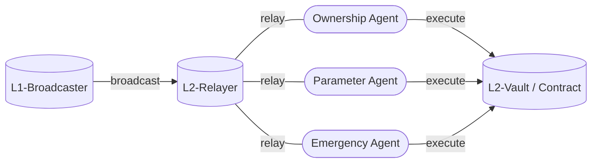

<h1>Curve Cross-Chain Governance</h1>

# **System Overview**

!!!deploy "Source Code"
    All source code can be found in the [`curve x-gov`]((../../references/deployed-contracts.md#curve-x-gov)) repository on GitHub.  
    A comprehensive list of all deployed contracts is available [here :material-arrow-up-right:](../../references/deployed-contracts.md#curve-x-gov).

The Curve X-DAO infrastructure facilitates **cross-chain governance across multiple blockchain networks**. This architecture allows the DAO to conduct and implement governance activities not only on Ethereum but also on other networks such as `Arbitrum`, `Optimism`, `Base`, `Mantle`, `Avalanche`, `Fantom`, `BinanceSmartChain`, `Kava`, and `Polygon`. 

**Governance voting is consistently conducted on the Ethereum mainnet**. Following a successful vote, the **results are transmitted** to the L2 network through a `L1-Broadcaster`. Subsequently, the intended actions are executed by `Agents` on the respective L2 networks by a `L2-Relayer`.


<div align="center">

</div>


---

# **Smart Contracts**

*The cross-chain governance system utilizes the following four main contracts:* 

<div class="grid cards" markdown>

-   __Broadcaster.vy__ [:material-github:](https://github.com/curvefi/curve-xgov/tree/master/contracts)

    ---

    The `Broadcaster.vy` contract is responsible for broadcasting the results of governance votes from the Ethereum mainnet to various sidechains. 

    [:octicons-arrow-right-24: Getting started](./broadcaster.md)

-   __Relayer.vy__ [:material-github:](https://github.com/curvefi/curve-xgov/tree/master/contracts)

    ---

    The `Relayer.vy` contract facilitates the relay of voting outcomes to Layer 2 networks, ensuring the execution of governance decisions.

    [:octicons-arrow-right-24: Getting started](./relayer.md)

-   __Agent.vy__ [:material-github:](https://github.com/curvefi/curve-xgov/blob/master/contracts/Agent.vy)

    ---

    On each sidechain and Layer 2 network, the `Agent.vy` contract assumes three distinct roles: ownership, parameter, and emergency, mirroring the structure found on the Ethereum mainnet for controlled actions.

    [:octicons-arrow-right-24: Getting started](./agents.md)

-   __Vault.vy__ [:material-github:](https://github.com/curvefi/curve-xgov/blob/master/contracts/Vault.vy)

    ---

    The `Vault.vy` contract serves as a repository for various assets, with its control vested in the ownership agent.

    [:octicons-arrow-right-24: Getting started](./vault.md)

</div>


---


# **Example: Claiming $OP Airdrop on L2**

Let's explore an example. Shortly after its launch, Optimism chose to airdrop $OP tokens to projects that were built on their blockchain. Curve Finance was allocated approximately 500,000 $OP tokens. This airdrop took place on the Optimism chain.

Due to Curve's voting mechanism being hosted on the Ethereum Mainnet, a [proposal to claim the 500,000+ tokens](https://curvemonitor.com/#/dao/proposal/gauge/522) was made.

The proposal initiated a call to the `broadcast` function of the [`Optimism Broadcaster`](https://etherscan.io/address/0x8e1e5001C7B8920196c7E3EdF2BCf47B2B6153ff) as follows:

```shell
Call via agent (0x40907540d8a6C65c637785e8f8B742ae6b0b9968):
├─ To: 0x8e1e5001C7B8920196c7E3EdF2BCf47B2B6153ff
├─ Function: broadcast
└─ Inputs: [('(address,bytes)[]', '_messages', (('0x4200000000000000000000000000000000000042', '23b872dd00000000000000000000000019793c7824be70ec58bb673ca42d2779d12581be000000000000000000000000d166eedf272b860e991d331b71041799379185d5000000000000000000000000000000000000000000006ae6c7dd0a9fb2700000'),))]
```

*[Decoding](https://tools.deth.net/calldata-decoder) the calldata results in the following:*

```shell
function: transferFrom
from: 0x19793c7824Be70ec58BB673CA42D2779d12581BE
to: 0xD166EEdf272B860E991d331B71041799379185D5
amount: 504828000000000000000000
```

Conclusion: Once the vote on the Ethereum Mainnet was successfully passed and [executed](https://etherscan.io/tx/0x31a99a3fbbaf93d2a19861bc8b307ee8806a54c4c5d55580362a6cc41e59a8c0), the `Broadcaster` contract relayed the message through a messenger contract to the `Relayer` on L2. Subsequently, the `OwnershipAgent` executed the specified calldata, resulting in the transfer of 504,828 $OP tokens from `0x19793c7824Be70ec58BB673CA42D2779d12581BE` to `0xD166EEdf272B860E991d331B71041799379185D5`.[^1]

[^1]: Before executing the transferFrom function, the Curve Vault contract had to be approved to transfer the tokens. Without sufficient allowance, the transaction would have failed.