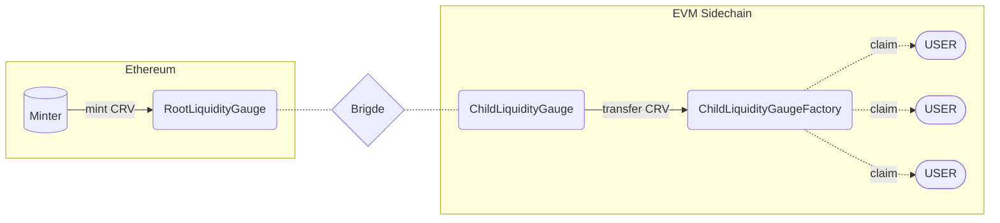

In addition to Ethereum, Curve is active on several sidechains.

The Curve DAO is sufficiently complex that it cannot be easily bridged outside of Ethereum, however aspects of functionality (including CRV emissions) are capable on the various sidechains where pools are active.

!!!deploy "Contract Source & Deployment"
    Source code available on [Github](https://github.com/curvefi/curve-dao-contracts/tree/master/contracts/gauges/sidechain).

!!!warning
    Each sidechain comes with it’s own set of tradeoffs between security, scalability and cost of use. The technical specifications and security considerations of each sidechain is outside the scope of this documentation, however we encourage all users to do their own research prior to transferring funds off of Ethereum and onto a sidechain.

# **Implementation Details**

At a high level, the process of CRV distribution on sidechain gauges is as follows:

1. **On Ethereum, a `RootChainGauge` contract mints allocated CRV depending on the gauge weight each week and bridges them to the `ChildLiquidityGauge`.**

    At the beginning of each epoch week, a call is made to the `transmit_emissions()` function within each gauge. Although this function can be called by anyone, it needs to be done via the RootChainGaugeFactory contract, which acts as a proxy for all deployed RootGauges. This function mints all of the allocated CRV for the previous week, and transfers them over the bridge to the contract deployed at the same address on the related sidechain. Emissions are delayed by one week in order to avoid exceeding the maximum allowable supply of CRV.

2. **On the sidechain, CRV is received into a `ChildLiquidityGauge` contract and upon an interaction with the gauge further transfered to the `ChildLiquidityGaugeFactory`.**

    The bridged CRV tokens are transferred upon a user interaction with the `ChildLiquidityGauge`. This happens whenever a user performs a checkpoint via the `_checkpoint()` function. Due to this mechanism, the gauge needs user interaction before CRV emissions can be streamed/claimed on sidechains. The checkpoint is made when users either deposit or withdraw LP tokens, claim rewards, or call `user_checkpoint()` itself."

3. **Users can claim their emissions directly from the `ChildLiquidityGaugeFactory`.**
    
    CRV emissions can be claimed from the ChildLiquidityGaugeFactory by calling the `mint()` function. It's worth mentioning that this function does not actually mint new CRV tokens, since the tokens have already been minted previously. It is a 'pseudo-mint'.

# **RootChainGauge**
`RootChainGauge` is a simplified liquidity gauge contract on Ethereum used for bridging CRV from Ethereum to a sidechain. This gauge can be, just like any other liquidity gauge, be added to the GaugeController. As soon as the DAO approved, it is eligible to receive CRV emissions.

# **ChildLiquidityGauge**
`ChildLiquidityGauge` is a gauge contract on the sidechain. 

For each `RootChainGauge` deployed on Ethereum, a `ChildLiquidityGauge` is deployed at the same address on the corresponding sidechain. CRV tokens are bridged into this contract. From here, they are further transferred upon a user interaction with the contract to the `ChildLiquidityGaugeFactory`."

# **ChildLiquidityGaugeFactory**
`ChildLiquidityGaugeFactory` is used to claim the CRV emissions from.

# **RootLiquidityGaugeFactory**
`RootLiquidityGaugeFactory` is a factory contract designed to create both Root- and ChildGauges. Allocated emissions are transmitted by calling the `transmit_emissions(_gauge: address)` function and inputting the address of the `RootLiquidityGauge`. It also serves as a proxy for all deployed RootChainGauges.