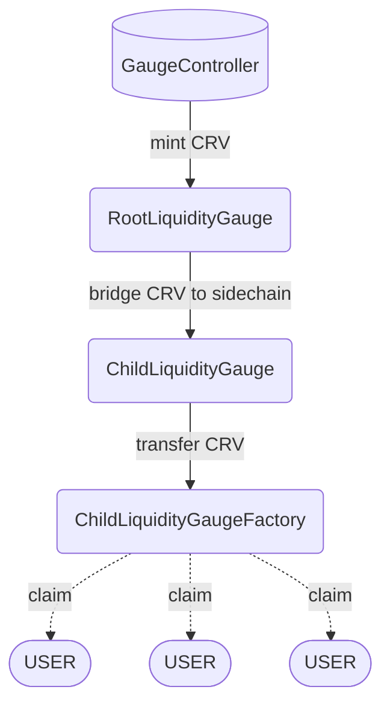

In addition to Ethereum, Curve is active on several sidechains.

The Curve DAO is sufficiently complex that it cannot be easily bridged outside of Ethereum, however aspects of functionality (including CRV emissions) are capable on the various sidechains where pools are active.

Source code for the smart contracts used in sidechain emissions is available on [Github](https://github.com/curvefi/curve-dao-contracts/tree/master/contracts/gauges/sidechain).

!!!warning
    Each sidechain comes with it’s own set of tradeoffs between security, scalability and cost of use. The technical specifications and security considerations of each sidechain is outside the scope of this documentation, however we encourage all users to do their own research prior to transferring funds off of Ethereum and onto a sidechain.

# **Implementation Details**

At a high level, the process of CRV distribution on sidechain gauges is as follows:

1. **On Ethereum, a `RootChainGauge` contract mints allocated CRV depending on the gauge weight each week and bridges them to the `ChildLiquidityGauge`.**

    At the beginning of each epoch week, a call is made to the `transmit_emissions()`function within each gauge. Although this function can be called by anyone, it needs to be done via the RootChainGaugeFactory proxy. This function mints all of the allocated CRV for the previous week, and transfers them over the bridge to the contract deployed at the same address on the related sidechain. Emissions are delayed by one week in order to avoid exceeding the max allowable supply of CRV.

2. **On the sidechain, CRV is received into a `ChildLiquidityGauge` contract and then further transfered to the `ChildLiquidityGaugeFactory`.**

    The bridged CRV tokens are transfered upon a user interaction with the `ChildLiquidityGauge`.This happens whenever a user performs a checkpoint via the `_checkpoint()` function. Due to this mechanism, the gauge needs a user interaction before CRV emissions can be streamed/claimed on sidechains. The relevant function is called whenever a user depoits or withdraws lp tokens or `user_checkpoint()` itself is called.

3. **Users can claim their emissions directly from the `ChildLiquidityGaugeFactory`.**
    
    CRV emissions can be claimed by calling `mint()` on the contract. This step does not literally mint CRV tokens, as they have already been minted before. 

# **RootLiquidityGauge**
`RootChainGauge` is a simplified liquidity gauge contract used for bridging CRV from Ethereum to a sidechain. Each root gauge is added to the gauge controller and receives gauge weight votes to determine emissions for a sidechain pool.

# **ChildLiquidityGauge**
ChildChainStreamer is a simple reward streaming contract. The logic is similar to that of the [Synthetix staking rewards contract](https://github.com/Synthetixio/synthetix/blob/master/contracts/StakingRewards.sol).

For each RootChainGauge deployed on Ethereum, a `ChildChainStreamer` is deployed at the same address on the related sidechain. CRV tokens that are sent over the bridge are transferred into the contract. From there they are transfered unpon a user interaction to the `ChildLiquidityGaugeFactory`.

# **ChildLiquidityGaugeFactory**
`ChildLiquidityGaugeFactory` is used to claim the CRV emissions from.

# **RootLiquidityGaugeFactory**
`RootLiquidityGaugeFactory` is a Factory contract to deploy gauges and create Root- and ChildGauges. Emissions are transmitted by calling `transmit_emissions(_gauge: address)` function by inputting the RootLiquidityGauge address.