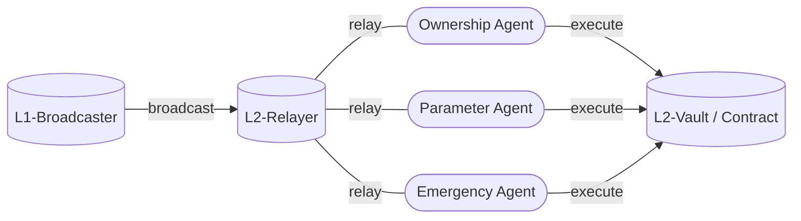

<h1>Curve Cross-Chain Governance</h1>

!!!deploy "Source Code"
    Full list of deployments can be found [here](../../references/deployed-contracts.md#curve-x-gov).  
    Source code for cross-chain governance available on [GitHub](https://github.com/curvefi/curve-xgov).

Curve X-DAO handles cross-chain governance. This system enables the DAO to **perform and execute governance on other networks** such as Arbitrum, Optimism, or Optimistic Rollups. The governance vote is always held on the Ethereum mainnet. After the execution of the successfully passed vote, the outcome is communicated to the L2 via a **Broadcaster contract** and then executed by the corresponding agent through the **L2-Relayer**.

<div align="center">

</div>

The Broadcaster and Relay contracts **share the same contract address across different networks**.

# **L1 Broadcaster**

Once the governance vote is concluded, the **sequence of messages need to be communicated to the Layer 2**. This is done via the Broadcaster's `broadcast` function.

!!!info
    The `broadcast` functions might slightly vary based on the network the message is communicated to.


## **Arbitrum**

### `broadcast`
!!! description "`L1-Relayer.broadcast(_messages: DynArray[Message, MAX_MESSAGES], _gas_limit: uint256, _max_fee_per_gas: uint256):`"

    !!!guard "Guarded Method"
        This function is only callable by one of the agents (`ownership`, `parameter` or `emergency`).

    Function to broadcast a sequence of messages to the L2.

    | Input     | Type       | Description                  |
    | --------- | ---------- | ---------------------------- |
    | `_messages`  |  `DynArray[Message, MAX_MESSAGES]` | sequence of messages to broadcast |
    | `_gas_limit`     |  `uint256` | gas limit for execution on L2 |
    | `_max_fee_per_gas`  |  `uint256` | maximum gas price bid for the execution on L2 |

    ??? quote "Source code"

        ```vyper
        @external
        def broadcast(_messages: DynArray[Message, MAX_MESSAGES], _gas_limit: uint256, _max_fee_per_gas: uint256):
            """
            @notice Broadcast a sequence of messeages.
            @param _messages The sequence of messages to broadcast.
            @param _gas_limit The gas limit for the execution on L2.
            @param _max_fee_per_gas The maximum gas price bid for the execution on L2.
            """
            agent: Agent = self.agent[msg.sender]
            assert agent != empty(Agent)

            # define all variables here before expanding memory enormously
            arb_inbox: address = self.arb_inbox
            arb_refund: address = self.arb_refund
            submission_cost: uint256 = 0

            data: Bytes[MAXSIZE] = _abi_encode(
                agent,
                _messages,
                method_id=method_id("relay(uint256,(address,bytes)[])"),
            )
            submission_cost = IArbInbox(arb_inbox).calculateRetryableSubmissionFee(len(data), block.basefee)

            # NOTE: using `unsafeCreateRetryableTicket` so that refund address is not aliased
            raw_call(
                arb_inbox,
                _abi_encode(
                    self,  # to
                    empty(uint256),  # l2CallValue
                    submission_cost,  # maxSubmissionCost
                    arb_refund,  # excessFeeRefundAddress
                    arb_refund,  # callValueRefundAddress
                    _gas_limit,
                    _max_fee_per_gas,
                    data,
                    method_id=method_id("unsafeCreateRetryableTicket(address,uint256,uint256,address,address,uint256,uint256,bytes)"),
                ),
                value=submission_cost + _gas_limit * _max_fee_per_gas,
            )
        ```

    === "Example"
        ```shell
        >>> L1-Broadcaster.broadcast(todo)
        'todo'
        ```


### `arb_inbox`
!!! description "`L1-Broadcaster.arb_inbox(): view`"

    Getter for the Arbitrum Delayed Inbox contract.

    ??? quote "Source code"

        ```vyper
        arb_inbox: public(address)
        ```

    === "Example"
        ```shell
        >>> L1-Broadcaster.arb_inbox()
        '0x4Dbd4fc535Ac27206064B68FfCf827b0A60BAB3f'
        ```


### `arb_refund`
!!! description "`L1-Broadcaster.arb_refund(): view`"

    Getter for the refund address, which is the L2 Vault.

    ??? quote "Source code"

        ```vyper
        arb_refund: public(address)
        ```

    === "Example"
        ```shell
        >>> L1-Broadcaster.arb_refund()
        '0x25877b9413Cc7832A6d142891b50bd53935feF82'
        ```


### `set_arb_inbox`
!!! description "`L1-Broadcaster.set_arb_inbox(_arb_inbox: address):`"

    !!!guard "Guarded Method"
        This function is only callable by the `ownership admin`.

    Function to set a new Arbitrum Inbox contract.

    Emits: `SetArbInbox`

    | Input     | Type       | Description                  |
    | --------- | ---------- | ---------------------------- |
    | `_arb_inbox` | `address` | new arbitrum inbox address |

    ??? quote "Source code"

        ```vyper
        event SetArbInbox:
            arb_inbox: address

        @external
        def set_arb_inbox(_arb_inbox: address):
            assert msg.sender == self.admins.ownership

            self.arb_inbox = _arb_inbox
            log SetArbInbox(_arb_inbox)
        ```

    === "Example"
        ```shell
        >>> L1-Broadcaster.set_arb_inbox()
        '0x25877b9413Cc7832A6d142891b50bd53935feF82'
        ```


### `set_arb_refund`
!!! description "`L1-Broadcaster.set_arb_refund(_arb_refund: address):`"

    !!!guard "Guarded Method"
        This function is only callable by the `ownership admin`.

    Function to set a new refund address.

    Emits: `SetArbRefund`

    | Input     | Type       | Description                  |
    | --------- | ---------- | ---------------------------- |
    | `set_arb_refund` | `address` | new refund address |

    ??? quote "Source code"

        ```vyper
        event SetArbRefund:
            arb_refund: address

        @external
        def set_arb_refund(_arb_refund: address):
            assert msg.sender == self.admins.ownership

            self.arb_refund = _arb_refund
            log SetArbRefund(_arb_refund)
        ```

    === "Example"
        ```shell
        >>> L1-Broadcaster.set_arb_refund()
        '0x25877b9413Cc7832A6d142891b50bd53935feF82'
        ```

    !!!note
        The current refund address is the L2-Vault.


## **Optimism and Optimistic Rollups**

The [**Mantle**](https://www.mantle.xyz/) and [**Base**](https://base.org/) Broadcaster contract have the identical `broadcast` function as Optimism, since they are Optimistic Rollups.


For a better understanding on how data is sent between L1 and L2 through Optimism read here: https://docs.optimism.io/builders/dapp-developers/bridging/messaging.


### `broadcast`
!!! description "`L1-Broadcaster.broadcast(_messages: DynArray[Message, MAX_MESSAGES], _gas_limit: uint32 = 0):`"

    !!!guard "Guarded Method"
        This function is only callable by one of the agents (`ownership`, `parameter` or `emergency`).

    Function to broadcast a sequence of messages.

    | Input     | Type       | Description                  |
    | --------- | ---------- | ---------------------------- |
    | `_messages`  |  `DynArray[Message, MAX_MESSAGES]` | sequence of messages to broadcast |
    | `_gas_limit`     |  `uint256` | gas limit for execution on L2 |

    ??? quote "Source code"

        ```vyper
        @external
        def broadcast(_messages: DynArray[Message, MAX_MESSAGES], _gas_limit: uint32 = 0):
            """
            @notice Broadcast a sequence of messeages.
            @param _messages The sequence of messages to broadcast.
            @param _gas_limit The L2 gas limit required to execute the sequence of messages.
            """
            agent: Agent = self.agent[msg.sender]
            assert agent != empty(Agent)

            # https://community.optimism.io/docs/developers/bridge/messaging/#for-l1-%E2%87%92-l2-transactions
            gas_limit: uint32 = _gas_limit
            if gas_limit == 0:
                gas_limit = OVMChain(self.ovm_chain).enqueueL2GasPrepaid()

            raw_call(
                self.ovm_messenger,
                _abi_encode(  # sendMessage(address,bytes,uint32)
                    self,
                    _abi_encode(  # relay(uint256,(address,bytes)[])
                        agent,
                        _messages,
                        method_id=method_id("relay(uint256,(address,bytes)[])"),
                    ),
                    gas_limit,
                    method_id=method_id("sendMessage(address,bytes,uint32)"),
                ),
            )
        ```

    === "Example"
        ```shell
        >>> L1-Broadcaster.broadcast(todo)
        'todo'
        ```


### `ovm_chain`
!!! description "`L1-Broadcaster.ovm_chain(): view`"

    Getter for the Optimism Canonical Transaction Chain.

    ??? quote "Source code"

        ```vyper
        ovm_chain: public(address)  # CanonicalTransactionChain
        ```

    === "Example"
        ```shell
        >>> L1-Broadcaster.ovm_chain()
        '0x5E4e65926BA27467555EB562121fac00D24E9dD2'
        ```


### `ovm_messenger`
!!! description "`L1-Broadcaster.ovm_messenger(): view`"

    Getter for the Optimism Proxy OVM L1 Cross Domain Messenger.

    ??? quote "Source code"

        ```vyper
        ovm_messenger: public(address)  # CrossDomainMessenger
        ```

    === "Example"
        ```shell
        >>> L1-Broadcaster.ovm_messenger()
        '0x25ace71c97B33Cc4729CF772ae268934F7ab5fA1'
        ```


### `set_ovm_chain`
!!! description "`L1-Broadcaster.set_ovm_chain(_ovm_chain: address):`"

    !!!guard "Guarded Method"
        This function is only callable by the `ownership admin`.

    Function to set a new OVM Canonical Transaction Chain contract.

    Emits: `SetOVMChain`

    | Input     | Type       | Description                  |
    | --------- | ---------- | ---------------------------- |
    | `_ovm_chain`  |  `address` | new ovm chain address |

    ??? quote "Source code"

        ```vyper
        event SetOVMChain:
            ovm_chain: address

        @external
        def set_ovm_chain(_ovm_chain: address):
            """
            @notice Set the OVM Canonical Transaction Chain storage variable.
            """
            assert msg.sender == self.admins.ownership

            self.ovm_chain = _ovm_chain
            log SetOVMChain(_ovm_chain)
        ```

    === "Example"
        ```shell
        >>> L1-Broadcaster.set_ovm_chain(todo)
        'todo'
        ```


### `set_ovm_messenger`
!!! description "`L1-Broadcaster.set_ovm_messenger):`"

    !!!guard "Guarded Method"
        This function is only callable by the `ownership admin`.

    Function to set a new OVM Cross Domain messenger contract.

    Emits: `SetOVMMessenger`

    | Input     | Type       | Description                  |
    | --------- | ---------- | ---------------------------- |
    | `_ovm_messenger`  |  `address` | new ovm messenger address |

    ??? quote "Source code"

        ```vyper
        event SetOVMMessenger:
            ovm_messenger: address

        @external
        def set_ovm_messenger(_ovm_messenger: address):
            """
            @notice Set the OVM Cross Domain Messenger storage variable.
            """
            assert msg.sender == self.admins.ownership

            self.ovm_messenger = _ovm_messenger
            log SetOVMMessenger(_ovm_messenger)
        ```

    === "Example"
        ```shell
        >>> L1-Broadcaster.set_ovm_messenger(todo)
        'todo'
        ```


## **Contract Admins**

Contract admins of the L1 Broadcaster can be changed by the `ownership agent`. This process includes two steps: first, committing the new ownership address and then applying it.


### `admins`
!!! description "`L1-Broadcaster.admins() -> tuple: view`"

    Getter for the current admins.

    Returns: admins (`address`).

    ??? quote "Source code"

        ```vyper
        admins: public(AdminSet)
        ```

    === "Example"
        ```shell
        >>> L1-Broadcaster.admins()
        '0x40907540d8a6C65c637785e8f8B742ae6b0b9968', '0x4EEb3bA4f221cA16ed4A0cC7254E2E32DF948c5f', '0x467947EE34aF926cF1DCac093870f613C96B1E0c'
        ```

    !!!note
        The admin contracts are the `ownership`, `parameter` and `emergency` agent.


### `future_admins`
!!! description "`L1-Broadcaster.future_admins() -> tuple: view`"

    Getter for the future admins.

    Returns: future admins (`address`).

    ??? quote "Source code"

        ```vyper
        future_admins: public(AdminSet)
        ```

    === "Example"
        ```shell
        >>> L1-Broadcaster.future_admins()
        '0x0000000000000000000000000000000000000000','0x0000000000000000000000000000000000000000', '0x0000000000000000000000000000000000000000'
        ```


### `commit_admins`
!!! description "`L1-Broadcaster.commit_admins(_future_admins: AdminSet):`"

    !!!guard "Guarded Method"
        This function is only callable by the `ownership admin`.

    Function to commit new admin contracts.

    Emits: `CommitAdmins`

    | Input           | Type       | Description                  |
    | --------------- | ---------- | ---------------------------- |
    | `_future_admins`| `AdminSet` | New future admin contracts   |

    ??? quote "Source code"

        ```vyper
        event CommitAdmins:
            future_admins: AdminSet

        @external
        def commit_admins(_future_admins: AdminSet):
            """
            @notice Commit an admin set to use in the future.
            """
            assert msg.sender == self.admins.ownership

            assert _future_admins.ownership != _future_admins.parameter  # a != b
            assert _future_admins.ownership != _future_admins.emergency  # a != c
            assert _future_admins.parameter != _future_admins.emergency  # b != c

            self.future_admins = _future_admins
            log CommitAdmins(_future_admins)
        ```

    === "Example"
        ```shell
        >>> L1-Broadcaster.commit_admins(todo)
        'todo'
        ```


### `apply_admins`
!!! description "`L1-Broadcaster.apply_admins():`"

    !!!guard "Guarded Method"
        This function is only callable by the `ownership admin`.

    Function to apply the new admins.

    Emits: `ApplyAdmins`

    ??? quote "Source code"

        ```vyper
        event ApplyAdmins:
            admins: AdminSet

        @external
        def apply_admins():
            """
            @notice Apply the future admin set.
            """
            admins: AdminSet = self.admins
            assert msg.sender == admins.ownership

            # reset old admins
            self.agent[admins.ownership] = empty(Agent)
            self.agent[admins.parameter] = empty(Agent)
            self.agent[admins.emergency] = empty(Agent)

            # set new admins
            future_admins: AdminSet = self.future_admins
            self.agent[future_admins.ownership] = Agent.OWNERSHIP
            self.agent[future_admins.parameter] = Agent.PARAMETER
            self.agent[future_admins.emergency] = Agent.EMERGENCY

            self.admins = future_admins
            log ApplyAdmins(future_admins)
        ```

    === "Example"
        ```shell
        >>> L1-Broadcaster.apply_admins(todo)
        'todo'
        ```


# **L2 Relayer**

The L2 Relayer contract acts as a middleman, receiving messages and relaying them to the specific agent (`ownership`, `parameter`, or `emergency`).

The Relayer receives the broadcasted message and, using the `relay` function, forwards this message to the appropriate agent. The agents defined in the L2 Relayer contract (`OWNERSHIP_AGENT`, `PARAMETER_AGENT`, `EMERGENCY_AGENT`) are responsible for executing the instructions contained in the message.

!!!warning
    A Relayer's agent addresses cannot be altered.


## **Arbitrum**

### `relay`
!!! description "`L2-Relayer.apply_admins():`"

    Function to receive messages, relay them to the appropriate agent, and execute the messages by calling the `execute` function on the agent's contract.

    | Input       | Type                                 | Description                      |
    | ----------- | ------------------------------------ | -------------------------------- |
    | `_agents`   | `Agent`                              | Agent to relay messages to       |
    | `_messages` | `DynArray[Message, MAX_MESSAGES]`    | Sequence of messages to relay    |

    ??? quote "Source code"

        === "Relayer"

            ```vyper
            @external
            def relay(_agent: Agent, _messages: DynArray[Message, MAX_MESSAGES]):
                """
                @notice Receive messages for an agent and relay them.
                @param _agent The agent to relay messages to.
                @param _messages The sequence of messages to relay.
                """
                assert IArbSys(ARBSYS).wasMyCallersAddressAliased()
                assert IArbSys(ARBSYS).myCallersAddressWithoutAliasing() == self

                IAgent(self.agent[_agent]).execute(_messages)
            ```

        === "Agent"

            ```vyper
            @external
            def execute(_messages: DynArray[Message, MAX_MESSAGES]):
                """
                @notice Execute a sequence of messages.
                @param _messages An array of messages to be executed.
                """
                assert msg.sender == RELAYER

                for message in _messages:
                    raw_call(message.target, message.data)
            ```

    === "Example"
        ```shell
        >>> L2-Relayer.relay(todo)
        'todo'
        ```


### `ARBSYS`
!!! description "`L2-Relayer.ARBSYS(): view`"

    Getter for the Arbitrum SYS contract.

    ??? quote "Source code"

        ```vyper
        ARBSYS: public(immutable(address))
        ```

    === "Example"
        ```shell
        >>> L2-Relayer.ARBSYS()
        '0x0000000000000000000000000000000000000064'
        ```


## **Optimism and Optimistic Rollups**

Mantle and Base Relayer have the identical `relay` function as the one from Optimism, as they are Optimistic Rollups. Agents and Messengers obviously differ on each chain.

### `relay`
!!! description "`L2-Relayer.apply_admins():`"

    !!!guard "Guarded Method"
        This function is only callable by the `MESSENGER`.

    Function to receive messages, relay them to the appropriate agent, and execute the messages by calling the `execute` function on the agent's contract.

    | Input       | Type                               | Description                    |
    | ----------- | ---------------------------------- | ------------------------------ |
    | `_agents`   | `Agent`                            | Agent to relay messages to     |
    | `_messages` | `DynArray[Message, MAX_MESSAGES]`  | Sequence of messages to relay  |

    ??? quote "Source code"

        === "Relayer"

            ```vyper
            @external
            def relay(_agent: Agent, _messages: DynArray[Message, MAX_MESSAGES]):
                """
                @notice Receive messages for an agent and relay them.
                @param _agent The agent to relay messages to.
                @param _messages The sequence of messages to relay.
                """
                assert msg.sender == MESSENGER
                assert IMessenger(MESSENGER).xDomainMessageSender() == self

                IAgent(self.agent[_agent]).execute(_messages)
            ```

        === "Agent"

            ```vyper
            @external
            def execute(_messages: DynArray[Message, MAX_MESSAGES]):
                """
                @notice Execute a sequence of messages.
                @param _messages An array of messages to be executed.
                """
                assert msg.sender == RELAYER

                for message in _messages:
                    raw_call(message.target, message.data)
            ```

    === "Example"
        ```shell
        >>> L2-Relayer.relay(todo)
        'todo'
        ```


### `MESSENGER`
!!! description "`L2-Relayer.MESSENGER(): view`"

    Getter for the Optimism Messenger contract.

    ??? quote "Source code"

        ```vyper
        MESSENGER: public(immutable(address))
        ```

    === "Example"
        ```shell
        >>> L2-Relayer.MESSENGER()
        '0x4200000000000000000000000000000000000007'
        ```