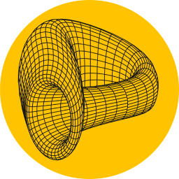

---
search:
  exclude: true
---

<h1></h1>

# **crvUSD Core Contracts**

For testing in production purposes, several contract deployments have taken place. Please ensure that you are using the correct and latest version. The latest deployment logs can be found [here](https://github.com/curvefi/curve-stablecoin/blob/master/deployment-logs/mainnet.log).

!!!github "GitHub"
    Source code for all `curve-stablecoin` contracts is available on [:material-github: GitHub](https://github.com/curvefi/curve-stablecoin).

!!!warning "Implementations"
    **Implementation contracts are upgradable.** They can be either replaced or additional implementation contracts can be set. Therefore, please **always make sure to check the most recent ones**.

| Contract Type           | Contract Address                                                         |
| :---------------------: | :----------------------------------------------------------------------: |
| :logos-crvusd: `crvUSD` | [0xf939E0A03FB07F59A73314E73794Be0E57ac1b4E](https://etherscan.io/address/0xf939E0A03FB07F59A73314E73794Be0E57ac1b4E) |
| `Controller Factory`               | [0xC9332fdCB1C491Dcc683bAe86Fe3cb70360738BC](https://etherscan.io/address/0xC9332fdCB1C491Dcc683bAe86Fe3cb70360738BC) |
| `Controller Implementation` | [0x6340678b2bab22a37d781Cd8da958a3cD1d97cdD](https://etherscan.io/address/0x6340678b2bab22a37d781Cd8da958a3cD1d97cdD) |
| `AMM Implementation`    | [0x3da7fF6C15C0c97D9C2dF4AF82a9910384b372FD](https://etherscan.io/address/0x3da7fF6C15C0c97D9C2dF4AF82a9910384b372FD) |
| `PriceAggregator`       | [0xe5Afcf332a5457E8FafCD668BcE3dF953762Dfe7](https://etherscan.io/address/0xe5Afcf332a5457E8FafCD668BcE3dF953762Dfe7) |
| `PriceAggregatorV3`     | [0x18672b1b0c623a30089A280Ed9256379fb0E4E62](https://etherscan.io/address/0x18672b1b0c623a30089A280Ed9256379fb0E4E62) |
| `PriceAggregator (Arbitrum)` | [0x44a4FdFb626Ce98e36396d491833606309520330](https://arbiscan.io/address/0x44a4FdFb626Ce98e36396d491833606309520330) |
| `FlashLender` | [0xa7a4bb50af91f90b6feb3388e7f8286af45b299b](https://etherscan.io/address/0xa7a4bb50af91f90b6feb3388e7f8286af45b299b) |
| `LeverageZap1inch` | [0x3294514B78Df4Bb90132567fcf8E5e99f390B687](https://etherscan.io/address/0x3294514B78Df4Bb90132567fcf8E5e99f390B687) |
| `LlamaLendOdosLeverageZap` | [0xc5898606bdb494a994578453b92e7910a90aa873](https://etherscan.io/address/0xc5898606bdb494a994578453b92e7910a90aa873) |

---

# **PegKeepers**

| Contract Type           | Contract Address                                                         |
| :---------------------: | :----------------------------------------------------------------------: |
| `PegKeeperV1 (USDC)`      | [0xaA346781dDD7009caa644A4980f044C50cD2ae22](https://etherscan.io/address/0xaA346781dDD7009caa644A4980f044C50cD2ae22#code) |
| `PegKeeperV1 (USDT)`      | [0xE7cd2b4EB1d98CD6a4A48B6071D46401Ac7DC5C8](https://etherscan.io/address/0xE7cd2b4EB1d98CD6a4A48B6071D46401Ac7DC5C8#code) |
| `PegKeeperV1 (USDP)`      | [0x6B765d07cf966c745B340AdCa67749fE75B5c345](https://etherscan.io/address/0x6B765d07cf966c745B340AdCa67749fE75B5c345#code) |
| `PegKeeperV1 (TUSD)`      | [0x1ef89Ed0eDd93D1EC09E4c07373f69C49f4dcCae](https://etherscan.io/address/0x1ef89Ed0eDd93D1EC09E4c07373f69C49f4dcCae#code) |
| `PegKeeperRegulator`      | [0x36a04CAffc681fa179558B2Aaba30395CDdd855f](https://etherscan.io/address/0x36a04CAffc681fa179558B2Aaba30395CDdd855f#code) |
| `PegKeeperV2 (USDC)`      | [0x9201da0D97CaAAff53f01B2fB56767C7072dE340](https://etherscan.io/address/0x9201da0D97CaAAff53f01B2fB56767C7072dE340#code) |
| `PegKeeperV2 (USDT)`      | [0xFb726F57d251aB5C731E5C64eD4F5F94351eF9F3](https://etherscan.io/address/0xFb726F57d251aB5C731E5C64eD4F5F94351eF9F3#code) |
| `PegKeeperV2 (pyUSD)`     | [0x3fA20eAa107DE08B38a8734063D605d5842fe09C](https://etherscan.io/address/0x3fA20eAa107DE08B38a8734063D605d5842fe09C#code) |
| `PegKeeperV2 (TUSD)`      | [0x0a05FF644878B908eF8EB29542aa88C07D9797D3](https://etherscan.io/address/0x0a05FF644878B908eF8EB29542aa88C07D9797D3#code) |
| `PegKeeperV2 (USDM)`      | [0x503E1Bf274e7a6c64152395aE8eB57ec391F91F8](https://etherscan.io/address/0x503E1Bf274e7a6c64152395aE8eB57ec391F91F8#code) |

---

# **crvUSD CrossChain**

*Despite being launched on Ethereum, crvUSD can be bridged to various chains:*

| Chain                         | crvUSD Token Address | 
| ----------------------------- | :------------------: | 
| :logos-ethereum: `Ethereum` | [0xf939E0A03FB07F59A73314E73794Be0E57ac1b4E](https://etherscan.io/token/0xf939E0A03FB07F59A73314E73794Be0E57ac1b4E) | 
| :logos-arbitrum: `Arbitrum` | [0x498Bf2B1e120FeD3ad3D42EA2165E9b73f99C1e5](https://arbiscan.io/address/0x498Bf2B1e120FeD3ad3D42EA2165E9b73f99C1e5) |
| :logos-optimism: `Optimism` | [0xc52d7f23a2e460248db6ee192cb23dd12bddcbf6](https://optimistic.etherscan.io/address/0xc52d7f23a2e460248db6ee192cb23dd12bddcbf6) |
| :logos-base: `Base`         | [0x417Ac0e078398C154EdFadD9Ef675d30Be60Af93](https://basescan.org/address/0x417Ac0e078398C154EdFadD9Ef675d30Be60Af93) | 
| :logos-gnosis: `Gnosis`     | [0xaBEf652195F98A91E490f047A5006B71c85f058d](https://gnosisscan.io/address/0xaBEf652195F98A91E490f047A5006B71c85f058d) |
| :logos-polygon: `Polygon`     | [0xc4Ce1D6F5D98D65eE25Cf85e9F2E9DcFEe6Cb5d6](https://polygonscan.com/address/0xc4Ce1D6F5D98D65eE25Cf85e9F2E9DcFEe6Cb5d6) | 
| :logos-xlayer: `X-Layer`     | [0xda8f4eb4503acf5dec5420523637bb5b33a846f6](https://www.oklink.com/xlayer/address/0xda8f4eb4503acf5dec5420523637bb5b33a846f6) |
| :logos-fraxtal: `Fraxtal`     | [0xB102f7Efa0d5dE071A8D37B3548e1C7CB148Caf3](https://fraxscan.com/address/0xB102f7Efa0d5dE071A8D37B3548e1C7CB148Caf3) | 
| :logos-bsc: `BinanceSmartChain`     | [0xe2fb3F127f5450DeE44afe054385d74C392BdeF4](https://bscscan.com/address/0xe2fb3F127f5450DeE44afe054385d74C392BdeF4) |
| :logos-mantle: `Mantle`     | [0x0994206dfe8de6ec6920ff4d779b0d950605fb53](https://mantlescan.xyz/address/0x0994206dfe8de6ec6920ff4d779b0d950605fb53) | 
| :logos-zksync: `zk-Sync`     | [0x43cd37cc4b9ec54833c8ac362dd55e58bfd62b86](https://era.zksync.network/address/0x43cd37cc4b9ec54833c8ac362dd55e58bfd62b86) |
| :logos-sonic: `Sonic` | [tbd](https://sonicscan.org/address/) |
| :logos-taiko: `Taiko` | [0xc8F4518ed4bAB9a972808a493107926cE8237068](https://taikoscan.io/address/0xc8F4518ed4bAB9a972808a493107926cE8237068) |
| :logos-corn: `Corn` | [0xEAEdD2B1b3F0fEC6388A4d6b2fE500B59Fd9f755](https://cornscan.io/address/0xEAEdD2B1b3F0fEC6388A4d6b2fE500B59Fd9f755) |
| :logos-ink: `Ink` | [0x39fec550CC6DDCEd810eCCfA9B2931b4B5f2344D](https://explorer.inkonchain.com/address/0x39fec550CC6DDCEd810eCCfA9B2931b4B5f2344D) |

---

# **Markets**

**:logos-sfrxeth: sfrxETH**

| Contract Type | Contract Address |
| :---------: | :----------------: | 
|`AMM`|[0x136e783846ef68c8bd00a3369f787df8d683a696](https://etherscan.io/address/0x136e783846ef68c8bd00a3369f787df8d683a696#code)|
|`Controller`|[0x8472a9a7632b173c8cf3a86d3afec50c35548e76](https://etherscan.io/address/0x8472a9a7632b173c8cf3a86d3afec50c35548e76#code)|
|`MonetaryPolicy`|[0xd8f49c747aed8d394f6f1841546e2b83e09a357d](https://etherscan.io/address/0xd8f49c747aed8d394f6f1841546e2b83e09a357d#code)|
|`CollateralToken (sfrxETH)`|[0xac3e018457b222d93114458476f3e3416abbe38f](https://etherscan.io/address/0xac3e018457b222d93114458476f3e3416abbe38f)|
|`PriceOracle`|[0x19F5B81e5325F882C9853B5585f74f751DE3896d](https://etherscan.io/address/0x19F5B81e5325F882C9853B5585f74f751DE3896d#code)|
|`Leverage Zap`|[0xb556FA4C4752321B3154f08DfBDFCF34847f2eac](https://etherscan.io/address/0xb556FA4C4752321B3154f08DfBDFCF34847f2eac#code)|

**:logos-wsteth: wstETH**

| Contract Type | Contract Address |
| :---------: | :----------------: | 
|`AMM`|[0x37417b2238aa52d0dd2d6252d989e728e8f706e4](https://etherscan.io/address/0x37417b2238aa52d0dd2d6252d989e728e8f706e4#code)|
|`Controller`|[0x100daa78fc509db39ef7d04de0c1abd299f4c6ce](https://etherscan.io/address/0x100daa78fc509db39ef7d04de0c1abd299f4c6ce#code)|
|`MonetaryPolicy`|[0xD8F49c747AED8D394F6f1841546E2B83E09A357D](https://etherscan.io/address/0xD8F49c747AED8D394F6f1841546E2B83E09A357D#code)|
|`CollateralToken (wstETH)`|[0x7f39c581f595b53c5cb19bd0b3f8da6c935e2ca0](https://etherscan.io/address/0x7f39c581f595b53c5cb19bd0b3f8da6c935e2ca0)|
|`PriceOracle`|[0xc1793A29609ffFF81f10139fa0A7A444c9e106Ad](https://etherscan.io/address/0xc1793A29609ffFF81f10139fa0A7A444c9e106Ad#code) |
|`Leverage Zap`|[0x293436d4e4a15FBc6cCC400c14a01735E5FC74fd](https://etherscan.io/address/0x293436d4e4a15FBc6cCC400c14a01735E5FC74fd#code)|

**:logos-wbtc: wBTC**

| Contract Type | Contract Address |
| :---------: | :----------------: | 
|`AMM`|[0xe0438eb3703bf871e31ce639bd351109c88666ea](https://etherscan.io/address/0xe0438eb3703bf871e31ce639bd351109c88666ea#code)|
|`Controller`|[0x4e59541306910ad6dc1dac0ac9dfb29bd9f15c67](https://etherscan.io/address/0x4e59541306910ad6dc1dac0ac9dfb29bd9f15c67#code)|
|`MonetaryPolicy`|[0x8c5a7f011f733fbb0a6c969c058716d5ce9bc933](https://etherscan.io/address/0x8c5a7f011f733fbb0a6c969c058716d5ce9bc933#code)|
|`CollateralToken (wBTC)`|[0x2260fac5e5542a773aa44fbcfedf7c193bc2c599](https://etherscan.io/address/0x2260fac5e5542a773aa44fbcfedf7c193bc2c599)|
|`PriceOracle`|[0xBe83fD842DB4937C0C3d15B2aBA6AF7E854f8dcb](https://etherscan.io/address/0xBe83fD842DB4937C0C3d15B2aBA6AF7E854f8dcb#code)|
|`Leverage Zap`|[0xA2518b71ee64E910741f5Cf480b19E8e402de4d7](https://etherscan.io/address/0xA2518b71ee64E910741f5Cf480b19E8e402de4d7#code)|

**:logos-eth: ETH**

| Contract Type | Contract Address |
| :---------: | :----------------: | 
|`AMM`|[0x1681195c176239ac5e72d9aebacf5b2492e0c4ee](https://etherscan.io/address/0x1681195c176239ac5e72d9aebacf5b2492e0c4ee#code)|
|`Controller`|[0xa920de414ea4ab66b97da1bfe9e6eca7d4219635](https://etherscan.io/address/0xa920de414ea4ab66b97da1bfe9e6eca7d4219635#code)|
|`MonetaryPolicy`|[0x8c5a7f011f733fbb0a6c969c058716d5ce9bc933](https://etherscan.io/address/0x8c5a7f011f733fbb0a6c969c058716d5ce9bc933#code)|
|`CollateralToken (wETH)`|[0xC02aaA39b223FE8D0A0e5C4F27eAD9083C756Cc2](https://etherscan.io/address/0xC02aaA39b223FE8D0A0e5C4F27eAD9083C756Cc2)|
|`PriceOracle`|[0x966cBDeceFB60A289b0460F7638f4A75F432cA06](https://etherscan.io/address/0x966cBDeceFB60A289b0460F7638f4A75F432cA06#code)|
|`Leverage Zap`|[0xd3e576B5DcDe3580420A5Ef78F3639BA9cd1B967](https://etherscan.io/address/0xd3e576B5DcDe3580420A5Ef78F3639BA9cd1B967#code)|

**:logos-sfrxeth: sfrxeth v2**

| Contract Type | Contract Address |
| :---------: | :----------------: | 
|`AMM`|[0xfa96ad0a9e64261db86950e2da362f5572c5c6fd](https://etherscan.io/address/0xfa96ad0a9e64261db86950e2da362f5572c5c6fd#code)|
|`Controller`|[0xec0820efafc41d8943ee8de495fc9ba8495b15cf](https://etherscan.io/address/0xec0820efafc41d8943ee8de495fc9ba8495b15cf#code)|
|`MonetaryPolicy`|[0xd8f49c747aed8d394f6f1841546e2b83e09a357d](https://etherscan.io/address/0xd8f49c747aed8d394f6f1841546e2b83e09a357d#code)|
|`CollateralToken (sfrxETH)`|[0xac3e018457b222d93114458476f3e3416abbe38f](https://etherscan.io/address/0xac3e018457b222d93114458476f3e3416abbe38f)|
|`PriceOracle`|[0x28d7880B5b67fB4a0B1c6Ed6c33c33f365113C29](https://etherscan.io/address/0x28d7880B5b67fB4a0B1c6Ed6c33c33f365113C29#code)|
|`Leverage Zap`|[0x43eCFfe6c6C1b9F24AeB5C180E659c2a6FCe11Bc](https://etherscan.io/address/0x43eCFfe6c6C1b9F24AeB5C180E659c2a6FCe11Bc#code)|

**tBTC**

| Contract Type | Contract Address |
| :---------: | :----------------: | 
|`AMM`|[0xf9bd9da2427a50908c4c6d1599d8e62837c2bcb0](https://etherscan.io/address/0xf9bd9da2427a50908c4c6d1599d8e62837c2bcb0#code)|
|`Controller`|[0x1c91da0223c763d2e0173243eadaa0a2ea47e704](https://etherscan.io/address/0x1c91da0223c763d2e0173243eadaa0a2ea47e704#code)|
|`MonetaryPolicy`|[0x8c5a7f011f733fbb0a6c969c058716d5ce9bc933](https://etherscan.io/address/0x8c5a7f011f733fbb0a6c969c058716d5ce9bc933#code)|
|`CollateralToken (tBTC)`|[0x18084fba666a33d37592fa2633fd49a74dd93a88](https://etherscan.io/address/0x18084fba666a33d37592fa2633fd49a74dd93a88)|
|`PriceOracle`|[0xbeF434E2aCF0FBaD1f0579d2376fED0d1CfC4217](https://etherscan.io/address/0xbeF434E2aCF0FBaD1f0579d2376fED0d1CfC4217#code)|
|`Leverage Zap`|[0xD79964C70Cb06224FdA4c48387B53E9819bcB71c](https://etherscan.io/address/0xD79964C70Cb06224FdA4c48387B53E9819bcB71c#code)|

---

# { width="20" height="20" .middle } **Savings crvUSD**

| Contract Type           | Contract Address |
| :---------------------: | :----------------: |
| `scrvUSD / Vault` | [0x0655977FEb2f289A4aB78af67BAB0d17aAb84367](https://etherscan.io/address/0x0655977FEb2f289A4aB78af67BAB0d17aAb84367) |
| `RewardsHandler` | [0xe8d1e2531761406af1615a6764b0d5ff52736f56](https://etherscan.io/address/0xe8d1e2531761406af1615a6764b0d5ff52736f56) |
| `StablecoinLens` | [0xe24e2db9f6bb40bbe7c1c025bc87104f5401ecd7](https://etherscan.io/address/0xe24e2db9f6bb40bbe7c1c025bc87104f5401ecd7) |

*Additionally, the `scrvUSD` was bridged using the [x-dao](crosschain.md#curve-x-dao) system to the following chains:*

| Chain | crvUSD Token Address |
| ----- | :-----------------: |
| :logos-optimism: `Optimism` | [0x289f635106d5b822a505b39ac237a0ae9189335b](https://optimistic.etherscan.io/address/0x289f635106d5b822a505b39ac237a0ae9189335b) |
| :logos-base: `Base` | [0x646a737b9b6024e49f5908762b3ff73e65b5160c](https://basescan.org/address/0x646a737b9b6024e49f5908762b3ff73e65b5160c) |
| :logos-fraxtal: `Fraxtal` | [0xaB94C721040b33aA8b0b4D159Da9878e2a836Ed0](https://fraxscan.com/address/0xaB94C721040b33aA8b0b4D159Da9878e2a836Ed0) |
| :logos-avalanche: `Avalanche` | [0xA3ea433509F7941df3e33857D9c9f212Ad4A4e64](https://snowscan.xyz/address/0xA3ea433509F7941df3e33857D9c9f212Ad4A4e64#code) |
| :logos-bsc: `BinanceSmartChain` | [0xAE0666C978500f2C05784242B79B08C478Dd999c](https://bscscan.com/address/0x0094Ad026643994c8fB2136ec912D508B15fe0E5#code) |
| :logos-fantom: `Fantom` | [0x5191946500e75f0A74476F146dF7d386e52961d9](https://ftmscan.com/address/0x5191946500e75f0A74476F146dF7d386e52961d9#code) |
