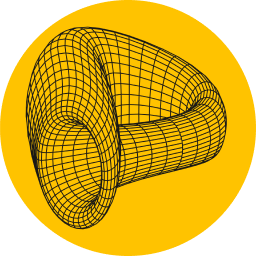

---
hide:
  - toc
---

<h1>Documentation Overview</h1>

Curve is a **decentralized exchange (DEX) and automated market maker (AMM) on Ethereum and EVM-compatible sidechains/L2s**, designed for the **efficient trading of stablecoins and volatile assets**.

Additionally, Curve has launched its own stablecoin, **crvUSD**, and **Curve Lending**, both featuring a **unique liquidation mechanism** known as **LLAMMA**.

This documentation outlines the technical implementation of the core Curve protocol and related smart contracts. It may be useful for contributors to the Curve codebase, third-party integrators, or technically proficient users of the protocol.

!!!tip "Resources for Non-Technical Users"
    Non-technical users might prefer the **[Resources](https://resources.curve.fi/)** site as it offers more general insights and information.

---------

-   **:logos-crv: Curve DAO** 

    ---

    Core smart contracts include the Curve DAO Token, governance infrastructure governed by vote-escrowed CRV, mechanisms for fee collection and distribution, gauges, and many other components.

    [**:octicons-arrow-right-24: Getting started**](./curve_dao/crv-token.md)

-   **:logos-crvusd: Curve Stablecoin (crvUSD)**

    ---

    Over-collateralized USD stablecoin powered by a unique liquidating algorithm ([LLAMMA](./crvUSD/amm.md)), which progressively converts the put-up collateral token into crvUSD when the loan health decreases to certain thresholds.

    [**:octicons-arrow-right-24: Getting started**](./crvUSD/overview.md)

-   { width="21" height="21" .middle } **Savings crvUSD (scrvUSD)**

    ---

    Savings crvUSD, in short scrvUSD, is a savings version of crvUSD.

    [**:octicons-arrow-right-24: Getting started**](./scrvusd/overview.md)

-   **:material-bank: Curve Lending**

    ---

    Permissionless lending markets to borrow or lend crvUSD against any asset with a proper oracle. Additionally, the markets are powered by Curve's unique liquidation algorithm, [LLAMMA](./crvUSD/amm.md).

    [**:octicons-arrow-right-24: Getting started**](./lending/overview.md)

-   :material-scale-balance:{ .lg .middle } **StableSwap Exchange**

    ---

    Implementation of the Stableswap algorithm, as detailed in the [whitepaper](./assets/pdf/whitepaper_stableswap.pdf), into on-chain exchange contracts to facilitate trades between multiple relatively stable assets in comparison to each other (e.g., USDC<>USDT).

    [**:octicons-arrow-right-24: Getting started**](./stableswap-exchange/overview.md)

-   :material-scale-unbalanced:{ .lg .middle } **CryptoSwap Exchange**

    ---

    Implementation of the Cryptoswap algorithm, as detailed in the [whitepaper](./assets/pdf/whitepaper_cryptoswap.pdf), into on-chain exchange contracts to facilitate trades between multiple volatile assets (e.g. CRV<>ETH).

    [**:octicons-arrow-right-24: Getting started**](./cryptoswap-exchange/overview.md)

-   :material-database-cog-outline:{ .lg .middle } **Registry**

    ---

    A standardized API and on-chain Pool Registry Aggregator offering an on-chain API for various properties of Curve pools, by consolidating multiple pool registries into a single contract.

    [**:octicons-arrow-right-24: Getting started**](./registry/overview.md)

-   :octicons-gear-16:{ .lg .middle } **Pool Factory**

    ---

    Permissionless deployment of liquidity pools, including stableswap and cryptoswap pools, along with liquidity gauges.

    [**:octicons-arrow-right-24: Getting started**](./factory/overview.md)

-   :simple-fastapi: **Curve API**

    ---

    Public Curve API for pools, volumes, gauges, and much more, intended for all those seeking to integrate Curve data into their own projects.

    [**:octicons-arrow-right-24: Getting started**](./curve-api/curve-api.md)

-   :simple-knowledgebase: **Integration Section**

    ---

    Section targeted at integrators covering contracts like `AddressProvider` or `MetaRegistry`.
    
    [**:octicons-arrow-right-24: Getting started**](./integration/overview.md)

-   :logos-googlecolab: **Notebooks**

    ---

    Interactive python notebooks hosted on Google Colab, which showcase the functionality and logic of Smart Contracts.

    [**:octicons-arrow-right-24: Getting started**](./references/notebooks.md)

