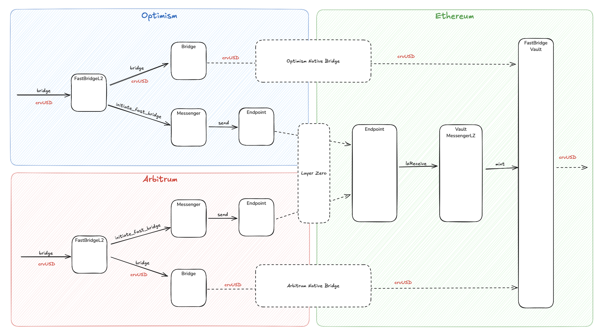

<h1>FastBridge Overview</h1>

FastBridge is a workaround solution for the 7-day delay from L2 native bridges by pre-minting crvUSD. This system enables fast cross-chain transfers of crvUSD from Layer 2 networks (Arbitrum, Optimism, Fraxtal) to Ethereum mainnet.

The traditional approach to bridging assets from Layer 2 networks to Ethereum mainnet involves a significant 7-day waiting period, which creates friction for users and limits the utility of crvUSD across different networks. FastBridge addresses this challenge by implementing a dual-bridge mechanism that provides immediate access to funds while maintaining the security and reliability of the underlying bridge infrastructure.

FastBridge implements a dual-bridge mechanism that combines:

1. **Native Bridge** (slow (7d) but reliable): Direct crvUSD transfer from L2 to Ethereum
2. **Fast Bridge** (immediate): LayerZero messaging + pre-minted crvUSD release

---

## **System Components**

The FastBridge system consists of several key components that work together to enable fast cross-chain transfers. These components are distributed across Layer 2 networks and Ethereum mainnet, each serving a specific role in the bridging process.

- L2 Networks (Arbitrum, Optimism, Fraxtal)

    The `FastBridgeL2.vy` contract serves as the primary coordinator on each L2 network. It initiates both native and fast bridge transactions while enforcing daily limits and minimum amounts. The contract manages native token fees for bridge operations and tracks bridged amounts per 24-hour interval.

    The `L2MessengerLZ.vy` contract handles LayerZero messaging from L2 to Ethereum mainnet. It encodes bridge requests and sends them through the LayerZero network to the corresponding messenger contract on Ethereum mainnet.

- Ethereum Mainnet

    The `FastBridgeVault.vy` holds pre-minted crvUSD which can be released for fast bridge operations. It manages debt ceilings and fee collection, implements emergency kill switches, and handles token recovery in case of malfunctions.

    The `VaultMessengerLZ.vy` receives LayerZero messages from L2s, triggers crvUSD minting in the vault, and manages the fast bridge message flow.

---

## **How It Works**

The FastBridge process involves a carefully orchestrated sequence of events that ensures both immediate access to funds and long-term security. The system operates through four main phases that work in parallel to provide users with the best possible experience.

1. User Initiates Bridge

    When a user wants to bridge crvUSD from L2 to Ethereum, they call `bridge()` on the `FastBridgeL2` contract. The contract transfers crvUSD from the user to itself and initiates both bridge paths simultaneously: native and fast.

2. Native Bridge Path (Slow)

    The `FastBridgeL2` calls the native bridge adapter, transferring crvUSD through the L2's native bridge. After 7 days, the crvUSD arrives at FastBridgeVault on Ethereum, where the vault holds the tokens for final settlement.

3. Fast Bridge Path (Immediate)

    The `FastBridgeL2` sends a message via `L2MessengerLZ`, which travels through the LayerZero network. The `VaultMessengerLZ` receives the message on Ethereum, and the vault immediately mints crvUSD to the user, allowing them to use the tokens while the native bridge is pending.

4. Settlement

    The pre-minted crvUSD is backed by the incoming native bridge transaction. When the native bridge completes, it replenishes the vault's balance mechanism.

---

## **Security Model**

The FastBridge system implements a comprehensive security model that addresses both technical and economic risks. The security architecture is built around multiple layers of verification, emergency controls, and risk management mechanisms that ensure the system's integrity and user fund safety.

**LayerZero Verification**

Messages are proven by 2/2 DVNs (Decentralized Verifier Networks). The LayerZero team serves as the primary verifier, while Curve core developers (SwissStake) act as the secondary verifier with maximum conservative setup.

**Emergency Controls**

The system includes a DAO Emergency Stop that can halt any mints immediately, along with kill switches that can disable specific minters or all operations. Role-based access control provides different roles for different administrative functions.

## **Debt Ceilings and Limits**

The FastBridge system implements multiple layers of limits to manage risk. These limits control how much crvUSD can be bridged and when.

Risk management is a critical aspect of the FastBridge system, as it involves pre-minting crvUSD tokens that are backed by pending bridge transactions. The system employs a sophisticated limit structure that balances user convenience with protocol safety, ensuring that the system can handle various market conditions while protecting against potential risks.

**Debt Ceilings (Per Network)**

Debt ceilings represent the maximum total exposure the system can have on each L2 network. Debt ceilings are set per L2 network independently and represent the maximum amount of "unbacked" crvUSD that can be minted. These are conservative limits designed to protect the protocol:

| Network | Debt Ceiling |
|---------|--------------|
| Arbitrum | TBD |
| Optimism | TBD |
| Fraxtal | TBD |

---

**Daily Bridge Limits**

Each L2 network has a daily limit on how much crvUSD can be bridged within a 24-hour period:

| Limit Type | Description | Purpose |
|------------|-------------|---------|
| **Daily Limit** | Maximum crvUSD that can be bridged per 24-hour interval | Prevents overwhelming the Ethereum claim queue |
| **Interval Tracking** | 24-hour periods (86400 seconds) | Ensures smooth processing of bridge transactions |
| **Reset Mechanism** | Limits reset every 24 hours | Allows continuous bridging while maintaining caps |

**Implementation:** Limits are enforced by the `FastBridgeL2` contract, where each bridge transaction reduces the available daily limit. Limits are tracked using `block.timestamp // INTERVAL` where `INTERVAL = 86400`, and users can check available amounts using `allowed_to_bridge()`.

---

**Minimum Bridge Amounts**

To prevent uneconomical transactions, the system enforces minimum bridge amounts to prevent gas-inefficient small transactions as claiming small amounts can be expensive on Ethereum (high relative fee).  
The minimum amount can be adjusted by the DAO.

## **Emergency Controls**

In case of emergencies, the system includes additional controls. The Kill Switch can stop all minting operations (KILLER_ROLE), Individual Kills can stop specific minters (KILLER_ROLE), Limit Adjustment can modify daily limits (DEFAULT_ADMIN_ROLE), and Debt Ceiling Updates can modify debt ceilings (Governance).

## **Fee Structure**

The FastBridge system implements a carefully designed fee structure that balances user accessibility with operational sustainability. Initially, there will be fee-free transfers for the first 1-4 weeks to encourage adoption and gather usage data. After this initial period, fees are set to cover the keeper operational expenses and ensure the system's long-term viability. 
