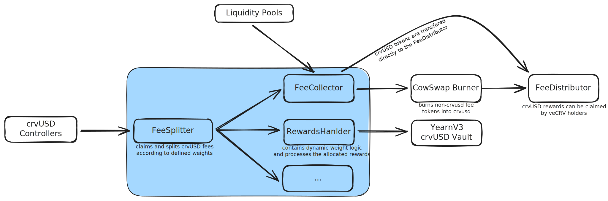

<h1>FeeSplitter</h1>

The `FeeSplitter.vy` is a contract that collects and splits accumulated crvUSD fees from crvUSD Controllers[^1] in a single transaction across other contracts according to predetermined weights.

[^1]: These are Controllers from where crvUSD is minted. See here: https://crvusd.curve.fi/

!!!github "GitHub"
    The source code for the `FeeSplitter.vy` contract can be found on [:material-github: GitHub](https://github.com/curvefi/fee-splitter/blob/main/contracts/FeeSplitter.vy). The contract is written using [Vyper](https://github.com/vyperlang/vyper) version `0.4.0` and utilizes a [snekmate module](https://github.com/pcaversaccio/snekmate/blob/main/src/snekmate/auth/ownable.vy) to handle contract ownership.

    The source code was audited by [:logos-chainsecurity: ChainSecurity](https://www.chainsecurity.com/). The full audit report can be found [here](https://github.com/curvefi/fee-splitter/blob/main/audits/ChainSecurity.pdf).




---


## **Dispatching Fees, Receivers and Weights**

The contract consolidates the process of claiming and distributing fees into a single external function called `dispatch_fees`. Calling this function is fully permissionless and can be done by anyone.

The function makes use of a helper module called `ControllerMulticlaim.vy`, which aims to track all `crvUSD Controllers` from the `Factory` and provides an interface for claiming fees from them. By default, the `dispatch_fees` function claims fees from all the controllers registered in the [`controllers`](#controllers) array of the `ControllerMulticlaim.vy` module, but the function also allows for only claiming fees from specified controllers.

All receiving addresses are stored in the `receivers` variable and are stored in a `Receiver` struct, which includes the address and its corresponding weight:

```py
struct Receiver:
    addr: address
    weight: uint256
```


The weight assigned to a receiver is set when a receiver address is added using the `set_receivers` function. In addition to static weights, the contract supports dynamic weights based on various conditions defined in the receiver contract itself. To support dynamic weights, the receiver contract must implement `DYNAMIC_WEIGHT_EIP165_ID: constant(bytes4) = 0xA1AAB33F` a la EIP-165 and a `weight()` function which returns the actual dynamic weight.

If a weight is dynamic, the `weight` value in the struct acts as an upper cap. If the actual dynamic weight returned by the receiving contract is less than the defined weight in the struct, the unused weight is rolled over to the weight of the `excess_receiver`.

!!!tip "Weight Example"
    Consider a scenario where the initial weights stored in a `Receiver` struct are defined as follows: 

    - `receiver1` has a weight of 10% 
    - `receiver2` has a weight of 10%
    - `receiver3` has a weight of 80%

    However, due to the dynamic nature of `receiver1`'s weight, the actual weight turns out to be 8%. The 2% difference is then rolled over to the last receiver in `receivers` (which is `excess_receiver`), `receiver3`.

    As a result, the final weights are adjusted as follows:
    
    - `receiver1` ends up with a weight of 8%
    - `receiver2` remains at 10%
    - `receiver3` receives an adjusted weight of 82%, which includes the 2% rolled over from `receiver1`.


---


### `dispatch_fees`
!!! description "`FeeSplitter.dispatch_fees(controllers: DynArray[multiclaim.Controller, multiclaim.MAX_CONTROLLERS]=[])`"

    Function to claim crvUSD fees from crvUSD Controllers and distribute them to addresses and weights defined in the `receivers` variable. This function is callable by anyone.

    | Input         | Type                                                          | Description |
    | ------------- | ------------------------------------------------------------- | ----------- |
    | `controllers` | `DynArray[multiclaim.Controller, multiclaim.MAX_CONTROLLERS]` | Array of Controllers to claim from; defaults to claiming fees from all Controllers in `controllers` |

    ??? quote "Source code"

        === "FeeSplitter.vy"

            ```python
            struct Receiver:
                addr: address
                weight: uint256

            # maximum number of splits
            MAX_RECEIVERS: constant(uint256) = 100
            # maximum basis points (100%)
            MAX_BPS: constant(uint256) = 10_000
            DYNAMIC_WEIGHT_EIP165_ID: constant(bytes4) = 0xA1AAB33F

            # receiver logic
            receivers: public(DynArray[Receiver, MAX_RECEIVERS])

            crvusd: immutable(IERC20)

            @nonreentrant
            @external
            def dispatch_fees(
                controllers: DynArray[
                    multiclaim.Controller, multiclaim.MAX_CONTROLLERS
                ] = []
            ):
                """
                @notice Claim fees from all controllers and distribute them
                @param controllers The list of controllers to claim fees from (default: all)
                @dev Splits and transfers the balance according to the receivers weights
                """

                multiclaim.claim_controller_fees(controllers)

                balance: uint256 = staticcall crvusd.balanceOf(self)

                excess: uint256 = 0

                # by iterating over the receivers, rather than the indices,
                # we avoid an oob check at every iteration.
                i: uint256 = 0
                for r: Receiver in self.receivers:
                    weight: uint256 = r.weight

                    if self._is_dynamic(r.addr):
                        dynamic_weight: uint256 = staticcall DynamicWeight(r.addr).weight()

                        # `weight` acts as a cap to the dynamic weight, preventing
                        # receivers to ask for more than what they are allowed to.
                        if dynamic_weight < weight:
                            excess += weight - dynamic_weight
                            weight = dynamic_weight

                    # if we're at the last iteration, it means `r` is the excess
                    # receiver, therefore we add the excess to its weight.
                    if i == len(self.receivers) - 1:
                        weight += excess

                    extcall crvusd.transfer(r.addr, balance * weight // MAX_BPS)

                    log FeeDispatched(r.addr, weight)
                    i += 1

            def _is_dynamic(addr: address) -> bool:
                """
                This function covers the following cases without reverting:
                1. The address is an EIP-165 compliant contract that supports
                    the dynamic weight interface (returns True).
                2. The address is a contract that does not comply to EIP-165
                    (returns False).
                3. The address is an EIP-165 compliant contract that does not
                    support the dynamic weight interface (returns False).
                4. The address is an EOA (returns False).
                """
                success: bool = False
                response: Bytes[32] = b""
                success, response = raw_call(
                    addr,
                    abi_encode(
                        DYNAMIC_WEIGHT_EIP165_ID,
                        method_id("supportsInterface(bytes4)"),
                    ),
                    max_outsize=32,
                    is_static_call=True,
                    revert_on_failure=False,
                )
                return success and convert(response, bool) or len(response) > 32
            ```

        === "ControllerMulticlaim.vy"

            ```python
            import ControllerFactory
            import Controller

            factory: immutable(ControllerFactory)

            allowed_controllers: public(HashMap[Controller, bool])
            controllers: public(DynArray[Controller, MAX_CONTROLLERS])

            # maximum number of claims in a single transaction
            MAX_CONTROLLERS: constant(uint256) = 100


            @deploy
            def __init__(_factory: ControllerFactory):
                assert _factory.address != empty(address), "zeroaddr: factory"

                factory = _factory


            def claim_controller_fees(controllers: DynArray[Controller, MAX_CONTROLLERS]):
                """
                @notice Claims admin fees from a list of controllers.
                @param controllers The list of controllers to claim fees from.
                @dev For the claim to succeed, the controller must be in the list of
                    allowed controllers. If the list of controllers is empty, all
                    controllers in the factory are claimed from.
                """
                if len(controllers) == 0:
                    for c: Controller in self.controllers:
                        extcall c.collect_fees()
                else:
                    for c: Controller in controllers:
                        if not self.allowed_controllers[c]:
                            raise "controller: not in factory"
                        extcall c.collect_fees()


            @nonreentrant
            @external
            def update_controllers():
                """
                @notice Update the list of controllers so that it corresponds to the
                    list of controllers in the factory.
                @dev The list of controllers can only add new controllers from the
                    factory when updated.
                """
                old_len: uint256 = len(self.controllers)
                new_len: uint256 = staticcall factory.n_collaterals()
                for i: uint256 in range(new_len - old_len, bound=MAX_CONTROLLERS):
                    i_shifted: uint256 = i + old_len
                    c: Controller = Controller(staticcall factory.controllers(i_shifted))
                    self.allowed_controllers[c] = True
                    self.controllers.append(c)
            ```

    === "Example"

        ```shell
        >>> soon
        ```


### `receivers`
!!! description "`FeeSplitter.receivers(arg0: uint256) -> Receiver: view`"

    Getter for the addresses and weights of receivers at index `arg0`. Receivers can be added/removed/modified by the DAO using the `set_receivers` function.

    Returns: `Receiver` struct consisting of `address` and `weight`.

    | Input  | Type      | Description           |
    | ------ | --------- | --------------------- |
    | `arg0` | `uint256` | Index of the receiver |

    ??? quote "Source code"

        === "FeeSplitter.vy"

            ```python
            struct Receiver:
                addr: address
                weight: uint256

            receivers: public(DynArray[Receiver, MAX_RECEIVERS])
            ```

    === "Example"

        This example allows you to fetch the receiver information for a given index. Enter an index number to see the corresponding receiver's address and weight.

        <div class="highlight">
        <pre><code>>>> FeeSplitter.receivers(<input id="receiverIndex" type="number" value="0" min="0" style="width: 50px; background: transparent; border: none; border-bottom: 1px solid #ccc; color: inherit; font-family: inherit; font-size: inherit; -moz-appearance: textfield;" oninput="fetchReceiver()"/>)
        <span id="receiverOutput"></span></code></pre>
        </div>

        <style>
        input[type=number]::-webkit-inner-spin-button, 
        input[type=number]::-webkit-outer-spin-button {
            -webkit-appearance: none;
            margin: 0;
        }
        </style>


### `n_receivers`
!!! description "`FeeSplitter.n_receivers() -> uint256`"

    Getter for the total number of receivers the fees are split to.

    Returns: number of receivers (`uint256`).

    ??? quote "Source code"

        === "FeeSplitter.vy"

            ```python
            receivers: public(DynArray[Receiver, MAX_RECEIVERS])

            @view
            @external
            def n_receivers() -> uint256:
                """
                @notice Get the number of receivers
                @return The number of receivers
                """
                return len(self.receivers)
            ```

    === "Example"

        This example returns the total number of crvUSD Controllers "registered" in the [`receivers`](#receivers) array.

        <div class="highlight">
        <pre><code>>>> FeeSplitter.n_receivers()
        <span id="nReceiversOutput"></span></code></pre>
        </div>


### `excess_receiver`
!!! description "`FeeSplitter.excess_receiver() -> address`"

    Getter for the excess receiver. That is the last receiver address in [`receivers`](#receivers) and is the one that receives additional weight ontop of his on weight, if prior receivers with a dynamic weight allocate less than their cap (see this example at the top).

    Returns: excess receiver (`address`)

    ??? quote "Source code"

        === "FeeSplitter.vy"

            ```python
            receivers: public(DynArray[Receiver, MAX_RECEIVERS])

            @view
            @external
            def excess_receiver() -> address:
                """
                @notice Get the excess receiver, that is the receiver
                    that, on top of his weight, will receive an additional
                    weight if other receivers (with a dynamic weight) ask
                    for less than their cap.
                @return The address of the excess receiver.
                """
                receivers_length: uint256 = len(self.receivers)
                return self.receivers[receivers_length - 1].addr
            ```

    === "Example"

        This example returns the total number of crvUSD Controllers "registered" in the [`receivers`](#receivers) array.

        <div class="highlight">
        <pre><code>>>> FeeSplitter.excess_receiver()
        <span id="excessReceiverOutput"></span></code></pre>
        </div>


### `set_receivers`
!!! description "`FeeSplitter.set_receivers(receivers: DynArray[Receiver, MAX_RECEIVERS])`"

    !!!guard "Guarded Method by Snekmate 🐍"
        This contract makes use of a Snekmate module to manage roles and permissions. This specific function can only be called by the current `owner` of the contract.

    Function to set receivers and their respective weights. New receveivers can not simply be added or removed from the exisiting array of receivers. One must include the current receivers in the array of `Receiver` structs. The weight is based on a scale of 1e5, meaning e.g. 100% corresponds to a weight value of 10000, and 50% would be a weight value of 5000. 
    
    The function will revert if a receiver address is `ZERO_ADDRESS`, if the weight is `0` or greater than `10000` (`MAX_BPS`), or if the sum of the weights of all receivers does not equal `10000` (100%). 
    
    Additionally, when adding receivers with dynamic weights, they must support the `DYNAMIC_WEIGHT_EIP165_ID` as specified in EIP-165 and implement a `weight()` function which returns the weight the receiver asks for.

    Emits: `SetReceivers`

    | Input       | Type                                | Description                                                  |
    | ----------- | ----------------------------------- | ------------------------------------------------------------ |
    | `receivers` | `DynArray[Receiver, MAX_RECEIVERS]` | Array of `Receiver` structs containing of address and weight |

    ??? quote "Source code"

        === "FeeSplitter.vy"

            The following source code includes all changes up to commit hash [581b897](https://github.com/curvefi/autobribe/tree/581b8978f91e426c648cf6243420fee5276166b7); any changes made after this commit are not included.

            ```python
            from snekmate.auth import ownable

            struct Receiver:
                addr: address
                weight: uint256

            # maximum number of splits
            MAX_RECEIVERS: constant(uint256) = 100
            # maximum basis points (100%)
            MAX_BPS: constant(uint256) = 10_000
            DYNAMIC_WEIGHT_EIP165_ID: constant(bytes4) = 0xA1AAB33F

            receivers: public(DynArray[Receiver, MAX_RECEIVERS])

            @external
            def set_receivers(receivers: DynArray[Receiver, MAX_RECEIVERS]):
                """
                @notice Set the receivers, the last one is the excess receiver.
                @param receivers The new receivers's list.
                @dev The excess receiver is always the last element in the
                    `self.receivers` array.
                """
                ownable._check_owner()

                self._set_receivers(receivers)

            def _set_receivers(receivers: DynArray[Receiver, MAX_RECEIVERS]):
                assert len(receivers) > 0, "receivers: empty"
                total_weight: uint256 = 0
                for r: Receiver in receivers:
                    assert r.addr != empty(address), "zeroaddr: receivers"
                    assert r.weight > 0 and r.weight <= MAX_BPS, "receivers: invalid weight"
                    total_weight += r.weight
                assert total_weight == MAX_BPS, "receivers: total weight != MAX_BPS"

                self.receivers = receivers

                log SetReceivers()
            ```

    === "Example"

        This example sets two receiver addresses and their respective weights: 
        
        1. the first address is the Vyper Gitcoin address with a 10% weight, and 
        2. the second address is the `FeeCollector` with the remaining 90%.

        ```shell
        >>> FeeSplitter.set_receivers([
            ('0x70CCBE10F980d80b7eBaab7D2E3A73e87D67B775', 1000), 
            ('0xa2Bcd1a4Efbd04B63cd03f5aFf2561106ebCCE00', 9000)])
        ```


---


## **Controller Management**

The contract maintains a list of [`controllers`](#controllers) from which fees can be claimed. This list is updated to match the controllers registered in the crvUSD Factory contract. The [`update_controllers`](#update_controllers) function is used to keep this list current.


The contract maintains a list of allowed `Controller` contracts from which fees can be claimed. This list is updated to match the controllers registered in the crvUSD Factory contract. The `update_controllers` function is used to keep this list current.


### `controllers`
!!! description "`FeeSplitter.controllers(arg0: uint256) -> IController: view`"

    Getter for the `Controller` at index `arg0`.

    Returns: controller (`address`).

    | Input  | Type      | Description           |
    | ------ | --------- | --------------------- |
    | `arg0` | `uint256` | Index of the controller |

    ??? quote "Source code"

        === "FeeSplitter.vy"

            ```python
            import ControllerMulticlaim as multiclaim
            initializes: multiclaim
            exports: (
                multiclaim.update_controllers,
                multiclaim.n_controllers,
                multiclaim.allowed_controllers,
                multiclaim.controllers
            )
            ```

        === "ControllerMulticlaim.vy"

            ```python
            from contracts.interfaces import IController
            
            controllers: public(DynArray[IController, MAX_CONTROLLERS])

            MAX_CONTROLLERS: constant(uint256) = 50000
            ```

        === "IController.vy"

            ```python
            @external
            def collect_fees() -> uint256:
                ...
            ```

    === "Example"

        This example fetches the `Controller` address at a certain index.

        <div class="highlight">
        <pre><code>>>> FeeSplitter.controllers(<input id="controllerIndex" type="number" value="0" min="0" style="width: 50px; background: transparent; border: none; border-bottom: 1px solid #ccc; color: inherit; font-family: inherit; font-size: inherit; -moz-appearance: textfield;" oninput="this.value = this.value.replace(/[^0-9]/g, '')"/>) <span id="controllerOutput">>>> Loading...</span></code></pre>
        </div>


### `allowed_controllers`
!!! description "`FeeSplitter.allowed_controllers(arg0: uint256) -> address: view`"

    Getter for the allowed controller address at index `arg0`.

    Returns: allowed controller address (`address`).

    | Input  | Type      | Description           |
    | ------ | --------- | --------------------- |
    | `arg0` | `uint256` | Index of the receiver |

    ??? quote "Source code"

        === "FeeSplitter.vy"

            The following source code includes all changes up to commit hash [581b897](https://github.com/curvefi/autobribe/tree/581b8978f91e426c648cf6243420fee5276166b7); any changes made after this commit are not included.

            ```python
            import ControllerMulticlaim as multiclaim
            initializes: multiclaim
            exports: (
                multiclaim.update_controllers,
                multiclaim.n_controllers,
                multiclaim.allowed_controllers,
                multiclaim.controllers
            )
            ```

        === "ControllerMulticlaim.vy"
        
            ```python
            from contracts.interfaces import IController

            allowed_controllers: public(HashMap[IController, bool])
            ```

    === "Example"

        This example checks if a specific `Controller` address is allowed to be claimed from.

        <div class="highlight">
        <pre><code>>>> FeeSplitter.allowed_controllers(<input id="allowedControllerAddress" type="text" style="width: 330px; background: transparent; border: none; border-bottom: 1px solid #ccc; color: inherit; font-family: inherit; font-size: inherit;" placeholder="Enter address"/>) <span id="allowedControllerOutput">>>> Loading...</span></code></pre>
        </div>


### `n_controllers`
!!! description "`FeeSplitter.n_controllers() -> uint256: view`"

    Getter for the number of `Controllers` added to the contract from which potentially (if they are allowed) fees can be claimed from.

    Returns: number of controllers (`uint256`).

    ??? quote "Source code"

        === "FeeSplitter.vy"

            The following source code includes all changes up to commit hash [581b897](https://github.com/curvefi/autobribe/tree/581b8978f91e426c648cf6243420fee5276166b7); any changes made after this commit are not included.

            ```python
            import ControllerMulticlaim as multiclaim
            initializes: multiclaim
            exports: (
                multiclaim.update_controllers,
                multiclaim.n_controllers,
                multiclaim.allowed_controllers,
                multiclaim.controllers
            )
            ```

        === "ControllerMulticlaim.vy"

            ```python
            controllers: public(DynArray[IController, MAX_CONTROLLERS])

            MAX_CONTROLLERS: constant(uint256) = 50000

            @view
            @external
            def n_controllers() -> uint256:
                return len(self.controllers)
            ```

    === "Example"

        This example returns the number of `Controller` contracts.

        <div class="highlight">
        <pre><code>>>> FeeSplitter.n_controllers()
        <span id="nControllersOutput"></span></code></pre>
        </div>


### `update_controllers`
!!! description "`FeeSplitter.update_controllers()`"

    Function to update the list of `Controllers` to correspond with the list of `Controllers` in the `Factory`. Calling this function is fully permissionless and can be done by anyone.

    This function uses the `n_collaterals` function from the `IControllerFactory` interface to determine the total number of Controllers. If the local list of Controllers is not up to date, the function adds the missing Controllers to the dynamic array in `controllers`. Simultaneously, it updates the `allowed_controllers` mapping to permit claiming from the newly added Controllers.

    ??? quote "Source code"

        === "FeeSplitter.vy"

            The following source code includes all changes up to commit hash [581b897](https://github.com/curvefi/autobribe/tree/581b8978f91e426c648cf6243420fee5276166b7); any changes made after this commit are not included.

            ```python
            import ControllerMulticlaim as multiclaim
            initializes: multiclaim
            exports: (
                multiclaim.update_controllers,
                multiclaim.n_controllers,
                multiclaim.allowed_controllers,
                multiclaim.controllers
            )
            ```

        === "ControllerMulticlaim.vy"

            ```python
            from contracts.interfaces import IControllerFactory
            from contracts.interfaces import IController

            factory: immutable(IControllerFactory)

            allowed_controllers: public(HashMap[IController, bool])
            controllers: public(DynArray[IController, MAX_CONTROLLERS])

            # maximum number of claims in a single transaction
            MAX_CONTROLLERS: constant(uint256) = 50000

            @nonreentrant
            @external
            def update_controllers():
                """
                @notice Update the list of controllers so that it corresponds to the
                    list of controllers in the factory.
                @dev The list of controllers can only add new controllers from the
                    factory when updated.
                """
                old_len: uint256 = len(self.controllers)
                new_len: uint256 = staticcall factory.n_collaterals()
                for i: uint256 in range(old_len, new_len, bound=MAX_CONTROLLERS):
                    c: IController = IController(staticcall factory.controllers(i))
                    self.allowed_controllers[c] = True
                    self.controllers.append(c)
            ```

        === "IControllerFactory.vy"

            ```python
            @external
            @view
            def controllers(index: uint256) -> address:
                ...


            @external
            @view
            def n_collaterals() -> uint256:
                ...
            ```


    === "Example"

        This example updates the `controllers` list to correspond with the actual list of `Controllers` in the `Factory`.

        ```shell
        >>> FeeSplitter.update_controllers()
        ```


---


## **Contract Ownership**

Ownership of the contract is managed using the [`Ownable.vy`](https://github.com/pcaversaccio/snekmate/blob/main/src/snekmate/auth/ownable.vy) module from 🐍 [Snekmate](https://github.com/pcaversaccio/snekmate) which implements a basic control access mechanism, where there is an `owner` that can be granted exclusive access to specific functions.


### `owner`
!!! description "`FeeSplitter.owner() -> address: view`"

    Getter for the owner of the contract. This is the address that can call restricted functions like `transfer_ownership`, `renounce_ownership` or `set_receivers`.

    Returns: contract owner (`address`). 

    ??? quote "Source code"

        === "FeeSplitter.vy"

            The following source code includes all changes up to commit hash [581b897](https://github.com/curvefi/autobribe/tree/581b8978f91e426c648cf6243420fee5276166b7); any changes made after this commit are not included.

            ```python
            from snekmate.auth import ownable
            initializes: ownable
            exports: (
                ownable.transfer_ownership,
                ownable.renounce_ownership,
                ownable.owner
            )

            @deploy
            def __init__(
                _crvusd: IERC20,
                _factory: multiclaim.IControllerFactory,
                receivers: DynArray[Receiver, MAX_RECEIVERS],
                owner: address,
            ):
                """
                @notice Contract constructor
                @param _crvusd The address of the crvUSD token contract
                @param _factory The address of the crvUSD controller factory
                @param receivers The list of receivers (address, weight).
                    Last item in the list is the excess receiver by default.
                @param owner The address of the contract owner
                """
                assert _crvusd.address != empty(address), "zeroaddr: crvusd"
                assert owner != empty(address), "zeroaddr: owner"

                ownable.__init__()
                ownable._transfer_ownership(owner)
                multiclaim.__init__(_factory)

                # setting immutables
                crvusd = _crvusd

                # set the receivers
                self._set_receivers(receivers)
            ```

        === "Ownable.vy"

            ```python
            owner: public(address)

            @deploy
            @payable
            def __init__():
                """
                @dev To omit the opcodes for checking the `msg.value`
                    in the creation-time EVM bytecode, the constructor
                    is declared as `payable`.
                @notice The `owner` role will be assigned to
                        the `msg.sender`.
                """
                self._transfer_ownership(msg.sender)
            ```

    === "Example"

        This example fetches the current owner of the `FeeSplitter` contract.

        <div class="highlight">
        <pre><code>>>> FeeSplitter.owner() <span id="ownerOutput"></span></code></pre>
        </div>


### `transfer_ownership`
!!! description "`FeeSplitter.transfer_ownership(new_owner: address)`"

    !!!guard "Guarded Method by Snekmate 🐍"
        This contract makes use of a Snekmate module to manage roles and permissions. This specific function can only be called by the current `owner` of the contract.

    Function to transfer the ownership of the contract to a new address.

    | Input      | Type      | Description |
    | ---------- | --------- | ------------ |
    | `new_owner` | `address` | New owner of the contract |

    ??? quote "Source code"

        === "FeeSplitter.vy"

            The following source code includes all changes up to commit hash [581b897](https://github.com/curvefi/autobribe/tree/581b8978f91e426c648cf6243420fee5276166b7); any changes made after this commit are not included.

            ```python
            from snekmate.auth import ownable
            initializes: ownable
            exports: (
                ownable.transfer_ownership,
                ownable.renounce_ownership,
                ownable.owner
            )

            @deploy
            def __init__(
                _crvusd: IERC20,
                _factory: multiclaim.IControllerFactory,
                receivers: DynArray[Receiver, MAX_RECEIVERS],
                owner: address,
            ):
                """
                @notice Contract constructor
                @param _crvusd The address of the crvUSD token contract
                @param _factory The address of the crvUSD controller factory
                @param receivers The list of receivers (address, weight).
                    Last item in the list is the excess receiver by default.
                @param owner The address of the contract owner
                """
                assert _crvusd.address != empty(address), "zeroaddr: crvusd"
                assert owner != empty(address), "zeroaddr: owner"

                ownable.__init__()
                ownable._transfer_ownership(owner)
                multiclaim.__init__(_factory)

                # setting immutables
                crvusd = _crvusd

                # set the receivers
                self._set_receivers(receivers)
            ```

        === "Ownable.vy"

            ```python
            owner: public(address)

            event OwnershipTransferred:
                previous_owner: indexed(address)
                new_owner: indexed(address)

            @external
            def transfer_ownership(new_owner: address):
                """
                @dev Transfers the ownership of the contract
                    to a new account `new_owner`.
                @notice Note that this function can only be
                        called by the current `owner`. Also,
                        the `new_owner` cannot be the zero address.
                @param new_owner The 20-byte address of the new owner.
                """
                self._check_owner()
                assert new_owner != empty(address), "ownable: new owner is the zero address"
                self._transfer_ownership(new_owner)

            @internal
            def _check_owner():
                """
                @dev Throws if the sender is not the owner.
                """
                assert msg.sender == self.owner, "ownable: caller is not the owner"

            @internal
            def _transfer_ownership(new_owner: address):
                """
                @dev Transfers the ownership of the contract
                    to a new account `new_owner`.
                @notice This is an `internal` function without
                        access restriction.
                @param new_owner The 20-byte address of the new owner.
                """
                old_owner: address = self.owner
                self.owner = new_owner
                log OwnershipTransferred(old_owner, new_owner)
            ```

    === "Example"

        This example transfers the ownership of the contract to `new_owner`.

        ```shell
        >>> FeeSplitter.transfer_ownership(new_owner)
        ```


### `renounce_ownership`
!!! description "`FeeSplitter.renounce_ownership()`"

    !!!guard "Guarded Method by Snekmate 🐍"
        This contract makes use of a Snekmate module to manage roles and permissions. This specific function can only be called by the current `owner` of the contract.

    Function to renounce the ownership of the contract. Calling this method will leave the contract without an owner, thereby removing any functionality that is only available to the owner.

    Emits: `OwnershipTransferred` from `Ownable.vy`.

    ??? quote "Source code"

        === "FeeSplitter.vy"

            The following source code includes all changes up to commit hash [581b897](https://github.com/curvefi/autobribe/tree/581b8978f91e426c648cf6243420fee5276166b7); any changes made after this commit are not included.

            ```python
            from snekmate.auth import ownable
            initializes: ownable
            exports: (
                ownable.transfer_ownership,
                ownable.renounce_ownership,
                ownable.owner
            )

            @deploy
            def __init__(
                _crvusd: IERC20,
                _factory: multiclaim.IControllerFactory,
                receivers: DynArray[Receiver, MAX_RECEIVERS],
                owner: address,
            ):
                """
                @notice Contract constructor
                @param _crvusd The address of the crvUSD token contract
                @param _factory The address of the crvUSD controller factory
                @param receivers The list of receivers (address, weight).
                    Last item in the list is the excess receiver by default.
                @param owner The address of the contract owner
                """
                assert _crvusd.address != empty(address), "zeroaddr: crvusd"
                assert owner != empty(address), "zeroaddr: owner"

                ownable.__init__()
                ownable._transfer_ownership(owner)
                multiclaim.__init__(_factory)

                # setting immutables
                crvusd = _crvusd

                # set the receivers
                self._set_receivers(receivers)
            ```

        === "Ownable.vy"

            ```python
            owner: public(address)

            event OwnershipTransferred:
                previous_owner: indexed(address)
                new_owner: indexed(address)

            @external
            def renounce_ownership():
                """
                @dev Leaves the contract without an owner.
                @notice Renouncing ownership will leave the
                        contract without an owner, thereby
                        removing any functionality that is
                        only available to the owner.
                """
                self._check_owner()
                self._transfer_ownership(empty(address))

            @internal
            def _check_owner():
                """
                @dev Throws if the sender is not the owner.
                """
                assert msg.sender == self.owner, "ownable: caller is not the owner"

            @internal
            def _transfer_ownership(new_owner: address):
                """
                @dev Transfers the ownership of the contract
                    to a new account `new_owner`.
                @notice This is an `internal` function without
                        access restriction.
                @param new_owner The 20-byte address of the new owner.
                """
                old_owner: address = self.owner
                self.owner = new_owner
                log OwnershipTransferred(old_owner, new_owner)
            ```

    === "Example"

        ```shell
        >>> FeeSplitter.renounce_ownership()
        ```


---


## **Other Methods**

### `version`
!!! description "`FeeSplitter.version() -> String[8]: view`"

    Getter for the version of the contract.

    Returns: version (`String[8]`). 

    ??? quote "Source code"

        === "FeeSplitter.vy"

            ```python
            version: public(constant(String[8])) = "0.1.0" # no guarantees on abi stability
            ```

    === "Example"

        ```
        >>> FeeSplitter.version()
        0.1.0
        ```


---


<script src="https://cdn.jsdelivr.net/npm/web3@1.5.2/dist/web3.min.js"></script>
<script>
document.addEventListener('DOMContentLoaded', async function() {
    const web3 = new Web3('https://eth.llamarpc.com');
    const FeeSplitterAddress = '0x22556558419EeD2d0A1Af2e7Fd60E63f3199aca3';
    const FeeSplitterABI = [
    {
        "anonymous": false,
        "inputs": [],
        "name": "SetReceivers",
        "type": "event"
    },
    {
        "anonymous": false,
        "inputs": [],
        "name": "LivenessProtectionTriggered",
        "type": "event"
    },
    {
        "anonymous": false,
        "inputs": [
            {
                "indexed": true,
                "name": "receiver",
                "type": "address"
            },
            {
                "indexed": false,
                "name": "weight",
                "type": "uint256"
            }
        ],
        "name": "FeeDispatched",
        "type": "event"
    },
    {
        "anonymous": false,
        "inputs": [
            {
                "indexed": true,
                "name": "previous_owner",
                "type": "address"
            },
            {
                "indexed": true,
                "name": "new_owner",
                "type": "address"
            }
        ],
        "name": "OwnershipTransferred",
        "type": "event"
    },
    {
        "inputs": [
            {
                "name": "new_owner",
                "type": "address"
            }
        ],
        "name": "transfer_ownership",
        "outputs": [],
        "stateMutability": "nonpayable",
        "type": "function"
    },
    {
        "inputs": [],
        "name": "renounce_ownership",
        "outputs": [],
        "stateMutability": "nonpayable",
        "type": "function"
    },
    {
        "inputs": [],
        "name": "owner",
        "outputs": [
            {
                "name": "",
                "type": "address"
            }
        ],
        "stateMutability": "view",
        "type": "function"
    },
    {
        "inputs": [],
        "name": "update_controllers",
        "outputs": [],
        "stateMutability": "nonpayable",
        "type": "function"
    },
    {
        "inputs": [],
        "name": "n_controllers",
        "outputs": [
            {
                "name": "",
                "type": "uint256"
            }
        ],
        "stateMutability": "view",
        "type": "function"
    },
    {
        "inputs": [
            {
                "name": "arg0",
                "type": "address"
            }
        ],
        "name": "allowed_controllers",
        "outputs": [
            {
                "name": "",
                "type": "bool"
            }
        ],
        "stateMutability": "view",
        "type": "function"
    },
    {
        "inputs": [
            {
                "name": "arg0",
                "type": "uint256"
            }
        ],
        "name": "controllers",
        "outputs": [
            {
                "name": "",
                "type": "address"
            }
        ],
        "stateMutability": "view",
        "type": "function"
    },
    {
        "inputs": [],
        "name": "dispatch_fees",
        "outputs": [],
        "stateMutability": "nonpayable",
        "type": "function"
    },
    {
        "inputs": [
            {
                "name": "controllers",
                "type": "address[]"
            }
        ],
        "name": "dispatch_fees",
        "outputs": [],
        "stateMutability": "nonpayable",
        "type": "function"
    },
    {
        "inputs": [
            {
                "components": [
                    {
                        "name": "addr",
                        "type": "address"
                    },
                    {
                        "name": "weight",
                        "type": "uint256"
                    }
                ],
                "name": "receivers",
                "type": "tuple[]"
            }
        ],
        "name": "set_receivers",
        "outputs": [],
        "stateMutability": "nonpayable",
        "type": "function"
    },
    {
        "inputs": [],
        "name": "excess_receiver",
        "outputs": [
            {
                "name": "",
                "type": "address"
            }
        ],
        "stateMutability": "view",
        "type": "function"
    },
    {
        "inputs": [],
        "name": "n_receivers",
        "outputs": [
            {
                "name": "",
                "type": "uint256"
            }
        ],
        "stateMutability": "view",
        "type": "function"
    },
    {
        "inputs": [],
        "name": "version",
        "outputs": [
            {
                "name": "",
                "type": "string"
            }
        ],
        "stateMutability": "view",
        "type": "function"
    },
    {
        "inputs": [
            {
                "name": "arg0",
                "type": "uint256"
            }
        ],
        "name": "receivers",
        "outputs": [
            {
                "components": [
                    {
                        "name": "addr",
                        "type": "address"
                    },
                    {
                        "name": "weight",
                        "type": "uint256"
                    }
                ],
                "name": "",
                "type": "tuple"
            }
        ],
        "stateMutability": "view",
        "type": "function"
    },
    {
        "inputs": [
            {
                "name": "_crvusd",
                "type": "address"
            },
            {
                "name": "_factory",
                "type": "address"
            },
            {
                "components": [
                    {
                        "name": "addr",
                        "type": "address"
                    },
                    {
                        "name": "weight",
                        "type": "uint256"
                    }
                ],
                "name": "receivers",
                "type": "tuple[]"
            },
            {
                "name": "owner",
                "type": "address"
            }
        ],
        "outputs": [],
        "stateMutability": "nonpayable",
        "type": "constructor"
    }
];
    
    const FeeSplitterContract = new web3.eth.Contract(FeeSplitterABI, FeeSplitterAddress);
    
    async function updateValue(elementId, method, ...args) {
        try {
            const result = await FeeSplitterContract.methods[method](...args).call();
            document.getElementById(elementId).textContent = `${result}`;
            document.getElementById(elementId).style.color = 'green';
        } catch (error) {
            console.error(`Error fetching ${method}:`, error);
            document.getElementById(elementId).textContent = `>>> Error fetching ${method}`;
            document.getElementById(elementId).style.color = 'red';
        }
    }

    // Update values for view functions without arguments
    updateValue('versionOutput', 'version');
    updateValue('ownerOutput', 'owner');
    updateValue('nControllersOutput', 'n_controllers');
    updateValue('excessReceiverOutput', 'excess_receiver');
    updateValue('nReceiversOutput', 'n_receivers');

    // Function to handle input-based queries
    async function handleInputQuery(inputId, outputId, method) {
        const inputElement = document.getElementById(inputId);
        const outputElement = document.getElementById(outputId);
        
        async function fetchData() {
            const input = inputElement.value.trim();
            
            if (input === '') {
                outputElement.textContent = 'Please enter a valid input';
                outputElement.style.color = 'red';
                return;
            }
            
            try {
                const result = await FeeSplitterContract.methods[method](input).call();
                outputElement.textContent = `${result}`;
                outputElement.style.color = 'green'; // Set color to green for correct outputs
            } catch (error) {
                console.error(`Error fetching ${method}:`, error);
                outputElement.textContent = `${error.message}`;
                outputElement.style.color = 'red'; // Set color to red for errors
            }
        }

        // Initial fetch
        fetchData();

        // Add event listener for input changes
        inputElement.addEventListener('input', fetchData);
    }

    // Set up input-based queries
    handleInputQuery('receiverIndex', 'receiverOutput', 'receivers');
    handleInputQuery('controllerIndex', 'controllerOutput', 'controllers');
    handleInputQuery('allowedControllerAddress', 'allowedControllerOutput', 'allowed_controllers');
});
</script>