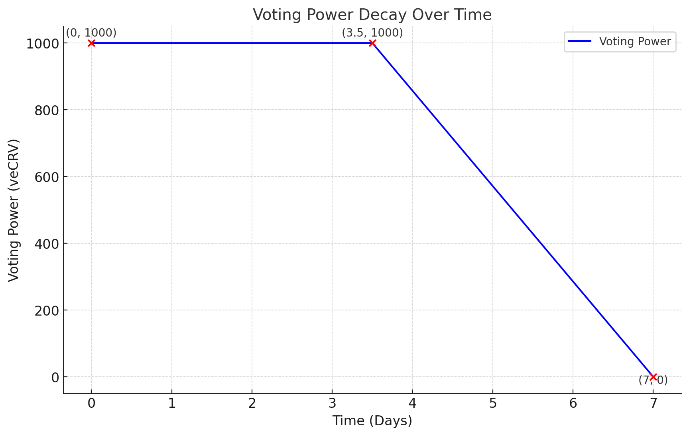

<h1>Governance and Voting</h1>

Curve governance and voting is a integral part of the protocol as all relevant contract are in full control of the DAO. Curve uses [Aragon](https://aragon.org/) for governance and control of the protocol admin functionality. Interaction with Aragon occurs through a [modified implementation](https://github.com/curvefi/curve-aragon-voting) of the Aragon [Voting App](https://github.com/aragon/aragon-apps/tree/master/apps/voting).

Curve's governance system is fully controlled by the DAO and extends to all deployed chains. Not only the Ethereum mainnet, but also all EVM sidechains. Due to the limitation of veCRV being on Ethereum only, all votes (also crosschain ones) are voted on Ethereum.

!!!info "CurveDAO Package"
    Curve developed a Python package to help make the process of creating and decoding proposals easier. For more information, see the [here](curve-dao.md).

---

## Aragon

Curve has **two different voting agents**, a ownership and parameter agent. While the ownership agent is used for critical changes such as changing the DAO's voting address, the parameter agent is/was mainly used for changing pool parameters. Recently, usage of the parameter agent decreased as parameter changes are now mainly also handled by the ownership agent.

- Voting Ownership: [`0xe478de485ad2fe566d49342cbd03e49ed7db3356`](https://etherscan.io/address/0xe478de485ad2fe566d49342cbd03e49ed7db3356)
- Voting Parameter: [`0xbcff8b0b9419b9a88c44546519b1e909cf330399`](https://etherscan.io/address/0xbcff8b0b9419b9a88c44546519b1e909cf330399)

These contracts are the entry points for creating new votes. Both votes have different quorum and support requirements (more down below).

- Ownership Agent: [`0x40907540d8a6C65c637785e8f8B742ae6b0b9968`](https://etherscan.io/address/0x40907540d8a6C65c637785e8f8B742ae6b0b9968)
- Parameter Agent: [`0x4EEb3bA4f221cA16ed4A0cC7254E2E32DF948c5f`](https://etherscan.io/address/0x4EEb3bA4f221cA16ed4A0cC7254E2E32DF948c5f)
- Emergency Agent: [`0x467947EE34aF926cF1DCac093870f613C96B1E0c`](https://etherscan.io/address/0x467947EE34aF926cF1DCac093870f613C96B1E0c)

---

## Quorum and Support Requirements

Quorum and support requirements are different for each vote type:

- Ownership Votes: 30% quorum, 51% support
- Parameter Votes: 15% quorum, 60% support

Generally, these values can be fetched from the `OwnershipVoting` and `ParameterVoting` contracts:

```python
VotingContract.supportRequiredPct()     # minimum support
510000000000000000                      # 51%

VotingContract.minAcceptQuorumPct()     # minimum quorum
300000000000000000                      # 30%
```

---

## Creating a Vote

The VotingOwnership and VotingParameter contracts are the entry points for creating new votes. New votes are created by calling the `newVote` function and passing in the `executionScript` and `metadata` as arguments. New votes can only be created by wallets with at least 2500 veCRV. Voting duration, regardless of the vote type, is 7 days. Once created, proposals can not be deleted or altered.

!!!colab "Notebook for Creating a Vote"
    To simplify this process, a simple notebook is avaliable to create a new vote. It uses a GoogleColab with Titanoboa (which allows for the connection of a wallet like Rabby or MetaMask) which not only allows the simulation, but also the creation of the vote. One simply needs to modify the script accordingly and run it.

    https://colab.research.google.com/drive/1SEmqdBgY3Pcg7q4XWGIoQOc1q5GEVGR6?usp=sharing

---

## Voting on Proposals

Any user with a veCRV balance can vote on a proposal. Vote duration is always 7 days and a vote can not be changed once it has been conducted.

Voting power **starts decaying halfway through the voting period**. If a user starts with 1000 veCRV, and the voting period is 7 days, they will still have a voting power of 1000 veCRV after 3.5 days but its starting to decay linearly until the end of the voting period. So, after another 1.75 days, the user will have a voting power of 500 veCRV, etc. This precausion taken to avoid whales from manipulating votes voting at the last minute.

<figure markdown="span">
    { width="500" }
</figure>

---

## Executing a Vote

After a vote has reached support and quorum, it can be executed. Execution of votes is fully permissionless (anyone can execute a vote; no minimum veCRV required; only some ETH for gas required) and once done, the `executionScript` passed in when creating the vote is executed.

Execution can either be done through the [Curve UI](https://curve.finance/dao/ethereum) or directly from the according Voting Contract.

```python
VotingContract.executeVote()
```
