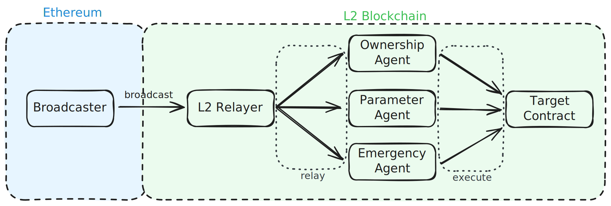

<h1>L1/L2 Governance</h1>

For being able to handle and execute governance activities not only on `Ethereum` but also on other networks such as `Arbitrum`, `Optimism`, `Base`, and many more, Curve has developed a cross-chain governance system called labeled as `x-gov`.

!!!github "GitHub"
    Source code of the `x-gov` repository can be found on [:material-github: GitHub](https://github.com/curvefi/curve-xgov).

    A comprehensive list of all deployed components on different chains is available [here](../../deployments/crosschain.md#curve-x-gov).

---

## Architecture & Smart Contracts

Voting for governance proposals is exclusively conducted on the Ethereum mainnet. Following a successful vote, the to be executed actions are broadcasted to a L2 network via a `Broadcaster` contract followed by the execution of the intended actions by `Agents` on the respective network via a `Relayer` contract.

<figure markdown="span">
  { width="700" }
  <figcaption></figcaption>
</figure>

<div class="grid cards" markdown>

-   :logos-vyper: **Broadcaster**

    ---

    The `Broadcaster` contract is responsible for broadcasting governance actions from Ethereum to the sidechain for execution.

    [:octicons-arrow-right-24: `Broadcaster.vy`](./broadcaster.md)

-   :logos-vyper: **Relayer**

    ---

    The `Relayer` contract facilitates the relaying of governance actions from Ethereum to `Agents` on the sidechain for execution.

    [:octicons-arrow-right-24: `Relayer.vy`](./relayer.md)

-   :logos-vyper: **Agents**

    ---

    On each sidechain and Layer 2 network, the `Agent` contract assumes three distinct roles: `ownership`, `parameter`, and `emergency`, mirroring the structure found on the Ethereum mainnet for controlled actions.

    [:octicons-arrow-right-24: `Agent.vy`](./agents.md)

-   :logos-vyper: **Vault**

    ---

    The `Vault` serves as a contract to hold various assets, controlled by the `OwnershipAgent`.

    [:octicons-arrow-right-24: `Vault.vy`](./vault.md)

</div>

---

## Creating a Cross-Chain Vote

!!!colab "Notebook for Creating a Cross-Chain Vote"

    Creating a cross-chain vote is very similar to creating a vote on Ethereum. The only difference is that the `executionScript` is a bit more complex. Here is an example of a cross-chain vote which modifes the minimum and maximum interest rate for lending markets on Arbitrum.  
    https://colab.research.google.com/drive/1SEmqdBgY3Pcg7q4XWGIoQOc1q5GEVGR6?usp=sharing

    The notebook can easily be modified to create votes for any other chain.

---

## Example: Claiming $OP Airdrop on L2

Best way to showcase how a system works is to show an example. Shortly after the launch of Optimism, a airdrop of `OP` tokens to projects that built infrastructure on Optimism was conducted. As Curve deployed their market-making infrastructure there, they were allocated `500,000 OP` tokens. The airdrop could be claimed by simply calling the `transferFrom` on the `OP` token contract as the Vault contract was granted allowance.

Due to Curve's voting mechanism being only on Ethereum, a [proposal to claim the 500,000+ OP tokens](https://curve.finance/dao/ethereum/proposals/522-OWNERSHIP) was made.

The proposal initiated a call to the `broadcast` function of the [`Optimism Broadcaster`](https://etherscan.io/address/0x8e1e5001C7B8920196c7E3EdF2BCf47B2B6153ff) with the following calldata:

```sh
Call via agent (0x40907540d8a6C65c637785e8f8B742ae6b0b9968):
 ├─ To: 0x8e1e5001C7B8920196c7E3EdF2BCf47B2B6153ff
 ├─ Function: broadcast
 └─ Inputs: [('(address,bytes)[]', '_messages', (('0x4200000000000000000000000000000000000042', '23b872dd00000000000000000000000019793c7824be70ec58bb673ca42d2779d12581be000000000000000000000000d166eedf272b860e991d331b71041799379185d5000000000000000000000000000000000000000000006ae6c7dd0a9fb2700000'),))]
```

*[Decoding](https://tools.deth.net/calldata-decoder) the calldata[^1] results in the following:*

[^1]: Calldata in our case is `23b872dd00000000000000000000000019793c7824be70ec58bb673ca42d2779d12581be000000000000000000000000d166eedf272b860e991d331b71041799379185d5000000000000000000000000000000000000000000006ae6c7dd0a9fb2700000`

```sh
function: transferFrom
├─ from: 0x19793c7824Be70ec58BB673CA42D2779d12581BE
├─ to: 0xD166EEdf272B860E991d331B71041799379185D5
└─ amount: 504828000000000000000000
```

Conclusion: Once the vote on the Ethereum Mainnet was successfully passed and [executed](https://etherscan.io/tx/0x31a99a3fbbaf93d2a19861bc8b307ee8806a54c4c5d55580362a6cc41e59a8c0)[^2], the `Optimism Broadcaster` contract relayed the message to the `Relayer` on L2. Subsequently, the `OwnershipAgent` executed the specified calldata, resulting in the transfer of `504,828 OP` tokens from `0x19793c7824Be70ec58BB673CA42D2779d12581BE` to `0xD166EEdf272B860E991d331B71041799379185D5`.

[^2]: Executing passed votes is fully permissionless. Anyone can do it.