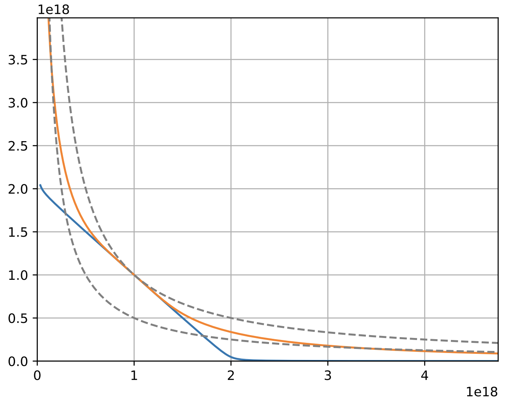

<h1 style="text-align: center;"></h1>
<h2 style="text-align: center;">Automatic market-making with dynamic peg</h2>

Michael Egorov, Curve Finance (Swiss Stake GmbH)

June 9, 2021

## **Introduction**
Automatic market-makers (AMMs) are one of the major innovations which decentralized finance brought. First, Uniswap brought markets created by $x·y = k$ invariant which doesn’t make any assumption about pricing of underlying assets and spreads liquidity across all prices evenly. Next, we introduced the stableswap invariant which allowed to focus most of liquidity around price 1.0 (or really any price), a very useful feature for creating stablecoin-to-stablecoin liquidity.    
In this work, we describe a method for creating liquidity for assets whicharen’t necessarily pegged to each other in a way more efficient than $x · y = k$ invariant. We concentrate liquidity given by the current “internal oracle” price but only move that price when the loss is smaller than part of the profit which the system makes. This creates $5 − 10$ times higher liquidity than the Uniswap invariant, as well as higher profits for liquidity providers.  
We describe the method in general, the invariants chosen, limits of their applicability and results of simulations based on historic pricing data.

## **Transformed pegged invariants**
Let’s transform the price space in such a way that all the prices are converted from some target to the area close to $1$ by a transformation $T()$. We already do that with compound and y pools on curve.fi. Let the vector of balances in the smart contract be $\mathbf{b} = (b_0, b_1, . . .)$ where $b_i$ is balance of $i$-th token supported by the pool. Let the contract keep the internal set of coefficient $\mathbf{p} = (p_0, p_1, . . .)$ which we call *price_scale* in the code. Then real balances $\mathbf{b}$ and transformed balances $\mathbf{b'}$ can be converted between each other as:

$$ \mathbf{b} = T(\mathbf{b', p}) = (b'_0 p_0, b'_1 p_1, ...);  $$

$$ \mathbf{b'} = T^{-1} (\mathbf{b, p}) = (\frac {b_0}{p_0}, \frac{b_1}{p_1}, ...). $$

An invariant can be represented as a hypersurface (a curve if the number of dimensions is 2) given by:

<figure markdown>
  { width="500" }
  <figcaption>Figure 1: Comparison of AMM invariants: constant-product (dashed line), stableswap (blue) and from this w (orange)</figcaption>
</figure>

$$ I(\mathbf{b'}) = 0. $$

The invariant function is convenient to choose in such a way that $p_0 = 1$ (for example, $0$-th asset is USD ant all prices are measured relative to USD). The invariants we consider are constructed in such a way that:

$$ ∀x : I (x,x,...) = 0  $$

One example of such an invariant is stableswap invariant. Another is the one which is discussed here further. Both are presented on Figure 1.   
The particular curve depends on deposits in pools. It is convenient to define an invariant $D$ which is constant for the same curve in such a way that it is equal to the total deposits in the pool when it is in equilibrium:

$$ \mathbf{x}_{eq} = (x_{eq}, x_{eq},...), $$  

$$ I(\mathbf{x}_{eq}, D) = 0, $$

$$ D = Nx_{eq}. $$

Since $D$ essentially parametrizes the curve, the equilibrium point $x_{eq}$ (the one vector $\mathbf{p}$ pegs to) becomes trivial to obtain. $N$ here is number of coins.

## **Quantification of a repegging loss**
In order to quantify profits or losses we need a robust measure of profit. For that, we choose the value of constant-product invariant *at equilibrium point*. For convenience, we also convert the loss/profit function to balances at the power of 1. The resulting function which quantifies value of the portfolio without noise reads as:

$$ X_{cp} = (\prod \frac{D}{Np_i})^\frac{1}{N}. $$

When we change $\mathbf{p}$, the price peg changes but balances don’t. We can calculate the new $D$ for the new values of $b'$ and substitute new $D$ and $p_i$ to calculate $X_{cp}. We allow the reduction in $X_{cp}$ but only such that the loss of value
of $X_{cp}$ doesn’t exceed half the profit we’ve made (which we track by tracking the increase of $X_{cp}$).

## **CurveCrypto invariant**
The invariant we use here is encouraged by stableswap invariant:

$$ KD^{N-1} \sum x_i + \prod x_i = KD^N + \frac{D}{N}^N,  $$

however we define K slightly differently:

$$ K_0 = \frac{\prod x_i N^N}{D^N},    K = AK_0 \frac{\gamma^2}{(\gamma + 1 - K_0)^2}, $$

where $A$ is amplification coefficient and $\gamma > 0$ (but usually a small number) has a meaning of distance between two dashed curve in Fig. 1. The invariant works approximately as a superposition of constant-product and stableswap invariants. For solving this invariant against $x_j$ or $D$, we need to define it in a form $F(\mathbf{x}, D) = 0$:

$$ F(\mathbf{x}, D) = K(\mathbf{x}, D)D^{N-1} \sum x_i + \prod x_i - K(\mathbf{x},D)D^N - (\frac{D}{N})^N.  $$

The algorithm for swaps firstly solves $F(\mathbf{x}, D) = 0$ equation against $D$, then against $x_j$ given $x_i$ which is increased by the amount of coin $i$ which is traded in (just like it was done in curve/stableswap algorithm for stablecoins). We use Newton’s method for that: firstly calculating $D$ iteratively as $D_{k+1} = D_k − F(\mathbf{x}, D_k)/F'_D(\mathbf{x}, D_k)$ and $x_{i,k+1} = x_{i,k} − F(x{_i,k},...,D)/ F'_{x_i}(x_{i,k},...,D)$. Since all the logic is implemented for EVM, each calculation is optimized, so finding a solution for $D$ or $x_i$ takes about 35k gas.  
Initial values are very important for the correct convergence of Newton’s method here since the function is not monotonic. We have found that the best initial values are:

$$ D_0 = N(\prod x_k)^\frac{1}{N}, $$

$$ x_{i,0} = \frac{D^{N-1}}{\prod_{k \neq 1} x_k N^{N-1}} $$

In addition to initial values, we determined limits of applicability of the math above by fuzzing (using hypothesis framework). We find that (while all noninteger numbers are taken at the basis of $10^18$) safe values for convergence of
$x_i$ are $0.1 ≤ D ≤ 10^{15}$ [USD]; $5·10^{−3} < x_i/D < 200; 10^{−8} ≤ \gamma ≤ 10^{−2}$ (typically $10^{−4}$); for convergence of $D$ the values are $1 ≤ A ≤ 10000, 10^{−9} ≤ x_0 ≤ 10^{15}, 10^{−5} ≤ x_i/x_0 ≤ 10^5, 10^{−8} ≤ \gamma ≤ 10^{−2}$.

## **Algorithm for repegging**
First of all, we track $X_{cp}$ at every exchange or deposit. After every operation, we multiply a variable xcp_profit by $X_{cp,after}/X_{cp,before}$, starting with 1.0. We also have a variable xcp_profit_real which keeps track of all losses after $\mathbf{p}$ adjustments. We undo $\mathbf{p}$ adjustment if it causes xcp_profit_real - 1 to fall lower than half of xcp_profit - 1.    
Internally, we have a price oracle given by an exponential moving average applied in $N$-dimensional price space. Suppose that the last reported price is $\mathbf{p}_{last}$, and the update happened $t$ seconds ago while the half-time of the EMA is $T_{1/2}$. Then the oracle price $\mathbf{p}^*$ is given as:

$$ \alpha = 2^{-\frac{t}{T_{1/2}}},  $$

$$ \mathbf{p}^* = \mathbf{p}_{last} (1-\alpha) + \alpha \mathbf{p}^*_{prev}. $$

We adjust the price vector in the direction towards $\mathbf{p}^*$ in log space, however we do that with approximations in order to simplify computations (so the direction could be a little bit different from the ideal ($\mathbf{p}^* − \mathbf{p}$) vector with the relative price change step being s, for $i$-th component:

$$ \frac{p_i}{p_{i, prev}} = 1 + \frac{s}{\sqrt{\sum (\frac{p^*_j}{p_{j, prev}}-1)^2}} (\frac{p^*_i}{p_{i, prev}}-1). $$

## **Dynamic fees**
We have a fee $f$ ranging from $f_{mid}$ to $f{out}$. It is determined as:

$$ g = \frac{\gamma_{fee}}{\gamma_{fee} + 1 - \frac{\prod x_i}{(\sum x_i/N)^N}}, $$

$$ f = g * f_{mid} + (1-g) * f_{out}$$

