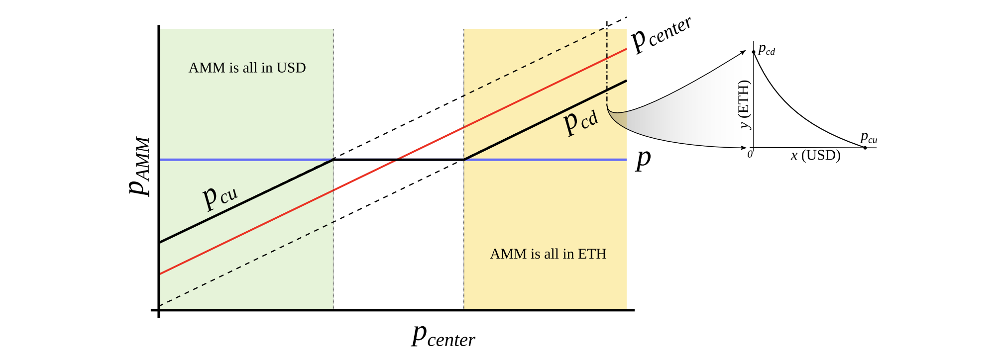
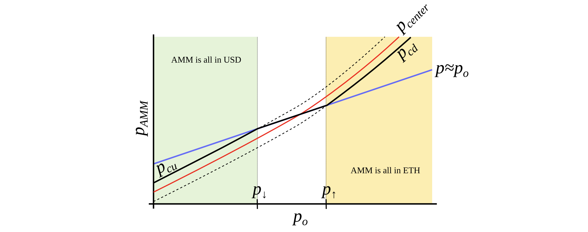

<h1 style="text-align: center;"></h1>
<h2 style="text-align: center;">Curve stablecoin design</h2>

Michael Egorov

October 9, 2022

## **Overview**
The design of the stablecoin has few concepts: lending-liquidating amm algorithm (LLAMMA), PegKeeper, Monetary Policy are the most important ones. But the main idea is in LLAMMA: replacing liquidations with a special-purpose AMM.

> Figure 1: Overall schematic
 

> Figure 2: Dependence of the loss on the price shift relative to the liquidation theshold. Time window for the observation is 3 days
 
In this design, if someone borrows against collateral, even at liquidation threshold, and the price of collateral dips and bounces - no significant loss happen. For example, according to simulations using historic data for ETH/USD since Sep 2017, if one leaves the CDP unattended for 3 days and during this time the price drop of 10% below the liquidation theshold happened - only 1% of collateral gets lost.

## **AMM for continuous liquidation/deliquidation (LLAMMA)**
The core idea of the stablecoin design is Lending-Liquidating AMM Algorithm. The idea is that it converts between collateral (for example, ETH) and the stablecoin (let’s call it USD here). If the price of collateral is high - a user has deposits all in ETH, but as it goes lower, it converts to USD. This is very different from traditional AMM designs where one has USD on top and ETH on the bottom instead.  
The below description doesn’t serve as a fully self-consistent rigurous proofs. A lot of that (especially the invariant) are obtained from dimensional considerations. More research might be required to have a full mathematical description, however the below is believed to be enough to implement in practice.  
This is only possible with an external price oracle. In a nutshell, if one makes a typical AMM (for example with a bonding curve being a piece of hyperbola)

> Figure 3: Behavior of an “AMM with an external price source”. External price $p_{center}$ determines a price around which liquidity is formed. AMM supports liquidity concentrated from prices $p_{cd}$ to $p_{cu}$, $p_{cd} < p_{center} < p_{cu}$. When current price $p$ is out of range between $p_{cd}$ and $p_{cu}$, AMM is either fully in stablecoin (when at $p_{cu}$) or fully in collateral (when at $p_{cd}$). When $p_{cd} ≤ p ≤ p_{cu}$, AMM price is equal to the current price $p$.
>  

> Figure 4: AMM which we search for. We seek to construct an AMM where $p_{cd}$ and $p_{cu}$ are such functions of $p_o$ that when $p_o$ grows, they grow even faster. In this case, this AMM will be all in ETH when ETH is expensive, and all in USD when ETH is cheap.
 

and ramps its “center price” from (for example) down to up, the tokens will adiabatically convert from (for example) USD to ETH while proving liquidity in both ways on the way (Fig. 3). It is somewhat similar to avoided crossing (also called Landau-Zener transition) in quantum physics (though only as an idea: mathematical description of the process could be very different). The range where the liquidity is concentrated is called band here, at the constant po band has liquidity from $p_{cd}$ to $p_{cu}$. We seek for $p_{cd}(p_{o})$ and $p_{cu}(p_o)$ being functions of $p_o$ only, functions being more steep than linear and, hence, growing faster than $p_o$ (Fig. 4). In addition, let’s define prices $p↓$ and $p↑$ being prices where $p↓(p_o) = p_o$, and $p↑(p_o) = p_o$, definining ends of bands in adiabatic limit (e.g. $p = p_o$).  
We start from a number of bands where, similarly to Uniswap3, hyperbolic shape of the bonding curve is preserved by adding virtual balances. Let say, the amount of USD is $x$, and the amount of ETH is $y$, therefore the “amplified” constant-product invariant would be:

$$ I = (x + f) (y + g). \tag{1}$$

We also can denote $x' ≡ x + f$ and $y' ≡ y + g$ so that the invariant can be written as a familiar $I = x' y'$.  
However, $f$ and $g$ do not stay constant: they change with the external price oracle (and so does the invariant $I$, so it is only the invariant while the oracle price $p_o$ is unchanged). At a given $p_o$, $f$ and $g$ are constant across the band. As mentioned before, we denote $p↑$ as the top price of the band and $p↓$ as the bottom price of the band. We define $A$ (a measure of concentration of liquidity) in such a way that:

$$ \frac{p↓}{p↑} = \frac{A-1}{A}. \tag{2}$$ 

The property we are looking for is such that higher price $p_o$ should lead to even higher price at the same balances, so that the current market price (which will, on average, follow $p_o$) is lower than that, and the band will trade towards being all in ETH (and the opposite is also true for the other direction). It is possible to find many ways to satisfy that but we need one:

$$ f = \frac{p^2_o}{p↑} Ay_o, g = \frac{p↑}{p_o}(A-1)y_0, \tag{3}$$

where $y_0$ is a $p_0$-dependent measure of deposits in the current band, denominated in ETH, defined in such a way that when current price $p$, $p↑$ and $p_o$ are equal to each other, then $y = y_0$ and $x = 0$ (see the point at $p_o = p↑$ on Fig. 4). Then if we substitute $y$ at that moment:

$$ I = p_o A^2 y^2_o. \tag{4}$$

Price is equal to $dx'/dy'$ which then for a constant-product invariant is:

$$ p = \frac{dx'}{dy'} = \frac{x'}{y'} = \frac{f+x}{g+y}.  \tag{5}$$

One can substitute situations where $p_o = p↑$ or $p_o = p↓$ with $x = 0$ or $y = 0$ correspndingly to verify that the above formulas are self-consistent.  
Typically for a band, we know $p↑$ and, hence, $p↓$, $p_o$, constant $A$, and also $x$ and $y$ (current deposits in the band). To calculate everything, we need to find $y_o$. It can be found by solving the quadratic equation for the invariant:

$$ (\frac{p^2_o}{p↑}Ay_0 + x) (\frac{p↑}{p_o} (A-1)y_0 + y) = p_o A^2 y^2_o, \tag{6}$$

which turns into the quadratic equation against $y_o$:

$$ p_oAy^2_0 - y_0 (\frac{p↑}{p_o}(A-1)x + \frac{p^2_o}{p↑}Ay) -xy = 0. \tag{7}$$

In the smart contract, we solve this quadratic equation in $\mathbf{\text{get_y0}}$ function. While oracle price $p_o$ stays constant, the AMM works in a normal way, e.g. sells ETH when going up / buys ETH when going down. By simply substituting $x = 0$ for the “current down” price $p_{cd}$ or $y = 0$ for the “current up” price $p_{cu}$ values into the equation of the invariant respectively, it is possible to show that AMM prices at the current value of $p_o$ and the current value of $p↑$ are:

$$ p_{cd} = \frac{p^3_o}{p↑^2}, p_{cu} = \frac{p^3_o}{p↓^2}. \tag{8}$$

Another practically important question is: if price changes up or down so slowly that the oracle price $p_o$ is fully capable to follow it *adiabatically*, what amount $y↑$ of ETH (if the price goes up) or $x↓$ of USD (if the price goes down) will the band end up with, given current values $x$ and $y$ and that we start also at $p = p_o$. While it’s not an immediately trivial mathematical problem to solve, numeric computations showed a pretty simple answer:

$$ y↑ = y + \frac{x}{\sqrt{p↑p}}, \tag{9}$$

$$ x↓ = x + y \sqrt{p↓p}. \tag{10}$$

We will use these results when evaluating safety of the loan as well as the
potential losses of the AMM.  
Now we have a description of one band. We split all the price space into bands which touch each other with prices $p↓$ and $p↑$ so that if we set a base price $p_base$ and have a band number $n$:

$$ p↑(n) = (\frac{A-1}{A})^n p_{base}, p↓(n) = (\frac{A-1}{A})^{n+1}p_{base}. \tag{11}$$

It is possible to prove that the solution of Eq. 7 and Eq. 5 for any band gives:

$$ p(x = 0, y > 0, n) = p_{cd}(n) = p_{cu}(n − 1),   \tag{12}$$

$$ p(x > 0, y = 0, n) = p_{cu} (n) = p_{cd} (n + 1),  \tag{13}$$

which shows that there are no gaps between the bands.  
Trades occur while preserving the invariant from Eq. 1, however the current price inside the AMM shifts when the price $p_o$: it goes up when $p_o$ goes down and vice versa cubically, as can be seen from Eq. 8.

## **LLAMMA vs Stablecoin**
Stablecoin is a CDP where one borrows stablecoin against a volatile collateral (cryptocurrency, for example, against ETH). The collateral is loaded into LLAMMA in such a price range (such bands) that if price of collateral goes down relatively slowly, the ETH gets converted into enough stablecoin to cover closing the CDP (which can happen via a self-liquidation, or via an external liquidation if the coverage is too close to dangerous limits, or not close at all while waiting for the price bounce).  
When a user deposits collateral and borrows a stablecoin, the LLAMMA smart contract calculates the bands where to locate the collateral. When the price of the collateral changes, it starts getting converted to the stablecoin. When the system is “underwater”, user *already* has enough USD to cover the loan. The amount of stablecoins which can be obtained can be calculated using a public $\mathbf{\text{get_x_down}}$ method. If it gives values too close to the liquidation thresholds - an external liquidator can be involved (typically shouldn’t happen within a few days or even weeks after the collateral price went down and sideways, or even will not happen ever if collateral price never goes up or goes back up relatively quickly). A $\mathbf{\text{health}}$ method returns a ratio of $\mathbf{\text{get_x_down}}$ to debt plus the value increase in collateral when the price is well above “liquidation”.  
When a stablecoin charges interest, this should be reflected in the AMM, too. This is done by adjusting all the grid of prices. So, when a stablecoin charges interest rate $r$, all the grid of prices in the AMM shifts upwards with the same rate $r$ which is done via a $\mathbf{\text{base_price}}$ multiplier. So, the multiplier goes up over time as long as the charged rate is positive.  
When we calculate $\mathbf{\text{get_x_down}}$ or $\mathbf{\text{get_y_up}}$, we are first looking for the amounts of stablecoin and collateral $x_*$ and $y_*$ if current price moves to the current price $p_o$. Then we look at how much stablecoin or collateral we get if $p_o$ adiabatically changes to either the lowest price of the lowest band, or the highest price of the highest band respectively. This way, we can get a measure of how much stablecoin we will which is not dependent on the current *instantaneous* price, which is important for sandwich attack resistance.

It is important to point out that the LLAMMA uses po defined as ETH/USD price as a price source, and our stablecoin could be traded under the peg ($p_s < 1$) or over peg ($p_s > 1$). If $ps < 1$, then price in the LLAMMA is $p > p_o$.  
In adiabatic approximation, $p = p_o/p_s$, and all the collateral$<>$stablecoin conversion would happen at a higher oracle price / as if oracle price was lower and equal to:

$$ p'_o = p_o \sqrt{\frac{p_o}{p}} = p_o \sqrt{p_s}.  \tag{14}$$

At this price, the amount of stablecoins obtained at conversion is higher by factor of $1/p_s$ (if $ps < 1$).  
It is less desirable to have $p_s > 1$ for prolonged times, and for that we will use the stabilizer (see next).

## **Automatic Stabilizer and Monetary Policy**
When $p_s > 1$ (for example, because of the increased demand for stablecoin), there is peg-keeping reserve formed by an asymmetric deposit into a stableswap Curve pool between the stablecoin and a redeemable reference coin or LP token. Once $p_s > 1$, the PegKeeper contract is allowed to mint uncollateralized stablecoin and (only!) deposit it to the stableswap pool single-sided in such a way that the final price after this is still no less than 1. When $p_s < 1$, the PegKeeper is allowed to withdraw (asymmetrically) and burn the stablecoin. These actions cause price $p_s$ to quickly depreciate when it’s higher than 1 and appreciate if lower than 1 because asymmetric deposits and withdrawals change the price. Even though the mint is uncollateralized, the stablecoin appears to be implicitly collateralized by liquidity in the stablecoin pool. The whole mint/burn cycle appears, at the end, to be profitable while providing stability. Let’s denote the amount of stablecoin minted to the stabilizer (debt) as $d_{st}$ and the function which calculates necessary amount of redeemable USD to buy the stablecoin in a stableswap AMM $\mathbf{\text{get_dx}}$ as $f_{dx}()$. Then, in order to keep reserves not very large, we use the “slow” mechanism of stabilization via varying the borrow r:

$$ p_s = \frac{f_{dx}(d_{st})}{d_{st}},  \tag{15}$$

$$ r = r_0 * 2^{-\frac{p-1}{h}},   \tag{16}$$

where $h$ is the change in $p_s$ at which the rate $r$ changes by factor of 2 (higher $p_s$ leads to lower $r$). The amount of stabilizer debt $d_{st}$ will equilibrate at different value depending on the rate at $p_s = 1 r_0$. Therefore, we can (instead of setting manually) be reducing $r_0$ while $d_{st}/\mathit{supply}$ is larger than some target number (for example, 5%) (thereby incentivizing borrowers to borrow-and-dump the stablecoin, decreasing its price and forcing the system to burn the $d_{st}$) or increasing if it’s lower (thereby incentivizing borrowers to return loans and pushing $p_s$ up, forcing the system to increase the debt $d_{st}$ and the stabilizer deposits).

## **Conclusion**
The presented mechanisms can, hopefully, solve the riskiness of liquidations for stablecoin-making and borrowing purposes. In addition, stabilizer and automatic monetary policy mechanisms can help with peg-keeping without the need of keeping overly big PSMs.

