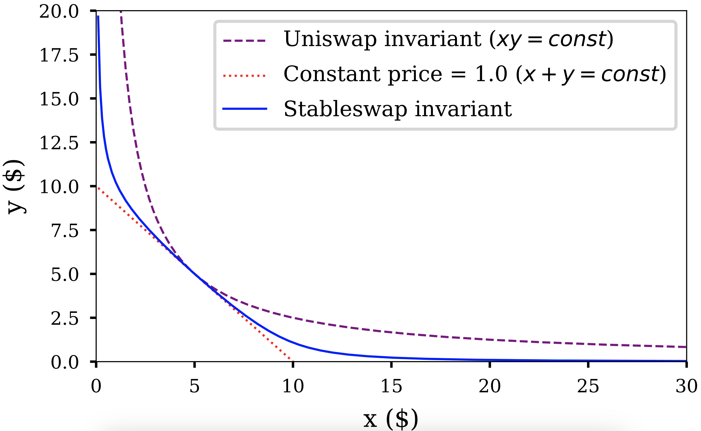
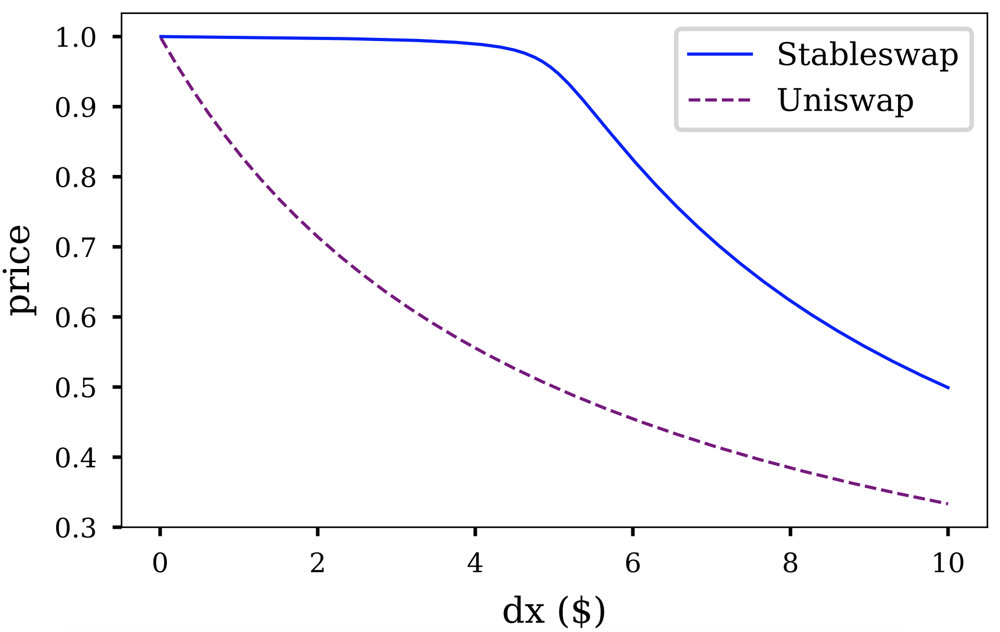
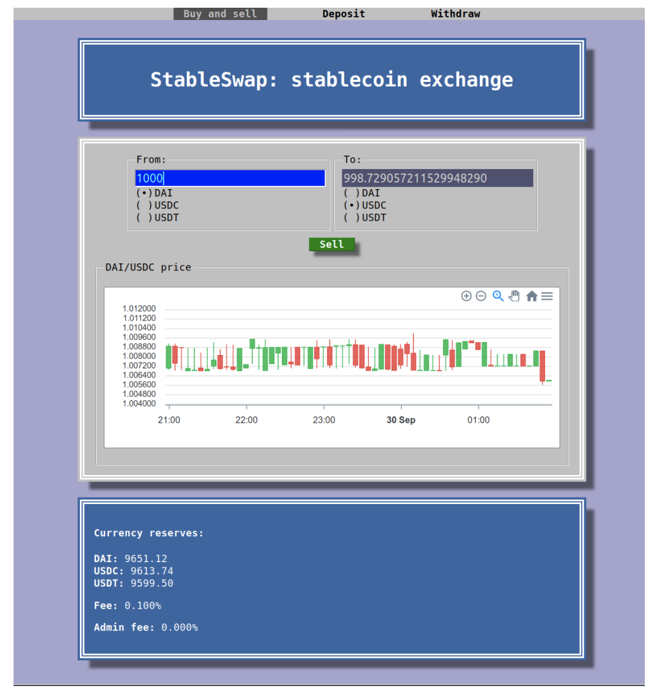

<h1 style="text-align: center;"></h1>
<h2 style="text-align: center;">StableSwap - efficient mechanism for Stablecoin liquidity</h2>

Michael Egorov

November 10, 2019

### **Abstract**
StableSwap provides a mechanism to create cross-markets for stablecoins in a way which could be called “Uniswap with leverage”. It is a fully autonomous market-maker for stablecoins with very minimal price slippage, as well as an efficient“fiat savings account” for liquidity providers on the other side.  
This is a brief version which doesn’t show all the details (most notably, the StableSwap invariant).

### **Introduction**
Stablecoins become very popular recently: custodial USDC, USDT, BUSD, PAX, TrueUSD, as well as decentralized DAI. They however(especially decentralized ones) have a problem of price stability and liquidity. This is especially painful for DeFi arbitrage. For example, when MakerDAO decreased its stability fee to 5.5%, many users of Compound (which had the interest rate of 11% at the time) preferred to stay there because they’ve taken the loan in DAI, and converting between DAI and USDC is an expensive task.  

At the same time, many DeFi users are willing to load their stablecoins up for lending in order to earn 5% APR, as it is much more than what traditional banking offers. They, however, would be uncomfortable giving same money to
trading firms who “promise profits”.  

In this work, I introduce StableSwap - automated liquidity provider for stablecoins. On the demand side, it offers a Uniswap-like automated exchange with very low price slippage (typically 100 times smaller). On the supply side, it offers a multi-stablecoin “savings account” which, according to simulation, can bring 300% APR, according to simulations assuming that traders will arbitrage between the smart contract and existing exchanges, taking into account their trading volumes and prices for stablecoins for the past half a year. This happens with no middleman being responsible for the trading, e.g. no exchange owners, no orderbooks, no human market makers.

### **How it works:**
First of all, imagine a liquidity provider which has constant price. If you have two coins $X$ and $Y$ , for example, selling $dx$ of coin $X$ will lead to buying $−dy = dx$ of coin $Y$ . This can be generalized for any number of coins $X_i$ having a “linear” invariant:

$$\sum x_i = const$$ 

The price is determined as $−dx_i/dx_j$ which is, in this case, always exactly 1. This doesn’t work in a fluctuating market unless the price is adjusted all the time. It can be done with price oracles, but it has risks and not very decentralized. It’s possible to do better.  

Uniswap, Bancor and Kyber work with inherently volatile and price-unstable markets, so they do it differently. They adjust prices in such a way that the “portfolio” (which is usually just two coins) is rebalances (so that value of coin $X$ and $Y$ in the liquidity pool, when expressed in the same currency, is the same). It appears, that this is given automatically

$$xy = const$$

Moreover, it is possible to generalize this invariant to any number of coins with any rations, as was brilliantly done by Balancer:

$$\prod x_i^{w_i} = const$$

While this is suitable for assets like ETH and tokens, it’s not very well working for something which is meant to be stable. The problem is that the price slippage is enormous, and one should provide enormous funds to keep a meaningful liquidity. On the flip side, if one for example loads DAI and USDC into Uniswap’s liquidity pool, the returns will be tiny (perhaps, several percent per year).  
For StableSwap, there was a middle-ground invariant found (Fig. 1). As expected, the price (equal to derivative) only slightly deviates from 1 when number of coins is closed to balance.

<figure markdown>
  { width="500" }
  <figcaption>Figure 1: Comparison of StableSwap invariant with Uniswap (constant-product) and constant price invariants. The portfolio consists of coins X and Y which have the “ideal” price of 1.0. There are x = 5 and y = 5 coins loaded up initially. As x decreases, y increases, and the price is the derivative dy/dx.</figcaption>
</figure>

The price slippage (Fig. 2) is much smaller, if compared to constant-product invariant.  
The StableSwap invariant has an “amplification coefficient” parameter: the lower it is, the closer the invariant is to the constant product. When calculating slippage, we use a practical value of $A = 100$. This is somewhat comparable to using Uniswap with 100x leverage.

<figure markdown>
  { width="500" }
  <figcaption>Figure 2: Price slippage: Uniswap invariant (dashed line) vs Stableswap (solidline)</figcaption>
</figure>

If the price appears to be shifted from equilibrium point (1.0), the invariant starts operating in a suboptimal point, still however providing some liquidity (in most cases larger than constant-product invariant, if optimal $A$ was correctly found). At any price, this invariant, just like a constant-product one, would provide some liquidity (unlike the constant-sum invariant).

### **Constructing the StableSwap invariant**
As depicted in Fig. 1, the constant-price invariant forms a straight line (or a hypersurface if having more than two coins). A constant-product invariant forms a hyperbola.  
The price is a slope of the line on the graph. We are looking for some invariant which is relatively flat near balance (price changes slowly, the graph is very close to the straight line, likely a “zoomed in” hyperbola), however shifting towards the constant-product invariant as the portfolio becomes more imbalanced (e.g. closer to the axes).  
Here are constant-sum (constant-price) and constant-product invariants generalized for $n$ coins, enumerated by $i$:

$$\sum x_i = D$$

$$\prod x_i = (\frac{D}{n})^n$$

The constant $D$ has a meaning of total amount of coins when they have an equal price.  
Let’s imagine what would an “amplified” invariant be. It should have a small curvature to have a low price slippage. A “zero slippage” invariant would correspond to infinite leverage. However, the zero-slippage invariant is a constantprice, or constant-sum one! Hence, assuming that constant-product has a “zero leverage”, and constant sum has an “infinite leverage”, let’s construct something in between. Let’s denote the leverage $χ$ . If we multiply the constant-sum invariant by $χ$ and add it to the constant-product one, we will have an invariant which is constant-product when $χ = 0$, and constant-sum when $χ = ∞$: the property we are looking for. However, $χ$ should ideally be a dimensionless parameter, not depending on numbers of coins we have.  
Therefore, let’s multiply the constant-sum invariant by $χD^{n−1}$ and add to the second invariant:

$$χD^{n−1} \sum x_i + \prod x_i = χD^n + (\frac{D}{n})^n $$

If this equation holds at all times, we will have trades with a leverage $χ$. However, it wouldn’t support prices going far from the ideal price 1.0. The invariant should support any prices (so that we have some liquidity at all times).  
In order to do so, we make $χ$ dynamic. When the portfolio is in a perfect balance, it’s equal to a constant $A$, however falls off to 0 when going out of balance:

$$ χ = \frac{A \prod x_i}{(D/n)^n} $$

Substituting this to the “leveraged” invariant above, we come to the StableSwap invariant:

$$ An^n \sum x_i + D = ADn^n + \frac{D^{n+1}}{n^n \prod x_i} $$

When a portfolio of coins $ {x_i} $ is loaded up, we need to calculate D, and we need to hold this equation true when we perform trades (e.g. swap $x_i$ into $x_j$ ). That is done by finding an iterative, converging solution either for $D$, or for $x_j$ when all other variables are known.

### **Simulations and Performance**
The performance of the algorithm was evaluated and optimized assuming providing liquidity for 3 stablecoins (DAI, USDC and USTD) taking price feeds from Coinbase Pro (DAI/USDC), Binance (USDC/USDT) and HitBtc (USDT/DAI) over the period of 6 months (May - October 2019). The simulations assumed the total liquidity in the contract of $30000. Trades were only done if there was enough volume in the price change. The results were the following:  

- Optimial “amplification coefficient” (“leverage”): $A = 85$;
- Optimal fee: 0.06% per trade;
- Liquidity provider profit at optimal parameters: 312% APR.

### **Implementation**
Multi-stablecoin contract was implemented in Vyper. Solutions of the equations which use the stableswap invariant were obtained iteratiely inside the smart contract itself, using only integer arithmetics. Browser UI (Fig. 3) was implemented in pure client-side Javascript.

### **Other applications**
Apart from liquidity for stablecoins, the same method can be applied for providing liquidity to interest-bearing assets (cDAI) and tokenized stake for stakeable cryptocurrencies. In my opinion, the method is an important part of future DeFi infrastructure.  
Applying this method to stablecoins can get it battle-tested, and to increase usability of decentralized (non-custodial) stablecoins.

<figure markdown>
  { width="500" }
  <figcaption>Figure 3: Stableswap UI</figcaption>
</figure>