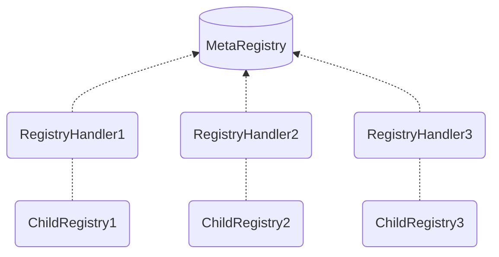

<h1>MetaRegistry: Overview</h1>

The MetaRegistry functions as a Curve Finance Pool Registry Aggregator and offers an on-chain API for various properties of Curve pools by **consolidating different registries into a single contract**.

This is achieved by integrating multiple `ChildRegistries`[^1], each paired with a `RegistryHandler`. This handler serves as a wrapper around its respective ChildRegistry, ensuring compatibility with the MetaRegistry's ABI standards.

Curve Factory contracts, which allow the permissionless deployment of pools and gauges, are such a `ChildRegistry`. When deploying pools or gauges, the respective information is picked up by the registry and then plugged into the MetaRegistry via a `Handler`[^2].

[^1]: Also referred to as `BaseRegistry`.
[^2]: The Handler needs to be added to the `MetaRegistry` using the `add_registry_handler` function.


!!!deploy "Contract Source & Deployment"
    The MetaRegistry is deployed across multiple networks. A full list of deployments can be found [here](../references/deployed-contracts.md#metaregistry).

    The source code is available on [:material-github: GitHub](https://github.com/curvefi/metaregistry/blob/main/contracts/mainnet/MetaRegistry.vy).


---


<div align="center" class="mermaid-diagram">

</div>


!!!info "Registries with Already Compliant ABI Standards"
    If a ChildRegistry already meets these standards, it does not require a handler. Nonetheless, wrappers can be **useful for hot-fixing bugs in production**, especially when direct modifications to the ChildRegistry would lead to significant breaking changes.

---

## **Who should use the MetaRegistry?**

Integrators often find it challenging to incorporate a protocol into their dApp when multiple on-chain registries are stored in separate contracts. They lack intrinsic, protocol-level knowledge to handle edge cases and onboard various registries. A single source that aggregates all registries can simplify integrations significantly.

*If you're an integrator looking to integrate Curve, the MetaRegistry is an invaluable resource.*


## **Setup**
Set up the python environment using the following steps: Please visit [GitHub](https://github.com/curvefi/metaregistry) for more details.

```
> python -m venv venv
> source ./venv/bin/active
> pip install --upgrade pip
> pip install -r ./requirements.txt
```

This project uses **`eth-ape >= 0.5.2`** developed at [Apeworx](https://apeworx.io/). The various plugins used are:

- **`ape-vyper`**
- **`ape-hardhat`**
- **`ape-alchemy`**
- **`ape-ledger`**
- **`ape-etherscan`**

To install these, please follow the instructions in their respective GitHub repositories.

!!!note
    If you choose to run tests using [**`Alchemy`**](https://www.alchemy.com/) as the upstream provider, please set up an Alchemy API key into an environment variable labeled **`WEB3_ALCHEMY_PROJECT_ID`** or **`WEB3_ALCHEMY_API_KEY`**. If you use a local node (**`geth`** or **`erigon`**), please change the hardhat upstream provider for mainnet-fork to **`geth`** in [ape-config.yaml](https://github.com/curvefi/metaregistry/blob/main/ape-config.yaml):

    ```shell
    hardhat:
        port: auto
        fork:
            ethereum:
                mainnet:
                    upstream_provider: geth
                    # upstream_provider: alchemy
    ```

## **Testing**

To run tests in interactive mode, please do the following:

```shell
> ape test -I -s
```

## **Deployment**

First, set up your account in Ape. If you're using an EOA that is a cold wallet, do:

```shell
> ape accounts import <alias>
```

This will prompt you for a private key. If your account is a ledger account, then follow:

```shell
> ape ledger add <alias>
```

To deploy, please use the following command (example deployment in mainnet-fork):

```shell
> ape run scripts/deploy.py main --network ethereum:mainnet-fork --account <your_account>
```
