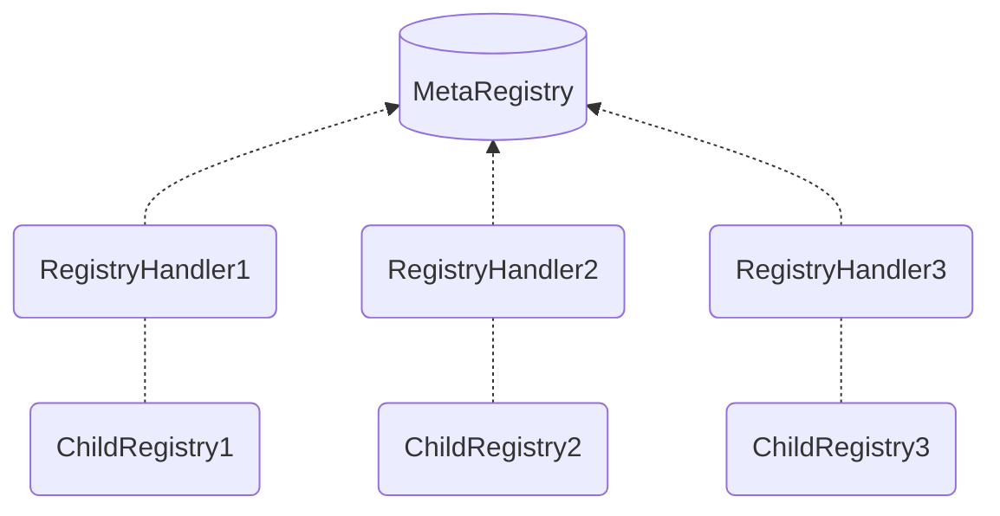

<h1>MetaRegistry: Overview</h1>

The MetaRegistry functions as a Curve Finance Pool Registry Aggregator and offers an on-chain API for various properties of Curve pools by **consolidating different registries into a single contract**.

This is achieved by integrating multiple `ChildRegistries`[^1], each paired with a `RegistryHandler`. This handler serves as a wrapper around its respective ChildRegistry, ensuring compatibility with the MetaRegistry's ABI standards.

Curve Factory contracts, which allow the permissionless deployment of pools and gauges, are such a `ChildRegistry`. When deploying pools or gauges, the respective information is picked up by the registry and then plugged into the MetaRegistry via a `Handler`[^2].

[^1]: Also referred to as `BaseRegistry`.
[^2]: The Handler needs to be added to the `MetaRegistry` using the `add_registry_handler` function.

!!!deploy "Contract Source & Deployment"
    The MetaRegistry is deployed across multiple networks. A full list of deployments can be found [here](../references/deployed-contracts.md#meta-registry).

    The source code is available on [:material-github: GitHub](https://github.com/curvefi/metaregistry/blob/main/contracts/mainnet/MetaRegistry.vy).

---

!!!info "Registries with Already Compliant ABI Standards"
    If a ChildRegistry already meets these standards, it does not require a handler. Nonetheless, wrappers can be **useful for hot-fixing bugs in production**, especially when direct modifications to the ChildRegistry would lead to significant breaking changes.

---

## **Who should use the MetaRegistry?**

Integrators often find it challenging to incorporate a protocol into their dApp when multiple on-chain registries are stored in separate contracts. They lack intrinsic, protocol-level knowledge to handle edge cases and onboard various registries. A single source that aggregates all registries can simplify integrations significantly.

*If you're an integrator looking to integrate Curve, the MetaRegistry is an invaluable resource.*

## **MetaRegistry API GitHub Repository**

A full MetaRegistry with Python API is available at the GitHub repository with setup instructions and examples: [:material-github: GitHub MetaRegistry](https://github.com/curvefi/metaregistry/)

See the API Documentation for further help: [MetaRegistry API Documentation](./MetaRegistryAPI.md)
