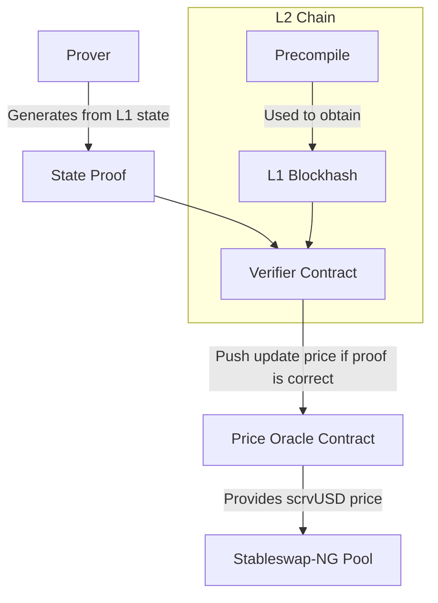

<h1>scrvUSD Cross-chain Oracle V2</h1>

`scrvUSD` on Ethereum is an ERC-4626 compatible token. While the contract provides a price through various methods, such as `pricePerShare` or `pricePerAsset`, it is not treated as an ERC-4626 token when bridged to other chains. Consequently, it will lack methods to return its continuously updating price. To address this, Curve uses a system to commit to and verify the price of `scrvUSD` on other chains.

---

*The system relies on the following actors:*

- An offchain prover (from now on the prover), whose role is to fetch data from Ethereum that are useful to compute the growth rate of the vault, alongside with a proof that those data are valid.
- A smart contract that will be called by the prover (from now on the verifier) that will verify that the data provided alongside their proof.
- A smart contract that will provide the current price of scrvUSD, given the growth rate of the vault provided by the prover and verified by the verifier, to be used by the Stableswap-NG pool on the target chain.

*Depending on the type of chain the proof (and hence its verification process) will be different:*

- On OP Stack-based chains the verifier will expect a blockhash (to be matched with the one available in a precompile) and a state proof of the memory slots relevant to the growth rate computation.
- On Taiko Stack-based chains the verifier will expect the blocknumber and a state proof of the memory slots relevant to the growth rate computation.
- On all other chains the prover will provide the same data as for the OP Stack, and relevant data to verify the proof will be bridged from Optimism using L0.

Here's the flowchart of the system for an OP Stack-based chain:

---

**Safety**

The prover doesn't need to be trusted as the safety of the whole system relies on the fact that it is not feasible to push an update with a forged proof.

**Liveness**

The prover needs to be online to provide the proof in a timely manner, if the prover is offline the system might not be able to provide a correct (or accurate) price for scrvUSD.
