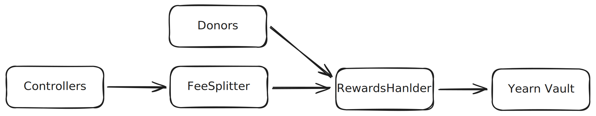
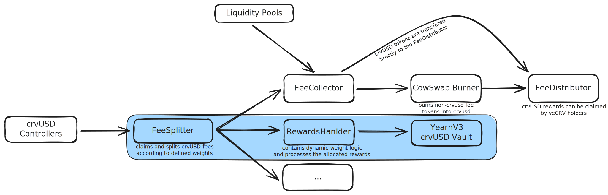

<h1>Savings crvUSD</h1>

Savings crvUSD, in short scrvUSD, is a savings version of crvUSD.

---

# **Smart Contracts**

The documentation of the `FeeSplitter` contract can be found [here](https://docs.curve.fi/fees/FeeSplitter/).

-   :logos-vyper: `VaultV3.vy`

    ---

    The Vault contract is based on Yearn's `VaultV3.vy` contract, more precisely [version `3.0.4`](https://github.com/yearn/yearn-Vaults-v3/blob/104a2b233bc6d43ba40720d68355b04d2dc31795/contracts/VaultV3.vy). It is an `ERC4626` compliant Vault that handles all logic associated with deposits, withdrawals, strategy management, profit reporting, etc.

    [:octicons-arrow-right-24: Yearn Dev Docs](https://docs.yearn.fi/developers/v3/overview)

-   :logos-vyper: `RewardsHandler.vy`

    ---

    The `RewardsHandler` is a peripheral contract that implements the `weight` function needed by the [`FeeSplitter`](https://docs.curve.fi/fees/FeeSplitter/). This function enables the Vault to receive rewards to depositors based on the proportion of crvUSD deposited in the Vault.
    

    [:octicons-arrow-right-24: Read more](./RewardsHandler.md)

-   :logos-vyper: `StablecoinLens.vy`

    ---

    Helper contract to calculate the circulating supply of crvUSD by excluding e.g. pre-minted crvUSD for flashloans.

    [:octicons-arrow-right-24: Read more](./StablecoinLens.md)

-   :fontawesome-solid-chart-line: `scrvUSD Crosschain Oracle`

    ---

    System of contracts to provide the price of `scrvUSD` on other chains.

    [:octicons-arrow-right-24: Read more](./crosschain-oracle.md)

---

## **Deployments**

The main `scrvUSD` contracts are deployed on :logos-ethereum: Ethereum at the following addresses:

- `scrvUSD / Vault` at [0x0655977FEb2f289A4aB78af67BAB0d17aAb84367](https://etherscan.io/address/0x0655977FEb2f289A4aB78af67BAB0d17aAb84367)
- `RewardsHandler` at [0xe8d1e2531761406af1615a6764b0d5ff52736f56](https://etherscan.io/address/0xe8d1e2531761406af1615a6764b0d5ff52736f56)
- `StablecoinLens` at [0xe24e2db9f6bb40bbe7c1c025bc87104f5401ecd7](https://etherscan.io/address/0xe24e2db9f6bb40bbe7c1c025bc87104f5401ecd7)

Additionally, the following cross-chain versions of the `scrvUSD` token are deployed:
 
- :logos-optimism: `Optimism` at [0x289f635106d5b822a505b39ac237a0ae9189335b](https://optimistic.etherscan.io/address/0x289f635106d5b822a505b39ac237a0ae9189335b)
- :logos-base: `Base` at [0x646a737b9b6024e49f5908762b3ff73e65b5160c](https://basescan.org/address/0x646a737b9b6024e49f5908762b3ff73e65b5160c)
- :logos-fraxtal: `Fraxtal` at [0xaB94C721040b33aA8b0b4D159Da9878e2a836Ed0](https://fraxscan.com/address/0xaB94C721040b33aA8b0b4D159Da9878e2a836Ed0)
- :logos-fantom: `Fantom` at [`0x5191946500e75f0A74476F146dF7d386e52961d9`](https://ftmscout.com/address/0x5191946500e75f0A74476F146dF7d386e52961d9)
- :logos-bsc: `BinanceSmartChain` at [`0x0094Ad026643994c8fB2136ec912D508B15fe0E5`](https://bscscan.com/address/0x0094Ad026643994c8fB2136ec912D508B15fe0E5)
- :logos-avalanche: `Avalanche` at [`0xA3ea433509F7941df3e33857D9c9f212Ad4A4e64`](https://snowscan.xyz/address/0xA3ea433509F7941df3e33857D9c9f212Ad4A4e64)

---

# **Vault Implementation Details**

The Vault is an unmodified instance of the [Yearn V3 multi-strategy Vault](https://github.com/yearn/yearn-Vaults-v3) that accepts crvUSD deposits. The crvUSD deposited into the Vault are not rehypothecated, they sit idle in the Vault to earn yield.

This Vault aims to be as cheap as possible for users to deposit and withdraw funds. For this reason funds deposited in the Vault are not moved anywhere and are always available to be redeemed.

Although the Vault is called "multi-strategy" it actually doesn't contain any strategies. This is possible thanks to yearn Vaults' v3.0.3 ability to [report on self](https://github.com/yearn/yearn-Vaults-v3/pull/205).

---

# **Rewards**

The Vault receives a dynamic percentage of the interest fees generated by the crvUSD from the `FeeSplitter` contract which is then distributed linearly across all depositors with respect to their share of the total deposits. Inbetween the `FeeSplitter` and the `Vault`, there is a `RewardsHandler` contract that handles the calculation of the dynamic percentage, which is determined by the ratio of crvUSD deposited into the Vault over the total circulating supply of crvUSD.

<figure markdown="span">
  { width="2000" }
  <figcaption></figcaption>
</figure>

---

# **FeeSplitter Interaction and Weight Calculation**

For the `FeeSplitter` to send funds to the `RewardsHandler`, the `RewardsHandler` must be added as a receiver in the `FeeSplitter` by the DAO. Once this condition is met, the `FeeSplitter` will send funds to the `RewardsHandler` according to what the `weight` function in the `RewardsHandler` returns (this value is dynamic).

The `take_snapshot` function allows anyone to take snapshots of the ratio of crvUSD in the Vault compared to the circulating supply of crvUSD. This ratio is used to determine the percentage of the fees that can be requested by the `FeeSplitter`.

For instance if the time-weighed average of the ratio is 0.1 (10% of the circulating supply is deposited into the Vault), the `FeeSplitter` will request 10% of the fees generated by the crvUSD controllers.

---

# **Rewards Allocation**

Rewards allocated to scrvUSD come from crvUSD interest fees or any external donations sent to the `RewardsHandler` contract.

The ultimate amount of rewards is dynamic and is determined by the ratio of the staked supply to the total supply of crvUSD. Although it is dynamic, the weight has an upper and lower bound.

Rewards are distributed to scrvUSD holders thought the `RewardsHandler` contract using a simple `process_rewards` function. This function permnissionlessly lets anyone distribute rewards to the crvUSD Vault.

<figure markdown="span">
  { width="2000" }
  <figcaption></figcaption>
</figure>

Although the weight is dynamic, it has a upper and lower bound:

1. The lower bound is defined in the `RewardsHandler` contract as `minimum_weight`. This is the minimum percentage of rewards that scrvUSD will receive.
2. The upper bound is defined in the `FeeSplitter` and represents the maximum percentage of rewards that scrvUSD will receive from the FeeSplitter. The FeeSplitter allows for dynamic weights, which is the case for scrvUSD. This upper value can be checked in the `FeeSplitter` contract by calling `FeeSplitter.receivers(i)`, where `i` is the index of the receiver. This method returns the address and the maximum weight of the receiver.