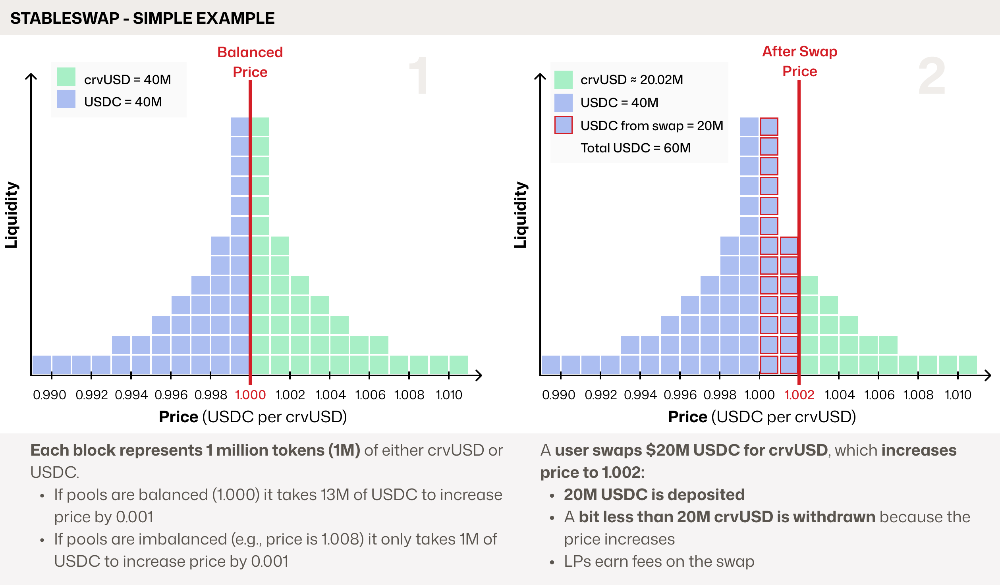
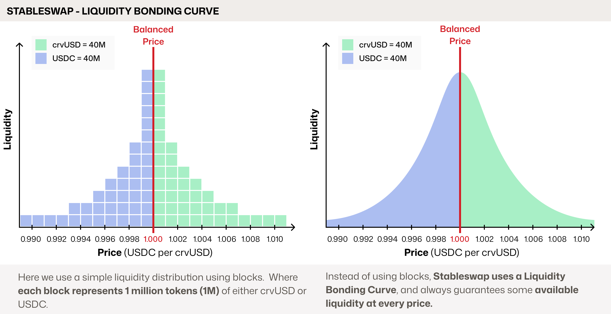
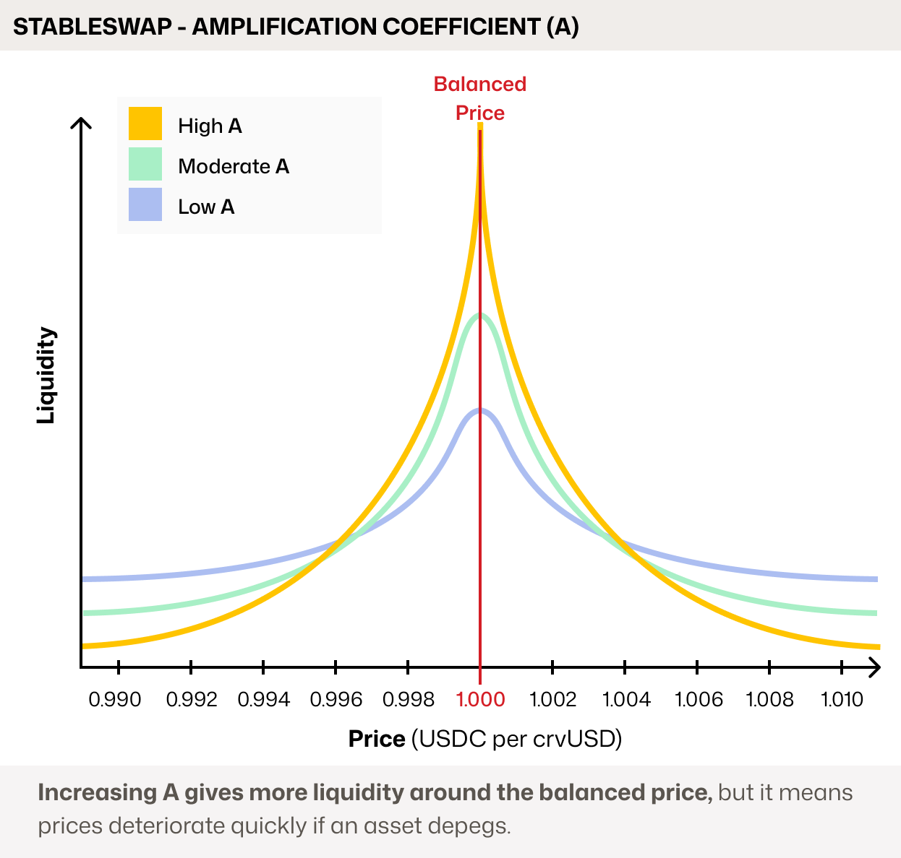

<h1>Stableswap: In Depth</h1>

Stableswap was designed for pools of similarly priced assets, like stablecoins, to **concentrate liquidity** around their pegged price (e.g., 1 `USDC` = 1 `USDT`). This allows for large swaps with very low slippage, even when the pool is imbalanced.

Let's look at an example with a `crvUSD/USDC` pool, where each block represents $1M in tokens:

Stableswap pools are designed to function effectively even when heavily imbalanced. Depending on the **Amplification Coefficient** (`A`), pools can maintain close to 1:1 pricing even when significantly imbalanced. If the imbalance becomes large enough to cause a price deviation from the 1:1 peg, it creates an arbitrage opportunity. This incentivizes traders to rebalance the pool, with each swap generating fees for liquidity providers (LPs).

While the blocks offer a helpful visual, Stableswap's liquidity is more accurately represented by a bonding curve:

The shape of this liquidity bonding curve and how imbalanced a pool can become before price deviates from 1:1 is controlled by a parameter called `A`, the **Amplification Coefficient**:

<figure markdown="span">
  { width="500" }
  <figcaption></figcaption>
</figure>

- A **higher `A`** (e.g., 1,000–20,000) concentrates liquidity more tightly around the peg. This provides deeper liquidity for swaps and allows pools to become very imbalanced before the price deviates significantly from 1:1. The trade-off is that if an asset moves far from the peg, liquidity and pricing can drop off sharply.

- A **lower `A`** (e.g., 50–200) distributes liquidity more evenly. The price will deviate more gradually from the peg as the pool becomes imbalanced, avoiding sharp jumps.

